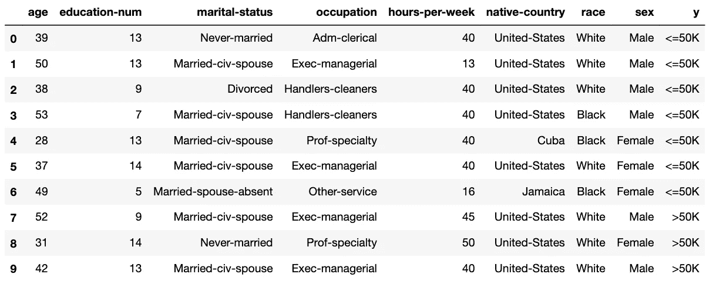
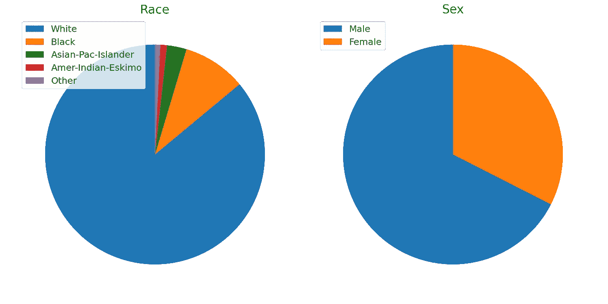
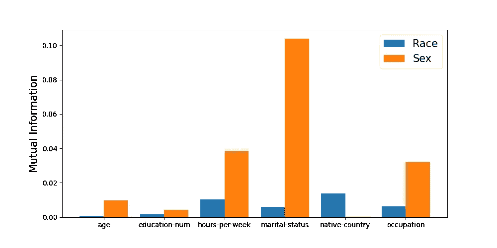
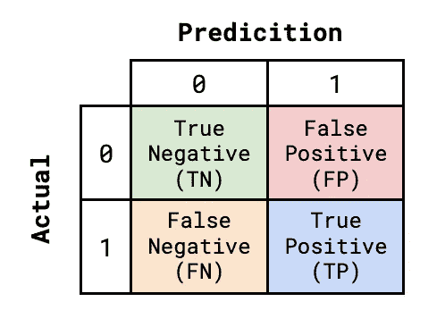
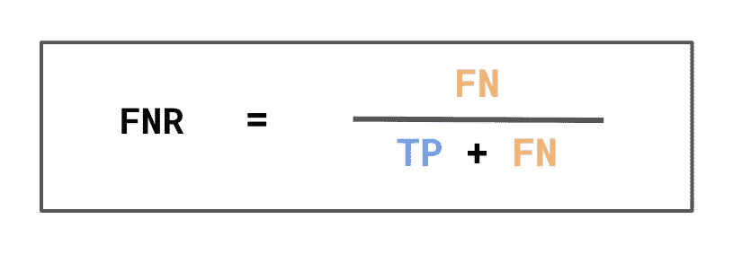
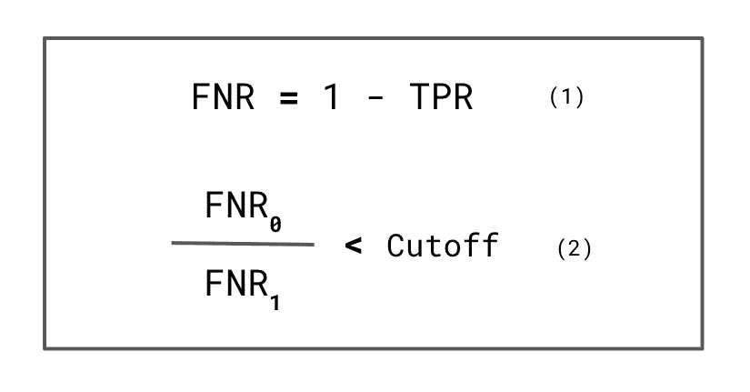
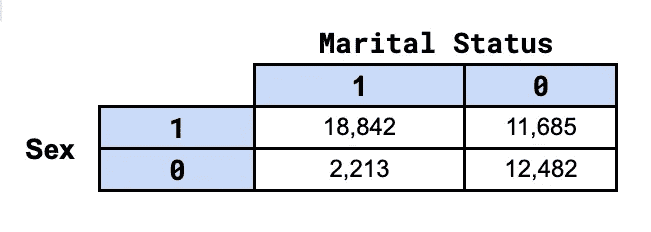
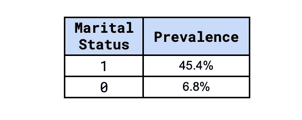

# 分析机器学习中的公平性(用 Python)

> 原文：<https://towardsdatascience.com/analysing-fairness-in-machine-learning-with-python-96a9ab0d0705>

## 进行探索性的公平性分析，并使用平等机会、均等优势和不同影响来衡量公平性

(来源: [flaticon](https://www.flaticon.com/premium-icon/measure-tape_4080045) )

仅仅建立做出**精确**预测的模型已经不够了。我们还需要确保这些预测是公平的**。**

**这样做会减少预测偏差的危害。因此，你将在建立对你的人工智能系统的信任方面走很长的路。为了纠正偏见，我们需要从分析数据和模型的公平性开始。**

**衡量公平很简单。**

**理解一个模型为什么不公平更复杂。**

**这就是为什么我们将:**

*   **首先做一个**探索性公平分析——在你开始建模之前**识别潜在的偏见来源。**
*   **然后，我们将继续**衡量公平—**应用不同的公平定义。**

**您可以看到我们将在下面介绍的方法的摘要。**

****

**公平性分析方法概述(来源:作者)**

**我们将讨论这些方法背后的理论。我们也将使用 **Python 来应用它们。**我们将讨论关键的代码片段，你可以在 [**GitHub**](https://github.com/conorosully/medium-articles/blob/master/src/algorithm%20fairness/Measuring%20Bias.ipynb) 上找到完整的项目。**

# **资料组**

**我们将使用[成人数据集](https://archive.ics.uci.edu/ml/datasets/adult) **建立一个模型。你可以在**表 1** 中看到这个的快照。经过一点功能工程，我们将使用前 6 列作为模型**功能**。接下来的 2 个，种族和性别，是敏感属性**。我们将基于这些来分析对群体的偏见。最后是我们的**目标变量**。我们将尝试预测一个人的收入是高于还是低于 5 万美元。**

****

**表 1:成人收入数据集快照(图片来源:作者)(数据集: [UCI](https://archive.ics.uci.edu/ml/datasets/adult) )(许可证:CC0:公共领域)**

**在加载这个数据集之前，我们需要导入一些 Python 包。我们用下面的代码做到了这一点。我们使用 **NumPy** 和**熊猫**进行数据操作(第 1-2 行)。 **Matplotlib** 用于一些数据可视化(第 3 行)。我们将使用 **xgboost** 来构建我们的模型(第 5 行)。我们还从 **scikit-learn** 导入了一些函数来评估我们的模型(第 7–9 行)。确保你已经安装了这些。**

**我们在下面导入数据集(第 7 行)。我们还会删除任何缺少值的行(第 8 行)。注意这里加载了一些额外的列。查看列名(第 1-4 行)。在此分析中，我们将只考虑我们在**表 1** 中提到的那些。**

# ****算法公平性的探索性分析****

**当你有了最终的模型时，评估公平性并没有开始。这也应该是你探索性分析的一部分。一般来说，我们这样做是为了围绕数据集建立一些直觉。所以，当谈到建模时，你对预期的结果有一个很好的想法。具体来说，为了公平，你想了解你的数据的哪些方面可能导致不公平的模型。**

**由于不公平的不同[原因](/algorithm-fairness-sources-of-bias-7082e5b78a2c)，你的模型可能变得不公平。在我们的探索性分析中，我们将关注与数据相关的 3 个关键来源。这些是**历史偏差**、**代理变量**和**不平衡数据集**。我们想了解这些在我们的数据中存在的程度。了解原因将有助于我们选择解决不公平的最佳方法。**

## **不平衡的数据集**

**我们将从查看我们的数据集是否不平衡开始。具体来说，我们指的是敏感属性方面的不平衡。请看图 1，我们有按种族和性别划分的人口。你可以看到我们确实有一个不平衡的数据集。第一张图表显示我们 86%的人口是白人。同样，**68%的人口是男性。****

********

****图 1:按种族和性别分列的人口(资料来源:作者)****

****您可以看到我们是如何为下面的种族属性创建饼图的。我们从按种族统计人口开始(第 2 行)。我们使用索引定义标签(第 3 行)。这些是我们在图 1 中看到的不同种族的名称。然后，我们使用 matplotlib 中的 ***pie*** 函数绘制计数(第 6 行)。我们还使用标签创建了一个图例(第 7 行)。性别属性饼图的代码非常相似。****

****不平衡数据集的问题是模型参数可能会偏向大多数。例如，女性和男性的趋势可能不同。所谓趋势，我们指的是特征和目标变量之间的关系。一个模型将试图最大化整个群体的准确性。这样做可能有利于男性人口的趋势。因此，我们对女性人口的准确性可能较低。****

## ****定义受保护的功能****

****在我们继续之前，我们需要定义我们的**保护特性**。我们通过使用敏感属性创建二进制变量来做到这一点。我们定义变量，使 1 代表一个**特权**组，0 代表一个**非特权**组。通常，弱势群体在过去会面临历史不公。换句话说，这个群体最有可能面临来自一个有偏见的模型的不公平的决定。****

****我们使用下面的代码定义这些特性。对于种族，我们定义了受保护的特征，因此“白人”是特权群体(第 4 行)。也就是说，如果这个人是白人，这个变量的值为 1，否则为 0。对于性，“男性”是特权群体(第 5 行)。接下来，我们将使用这些二进制变量来代替原来的敏感属性。****

****在上面的代码中，我们还定义了一个目标变量(第 8 行)。其中，如果个人收入超过 5 万美元，则该值为 1，如果收入低于 5 万美元，则该值为 0。在第 1 行中，我们用原始的敏感属性创建了 ***df_fair*** 数据集。我们已经将目标变量和受保护的要素添加到该数据集中。它将被用作剩余公平性分析的基础。****

## ****流行****

****对于目标变量，**患病率**是阳性病例占全部病例的比例。其中肯定的情况是当目标变量的值为 1 时。我们的数据集的总体患病率为 **24.8%** 。在我们的数据集中，大约有 1/4 的人收入超过 5 万美元(T21)。我们也可以用流行度作为一个公平的衡量标准。****

****我们通过计算不同特权(1)组和非特权(0)组的患病率来做到这一点。你可以在下面的**表 2** 中看到这些值。注意，特权群体的患病率要高得多。事实上，如果你是男性，你挣 5 万美元以上的可能性几乎是女性的三倍**。******

************

******表 2:受保护特征的流行率(资料来源:作者)******

******我们可以通过计算受保护特征的交叉点的普遍性来更进一步。你可以在**表 3** 中看到这些数值。如果你属于两个特权群体，左上角给出了患病率(即性别= 1 &种族= 1)。同样，右下方给出了不属于任何特权群体的患病率(即性别= 0 &种族= 0)。这告诉我们，白人男性收入超过 5 万美元的可能性是非白人女性的 4 倍。******

********

****表 3:受保护特征交叉的流行率(来源:作者)****

****我们使用下面的代码计算这些值。你可以看到总体患病率只是目标变量的平均值(第 1 行)。同样，我们可以对不同的受保护功能组合取平均值(第 3-5 行)。****

****在这一点上，你应该问自己为什么我们在患病率上有这么大的差异。该数据集是利用 1994 年美国人口普查数据建立的。这个国家有基于性别和种族歧视的历史。最终，目标变量反映了这种歧视。从这个意义上说，患病率可以用来理解**历史不公正**在多大程度上嵌入了我们的目标变量。****

## ****代理变量****

****我们可以分析偏差潜在来源的另一种方法是通过寻找**代理变量**。这些是与我们的受保护特征高度相关或关联的模型特征。使用代理变量的模型可以有效地使用受保护的特性来做出决策。****

****我们可以找到代理变量，就像在特征选择过程中找到重要特征一样。也就是说，我们在特征和目标变量之间使用一些关联的度量。除了现在，我们使用受保护的特性，而不是目标变量。我们将研究两种关联的度量方法——**互信息**和**特征重要性**。****

****在此之前，我们需要做一些功能工程。我们从创建一个目标变量开始，就像前面一样(第 2 行)。然后我们创建 **6 个模型特征**。首先，我们让**的年龄**、**的教育编号**和**的每周工作时间**保持不变(第 5 行)。我们从**婚姻状况**和**本国**创建二元特征(第 6-7 行)。最后，我们通过将原始职业分成 5 组来创建**职业**特征(第 9-16 行)。在下一节中，我们将使用这些相同的特性来构建我们的模型。****

******互信息**是两个变量之间非线性关联的度量。它表明一个变量的不确定性通过观察另一个变量减少了多少。在**图 2** 中，您可以看到 6 个特征和受保护特征之间的互信息值。注意婚姻状况和性别之间的高值。这表明了这些变量之间可能的关系。换句话说，婚姻状况可能是性别的一个替代变量。****

********

****图 2:具有受保护特征的交互信息(来源:作者)****

****我们使用下面的代码计算互信息值。这是使用 **mutual_info_classif** 函数完成的。对于种族，我们传递我们的特征矩阵(第 2 行)和种族保护特征(第 3 行)。我们还告诉函数 6 个特征中哪些是离散的(第 4 行)。性的代码是相似的(第 5 行)。****

****我们可以采取的另一种方法是使用受保护的特征来构建模型。也就是说，我们尝试使用 6 个模型特征来预测受保护的特征。然后我们可以使用来自这个模型的**特征重要性**分数作为我们的关联度量。你可以在图 3 中看到这个过程的结果。****

********

****图 3:预测受保护特性时的特性重要性(来源:作者)****

****这个过程的另一个结果是我们有了模型的准确性。这些可以给我们一个整体关联的度量。预测种族的准确率为 **72.7%** ，预测性别的准确率为 **78.9%** 。如果我们回到**图 2** 中的互信息值，这种差异是有意义的。你可以看到性的价值通常更高。最终，我们可以预期代理变量对于性别来说比种族更成问题。****

****您可以在下面看到我们是如何计算种族指标的。我们从获得一个平衡的样本开始(第 2-7 行)。这就是为什么我们的数据集中有相同数量的特权和非特权。然后，我们使用这个数据集来构建一个模型(第 10 -11 行)。请注意，我们使用竞争保护特性作为目标变量。然后我们得到模型预测(第 12 行)，计算准确性(第 15 行)并得到特征重要性分数(第 18 行)。****

****因此，我们已经看到数据集是不平衡的，T2 的患病率比 T4 的高。我们还发现了一些潜在的代理变量。然而，这一分析并没有告诉我们我们的模型是否会不公平。它只是强调了可能导致不公平模式的问题。在接下来的部分，我们将建立一个模型，并表明它的预测是不公平的。最后，我们将回到这个探索性的分析。我们将看到它如何帮助解释是什么导致了不公平的预测。****

# ****系统模型化****

****我们使用下面的代码构建我们的模型。我们正在使用**xgbclassifier**函数(第 2 行)。我们使用前面在代理变量一节中定义的特性和目标变量来训练模型。然后我们得到预测(第 6 行)并将它们添加到我们的 **df_fair** 数据集(第 7 行)。最终，这个模型的准确率为 85%。准确率为 **73%** 召回率为 **60%。我们现在想衡量一下这些预测有多公平。******

****在我们继续之前，如果你想的话，你可以用你自己的模型替换这个模型。或者您可以尝试不同的模型特征。这是因为我们将使用的所有公平性度量都是[模型不可知的](/what-are-model-agnostic-methods-387b0e8441ef)。这意味着它们可以用于任何型号。他们通过将预测与原始目标变量进行比较来工作。最终，您将能够在大多数应用程序中应用这些指标。****

# ****公平的定义****

****我们通过应用不同的公平定义来衡量公平。大多数定义涉及将人口分为特权群体和非特权群体。然后，您使用一些度量标准(例如准确性、FPR、FNR)来比较各组。我们将会看到，最佳指标显示了谁从该模型中受益于**。******

****通常，一个模型的预测要么会给一个人带来好处，要么没有好处。例如，一个银行模型可以预测一个人不会拖欠贷款。这将导致**获得贷款**的收益。另一个好处的例子是**得到了一份工作**。对于我们的模型，我们将假设 Y = 1 会带来收益。也就是说，如果模型预测这个人的收入超过 5 万美元，他们就会以某种方式受益。****

## ****准确(性)****

****首先，让我们讨论一下准确性，以及为什么它不是公平的理想衡量标准。我们可以根据**图 4** 中的混淆矩阵进行精度计算。这是用于比较模型预测和实际目标变量的标准混淆矩阵。这里 Y = 1 是正预测，Y=0 是负预测。当我们计算其他公平性指标时，我们还将参考这个矩阵。****

********

****图 4:困惑矩阵(来源:作者)****

****查看**图 5** ，您可以看到我们如何使用混淆矩阵来计算精确度。也就是说，准确度是在所有的观察中，真阴性和真阳性的数量。换句话说，准确性是正确预测的百分比。****

********

****图 5:精确度计算(来源:作者)****

******表 4** 通过受保护的特征给出了我们模型的精确度。比率列给出了非特权(0)到特权(1)的精确度。对于这两个受保护的功能，您可以看到，非特权组的准确性实际上更高。这些结果可能会误导你，让你认为这种模式是在惠及无特权群体。****

********

****表 4:受保护特征的模型精度(来源:作者)****

****问题是准确性可能会掩盖模型的结果。例如，不正确的肯定预测(FP)会降低准确性。然而，这个人仍然会从这个预测中受益。例如，即使预测是错误的，他们仍然会得到贷款或工作机会。****

## ****机会均等(真实阳性率)****

****为了更好地捕捉模型的好处，我们可以使用真实正利率(TPR)。你可以在**图 6** 中看到我们是如何计算 TPR 的。分母是**实际阳性数**。分子是**正确预测阳性**的数量。换句话说，TPR 是被正确预测为阳性的实际阳性的百分比。****

********

****图 6: TPR 计算(来源:作者)****

****记住，我们假设积极的预测会带来一些好处。这意味着分母可以看作是**应该从模型中受益**的人数。分子是**应该并且已经受益的人数。**所以 TPR 可以解释为**从该模型中正当获益**的人的百分比。****

****例如，以一个贷款模型为例，其中 Y=1 表示客户没有违约。分母是没有违约的人数。分子是没有违约的数字，我们预测他们不会违约。这意味着 TPR 是我们贷款给的好客户的百分比。对于招聘模型，它将被解释为收到工作邀请的优秀候选人的百分比。****

******表 5** 给出了我们模型的 TPR。同样，该比率给出了非特权(0)对特权(1)的 TPR。与准确性相比，您可以看到非特权群体的 TPR 较低。这表明，较少比例的弱势群体从这一模式中受益。也就是说，高收入人群中被正确预测为高收入的比例较小。****

********

****表 5:受保护特征的 TPR(来源:作者)****

****与流行性一样，我们可以通过在受保护特征的交叉点找到 TPR 来更进一步。您可以在**表 6** 中看到这些值。请注意，当这个人同时属于两个非特权群体时，TPR 甚至更低。事实上，白人男性的总生育率比非白人女性高 50%以上。****

********

****表 6:受保护特征交集的 TPR(来源:作者)****

****使用 TPRs 让我们在**等式 1** 中首次定义公平。在**机会均等**下，如果特权群体和非特权群体的 TPR 相等，我们认为模型是公平的。在实践中，我们会给统计不确定性留有余地。我们可以要求差值小于某个截止值(**等式 2** )。在我们的分析中，我们采用了比率。在这种情况下，我们要求比率大于某个截止值(**等式 3** )。这确保了非特权群体的 TPR 不会明显小于特权群体。****

********

****图 7:平等机会的定义(来源:作者)****

****问题是我们应该使用什么截止值？这个问题实际上没有好的答案。这取决于你的行业和应用。如果你的模型有重大影响，比如抵押贷款申请，你将需要一个更严格的截止日期。截止时间甚至可以由法律来定义。无论哪种方式，在衡量公平性之前，定义临界值是很重要的。****

## ****假阴性率****

****在某些情况下，您可能想要捕捉模型的负面结果。您可以使用图 8 中的 FNR 来完成此操作。同样，分母给出了**实际阳性**的数量。除了现在我们用**错误预测的负数**作为分子。换句话说，FNR 是被错误预测为阴性的实际阳性的百分比。****

********

****图 8: FNR 定义(来源:作者)****

****FNR 可以解释为错误地没有从模型中获益的人的百分比。例如，**应该有**但**没有**获得贷款的客户的百分比。对于我们的模型，它是被预测为低收入的高收入者的百分比。****

****您可以在**表 7** 中看到我们模型的 FNR。现在，非特权群体的净生育率更高。换句话说，更高比例的特权群体错误地没有受益。在这个意义上，我们有一个类似的结论，当使用 TPRs 与均衡的赔率。这种模式似乎对弱势群体不公平。****

********

****表 7:受保护特征的 FNR(来源:作者)****

****事实上，要求 fnr 平等会给我们带来与机会平等相同的定义。这是因为在**等式 1** 中可以看到线性关系。换句话说，平等的 TPR 意味着我们也有平等的 fnr。你应该记住，我们现在要求这个比率小于某个临界值(**等式 2** )。****

********

****图 9:用 FNR 评估公平性(来源:作者)****

****使用 fnr 来定义**平等机会**似乎没有必要。然而，在某些情况下，使用负面结果来定义框架可以更好地说明你的观点。例如，假设我们建立一个模型来预测皮肤癌。FNR 将给出患有癌症但未被诊断为癌症的人的百分比。这些错误可能是致命的。最终，以这种方式构建公平可以更好地强调不公平模型的后果。****

## ****均等的赔率****

****另一种获取模型益处的方法是通过观察假阳性率(FPR)。如**图 10** 所示，分母为**实际底片**的数量。这意味着 TPR 是被错误预测为阳性的实际阴性的百分比。这可以解释为从模型中不正当获益的人的百分比。例如，它将是收到工作邀请的不合格人员的百分比。****

********

****图 10: FPR 计算(来源:作者)****

****在我们的模型中，FPR 会给出被预测为高收入的低收入者的数量。你可以在**表 8** 中看到这些数值。同样，特权群体的税率更高。这告诉我们，更高比例的特权群体**错误地从该模式中获益**。****

********

****表 8:受保护特征的 FPR(来源:作者)****

****这就引出了公平的第二个定义，**均等几率**。与平等机会一样，这一定义要求贸易保护率是平等的。现在我们还要求 FPR 相等。这意味着均等的赔率可以被认为是公平的更严格定义。同样有道理的是，一个模型要公平，整体利益应该是平等的。这是一个相似比例的群体应该合法和非法受益。****

********

****图 11:均等赔率定义(来源:作者)****

****均等赔率的一个优点是，我们如何定义目标变量并不重要。假设 Y = 0 会带来收益。在这种情况下，TPR 和 FPR 互换的解释。TPR 现在获得了非法利益，而 FPR 现在获得了合法利益。均等赔率已经使用了这两个比率，因此解释保持不变。相比之下，对平等机会的解释发生了变化，因为它只考虑 TPR。****

## ******完全不同的影响******

****我们对公平的最后一个定义是**不同的影响** (DI)。我们首先计算图 12 中的购买力平价率。这是被正确(TP)或错误(FP)预测为阳性的人的百分比。我们可以将此解释为将从模型中受益的人的百分比。****

********

****图 12:购买力平价计算(来源:作者)****

****对于我们的模型，它是我们预测的高收入人群的百分比。您可以在**表 9** 中看到这些值。这些数字再次表明，这种模式对弱势群体不公平。也就是说，他们中受益于这种模式的比例较小。虽然，当解释这些值时，我们应该考虑这个定义的一个缺点。我们将在本节的最后讨论这一点。****

********

****表 9:不同的影响(来源:作者)****

****根据 **DI** ，如果我们有相等的购买力平价率，我们认为模型是公平的(**等式 1** )。同样，在实践中，我们使用一个截止值来给出一些余地。这个定义应该代表不同影响的法律概念。在美国，有一个将临界值设定为 0.8(T21)的法律先例。即非特权群体的购买力平价不得低于特权群体的购买力平价的 80%。****

********

****图 13:不同的影响定义(来源:作者)****

****DI 的问题在于它没有考虑地面的真实情况。回想一下探索性分析中的流行值。我们看到这些是倾斜的。特权群体的价值更高。对于一个完全精确的模型，我们不会有假阳性。这意味着流行率将与不同的影响率相同。换句话说，即使对于一个完全精确的模型，我们可能仍然有一个低的不同影响比。****

****在某些情况下，期待相同的患病率或 DI 可能是有意义的。例如，我们会期望一个模型预测同等比例的男性和女性是某个工作的高质量候选人。在其他情况下，没有意义。例如，肤色较浅的人更容易患皮肤癌。我们预计肤色较浅的人患皮肤癌的几率较高。在这种情况下，低 DI 比率并不表示模型不公平。****

## ******公平性定义代码******

****我们使用函数**【公平性 _ 度量】**来得到上面所有的结果。这需要一个带有实际值(y)和预测目标值(y_pred)的数据帧。它使用这些来创建一个混淆矩阵(第 5 行)。这与我们在**图 4** 中看到的 4 个值相同。我们得到这 4 个值(第 6 行)，并使用它们来计算公平性度量(第 8–13 行)。然后，我们将这些指标作为数组返回(第 15 行)。****

****您可以在下面看到我们如何使用这个函数来实现竞争保护功能。我们首先将人口的子群传递给**公平性度量**函数**。**具体来说，我们得到特权(第 2 行)和非特权(第 3 行)组的指标。然后，我们可以获得非特权与特权指标的比率(第 6 行)。****

# ****为什么我们的模型有偏差？****

****基于对公平的不同定义，我们发现我们的模型对弱势群体是不公平的。然而，这些定义并没有告诉我们为什么我们的模型是不公平的。为此，我们需要做进一步的分析。一个好的起点是回顾我们最初的探索性分析。****

****例如，利用相互信息，我们发现婚姻状况是性别的潜在代理变量。通过查看**表 10** 中的细分，我们可以开始理解这是为什么。记住，婚姻状况= 1 表示这个人已经结婚了。我们可以看到，62%的男性已婚。而人口中只有 15%的女性已婚。****

********

****表 10:按性别和婚姻状况分列的人口(资料来源:作者)****

****在**表 11** 中，我们可以看到已婚人群的患病率比**高 6 倍**。模型在进行预测时将使用这种关系。也就是说，它更有可能预测那些收入超过 5 万美元的已婚人士。问题是，正如我们在上面看到的，大多数已婚人士将是男性。换句话说，女性不太可能结婚，因此模型不太可能预测她们的收入超过 5 万美元。****

********

****表 11:按婚姻状况分列的流行率(资料来源:作者)****

****最后，还有更多的工作要做，以充分解释为什么模型是不公平的。这样做的时候，我们需要考虑所有不公平的潜在**原因。**我们在这篇文章中已经提到了一些。你也可以在下面的第一篇文章中深入了解它们。下一步是**纠正不公平**。在下面的第二篇文章中，我们将探讨定量和非定量方法。****

**** [## 你的模型做出不公平预测的 5 个原因

### 偏见的常见来源——历史偏见、代理变量、不平衡数据集、算法选择和用户交互

towardsdatascience.com](/algorithm-fairness-sources-of-bias-7082e5b78a2c)  [## 解决机器学习中的不公平问题

### 预处理、加工中和后处理定量方法。以及非定量方法…

towardsdatascience.com](/approaches-for-addressing-unfairness-in-machine-learning-a31f9807cf31) 

我希望这篇文章对你有帮助！如果你想看更多，你可以成为我的 [**推荐会员**](https://conorosullyds.medium.com/membership) **来支持我。你可以访问 medium 上的所有文章，我可以得到你的部分费用。**

 [## 通过我的推荐链接加入 Medium 康纳·奥沙利文

### 作为一个媒体会员，你的会员费的一部分会给你阅读的作家，你可以完全接触到每一个故事…

conorosullyds.medium.com](https://conorosullyds.medium.com/membership) 

## 图像来源

所有图片都是我自己的或从[www.flaticon.com](http://www.flaticon.com/)获得的。在后者的情况下，我拥有他们的[保费计划](https://support.flaticon.com/hc/en-us/articles/202798201-What-are-Flaticon-Premium-licenses-)中定义的“完全许可”。

## **数据集**

Kohavi 和 b . Barry Becker，(1996 年)，**成人数据集，** *加州欧文:加州大学信息与计算机科学学院*(许可证:CC0:公共领域)[https://archive.ics.uci.edu/ml/datasets/adult](https://archive.ics.uci.edu/ml/datasets/adult)

## 参考

Pessach，d .和 Shmueli，e .(2020)，**算法公平性。**[https://arxiv.org/abs/2001.09784](https://arxiv.org/abs/2001.09784)

Mehrabi，n .、Morstatter，f .、Saxena，n .、Lerman，k .和 Galstyan，A .，(2021)，**关于机器学习中的偏见和公平的调查。https://arxiv.org/abs/1908.09635**T2

Hardt，e . Price 和 and Srebro，2016 年。**监督学习中的机会均等。**[https://proceedings . neur IPS . cc/paper/2016/file/9d 2682367 c 3935 defcb 1 f 9 e 247 a 97 c 0d-paper . pdf](https://proceedings.neurips.cc/paper/2016/file/9d2682367c3935defcb1f9e247a97c0d-Paper.pdf)

Besse，p .，del Barrio，e .，Gordaliza，p .，Loubes，J.M .和 Risser，l .，2021 年。**通过统计奇偶性的棱镜调查机器学习中的偏差。**https://arxiv.org/abs/2003.14263****