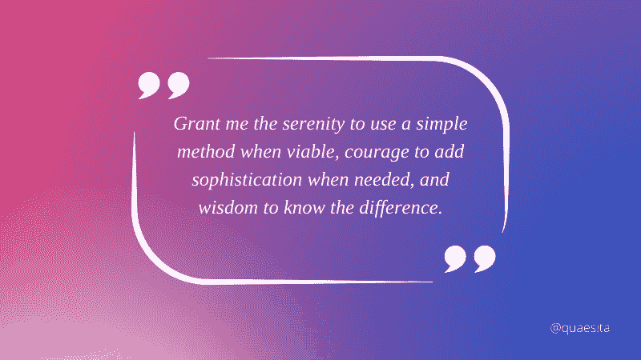

# 卓越分析与速度息息相关

> 原文：<https://towardsdatascience.com/analytical-excellence-is-all-about-speed-6881c848c09c>

## 职业建议引导数据分析师走向巅峰

在 [*数据科学最被误解的英雄*](http://bit.ly/quaesita_hero) *，*中，我描述了数据科学三个领域各自的卓越之处。分析师的优秀之处在于速度。

在我关于卓越数据科学的文章中了解更多信息。图片由作者提供。

不要误解这意味着分析师擅长像无头鸡一样跑来跑去，通过某种笨拙的布朗运动来获得洞察力。速度的优秀要深刻得多，细微得多。

> 分析是一个加速引擎。

分析是一个加速引擎。一个好的分析师通过发现(启发！)新方法，[发现他们的同事甚至不知道的机会和威胁](http://bit.ly/quaesita_hbrrisk)值得提问。他们的一只眼睛是盲人的王国。

> 不要被对速度的简单解释所迷惑。从长远来看，一个草率的分析师总是被闪亮的无意义的“见解”所迷惑，只会拖大家的后腿。

为了有效地产生这种灵感，分析师在探索数据的同时尽量少浪费自己的时间(以及[决策者的](http://bit.ly/quaesita_valueanalyst)！)的过程中。为了获得最佳的*灵感时间*回报，他们必须掌握许多不同形式的速度，包括:

*   获取有希望且相关的数据的速度。( ***领域知识。*** )
*   为操作准备数据的速度。( ***软件技能。***
*   汇总数据的速度。( ***数学技能。*** )
*   将数据摘要输入大脑的速度。( ***数据可视化技巧。*** )
*   将数据摘要输入利益相关者大脑的速度。( ***沟通技巧。*** )
*   激发决策者灵感的速度。( ***商业头脑。*** )

最后一点非常微妙(也是列表中最重要的一点)，所以让我为您详细说明。

丹尼尔·弗兰奇在 [Unsplash](https://unsplash.com?utm_source=medium&utm_medium=referral) 上的照片

当考虑你的决策者的时间时，记住漂亮的可视化和有效沟通的琐事是浪费时间。令人兴奋的发现被证明是误解是浪费时间。转移注意力是浪费时间。错过公共汽车的不可行动的发现是浪费时间。仔细研究垃圾数据源是浪费时间。无关的轶事是浪费时间。分析师带给决策者的任何他们认为不值得花时间的东西…都是浪费时间。

> 分析游戏就是优化每分钟的灵感。

分析师*会*浪费决策者的时间——这是探索的一部分——所以分析游戏就是要尽可能少地浪费时间。换句话说，优化每分钟*(他们的时间*和*你的时间，取决于你们每个人对组织的价值)。*

> *不要被对速度的简单解释所迷惑。从长远来看，一个草率的分析师总是被闪亮的无意义的“见解”所迷惑，只会拖大家的后腿。*

*理解这一点对新手来说是一个主要障碍，这也是为什么我列出了业余分析师和专业分析师之间的 10 个区别。我们已经在我之前的文章[【1】](http://bit.ly/quaesita_realanalyst)[【2】](http://bit.ly/quaesita_careeranalyst)[【3】](http://bit.ly/quaesita_realisticanalyst)[【4】](http://bit.ly/quaesita_valueanalyst)[【5】](http://bit.ly/quaesita_timeanalysts)中详细介绍了前 9 条，现在我们已经准备好跨越终点线了。*

**

*照片由 [Alexander Sinn](https://unsplash.com/@swimstaralex?utm_source=medium&utm_medium=referral) 在 [Unsplash](https://unsplash.com/?utm_source=medium&utm_medium=referral) 拍摄*

## *专业数据与业余数据的差异# 10——对卓越的细微看法*

*与业余爱好者不同，专业分析师不认为速度是一个肮脏的词，而是一个微妙的概念，指导他们如何看待自己的工作，如何区分优先次序，如何评估业绩，以及如何发展自己的技能。他们的工作是加速别人；要做好这件事，他们必须先加速自己。他们的工艺是各种形式的速度，他们认真对待它。*

> *速度不是一个肮脏的词。*

*作为其中的一部分，分析师是无情的优先排序者。因为一切都需要时间——而时间是如此宝贵！—他们拒绝把事情做得更好，除非有证据表明这件“事情”首先值得去做。这不是每个人天生就有的性格特征，所以让我们做一个小小的自我测试: ***你是否读完了所有你开始读的书？****

**

*Renee Fisher 在 [Unsplash](https://unsplash.com?utm_source=medium&utm_medium=referral) 上拍摄的照片*

*专业分析师不会。如果你生活在黑暗时代，所有你能接触到的文学作品都可以装进一个便当盒，那么你会从第一个单词到最后一个单词仔细阅读。但由于书的数量比你有时间去读的多，最有效的方法是迭代:在你承诺认真阅读之前，你需要一个过程来发现有前途的书，这些书值得你去读，再加上以最少的生命浪费停下来换书的纪律。分析师就像处理[数据](http://bit.ly/quaesita_hist)一样——总有比你有时间看的更多的东西——智能发现过程是关键。*

> *分析师不怕从简单开始。*

*分析师也是无情的原型。他们永远不会*从最耗时的工具开始*,无论多么闪亮或复杂，直到他们得到信号——通常是从尝试更简单的方法开始——这是对他们时间的良好投资。伟大的分析师不仅不怕从简单开始，他们还会偷偷嘲笑那些不简单的人。不言而喻，他们知道不应该浪费时间去重新发明轮子…或者代码/工具/方法。*

**

*对数据科学家的一个真诚的愿望:“请赐予我在可行的情况下使用简单方法的宁静，在需要时增加复杂性的勇气，以及辨别两者区别的智慧。”用 Canva 创建的。*

*同样的逻辑也适用于团队合作:如果不需要，不要试图自己做所有的事情。如果你的队友有独特的视角和技能可以加快你的工作，那就和他们一起工作。不要躲在角落里试图成为某种不可理解的无所不知的坏蛋，你没有时间做那个。你没有时间被你的盲点绊倒，所以要学会合作！*

**

*迈克·塞切尔在 [Unsplash](https://unsplash.com?utm_source=medium&utm_medium=referral) 上拍摄的照片*

> *让速度成为你技能发展的北极星。*

*作为专业分析师，速度也是你技能发展的北极星。诚然，数据格局正在快速变化，因此您不能停滞不前。你今天使用的工具不会持续很久。继续磨爪子，但不要追流行语。有很多缺乏安全感的人不知道如何让自己变得有用，所以他们把所有的精力都放在头衔、证书、徽章和其他小玩意上。你应该做得更好。*

> *不要再问:*“我应该学习所有酷孩子都在谈论的这个工具/方法/技术吗？”*
> 开始提问:*“学这个会让我更快吗？”**

*学习任何能让你更快的东西(用所有重要的方式)。既然你的工作包括加速别人，那就从加速自己开始吧。*

> *既然你的工作包括加速别人，那就从加速自己开始吧。*

**

*[Nicolas Hoizey](https://unsplash.com/@nhoizey?utm_source=medium&utm_medium=referral) 在 [Unsplash](https://unsplash.com?utm_source=medium&utm_medium=referral) 上拍摄的照片*

*系列到此为止！希望你喜欢。如果你发现它有用，别忘了分享它；以下是全套文章:*

## *专业数据与业余数据的差异#1-#3*

*软件技能；轻松处理大量数据；不受数据科学偏见的影响。包含在第 1 部分的[中。](http://bit.ly/quaesita_realanalyst)*

*</becoming-a-real-data-analyst-dcaf5f48bc34>  

## 专业数据与业余数据的差异# 4 –# 6

了解职业；拒绝成为数据江湖骗子；对确认偏差的抵抗力。包含在[第 2 部分](http://bit.ly/quaesita_careeranalyst)中。

</shifting-your-mindset-from-amateur-to-professional-analyst-61383f913408>  

## 专业数据与业余数据的差异#7

对数据的现实预期。包含在[第 3 部分](http://bit.ly/quaesita_realisticanalyst)中。

<https://kozyrkov.medium.com/how-to-form-realistic-expectations-about-data-622e85ab62cb>  

## 专业数据与业余数据的差异#8

知道如何增加价值。包含在[第 4 部分](http://bit.ly/quaesita_valueanalyst)中。

</how-to-add-value-as-a-data-analyst-8a6ae900b82a>  

## 专业数据与业余数据的差异#9

从不同的角度思考时间。包含在[第 5 部分](http://bit.ly/quaesita_timeanalysts)中。

## 专业数据与业余数据的差异#10

如果您错过了，请滚动到顶部。如果你没有，考虑一下当你不止一次点击拍手图标时会发生什么…

# 喜欢作者？与凯西·科兹尔科夫联系

让我们做朋友吧！你可以在 [Twitter](https://twitter.com/quaesita) 、 [YouTube](https://www.youtube.com/channel/UCbOX--VOebPe-MMRkatFRxw) 、 [Substack](http://decision.substack.com) 和 [LinkedIn](https://www.linkedin.com/in/kozyrkov/) 上找到我。有兴趣让我在你的活动上发言吗？使用[表格](http://bit.ly/makecassietalk)取得联系。*