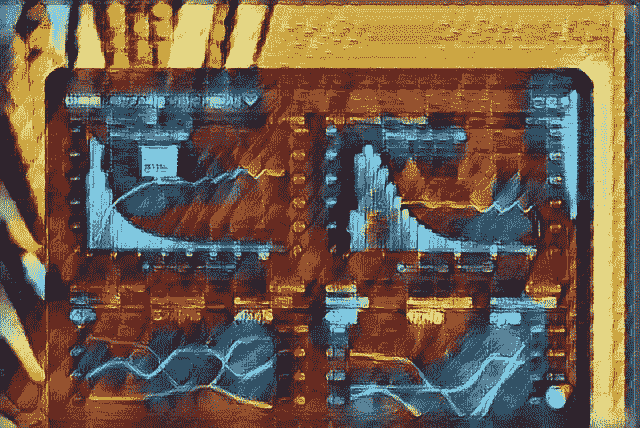

# 分析和数据科学结合在一起会更好

> 原文：<https://towardsdatascience.com/analytics-and-data-science-are-better-together-f5190a7e91b9>

照片由[卢克·切瑟](https://unsplash.com/@lukechesser?utm_source=unsplash&utm_medium=referral&utm_content=creditCopyText)在 [Unsplash](https://unsplash.com/s/photos/data-analytics?utm_source=unsplash&utm_medium=referral&utm_content=creditCopyText) 上拍摄，风格经由 [Fotoram.io](https://fotoram.io/artstyle/)

# 通过关注如何在两个职能部门之间顺利传递想法来提升你的综合价值

如果你是一个组织中的分析师或数据科学家，有幸为两者都定义了角色，“谁做什么？”困惑最多只能阻止您的组织最大化创新和价值。在最坏的情况下，它会产生负面的竞争动态，团队会为谁能参与任何给定的项目而争斗。

在这里，我们将介绍一些实用的策略，以确保专门的分析和数据科学团队能够相互加强，并帮助彼此最大限度地提高价值。自始至终，我将使用分析作为使组织变得更聪明的主要焦点，而数据科学指的是专注于模型构建的角色。自然会有重叠。我们会报道的。

两种角色的读者都将带着实用的人际关系策略，以较低的增量努力获得更多价值。帖子包含附属链接，通过这些链接，我可以免费获得佣金。如果你发现了其他有助于改善合作的技巧，请给我写封短信——我很乐意听到它们。

## 采取相互学习的心态

罗杰·施瓦茨的相互学习方法提供了一种心态和一系列行为，帮助团队摆脱困境，做出更好的决策。我第一次了解到他们是在他的书《聪明的领导者，更聪明的团队》中，这本书一直是我最喜欢的关于领导团队的书。他还在<https://amzn.to/3JVcAv4>**中讲述了他们，更侧重于引导和咨询角色，并在他的文章[“聪明团队的八种行为](https://www.schwarzassociates.com/download-our-eight-behaviors-for-smarter-teams-article/)”中提供了一个免费的精简版本**

**强烈建议至少阅读最后一篇文章，它给出了该框架的简明、全面的概要。该框架的核心是其价值观、假设和行为。Schwarz 在那篇文章中描述了思维模式的核心价值(粗体，作者强调):**

> ***当你* ***透明*** *时，你分享所有相关信息，包括你的想法、感受和策略。当你* ***好奇*** *的时候，你是真心对别人的观点感兴趣，并把它们找出来，这样你和别人都可以学习。当你重视* ***明智的选择*** *时，你的行为方式会最大限度地提高你自己和他人根据相关信息做出决策的能力。当你对***负责时，你要对自己的行为及其短期和长期后果负责。你希望被要求向你的团队和其他人解释你的信念、行动和决定。当你* ***富有同情心*** *时，你会理解他人的担忧，并与他人沟通和回应。你暂时停止判断，这样你就能体会别人的处境。当你带着同情心行动时，你就把理解、同情和帮助他人的意图注入了其他核心价值观。****

***如果你发现自己在努力弄清楚哪个团队应该做什么，或者发现你的利益相关者感到困惑和沮丧，他们不能从你的团队中获得价值，实践这些价值观会有所帮助。八种行为也是如此，我会提到它们之间的联系。***

## ***接受挑战，帮助您的非技术合作伙伴获得正确的支持***

***肮脏的秘密:不是所有的利益相关者都会完全理解你的分析和数据科学团队之间的差异。正如第一个相互学习假设所说，“我有一些信息；其他人也一样。”数据分析和数据科学之间的实际区别是我们拥有别人没有的信息。没关系。***

***就像我永远不会明白为什么我需要去看内分泌学家一样，我不需要:那是我医生的工作。然而，尽管我一无所知，我仍然可以意外地出现在正确的地方，就像我直接去耳鼻喉科说，“医生，前几天我有鼻窦头痛，我可以感觉到我的眼睛。什么给了？”***

***如果我错了，他肯定会让我去看更好的专家。如果我去看过敏症专科医生，她可能会在她的专业范围内对我进行治疗，并转介到耳鼻喉科。这才是最重要的，每个功能都帮助其他功能与能够帮助他们传递价值的人建立联系。***

***“但我建立模型，”我不满的数据科学朋友会说。“我不会花周末时间阅读深度学习的最新进展，这样我就可以避开构建仪表盘的请求。”***

***“每个人都不停地问我关于人工智能的问题，”我们的分析师朋友插话说，“而我们需要的是良好的商业情报和决策支持，而不是时髦的沙拉。”***

***我明白了。它们是非常不同的工作，每个都有自己独特的价值主张、技能和挑战。与此同时，在一个炙手可热的市场中，招聘人员让我们所有人都觉得自己像独角兽和 pegasi。但是我们的非技术朋友坐在很远的地方，以至于如果我们问他们我们中的任何一个是什么，你真的不能责怪他们眯着眼回答，“……基本上是一匹马？”作为一个换位思考的快速练习，让我们想象一下，如果被问到“你能帮我明确区分财务和会计，或者营销和销售吗？”时，我们这些数据专家会给出多么模糊的答案***

***因此，每当有人“问错了人”，我们可以选择是否以不满的愤怒来回应，或者提供帮助并说，“这不是我的团队做的事情，但我想我可能知道谁可以帮忙。”这是一种简单、免费的增值方式，让你变得更受欢迎。这通常会在以后派上用场。让这种反应成为一种习惯。如果这两个功能都嵌入到他们的合作伙伴业务中，这在实时情况下特别容易做到。它展示了透明度和同情心的价值。***

## ***积极对抗封地冲动***

***“不，那是我们的事”是一个有害的、没有生产力的竞争环境的标志。所谓非生产性竞争，我的意思是同一个组织雇佣的团队——因此，人们希望，有着共同的目标——将彼此*视为竞争对手，而不是他们共同的外部竞争对手。****

***内部竞争有多种形式，例如，“谁能清除最多的 bug”黑客马拉松、杰出客户服务奖等等。这些形式的竞争使团队关注支持共同兴趣的行为。获胜队中最有价值球员和第二有价值球员有一个关键的共同特征:他们都赢了。***

***团队之间为资源、利益相关者或支持任何给定项目的机会而发生的内讧，不是富有成效的竞争。这是一种非常愚蠢的时间浪费，而且如果你们停止互相瞄准，开始瞄准一个共同的目标，那么用你们所拥有的资源肯定会比你们所能做的更少。正如第五种相互学习的有效行为所说，“关注兴趣，而不是立场。”***

***作为达成共识的一种方式，花一些时间思考每个团队独特的价值主张。这两种功能的存在都是有原因的，如果你能清楚地表达彼此的目的，并认识到共享的不同价值，你就能更好地向利益相关者解释这一点。考虑为每个职能团队写出可交付成果的[菜单。然后，画出你看到的共享能力和贡献，并承诺永远不要画出人为的线，将特定的个人贡献者与他们有能力做的工作隔离开来。](/to-improve-your-relationships-with-ds-stakeholders-offer-them-a-menu-dfc15f3006c6)***

***例如，假设我们有一个分析师，他构建了一个销售仪表板。她还拥有统计学硕士学位和预测经验，并注意到线性增长和季节性模式。她推介了一个小项目来扩展销售仪表板，以包括基于模型的预测值。***

***如果她从她的主管那里得到的回应是，“我们把建模留给数据科学家”，这是扼杀数据创业精神并最终阻碍进步的领地的标志。同样，如果办公室里的数据科学家反对这个想法。她的工作是让组织变得更聪明。在决定她是否应该做这项工作时，我们可能会应用一些合理的测试:***

*   ***她能做这项工作吗？(是的。)***
*   ***它是否支持让更广泛的组织变得更智能的分析任务？(是的。)***
*   ***在她可能做的项目中，这是投资回报率最高的项目吗？(看情况。)***

***值得注意的是没有“她叫什么名字？”实践明智选择的价值，最大限度地增加彼此在何处以及如何增加价值的选择。***

## ***情侣，但不太正式***

***这里有一个来自系统工程的有趣比喻。如果您在 Google 上搜索“松散耦合”，这个定义将出现在第一批结果中:“松散耦合是一种将系统或网络中的组件互连起来的方法，以便这些组件(也称为元素)在尽可能小的程度上相互依赖。”***

***当然，细节魔鬼正等着听我们对“最不实际”的定义。这就是:分析和数据科学团队应该各自独立运作；任何一方都不应该需要对方来推动价值；通过与对方灵活友好的交流，每一方都应该能够增加更多的价值。***

***在实践中，这意味着熟悉分析团队所做工作的数据科学团队将能够更好地识别建模机会，并更好地加速他们自己的建模工作。作为建模者，我们中的大多数人在开始一个项目时，都是通过加快手头数据的速度，运行一些探索性的数据分析，构建图表等等。如果你在分析商店里有朋友已经处理过类似的问题和数据集，为什么还要浪费时间重复这些工作呢？为什么不用他们对数据集中存在的陷阱的辛苦获得的理解来武装自己呢？(如果你是一名数据科学家，在某个地方工作，那里拥有如此丰富、如此原始、记录全面的数据，没有任何会让人们犯错的陷阱，请保持联系。我的简历可以在我的[网站](https://easter.ai)上找到。)***

***同样，如果一个分析商店可以随时访问建模者在试图构建人工智能时学到的任何东西，它就能更好地让它的组织变得更聪明。“嘿，我们的第一个模型使用了收入和性别之间的交互效应，并发现了一个实质性的影响，你的营销仪表板的利益相关者可能会意识到这一点吗？”***

***回到我们的销售仪表板示例，该分析师应该能够非常快速地询问 DS 同行是否有人曾经模拟过预测销售。如果模型存在，更新的仪表板会更快地到达其内部市场。这都要归功于我们对彼此工作的好奇心，以及我们分享工作的透明度。***

## ***传递问题和假设***

***有一个简单的事实，我们任何受过科学训练的人都知道，但在实践中很容易忘记:我们学到的任何东西都意味着另一个未来的研究。这是我们在科学论文中有未来工作部分的原因之一，也是科学方法如此频繁地被描述为循环的原因之一。***

***放大数据交付价值而不放大工作量的一个简单方法是，分析和数据科学团队认识到，未来的工作可能会从另一个团队的工作中隐含出来。***

***回到我们的销售预测示例，假设我们的分析师了解到她的数据科学团队实际上有一个预测模型。然后，因为这是最低的 LOE 和最高的 ROI 路径，团队决定在仪表板中提供该模型的预测。然后，同一位分析师被要求检查不同产品的季节性需求模式，以帮助销售和运营部门掌握什么时候购买什么。***

***在分析之后，她分享了自己的发现，一些产品表现出非常尖锐的需求模式。“嘿，亚历克斯，”她说，“我们刚刚发现，有许多项目和类别在一年中的某些日子里表现出特定的模式。一种假设是，考虑商品或类别层面的季节性可能会提高我们预测的准确性。如果这种投入被重视，并被接受为推动两个团队向前发展，那么她在一个好地方工作。***

## ***入门指南***

***团队动态是复杂的，需要不断的维护。以下是一些快速可行的方法:***

1.  ***开发简单、灵活的摄入流程。让非技术风险承担者容易向任何一个团队寻求问题的帮助。“流程”可以想象出复杂表格的图像，但你可以像“在这个频道开始一场对话，我们将一起确定你的请求，并找出我们可以如何帮助你”这样简单地开始。你的利益相关者有你没有的信息，让他们容易分享。***
2.  ***让团队之间的推荐变得普通、自然和容易。“这听起来像是山姆的团队可以帮助你的事情。山姆，你同意吗？”实践相互学习的价值观，对你的同事保持透明，支持他们做出明智的选择。***
3.  ***对彼此透明，告诉对方你被要求做什么，你承诺做什么，还有哪些你认为还不能行动的机会。如果有他们可以做的事情，避免推诿。更多的透明度和知情选择。***
4.  ***庆祝彼此的贡献，不管它的形式是否落在两个功能的重叠部分。如果你听到自己或别人说，“我们应该先做那件事”，那不是一个好迹象。记住责任的相互学习价值，也就是你选择在其他项目上工作，以及我们都可以对问题做出贡献的核心假设。***
5.  ***读施瓦茨，真的。这八种行为将为你提供简单可行的方法来提升你与各种伙伴的合作和关系。***

***我希望这些技术能帮助您跨职能部门进行协作，我邀请您联系我，并告诉我任何一种方式。***

****原载于 2022 年 4 月 1 日*[*https://Easter . ai*](https://easter.ai/post/ds-da/)*。****