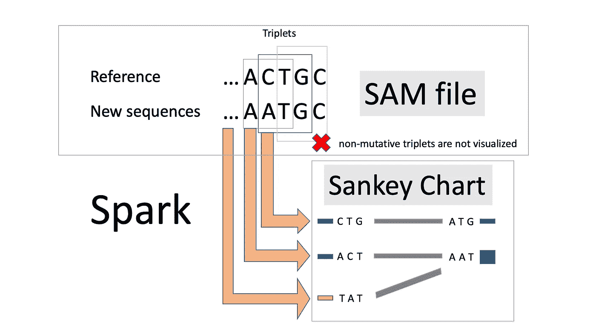
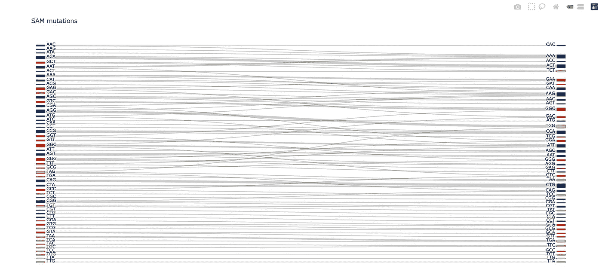

# 用 PySpark 分析 AWS EMR 中的大序列比对

> 原文：<https://towardsdatascience.com/analyze-big-sequence-alignments-with-pyspark-in-aws-emr-a044acaa60af>

## 如何处理生物信息学中的大数据

如今，生物领域的程序员需要从第一天起就为大数据设计他们的应用。这都是因为最新的 DNA 测序仪可以产生大量的数据。比如 [Illumina NextSeq 2000](https://www.illumina.com/systems/sequencing-platforms/nextseq-1000-2000/specifications.html) 两天产生 360 Gb，而来自 MGI 的 [DNBSEQ-T7](https://en.mgi-tech.com/products/instruments_info/5/) 每天可以输出 1 到 6 Tb。在一台计算机上处理它们可能需要几天时间。为了加快速度，我们需要分布式计算。

[Braňo](https://unsplash.com/@3dparadise?utm_source=unsplash&utm_medium=referral&utm_content=creditCopyText) 在 [Unsplash](https://unsplash.com/s/photos/dna?utm_source=unsplash&utm_medium=referral&utm_content=creditCopyText) 上拍照

在分布式计算中，我们将数据存储和数据处理分布在许多计算机上。但是我们开发人员不想自己处理这些细节。我们需要的是一个中间人，负责分发并为我们提供一个简单的编程接口。Apache Spark 就是这样一个大数据分析的中间人。

与其他并行计算如 AWS Batch(阅读我的介绍文章[这里](https://aws.plainenglish.io/parallel-blast-against-cazy-with-aws-batch-8239a45d8116)和[这里](https://aws.plainenglish.io/metagenomic-binning-with-nextflow-866f6c0b0d0c))、Slurm 或单个节点上的多线程/进程编程相比，用 Spark 编写的脚本是简洁的。主脚本几乎不包含任何关于工作分配的提示，因为 Spark 会自己处理输入拆分和并行性。不再有队列、信号量或池。相同的脚本可以在本地和集群中运行。即使是在本地运行，Spark 也会将计算分散到所有 CPU 内核中。但是当 Spark 在多节点环境中运行时，我们确实需要在主脚本之外配置基础设施。

有大量关于 Spark 的文章([勒米厄的这个](/production-data-processing-with-apache-spark-96a58dfd3fe7)是一个很好的切入点)，但很少有关于它在生物信息学中的部署。雪上加霜的是，许多文章都是“快速入门”，没有为实际的大规模项目提供足够的细节。由于生物信息学中对大数据分析的需求如此之大，而文献又如此匮乏，我们迫切需要用新鲜的教程来填补这一空白。在本文中，我将向您展示如何使用 Spark 来处理 AWS EMR 上的 SAM 校准文件。因为在实践中，很少有人拥有昂贵的内部基础设施来扩展 Spark，他们很可能会转向云。最后，我将向你展示如何用一个 Sankey 图表来可视化结果。您可以在这里找到我的 Github 资源库中的所有代码。测试数据`test.sam`是从 *E* 中随机生成的 SAM 文件。*大肠杆菌*基因组。

<https://github.com/dgg32/pyspark_sam/tree/master>  

# 1.SAM 文件和四核苷酸频率

生物信息学测序中最常见的任务之一是将短阅读序列映射到参考基因组。结果是 [SAM 或 BAM 文件](https://www.zymoresearch.com/blogs/blog/what-are-sam-and-bam-files)。两种格式包含相同的信息:新测序的读数、参考序列和一些其他数据。区别在于 SAM 是纯文本，而 BAM 是二进制的。所以巴姆比萨姆小多了。然而，在分布式环境中，纯文本文件是首选，因为它们可以很容易地分割和分散在许多计算机上。相比之下，对二进制文件进行切片并不是一件小事，而且通常情况下，它们必须作为一个单独的数据流来读取。为此，我将在本教程中处理一个 SAM 文件。

大多数基因组是由 DNA 组成的。它们由四种类型的核苷酸组成:A、T、C 和 g。因此，基因组就像是由四个字母组成的书(阅读我的介绍[这里](https://medium.com/geekculture/analyzing-genomes-in-a-graph-database-27a45faa0ae8))。除了同卵双胞胎，大多数个体都有独特的基因组。但是当你一个字母一个字母地比较时，亲缘关系近的生物确实有很大一部分基因组是相同的。此外，[密切相关的生物也共享相似的四核苷酸分布](https://sfamjournals.onlinelibrary.wiley.com/doi/abs/10.1111/j.1462-2920.2004.00624.x)。也就是说，如果你将它们的基因组分成三个字母组，即三胞胎，并计算它们的相对丰度，如果这两种生物在进化上接近，你会看到类似的结果。因此，计算基因组序列的四核苷酸频率是生物信息学中的一项常见任务。在我们的案例中，我们希望看到四核苷酸频率如何从参考基因组变化到新测序的基因组。

图一。项目工作流程。图片作者。

我将使用 AWS CLI 命令向 AWS EMR 提交 PySpark 脚本进行计算。虽然[亚马逊 EMR 无服务器](https://aws.amazon.com/emr/serverless/)仍处于预览阶段，但常规 EMR 中的`auto-terminate`选项使其成为目前你所能获得的尽可能多的无服务器。最后，我选择了 Plotly 的 Sankey 图表进行可视化，因为它可以优雅地显示详细的变化。

# 2.PySpark

Python 代码由一个`helper_function.py`和一个主脚本`spark_3mer.py`组成。`helper_function.py`包含任务的一些辅助功能。计算的主脚本非常短。

该脚本遵循 MapReduce 模型。SAM 文件中的每个比对都将在`map`功能中具体化。在`flatMap`函数中，从这些对齐对象中提取变异的三元组。这两个函数的区别在于，`map`函数为每个输入行生成一个输出，而`flatMap`压缩数据，换句话说，它使输出变平。最后，参考-新序列三联体对在`reduceByKey`函数中求和。`collect`功能为后续的`format`操作向驱动器节点检索数据。

一旦数据被格式化成字典，就该把它写到 S3 了。我发现了两种方法。第一个选项将字典“并行化”为 RDD。然后，它通过`RDD.coalesce().saveAsTextFile()`链，将词典作为一个名为“part-00000”的文本文件保存在 S3 文件夹中。缺点是我们不能命名输出文件，并且文件不是 JSON 格式的。第二个选项使用 boto3 包。这个选项解决了以上两个问题，更加方便。值得注意的是，我们不需要在脚本中提供 AWS 凭证。

# 3.在 AWS EMR 中运行 PySpark 脚本

通常，我们需要一些 Python 库来完成我们的任务。我们需要在 EMR 中安装这些库。幸运的是，这很容易。我们只需要在一个`emr_bootstrap.sh`文件中写下指令，并在稍后的 AWS CLI 命令中引用它:

上传`emr_bootstrap.sh`、`helper_function.py`、`spark_3mer.py`、`test.sam`(可以在我的仓库里找到)到你的 S3 桶里。以下命令可以一次性创建基础设施并运行 PySpark 脚本。

该命令将 emr-6.5.0 用于该作业。它调用引导脚本来安装必要的依赖项。`steps`部分调用 PySpark 脚本，并为它们提供输入和输出路径。一旦工作完成，它还将终止集群，以避免额外的成本。您可以在 AWS EMR 控制台中监控作业状态。

图二。AWS EMR 控制台中的作业状态。图片作者。

如果一切运行成功，您可以在您的 S3 存储桶中找到一个文件`sankey.json`。

# 4.桑基图表

一旦 JSON 结果文件在我们的本地机器上，我们可以用 Plotly Sankey 可视化它。

就像这样运行上面的脚本:

它会自动打开一个带有视觉效果的浏览器标签。这是一个交互式桑基图表:

图 3。与 Plotly 的互动桑基图表。图片作者。

# 5.成本

AWS EMR 的成本适中。我的设置包含一个主节点和两个核心节点。所有的都是 m5.xlarge，这个实例类型每小时花费 0.048 美元。对于本文，我的多个实验花费了大约 5.6 小时的计算时间，总共花费了 0.27 美元(0.048 * 5.6 美元)。据估计，如果我一个月每天工作 10 小时，我将花费 43.80 美元。

# 结论

成功！在这个项目中，我们使用 Spark 来计算四核苷酸频率的变化。Spark 的初始化花了相当长的时间。似乎简单的本地 Python 运行可以更快地完成工作。所以你可能想知道我们为什么要使用 Spark。原因是这个项目中的输入文件很小，Spark 的开销似乎过大。但是当输入文件达到 Gb 级别或以上时，单节点程序就开始挣扎，是时候让 Spark 大放异彩了。Spark 可以将输入分成多个分区，并并行处理它们。这也是开销非常值得的地方。

目前，我们运行并行程序有几种选择:多线程/进程、Slurm/SGE、AWS ParallelCluster、AWS Batch、mrjob 和 Spark。都有利弊。Spark 很容易学习和设置。它的脚本简洁，运行速度快。然而，与其他选项相比，Spark 在 AWS EMR 上的调试变得非常困难，因为它会生成许多日志文件，而没有明确的错误消息。在迁移到 EMR 之前，您最好在本地机器上彻底测试您的脚本。

您可以为将来的项目修改这里的脚本。您可以通过修改`spark_3mer.py`脚本来计算更多的 SAM 统计数据。或者在一些大型 SAM 文件上尝试一下。如果您需要更强大的实例，请在 AWS CLI 命令中更改`instance-type`。或者可以用 Spark 的 MLlib 做一些机器学习。

所以请在你的项目中多使用一些火花，说说你的经历吧！

<https://dgg32.medium.com/membership> 