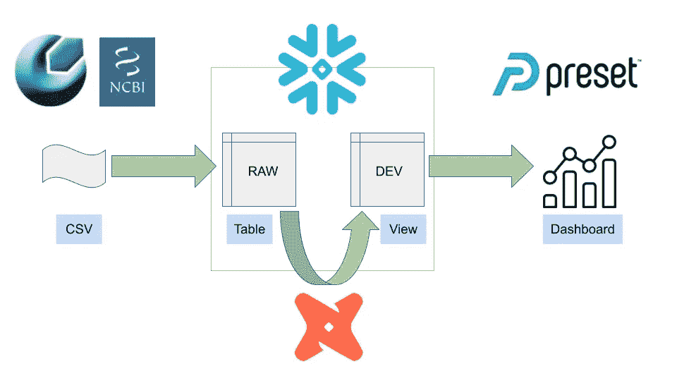
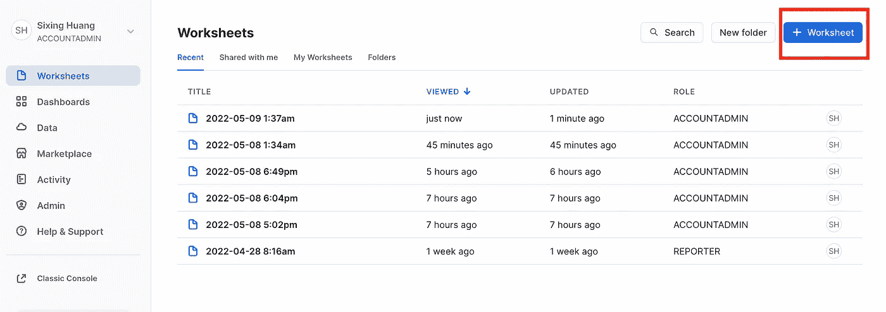
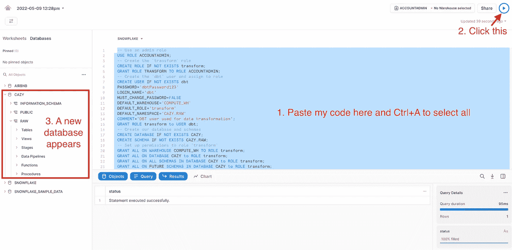
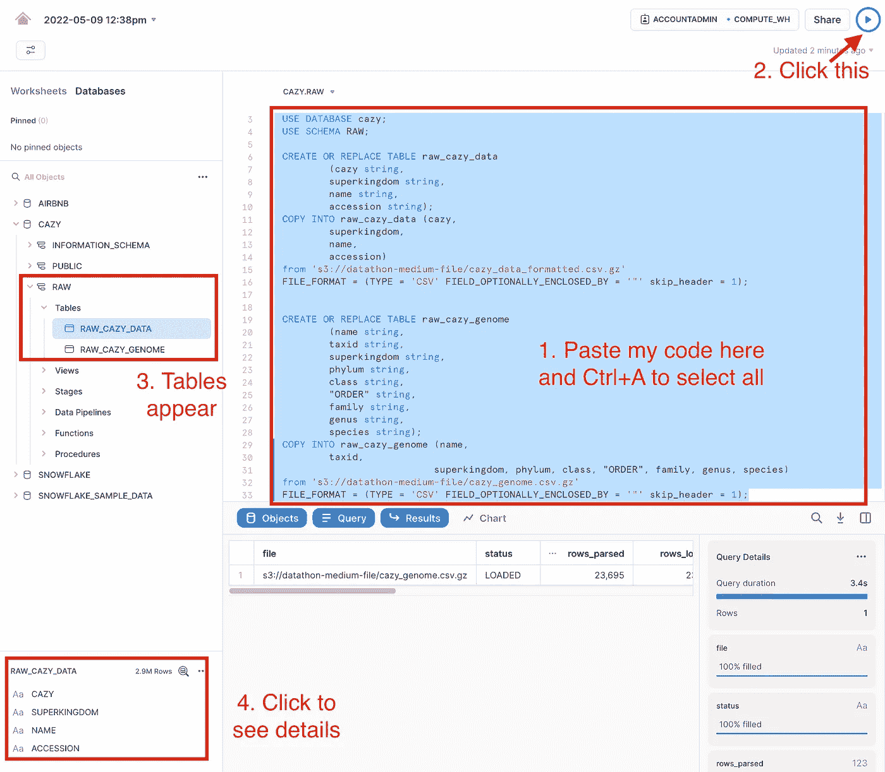
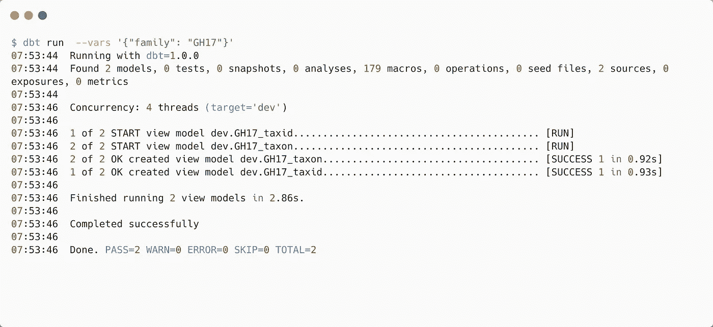
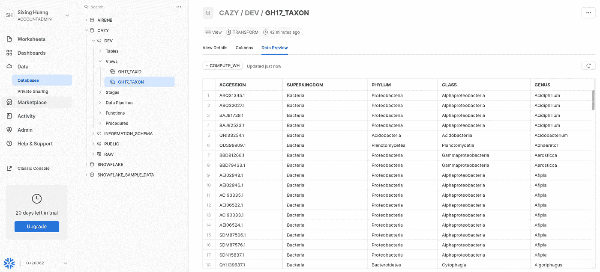
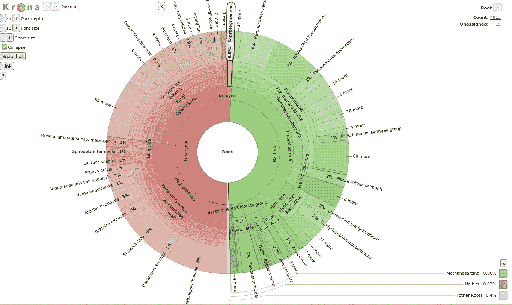
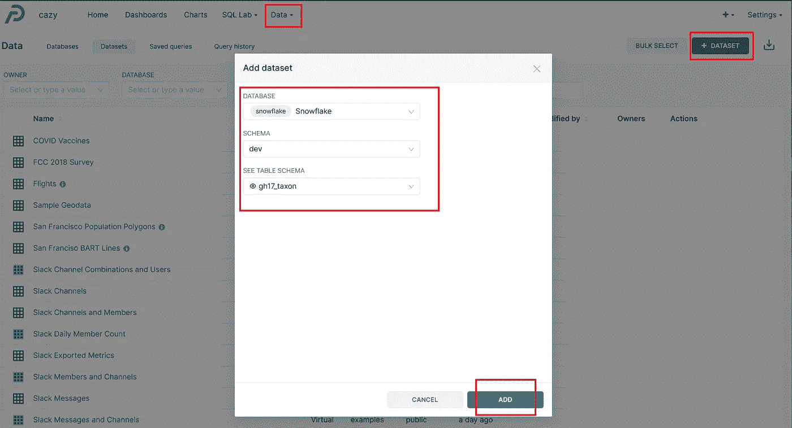
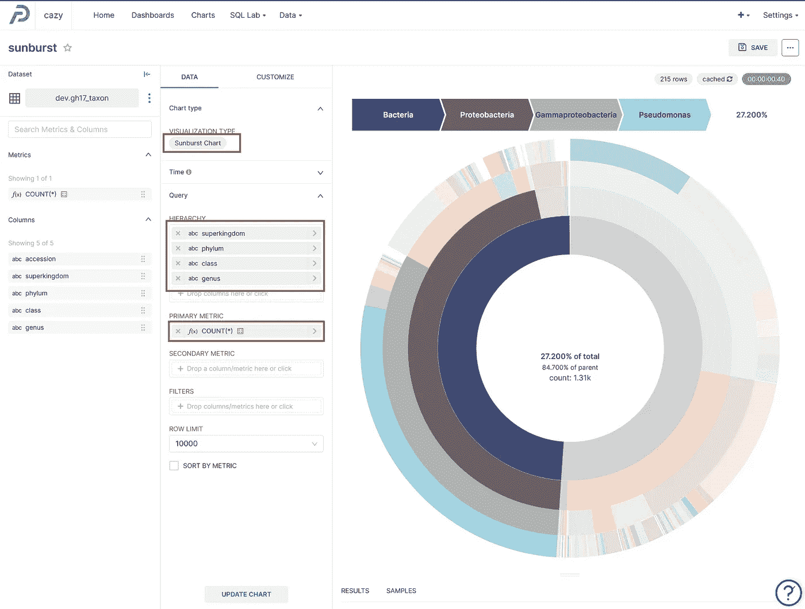

# 使用 dbt、雪花和预设分析 CAZy

> 原文：<https://towardsdatascience.com/analyze-cazy-with-dbt-snowflake-and-preset-2eae46856e10>

## 如何用现代数据栈做生物信息学


在 [Unsplash](https://unsplash.com/s/photos/snowflake?utm_source=unsplash&utm_medium=referral&utm_content=creditCopyText) 上由[zdenk macha ek](https://unsplash.com/@zmachacek?utm_source=unsplash&utm_medium=referral&utm_content=creditCopyText)拍摄的照片

[**C** 碳水化合物-**A**active en**ZY**mes(CAZy)](http://www.cazy.org/)数据库是一个门户网站，提供有关合成、修饰或降解碳水化合物的酶(CAZymes)的信息。对于基因组科学家来说，这是一个非常有价值的资源。他们使用 CAZy 数据库来识别新的 CAZymes，预测它们的功能并研究新的基因组。在我之前的文章 [*图数据库、GraphQL 和碳水化合物活性酶的机器学习*](https://medium.com/p/dba8500b45cf) 中，我已经将 CAZy 放入 Neo4j 图中，对它们进行分析，并使用图机器学习来获得一些新的见解。

然而，从 CAZy 下载数据一直相当困难。它的前身是一个纯文本网站。虽然最新的更新在其网页界面上添加了下载按钮，但可下载的内容仍然只是我们在网站上看到的一个片段。此外，CAZy 团队准备了很好的克朗图，但没有告诉我们如何复制它们。

让我们把这变成一个很好的生物信息学练习。在本文中，我将从 CAZy 下载数据，将其导入[雪花](https://www.snowflake.com/)，通过**数据构建工具** ( [dbt](https://www.getdbt.com/) )提取一些 CAZy 家族的 taxids，并在雪花和预设中生成克朗图和仪表板。



图一。该项目的工作流。图片作者。

是的，对于这样一个小任务来说，dbt+雪花看起来有点大材小用了。我们完全可以用 Jupyter 笔记本或 SQLite 项目完成同样的事情，甚至只需要几个 Bash 命令。但是我忍不住让自己进入了数据仓库和现代数据堆栈的热门话题。当我在 Udemy 完成了 Toth 等人的优秀的 dbt 课程后。我想探索一下数据仓库到底是什么，以及我是否可以在未来的项目中使用它。此外，完全在云上处理大量数据也有一定的吸引力。CAZy 的数据是一个很好的入门资料。你可以在我的 GitHub 仓库中找到这个项目的代码。

<https://github.com/dgg32/cazy_dbt_public>  

# 1.雪花

首先，你需要一个雪花账户。你可以在这里报名试用[。选择`Standard`版本和`AWS`作为您的云提供商。通过电子邮件激活您的帐户，并创建您自己的用户名和密码。雪花会再次给你发邮件。在这两封电子邮件中，您会发现您的帐户 URL 采用以下格式:](https://signup.snowflake.com/)

```
https://[random_string.region].snowflakecomputing.com
```

**请注意，[random_string.region]是您的帐户名称**。所以把你的账户名复制并粘贴到一个笔记本上，因为你以后会用到它。

一旦你进入雪花的界面，点击`+ Worksheet`。



图二。在雪花中添加您的第一个工作表。图片作者。

在工作表中，您现在可以执行 SQL 查询。让我们首先用下面的 SQL 查询为雪花数据库创建一个用户及其角色。



图 3。在工作表中执行 SQL 查询以初始化数据库。图片作者。

上面的查询创建了一个用户**`**dbt**`**，密码为** `**dbtPassword123**` **。它有** `**transform**` **的作用，数据仓库叫做** `**COMPUTE_WH**` **。然后查询创建一个名为** `**CAZY**`的数据库和一个模式`RAW`。**

**保持在同一个工作表中，粘贴并执行以下查询，将数据导入数据库。**

****

**图 4。在工作表中执行 SQL 查询，将数据导入数据库。图片作者。**

**这些查询创建了两个表`RAW_CAZY_DATA`和`RAW_CAZY_GENOME`。然后，他们从我的 S3 (public)获取两个 CSV 文件，并将它们导入到表中。您可以在雪花中预览这两个表格。第一个文件是从 CAZy 下载的。在第二个文件中，我在 pyphy 的帮助下将 taxid 扩展为 NCBI 分类法，pyphy 的云版本在我的第一篇文章中有描述。**

# **2.dbt**

**dbt 是一个数据转换器。您首先像雪花一样将 dbt 与您的数据仓库连接起来。然后，通过在模型文件中编写 SQL SELECT 查询，开始提取、组合和转换数据。在一个称为物化的过程中，每个模型通常会变成数据仓库中的一个视图或一个表(还有另外两种物化形式，称为“增量”和“短暂”)。虽然开发人员在本地编写 dbt 代码，但是计算完全是在云上完成的。最后，您可以使用仪表板可视化转换后的数据。**

**在这个项目中，我们想研究糖苷水解酶家族 17 (GH17)的分类组成。也就是说，我们想要计算每个分类群中 GH17 基因的数量。因为我们将在克朗图和仪表板中可视化结果，所以我们将在 dbt 中编写两个模型:`family_taxid`和`family_taxon`。**

**在你的本地电脑上安装[dbt-雪花](https://anaconda.org/conda-forge/dbt)。运行以下命令启动 dbt 项目:**

```
dbt init cazy
```

**按照提示完成注册。您将需要您的帐户名称。然后你可以填写你的用户名`dbt`，密码`dbtPassword123`，角色`transform`，仓库`COMPUTE_WH`，数据库`cazy`，模式`dev`。我用了 4 根线。当它完成时，dbt 将创建两个文件夹:`cazy`和`log`。删除`models`文件夹下的`example`文件夹。还要删除 dbt_project.yml 中的最后两行(示例:+materialized: view)。**

**此外，我想为表`RAW_CAZY_DATA`定义一个别名“基因”,为`RAW_CAZY_GENOME`定义一个别名“基因组”。将以下内容复制粘贴到一个名为`source.yml`的文件中，放在`models`文件夹下。**

## **2.1 克朗的 family_taxid 模型**

**现在在`models`文件夹下创建一个名为`family_taxid.sql`的文件。它应该有以下内容。**

**该模型在调用时需要用户提供 CAZy 家族名称。然后，它将在雪花的 DEV 模式中创建一个名为[CAZy_family]_taxid(第 1 行)的视图。SQL 查询以两个“with”子句开始。他们从两个表中选择必要的列:`gene`和`genome`(第 3 到 12 行)。这两个表通过名称匹配在“WHERE”子句中连接。WHERE 子句只保留用户指定的 CAZy 系列中的数据。它还确保 taxid 不为空(第 17 行)。因为 Krona 可以单独使用 taxid，所以我的 SELECT 子句只选择 taxid 和 accessions 作为输出(第 14 和 15 行)。**

## **2.2 科 _ 分类单元模型**

**类似的，`taxid_taxon.sql`模型看起来是这样的。**

**与`family_taxid`模型相比，`family_taxon`模型需要超界、门、类和属的数据来代替 taxid。雪花和预设都将使用这些列来生成图表。**

## **2.3 运行 dbt**

**现在是运行 dbt 并创建视图的时候了。在`cazy`文件夹中运行以下命令。**

**当一切顺利运行时，您应该会看到如下所示的控制台输出。**

****

**图 5。dbt 运行。图片作者。**

**现在去你的雪花刷新。您应该在`DEV`模式下看到两个视图。您也可以预览数据(图 6)。**

****

**图 6。dbt 运行后的雪花。图片作者。**

# **3.克朗图**

**现在从[这里](https://github.com/marbl/Krona/releases)下载最新的 KronaTools 版本。您需要运行其 updateTaxonomy.sh。它将从 NCBI 下载 taxdump.tar.gz 并对其进行预处理。但是，我建议您自己在这里下载文件，并将其放在 KronaTools 的`taxonomy`文件夹下，因为脚本每次都无法下载。**

**我们现在需要从雪花下载我们的 GH17_TAXID 视图到我们的本地计算机。据我所知，从 Snowflake 下载数据的唯一方法是运行像这样的 Python 脚本。**

**你可以这样运行它。**

**这次运行在当前文件夹下生成一个名为`GH17.tsv`的 TSV 文件。**

**现在我们用下面的命令生成克朗图。“-q 2”表示我们的查询标识符在第二列，而“-t 1”表示 taxids 在我们的`GH17.tsv`文件的第一列。**

**你可以在你的`KronaTools`文件夹下的`scripts`文件夹下找到`ImportTaxonomy.pl`。这个命令将生成一个 HTML 文件。打开 HTML 文件，您可以看到 GH17 的克朗图。**

****

**图 7。GH17 的克朗图。图片作者。**

**从图表中，你可以看到大约一半的 GH17 酶来自真核生物，另一半来自细菌。变形菌，尤其是γ变形菌，占了绝大部分。值得一提的是，我们的克朗图和 CAZy 官方的不一样。我们的图表统计了每个分类群下不同的酶，而官方的图表只统计了不同的分类群。当然，我们也可以在 dbt 模型中使用 DISTINCT 关键字来复制官方的。**

# **4.仪表盘**

**或者，我们可以在云上完全可视化我们的数据。雪花本身有一个仪表板选项卡，我们可以在那里快速生成一些图表。**

## **4.1 雪花状仪表板**

**在雪花中点击打开`Dashboards`选项卡，添加一个名为“cazy”的仪表盘。然后添加新的倾斜。在查询编辑器中，输入并执行一个 SQL 查询，例如:**

**选择`Chart`并确认`Chart type`为`Bar`。您应该会看到一个条形图，显示了类级别的分类细目分类。**

****

**图 8。雪花中 GH17 的条形图。图片作者。**

**然而，雪花的图表对我来说有点简陋。因此，让我们转到预设的一些更多的选项。**

## **4.2 预设**

**登录或注册您的[预设账户](https://www.google.com.hk/url?sa=t&rct=j&q=&esrc=s&source=web&cd=&cad=rja&uact=8&ved=2ahUKEwjhi5Tlg9X3AhWdK0QIHVbZCNoQFnoECAoQAQ&url=https%3A%2F%2Fpreset.io%2F&usg=AOvVaw13Ve1_RQDfgieHvYYb9Mn-)。进入之后，创建一个名为`GH17`的空仪表板。然后创建一个工作区并将您的雪花数据库添加到其中。**

****

**图 9。连接预设与您的雪花数据库。图片作者。**

**然后点击`Data` / `Datasets`下的`+DATASET`添加数据集。在`DATABASE`、`SCHEMA`和`TABLE`下输入正确的值。**

****

**图 10。使用雪花视图创建数据集。图片作者。**

**选择新创建的数据集，创建旭日图。拖拽`HIERARCHY`下的`superkingdom`、`phylum`、`class`、`genus`、`PRIMARY METRIC`下的`COUNT(*)`。更新图表，保存并将其添加到您的仪表板。你可以看到，在仪表板模式下，当他们试图将长名称压缩到面包屑中时，预设仍然有一些视觉错误需要修复。**

****

**图 10。在预设中创建 GH17 的旭日图。图片作者。**

**为什么停在那里？您可以在 GH17 仪表板中添加更多图表，以显示数据的不同方面。您甚至可以启用树形图中的`dashboard cross filters`。**

****

**图 11。我的 GH17 仪表板预设。图片作者。**

# **结论**

**这篇文章只是触及了 dbt、雪花和预设的一点皮毛。dbt 将软件工程的最佳实践，如模块化、可移植性、CI/CD 和文档引入数据工程。这个项目有很多地方可以改进。例如，我们应该为数据转换和数据可视化创建单独的角色。我们也可以在 dbt 中创建一个仪表板。我们可以通过曝光将预设仪表板插入 dbt 仪表板。我们可以用“dbt docs”命令为我们的项目创建一个文档页面。如果您没有预设帐户，但有 Tableau，您也可以使用 Tableau 和雪花驱动程序来分析雪花数据。**

**所以请尝试这个项目，并分享你的经验。**

**<https://dgg32.medium.com/membership> **