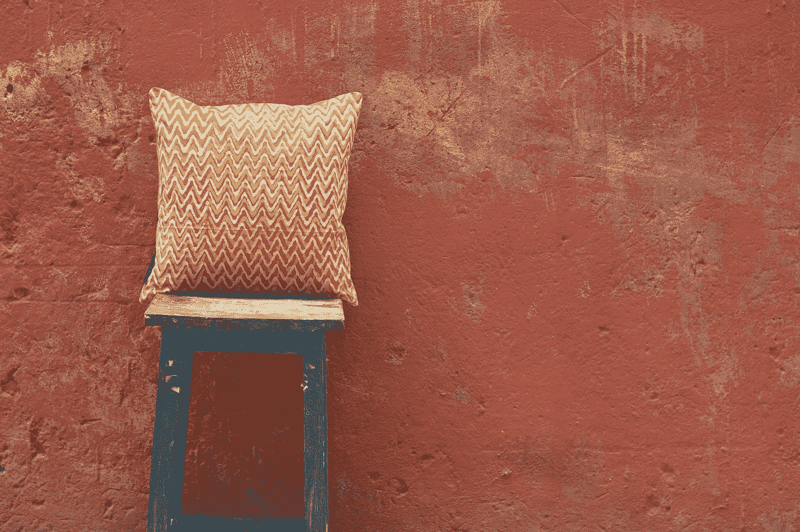
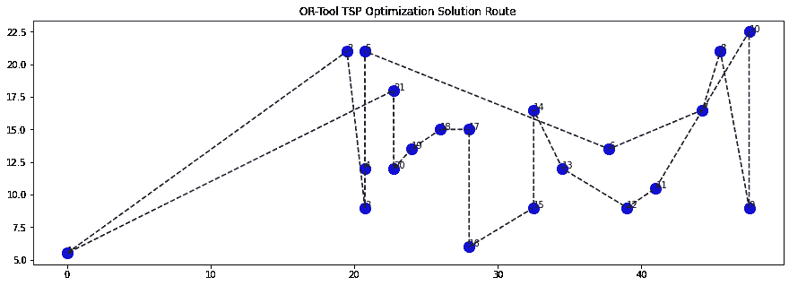
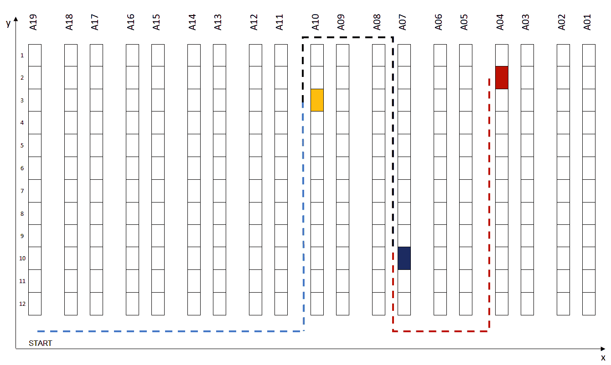
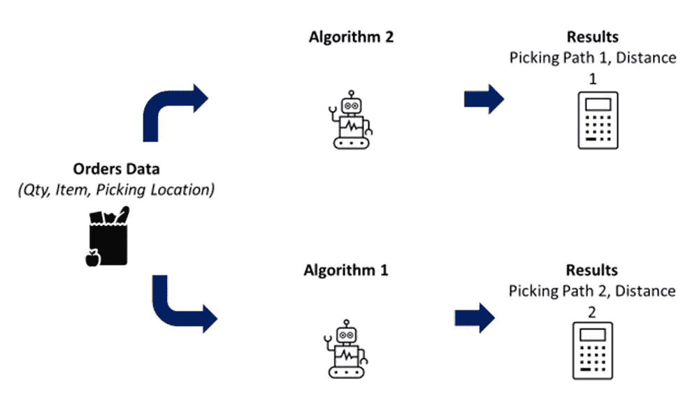
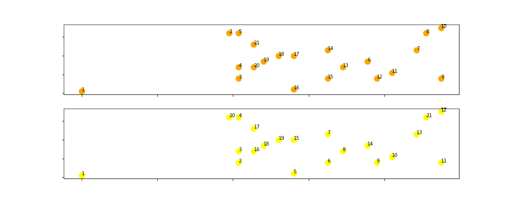

# 使用 Pillow 制作 Python 图形动画

> 原文：<https://towardsdatascience.com/animate-your-python-graphs-with-pillow-c1142b35c7f1>

## 使用 python 库 Pillow 为您的绘图创建动画 gif，为您的见解带来活力

[牛逼酱创意](https://unsplash.com/@awesomesauce_creative?utm_source=medium&utm_medium=referral)在 [Unsplash](https://unsplash.com?utm_source=medium&utm_medium=referral) 上的照片

**场景** 你是一名数据科学家，开发了一种算法或执行了一些与**动态流程**相关的高级分析。

因为您想要显示您的解决方案的**影响，**您使用传统的 python 库来绘制结果。

寻路解决方案示例—(图片由作者提供)

然而，您的图表**不是不言自明的**并且**没有反映流程的动态方面**。

**目标** 在本文中，我们将使用这个寻路算法的例子来展示如何通过使用 Python Pillow 构建 GIF 动画来带来额外的见解。

如果你愿意，你可以观看本教程的视频版本，

# **如何用 Python 制作图形动画？**

## 问题陈述

在**仓库中，**在拣货路线中从一个位置到另一个位置的行走时间可以占操作员工作时间的 *60%到*70%。

减少步行时间是提高你整体生产力的最有效的方法。

具有三个位置的路线示例—(图片由作者提供)

所以你开发了几个优化仓库操作员路线的算法来**减少他们的行走距离。**

## **任务**

以一个长时间拣选任务为例，您希望使用一个图表来显示这两种算法之间的差异。

带有两种解决方案的图表—(图片由作者提供)

每个点是一个**拣货位**，数字代表操作者在**拣货路线中的顺序。**

然而，这些图**并不是不言自明的**，我们错过了导致这个最终结果的不同步骤。

## **目标**

让我们将此图制作成动画，逐个位置地查看序列，以了解两种解决方案之间的差异。

> 正在寻找一种用 Python 实现图形设计自动化的方法？

# 解决方法

## 过程

让我先解释一下如何绘制上面的图表，

1.  您导入了一批订单行，其中包含订单编号、物料代码、库位坐标
2.  您将运行两个算法来为每个订单创建路线
3.  您可以导出包含每条路线的一系列位置的结果

挑选根优化—(图片由作者提供)

结果看起来像这样，

带有结果的数据框架 df—(作者提供的数据)

*   在**路径或**和**路径初始化**中你有 2D 坐标的继承
*   在**距离或**和**距离初始化**中，你有总距离

<https://www.samirsaci.com/improve-warehouse-productivity-using-pathfinding-algorithm-with-python/>  

## 情节

让我们取两种方法之间距离差距最大的线，并绘制结果。

**导入库**

因为我们将使用散点图，所以我们需要按位置提取两个解决方案的坐标

*   我们为两个解决方案创建了两个位置坐标列表
*   对于每个列表，我们创建两个子列表来获取 x 轴和 y 轴坐标

我们现在可以使用列表(x1，y1，x2，y2)来绘制两条路径，

*   为每个位置坐标(xi，易)画一个点，x1 为 xi，y1 为易
*   用虚线把这些点连起来。
*   用路径中的位置顺序注释每个点

最终结果是完整路径的绘图，

带有两种解决方案的图表—(图片由作者提供)

## **中间情节**

如果截断用于绘制虚线的列表，可以显示部分路径

三个第一位置—(图片由作者提供)

目标是**生成这些部分路径的 GIF 图**以显示两个解决方案的连续位置。

<http://samirsaci.com>  

# 用 Python Pillow 创建 GIF

这个过程很简单，

1.  逐步生成局部路径图
2.  使用库 io 将每个图转换为图片，并将其存储在列表中
3.  创建一个 gif 使用 PIL 与生成的列表

## 步骤 1:创建转换成图片的函数

该函数将获取用 matplotlib 生成的图形，并返回一张格式正确的 PIL 图片。

## **步骤 2:构建循环以绘制每个步骤**

图像存储在列表中: **list_gif**

**第三步:创建 Gif**

您可以用一行代码创建 gif，

*   您将第一个图像附加到列表的其余部分
*   您可以在中选择**每张图片的持续时间(毫秒)**
*   选择无限循环，选项: **loop = 0**

## 决赛成绩

最终结果—(图片由作者提供)

现在，您可以看到连续的提货地点，并了解这两种算法的不同之处。

# 结论

*欢迎随时关注我的 medium，获取更多与数据分析和供应链管理相关的文章*

## (更新)用 PowerPoint 创建 gif

我最近发现了一种用 Powerpoint 制作 gif 的新的无代码方法。

你可以在这个 youtube 短片中找到一个简明的教程，

## Python 的后续步骤

通过这个简单的例子，您可以理解生成动画图形的不同步骤，

1.  建立一个循环来生成 gif 的所有帧
2.  创建一个函数，将您的绘图转换为图像
3.  建立一个 gif，所有的帧选择速度和循环次数

在我以前的文章中，您可以找到这种方法的其他应用

交通路线—(图片由作者提供)

<https://www.samirsaci.com/road-transportation-network-visualization/>  

# 关于我

让我们连接上 [Linkedin](https://www.linkedin.com/in/samir-saci/) 和 [Twitter](https://twitter.com/Samir_Saci_) ，我是一名供应链工程师，正在使用数据分析来改善物流运作和降低成本。

如果你对数据分析和供应链感兴趣，可以看看我的网站

<https://samirsaci.com> 