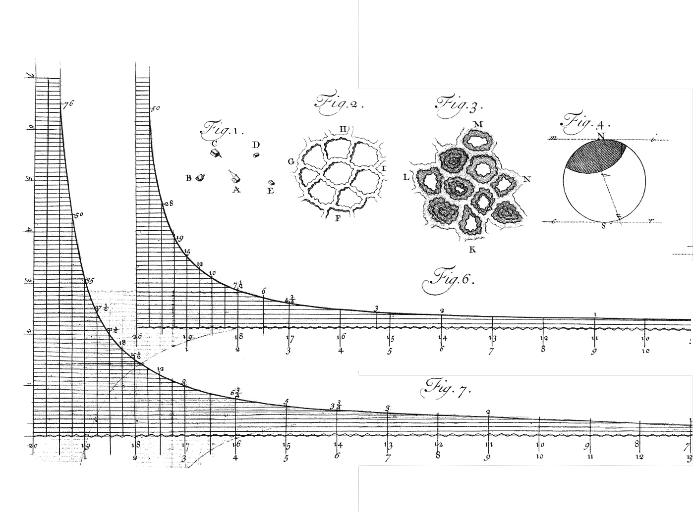
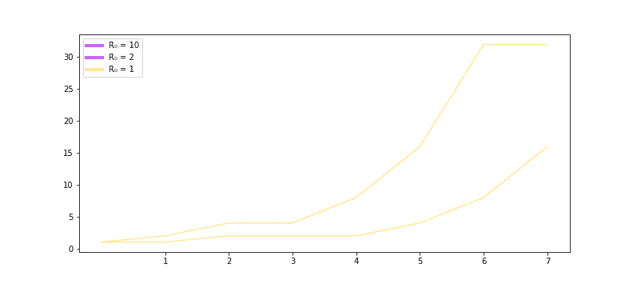
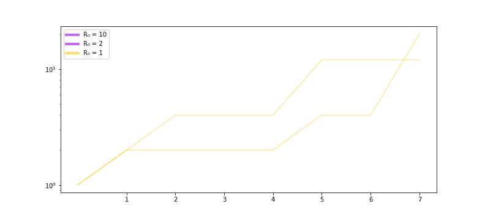
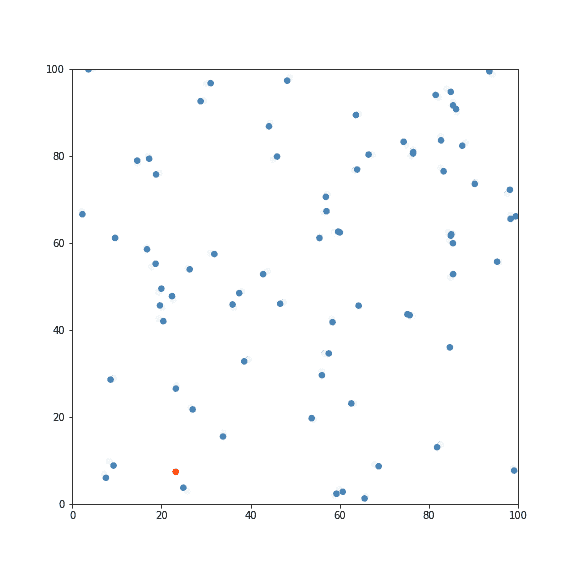
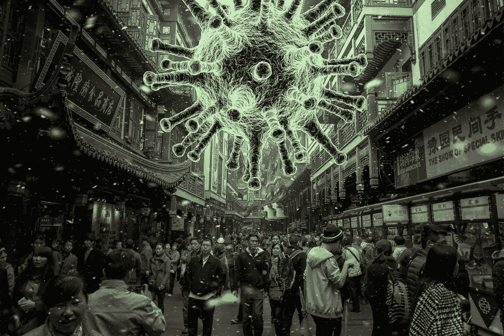

# 用 Python 制作病毒传播的动画

> 原文：<https://towardsdatascience.com/animating-viral-spread-in-python-b4a5b5dfbf6e>

## 使用 matplotlib 的 FuncAnimation 轻松制作信息数据可视化 gif——第 1 部分，共 2 部分


图片作者。

# 动机

在这部作品中，我想展示使用 matplotlib 制作动画是多么容易。过去，我搜索过关于这个主题的教程和信息，但总是没有找到。当我找到例子的时候，我很难解释它们，而且似乎没有什么是固定的。因此，我决定制作一套教程，希望其他人可以学习如何快速有效地制作 matplotlib GIFs。为此，我选择新型冠状病毒作为我的案例研究主题，因为目前有如此多的冠状病毒数据可用。

# 背景

在过去的两年里，每当一种新的菌株出现时，术语*r-零—* 又名 *R₀* 或*繁殖数—* 就会出现在所有的媒体上。我敢打赌，我们都知道这意味着什么，但[的定义](https://academic.oup.com/jtm/article/28/7/taab124/6346388)是指在没有疫苗、口罩或其他保护措施的情况下，一名感染者感染的平均人数。这是一个很难测量的数字，已经提出了许多值。早在 2020 年春天，人们对祖先菌株的 R₀做了许多[估计](https://www.weforum.org/agenda/2020/05/covid-19-what-is-the-r-number/)，范围从 2 到 6+；现在我们认为是在[2.5](https://academic.oup.com/jtm/article/28/7/taab124/6346388)【1】左右。Delta 变体似乎有大约 [5](https://academic.oup.com/jtm/article/28/7/taab124/6346388) 的 R₀，虽然我们仍然处于 Omicron 的早期，但据估计它有大约[10](https://www.thelancet.com/journals/lanres/article/PIIS2213-2600(21)00559-2/fulltext)【2】的 R₀。

传染性明明差别很大，但是怎么可视化呢？在[以前的帖子](/chord-diagrams-of-protein-interaction-networks-in-python-9589affc8b91)中，我描述了当涉及到视觉数据时，人类是如何出色地发现模式的。对我们来说，解读图像比解读一串数字要容易得多。记住这一点，我将解释如何使用 [matplotlib](https://matplotlib.org/stable/index.html) 在 R₀可视化这些差异。在这里，我将向您展示如何使用 [FuncAnimation()](https://matplotlib.org/stable/api/_as_gen/matplotlib.animation.FuncAnimation.html) 来生成病毒传播的 gif。首先，我们将看看如何创建一个动画线图，以及如何建立一个基本的，基于点的病毒传播模拟。在下一篇文章中，我们将看到如何改进这个基本设置，并创建更复杂的动画。

以下是您需要的导入内容:

```
from matplotlib import pyplot as plt
from matplotlib.animation import FuncAnimation
from matplotlib.collections import PatchCollection
from matplotlib.patches import Rectangle
import random
import numpy as np
from scipy.spatial import Delaunay
from matplotlib.lines import Line2D
```

# 线图可视化



图一。弗朗西斯·豪克斯比 1712 年的早期线图[3]

查看数据可视化的历史是很有趣的，图 1 显示了几个非常早期的线形图，如上面的*图 6* 和*图 7* 所示。这些图表描绘了两块玻璃之间水的毛细作用。这就有点含糊了，那么下面是这个实验的另外两个例子: [1](http://physicsexperiments.eu/2080/capillary-action-between-two-glass-plates) 和 [2](https://aapt.scitation.org/doi/abs/10.1119/1.2343547?journalCode=pte) 。折线图可用于显示多种类型的关系，但在这里，我们可以使用它们来显示感染数量随时间的变化。

当创建感染数量随时间增长的可视化时，我们可以使用下面的代码来生成可信的直线轨迹。首先，我们可以创建一个名为`calc_y()`的函数，它接受多个步骤(n)和一个 R₀值(r)。我们可以使用 `np.random.normal()`函数返回一个具有 R₀.平均值的正态分布值，而不是在每一步都使用相同的 R₀这更好，因为繁殖数是一个平均值，所以对每个被感染的个体来说是不同的。

接下来，我们可以创建动画。下面的代码使用了`FuncAnimation()`，它允许我们传入一个自定义函数来生成动画。下面的代码相当简单。所有的`animation_func()`所做的就是从 0 到 45 迭代，`FuncAnimation()`的帧参数，并根据上面描述的代码画线。由于随着时间的推移，不同的 R₀值会导致显著不同的感染数量，因此我编写了一个函数来分三个阶段画线，随着`i`值的增加，每个 R₀对应一个阶段。前 15 行对应于 1 的 R₀，后 15 行对应于 2 的 R₀，最后 15 行对应于 10 的 R₀。

> 请注意，我使用 imagemagick 将图形写入 GIF。如果你正在使用 google colab，你可以运行`!apt-get install imagemagick`来安装它，否则你需要确保你的系统已经安装了它。

上面的代码用于生成下面的 GIF。我们可以看到，对于 1、2 和 10 的每个 R₀，画了 15 条线。看到更大的 R₀'s 的线条增长如此之快，令人惊讶，但也不足为奇。



线形图动画。图片作者。

取消对第 10 行的注释会将 y 轴转换为对数刻度，这进一步说明了感染数量的急剧增加。



对数刻度 y 轴线图动画。图片作者。

# 仿真可视化

这些线形图显示了 R₀为 10 的病毒感染随时间的快速增加。但是，这些信息真的有用吗？请注意，上一个图的 y 轴刻度设置为对数刻度，紫色线的值约为 1000 万。直觉上这是有道理的。由于 R₀ =10 意味着每个人平均感染 10 个人，我们可以预期以 10 的倍数增长。但是，在一个大房间里，人们四处走动时，T5 会是什么样子呢？比方说，在像[生物基因会议](https://www.science.org/doi/10.1126/science.abe3261)这样的大型活动中。

回到 2020 年 3 月,《华盛顿邮报》发表的一篇[文章](https://www.washingtonpost.com/graphics/2020/world/corona-simulator/)展示了几个类似于我上面描述的模拟。它们旨在说明隔离和社会距离等活动是如何减缓传播的。R₀根本没有被纳入 WP 模拟中；一个点仅仅是通过接触一个被感染的点而被感染。我鼓励你去看看这篇文章，因为这些模拟是本教程的灵感来源。虽然可视化很好地说明了如何减少传播，但我们有不同的目标:我们希望模拟不同 R₀'s.的不同菌株的传播。现在我们有了不同菌株的估计值，我们可以可视化传染性的真实世界影响。

## 第一次尝试

问题是，我们如何在不同的 R₀值下模拟病毒传播？我的第一个计划是用一堆点初始化一个平面，每个点都有一个小的速度和一个状态，要么是健康的，要么是被感染的。这些点中的一个将被随机选择在时间 0 被感染。为了模拟传播，从具有 R₀平均值的正态分布中随机选择该感染点将感染的点数，类似于上述过程。然后，这些点的状态从健康变为感染。通过从 R₀周围的正态分布中选择一个感染点的感染数，我们确保平均而言，每个感染点都会感染 R₀点。



这个基本模拟设置有 75 个点，其中 1 个点被感染(红色)，74 个点是健康的(蓝色)。图片作者。

上述方法被证明是错误的。主要问题是在每个时间增量~R₀点被感染，并且这些点被选择为最接近被感染点的点。但这并不意味着他们真的很亲密。更重要的是，先验地确定 R₀ *并不优雅。一个更好的解决方案是设计模拟环境来产生想要的 R₀，这就是我接下来要做的。然而，模拟的动画是有效的，生成 GIF 的代码如下所示。*

用于产生基本模拟设置的代码。

# 后续步骤

在本文中，我展示了如何使用 matplotlib 和 FuncAnimation 生成两种不同类型的动画。在下一篇文章中，我将更深入地改进第二个模拟。一定要跟着我，这样你就不会错过了！如果你喜欢这个作品，请查看我的其他[文章](https://fordcombs.medium.com/)，[报名](https://fordcombs.medium.com/subscribe)接收通知，并加入[媒体](https://fordcombs.medium.com/membership)。



图片来自 [pixabay](https://pixabay.com/photos/coronavirus-virus-pandemic-china-4810201/) ，无需注明出处

## 参考

1.刘英，约阿希姆·罗克洛夫，新型冠状病毒的德尔塔变异体的繁殖数远远高于祖先的新型冠状病毒病毒，*旅行医学杂志*，第 28 卷第 7 期，2021 年 10 月，taab124，[https://doi.org/10.1093/jtm/taab124](https://doi.org/10.1093/jtm/taab124)

2.塔尔哈·汗·布尔基，奥米克隆变异和加强新冠肺炎疫苗，
*《柳叶刀呼吸医学》*，第 10 卷，第 2 期，2022 年，第 e17 页，
ISSN 2213–2600，[https://doi . org/10.1016/s 2213-2600(21)00559-2。](https://doi.org/10.1016/S2213-2600(21)00559-2.)
([https://www . science direct . com/science/article/pii/s 2213260021005592](https://www.sciencedirect.com/science/article/pii/S2213260021005592))

3.弗朗西斯·霍克斯比。“一个实验的账户触摸两个玻璃平面之间的水的上升，双曲线图形。弗朗西斯·豪克斯比先生，*哲学汇刊(1683-1775)*，第 27 卷，皇家学会，1710 年，第 539-40 页，[http://www.jstor.org/stable/103171.](http://www.jstor.org/stable/103171.)