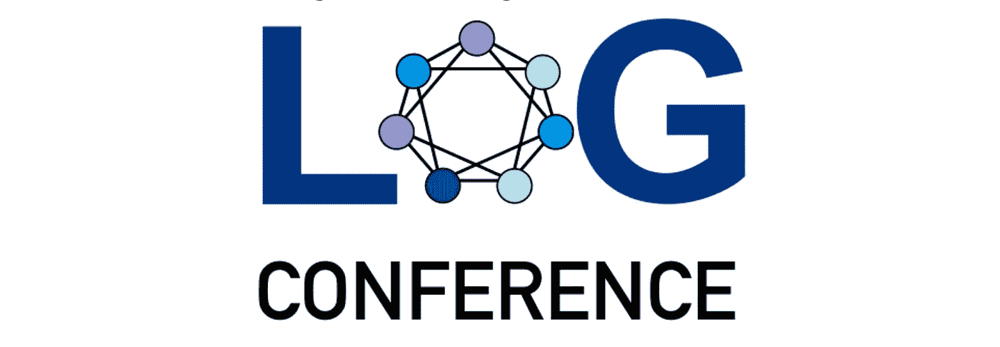

# 宣布图形学习会议

> 原文：<https://towardsdatascience.com/announcing-the-learning-on-graphs-conference-c63caed7347>

## 新图形 ML 会议

## 图机器学习已经成为一个足够大的领域，值得拥有自己独立的事件:关于图的学习会议(LoG)。首届活动将于 2022 年 12 月举行，并将完全虚拟化，免费参加。我们相信这一事件将通过汇集来自不同子领域和相邻学科的专家和从业者来刺激该领域的研究。

这个帖子是由 LoG 大会的组委会和顾问委员会撰写的。我是后者的一员。

随着机器学习领域发展迅速，它的许多子领域也发展迅速。在过去的十年里，图形上的机器学习已经起飞，特别是近年来图形深度学习方法取得了令人印象深刻的进展。这对于处理图形结构数据的应用领域来说是一大福音，例如计算化学、交通网络、社交网络、推荐系统或医疗保健。图形也可以被视为其他域(例如，网格或集合)的概括，并且使用基于图形的 ML 架构通常是有利的，其中传统上使用诸如 CNN 和 rnn 之类的已建立的模型。

然而，增长也带来了许多挑战。到目前为止，已经有很多关于图的学习的论文，涵盖了广泛的目标和方法；没有一个研究者能跟上这个领域的所有这些方面。因此，比以往任何时候都更需要更有针对性的评审人员分配和高质量的评审。

虽然已经有几个致力于图形学习的成功研讨会(在 NeurIPS、ICML、ICLR、KDD、WWW、WSDM、AAAI 和其他地点)，但这种研讨会已经变得非常大。例如，上次亲自举办大型图形表示学习研讨会(NeurIPS 2019)时，有超过 1300 名注册参与者，这使它成为会场上第二受欢迎的研讨会，可能比许多机器学习会议都大。由于这种增长与研讨会可用的资源不兼容，最近面向图形机器学习的顶级研讨会通常不包含图形学习的所有子领域。这种聚焦事件的例子包括关于[算法推理](https://sites.google.com/view/groundedml2022/)、[分子发现](https://moleculediscovery.github.io/workshop2021/)、[知识图学习](https://aihealth.ischool.utexas.edu/KGKDD2021/index.html#agenda)、[工业中的图 ML](https://sites.google.com/view/graph-ml-in-industry/home)和[图学习基准](https://graph-learning-benchmarks.github.io/glb2022)的研讨会。理想情况下，图形学习的所有子领域的研究都有适当的场所来展示和讨论研究，同时仍然保持合作和联系，这很重要，因为关键思想经常在专业子领域之间重新出现。

我们相信，一个致力于图形学习的新会议可以在研究社区中发挥重要作用，并使图形机器学习的研究超越现在。今年，在一些世界顶级图形学习研究人员的国际团队的帮助下，我们正在组织首届图形学习会议(LoG Conference)。在我们的第一年，日志会议将虚拟举行，所有人都可以免费参加。日志会议将有一个在 PMLR 出版的会议录和一个非存档的扩展摘要。我们将使用 OpenReview 进行透明的审查过程，审查过程将是双盲的。我们的目标是通过更有针对性的会议获得更高质量的评论，此外，我们还为顶级评论者提供金钱奖励来激励高质量的评论。会议将于 2022 年 12 月举行；更多信息可以在[我们的网站](http://logconference.github.io/)上找到。我们欢迎通过[这种形式](https://forms.gle/jWWMsdgoPtMnm1mK6)对大会提出任何反馈和建议。

# **其他场馆**

在考虑了机器学习或图形学习的其他工作场所后，我们相信 LoG conference 将在这个研究生态系统中发挥重要作用。像 NeurIPS、ICML 和 ICLR 这样的通用机器学习会议已经发展得[非常庞大](https://aiindex.stanford.edu/wp-content/uploads/2021/03/2021-AI-Index-Report-_Chapter-1.pdf)，因此它们关注的是图形之外的广泛主题。像 AAAI、KDD、WWW、WSDM 和 SIGIR 这样的其他会议最近也有许多关于图的学习的作品，但它们也涵盖了与图的学习正交的各种不同的主题。最近，像 [ML4Health](https://ml4health.github.io/2021/) 、 [AutoML](https://automl.cc/) 、终身学习代理人会议( [CoLLAs](https://lifelong-ml.cc/) )以及新的普通期刊 [TMLR](https://jmlr.org/tmlr/news/2022/launch.html) 等新的焦点场所已经成立。我们分享他们创立的一些原因，尽管图形学习研究也无法在这些新领域找到完美的契合点。

在过去的几年中，也有一些以图形 ML 为中心的研讨会。许多这样的研讨会已经变得非常大——2020 年 ICML 奥运会上， [GRL+](https://grlplus.github.io/papers/) 有 73 篇论文被接受。任何一个单独的工作室都很难满足从事图形学习的大型社区的需求；AAAI 2022 甚至有[两个](https://deep-learning-graphs.bitbucket.io/dlg-aaai22/publications.html) [单独的](https://sites.google.com/view/gclr2022/)图形学习研讨会，每个研讨会都有一个相当宽泛的范围。

因此，在过去的几年里，各种专注于图形学习特定子领域的研讨会已经成立。这些主题包括图形学习基准、工业中的图形学习、算法推理、分子学习等等。我们希望将这些社区统一在一个场所，以增加它们之间的互动和协作。这些独立社区的混合和交叉传播已经极大地促进了图形学习:基准创建者从各种应用领域创建数据集，最初在引用图形上评估的流行图形神经网络已经应用于无数其他领域，来自自然语言处理和物理科学等各种领域的模型已经统一在通用图形神经网络框架下。日志会议将有助于在这些不同的研究者群体之间建立联系。

# **范围**

会议将涵盖广泛定义的图形学习的不同子领域。在[论文征集](https://logconference.github.io/cfp/)中可以找到主题领域的非详尽列表。我们欢迎来自分子发现、物理科学、推荐系统、计算机视觉、自然语言处理等应用领域的图形学习论文。此外，我们欢迎关于图形神经网络体系结构、表达性图形神经网络、等变网络、图形内核、可扩展图形方法、图形生成模型等的论文。我们希望涵盖广泛的理论和应用，以及工业和学术性质的工作。

# **评审员奖项**

世界各地的研究人员花费数小时审阅学术会议的论文，但只有间接的激励提交高质量的评论。我们的目标是通过奖金奖励来激励更好的评论。目前，我们希望给予 20 名顶级评审员每人 1500 美元的奖励。通过结合评审者反馈和元评审者反馈来决定顶级评审者。我们稍后会提供更多细节。

# **致谢**

我们要感谢几个研讨会和会议的组织者，他们在这个过程中帮助了我们:关于图形学习基准的 WWW 研讨会( [GLB](https://graph-learning-benchmarks.github.io/glb2022) )、关于图形的 WSDM 机器学习研讨会( [MLoG](https://mlog-workshop.github.io/) )、关于几何和拓扑表示学习的 ICLR 研讨会( [GTRL](https://gt-rl.github.io/) )、关于图形深度学习的 KDD/AAAI 研讨会( [DLG](https://deep-learning-graphs.bitbucket.io/dlg-kdd21/index.html) )，以及关于健康的机器学习研讨会( [ML4H](https://ml4health.github.io/2021/index.html) )。

# **顾问委员会**

里贾纳·巴兹莱(麻省理工学院)、泽维尔·布列松(新加坡国立大学)、迈克尔·布朗斯坦(牛津/推特)、斯蒂芬·居内曼(牛津大学)、斯蒂芬妮·杰格尔卡(麻省理工学院)、朱尔·莱斯科维奇(斯坦福大学)、彼得罗·里ò(剑桥大学)、汤集安(MILA/蒙特利尔高等商学院)、唐杰(清华大学)、佩塔尔·韦利奇科维奇(DeepMind)、索莱达·维拉尔(JHU)和马林卡·齐特尼克(哈佛大学)。

# **组织者**

袁琪·杜(动力定位技术)，汉尼斯·斯特尔克(麻省理工)，德里克·林(麻省理工)，柴坦尼亚·k·乔希(剑桥)，安德烈娅·戴克(米兰)，尤利娅·杜塔(剑桥)，乔舒亚·罗宾逊(麻省理工)。