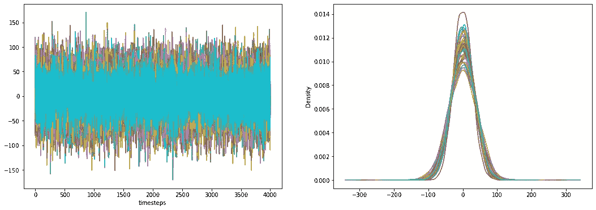
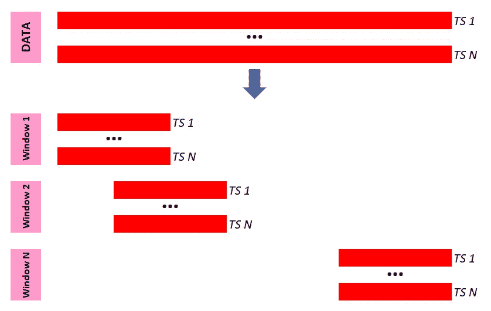
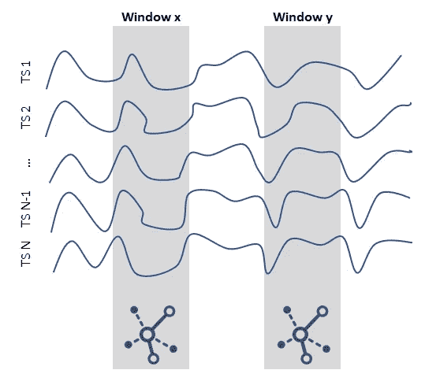
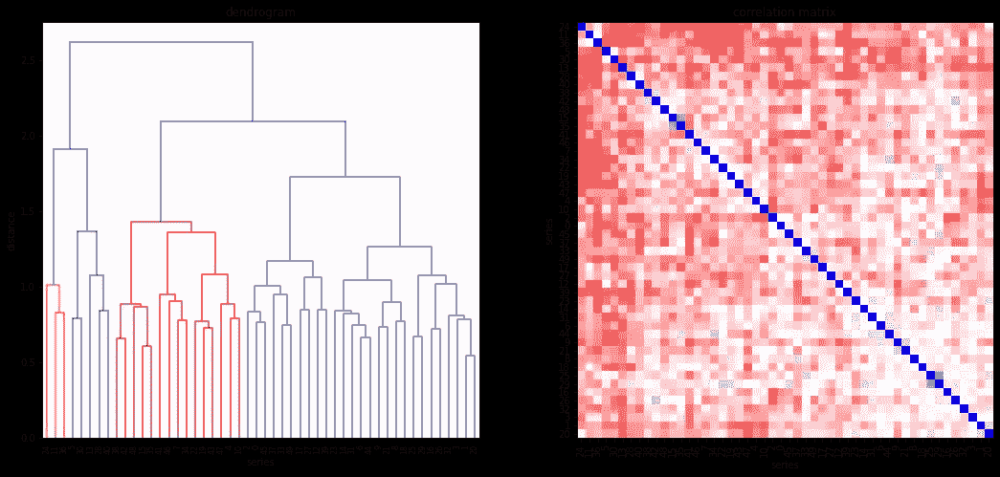
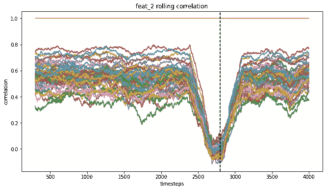

# 基于网络图的多元时间序列异常检测

> 原文：<https://towardsdatascience.com/anomaly-detection-in-multivariate-time-series-with-network-graphs-80a84deeed9e>

## 超越 PCA:一种基于图的异常模式检测方法

阿兰·范在 [Unsplash](https://unsplash.com?utm_source=medium&utm_medium=referral) 上的照片

在进行异常检测任务时，我们习惯于发现并指出数据记录了看不见的动态的情况。**研究过去并推断“正常”行为的能力对于大多数异常检测应用的成功至关重要**。在这种情况下，适当的学习策略必须考虑到时间依赖性。**过去可能被认为是“异常”的，现在可能被标记为“正常”**因为底层数据动态很容易发生变化。

一个好的多元异常检测系统应该研究数据之间的历史关系，并警告未来可能的差异。鉴于这些前提，PCA(主成分分析)算法显示出是该任务的非常好的候选。与旧的黄金 PCA 一起，**我们可以利用我们处理的信号的连接性质来开发网络结构，并通过基于图形的方法检测异常**。

在这篇文章中，我们采用一种基于网络聚类的无监督方法来执行一个多元异常检测任务。我们从一系列时间序列中构建一个网络图，观察它们之间的相关性。然后，我们在相关矩阵之上应用 DBSCAN 算法来识别潜在的异常模式。

# 数据

我们想象在一个多元系统中工作。所有系列都显示出相互之间的正相关程度，同时在整个参照期内保持稳定。

合成系列分布(图片由作者提供)

我们不寻找逐点单变量异常。**我们正在搜索当潜在系列关系随时间发生变化**或出现意外行为时发生的多元异常。

我们手动在数据中插入一个异常周期。我们在一个预定义的特征中，用一些高斯噪声改变一系列连续的观察值。我们进行这种“交换”操作，注意保持原始数据的相同平均值和标准偏差。这样，仅仅通过观察特征分布，异常周期是不可见的。换句话说，在给定的时间范围内，我们通过插入一些与整个系统无关的高斯噪声来改变数据中存在的相关性。

**我们的目标是开发一种异常检测解决方案，能够正确指出特征关系的变化**。让我们开始采用基于 PCA 的方法。

# PCA 异常检测

PCA 特别适合我们的场景。这并不奇怪，因为它在许多异常检测的工业应用中被广泛采用。它的适应性和灵活性使其成为需要检测多变量系统异常的标准解决方案。

用 PCA 检测异常很简单。**我们利用 PCA 的压缩能力**来降低数据的原始特征维度。通过这种方式，**我们只保留有意义的交互，同时减少特征的数量并消除噪音**。降维操作是完全可逆的。我们可以仅使用原始数据集中学习到的关系，毫不费力地回到原始数据形状。

**我们可以通过计算重建误差来查看和总结压缩操作的好坏**。

PCA 重构误差(图片由作者提供)

**我们可以将重建误差视为异常分数**。高幅度的重建误差意味着数据关系发生了变化。我们可以逐个样本地计算它，以确定每个样本的异常分数。我们还可以随着时间的推移对每个特征进行计算，并观察哪个特征受到异常行为的影响。在这两种情况下，我们都遵循时间验证策略来模拟时间相关系统中的真实数据流。

在我们的模拟研究中，我们看到重建误差如何随着人工异常周期(样本和特征方面)而增加。

# DBSCAN 异常检测

检测多变量系统中存在序列相关性的异常是一个热门话题。有很多方法可以解决这个问题(例如用 VAR 对多变量时间序列进行 [**异常检测)。我们也可以想象一个像网络一样的相关系统。这些序列组成了节点和它们之间的关联度，在给定的时间范围内，建立了它们之间的联系。**](/anomaly-detection-in-multivariate-time-series-with-var-2130f276e5e9)

为了开发我们基于图的方法，作为第一步，我们只需将数据划分为相同大小的时间窗口。

我们处理的系列中的时间窗口生成过程(图片由作者提供)

然后，我们应该计算每个时间窗口中序列的相关性。**相关矩阵用作内部系统动态和系列之间关系的近似值**。其他相似性度量也可以很好地工作，如欧几里德距离或动态时间弯曲。

作为最后一步，**我们在每个相似性矩阵**上拟合一个 DBSCAN 算法。在正常情况下，我们应该期望所有的系列都属于同一个群集。**万一出现异常，我们预计会有多个集群串联**。

根据我们处理的系列中的相似性矩阵进行聚类(图片由作者提供)

**相关的系列应该一起运动。如果其中一个改变了方向，关于其他的，我们可以将其标记为异常**。为了从这种方法中获得最佳效果，使用显示相同相关度的系列非常重要。由于一些系统的复杂性，这并不总是可能的。在这些情况下，应该进行初步的聚类。简单的层次聚类可能有助于根据其性质对系列进行分组，并使 DBSCAN 实现最佳性能。

分层聚类将系列分成相关的组(图片由作者提供)

最后，整个过程检测对应于异常周期的内部系统动态的变化。

DBSCAN 探测到的异常系列之间的时间相关性(图片由作者提供)

# 摘要

在这篇文章中，我们介绍了一种有趣的基于图网络的异常检测方法。我们实现了它，并将其与基于 PCA 的标准方法进行了比较。这两种技术都显示了在高度相关的系统中检测多元异常的能力。与此同时，它们看起来很快，完全可以实时解释。

[**查看我的 GITHUB 回购**](https://github.com/cerlymarco/MEDIUM_NoteBook)

保持联系: [Linkedin](https://www.linkedin.com/in/marco-cerliani-b0bba714b/)