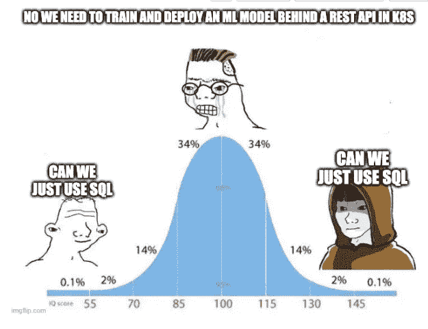

# SQL 中的异常检测

> 原文：<https://towardsdatascience.com/anomaly-detection-in-sql-2bcd8648f7a8>

## 如何在数据仓库中直接实现快速、强大的异常检测模型

# 为什么关注 SQL？

谈到数据科学，我的总格言是:任何能用 SQL 完成的事情都应该用 SQL 来完成。显然，许多有价值的数据科学问题需要机器学习，因此，需要机器学习基础设施、Python 包等。；然而，比大多数机器学习实践者意识到的更多的是，有价值的建模可以直接在数据仓库中完成，以构建快速、可扩展的原型。

图片作者:通过[https://imgflip.com/](https://imgflip.com/)生成

# 使用 Z 计分的异常检测

检测异常是一个非常普遍的问题，涵盖了从欺诈检测到机器故障的各种用例。有些问题需要有人监督或无人监督的机器学习，但仅仅有效地标记鲸鱼通常就有很大的好处。也许你有一个时间序列的销售数据，你想标记异常高的交易量的日子(出于一些我现在想不出的合理原因)；或者，您可能希望标记信用卡刷卡次数异常高的客户，以便进行风险评估。

z 评分是一种简单的、无监督的统计技术，用于标记异常值。简单地减去平均值，然后除以标准差。

图片作者。在线 LaTeX 编辑器。

## 一个简单的技巧...对数变换

这种技术假设正态分布。在只有正数据的情况下，这种假设通常会被打破。众所周知，计数数据和美元金额数据*右偏，*密度集中在低值和长尾附近。将名义标度中的值转换为对数标度将提高大多数 ML 模型辨别关系的能力，并将提高 Z 分数标记异常值的能力。

由天后贾恩—[https://code burst . io/2-important-statistics-terms-you-need-to-know-in-data-science-skewness-and-kurtosis-388 fef 94 eeaa](https://codeburst.io/2-important-statistics-terms-you-need-to-know-in-data-science-skewness-and-kurtosis-388fef94eeaa)，CC BY-SA 4.0，[https://commons.wikimedia.org/w/index.php?curid=84219892](https://commons.wikimedia.org/w/index.php?curid=84219892)

为了说明原因，让我们考虑一个标记低价值客户的例子。如果客户平均每年花费 500 美元，标准差为 300 美元，则每年花费 1 美元的*客户将位于平均值的 2 个标准差之外，*这不足以将其视为异常*。*如果我们对该数据进行对数转换，该客户将偏离均值 3-4 个标准差，我们可以合理地将他或她标记为小气鬼。

## 实施模型

在客户示例的基础上，让我们基于雪花中一个虚构的事务级表(应该以某种形式存在于许多企业中)，在 SQL 中构建一个非常通用的异常值检测模型。

我已经组织了 SQL 来将事务表的细节抽象到第一个 CTE 中，并包括“state”作为我们想要划分数据的维度。在大多数情况下，考虑数据的某个子集内的异常是有意义的，并且——当然——考虑用“state”来代替您想要标记异常的任何一个或多个维度。

SQL 来标记虚构数据仓库中的客户

# 结论

Z-scoring 是一个功能强大的极简异常检测模型，可以在数据仓库中快速灵活地实现。虽然我在强调用 SQL 实现模型的好处时显得有些滑稽，但它确实提供了一种获得轻量级 MVP 并进行验证的方法，这可能是数据科学家最困难的工作。