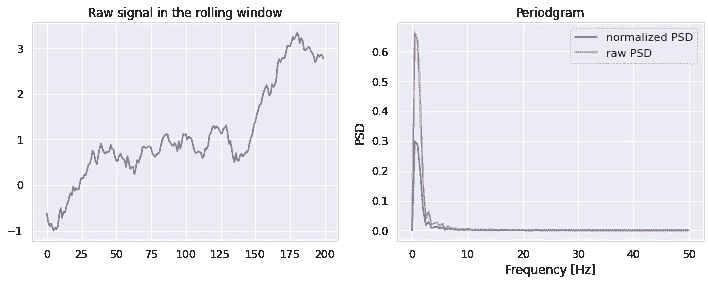

# 基于谱熵的单变量随机时间序列异常检测

> 原文：<https://towardsdatascience.com/anomaly-detection-in-univariate-stochastic-time-series-with-spectral-entropy-834b63ec9343>

## 从随机性中找出正弦波等规则模式的一个技巧。

时间序列数据中的异常检测是数据科学中的一项常见任务。我们将异常视为不按预期存在的数据模式。今天，让我们集中于检测由**随机过程**产生的特殊单变量时间序列中的异常。

在那些随机的时间序列中，数据看起来应该是嘈杂的、混乱的和随机的。意想不到的变化应该一直在发生。如果该值没有变化或以确定的模式变化，则数据有问题。

让我们看一下下面的图，您将看到标记的可疑部分，并理解为什么它们应该被检测为异常。

四个异常区域(图片由作者提供)

上面的图使用了我将在下面展示的代码生成的合成数据。出于客户隐私的考虑，我不会透露启发这种方法的实际用例。我可以试着举一个例子:

根据不同的风力条件，上升烟柱的路径可能看起来奇怪而随机。除非人们操纵大气，否则你不太可能看到像之字形或长直线这样的重复图案。

我想你明白了:我们试图从一堆混乱和随机中找到确定性和模式，然后那些被发现的异常将被贴上异常的标签。

## 生成合成数据

上面的时间序列数据是通过随机游走过程生成的。然后我随机添加三段带有高斯噪声的正弦波和一个常量值的区域。

首先，生成时间序列。

然后，随机添加四个异常区域。

## 基于谱熵的异常检测

异常部分具有不同的长度、频率和振幅。我们能容易地找到那些部分吗？

答案是肯定的。

光谱熵(作者图片)

简单地计算滚动谱熵将是一个快速的解决方案。从图中可以看出，所有异常区域的滚动光谱熵都接近于零。我们可以使用滚动熵作为指示异常可能性的连续异常分数。

## 谱熵为什么起作用？

想法是先计算**光谱密度**，**归一化**，最后计算**香农熵**。

在这里，我比较了两个滚动窗口为 200 的观察示例。上面是一个异常区域的窗口，下面是正常区域的窗口。

异常窗口的功率谱密度(PSD)

良好窗口的功率谱密度(PSD)

首先，计算每个窗口的光谱密度，并得到显示在右侧的结果。

然后，您可能会认为频率是一个具有箱的离散变量，并将归一化密度视为每个频率箱值的概率。因为密度是归一化的，所以它们的和应该等于 1。

现在香农熵可以发挥作用了。

> 分布的香农熵是从该分布中提取的事件中的预期信息量。它给出了对从分布 p 中提取的符号进行编码平均所需的比特数的下限

在上面的异常窗口中，信号将仅在 1Hz 的频率仓“活跃”(1Hz 的概率几乎为 1，其他的几乎为 0)。没有惊喜，没有不确定性；因此，在这种情况下，熵大约为 0。

对于好的区域，信号可能在具有不同概率的几个频率仓上是“活动的”。我们有更多的不确定性或未知信息，所以熵会更高。

## 滚动窗口大小和 FFT 大小

对于那些类似正弦波的异常，你并不总是看到非常接近零的光谱熵。这背后的原因是我们如何计算光谱。峰值频率有可能扩展到两个相邻的频率仓中(**频谱泄漏**由于频率分辨率)。那么香农熵将不会接近零，但仍将小于正常窗口中的情况。

**采样率**和 **FFT 大小**决定频率仓。如果没有指定 FFT 大小，我们将使用窗口大小。

光谱熵(作者图片)

以上是 FFT 大小为 512，窗口大小为 100 的结果。我们仍然可以看到使用滚动谱熵的分离；虽然异常区域的分数较小，但不等于 0。我们可能需要进行后处理，如计算移动平均值，以将时间序列分为异常和标准部分。使用较小的窗口大小，我们可以更早地检测到异常。

在实际应用中，你应该探索和研究预期的异常。然后，您将根据您的异常检测要求选择滚动窗口大小或 FFT 大小。

## 结论

谱熵结合了 FFT、谱密度和香农熵的思想。我们可以用它来检查一个时间序列数据窗口中包含了多少信息。更高的熵意味着不确定性和随机性。较低的熵表示规则和确定的模式。

因此，我们可以使用谱熵从随机性中检测模式。当然，谱熵的作用正好相反:从一系列模式化的数据中检测随机性。但是频率分析对于这些情况可能已经足够好了。

感谢阅读。

享受你的时间序列。