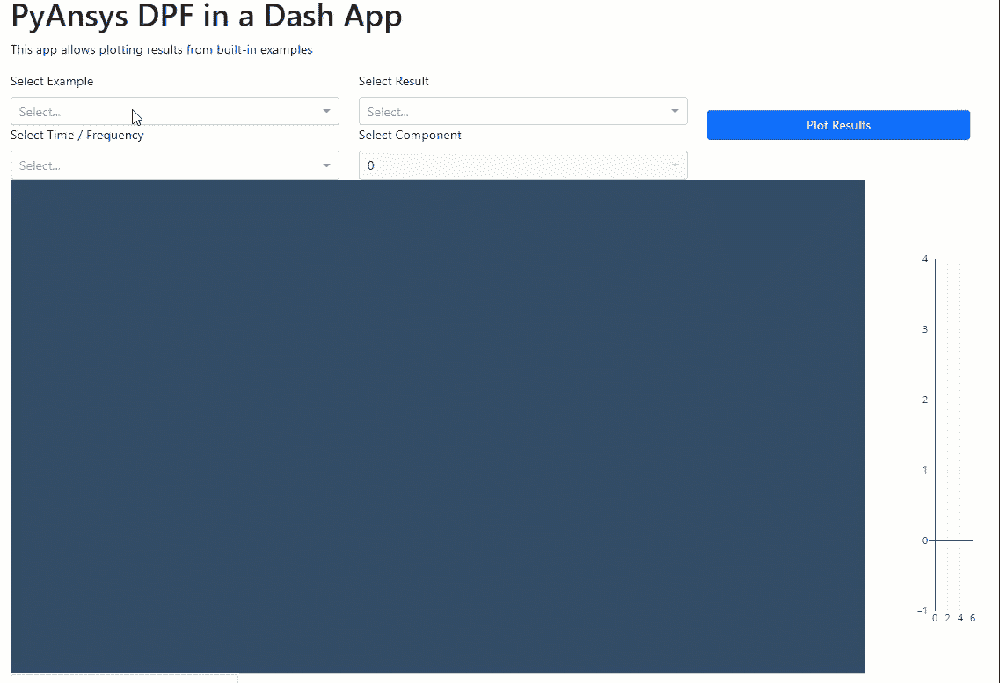

# Python Web 应用程序中的 ANSYS，第 1 部分:使用 PyDPF 进行后处理

> 原文：<https://towardsdatascience.com/ansys-in-a-python-web-app-part-1-post-processing-with-pydpf-44d2fbaa6135>

## 将 PyAnsys 与 Plotly 的 Dash 和 Dash-VTK 组件集成，构建 Ansys 结构分析后处理 web 应用程序



最后的后期处理 app。作者图片

ANSYS [最近宣布](https://www.ansys.com/blog/ansys-gets-into-open-source-with-github)支持一个开源项目: [PyAnsys](https://docs.pyansys.com/index.html) 。PyAnsys 被拆分成多个包: [PyMAPDL](https://mapdldocs.pyansys.com/) 用于与 Ansys multiphysics 仿真和方程解算器的实例进行交互，以及 [PyDPF-Core](https://dpfdocs.pyansys.com/) ( &它的简化兄弟 [PyDPF-Post](https://postdocs.pyansys.com/) )用于后处理 Ansys 结果文件。作为一个几乎每天都在使用 ANSYS 和 Python 的结构分析师，这真的很吸引我。我还使用了 Plotly 的 Dash 框架来构建相当简单的网络应用程序，用于后处理数据和求解各种方程或系统。

在 Jupyter 笔记本上玩了一会儿 PyANSYS 之后，我决定看看是否可以将一个 web 应用程序混合在一起，该应用程序将 PyANSYS 用作非分析师可以使用并获得洞察力的专门构建的分析工具的后端(或者至少构建一些朝着那个方向发展的东西)。PyANSYS 被拆分成几个包。PyMAPDL 专注于与正在运行的 MAPDL 实例(本地或远程)通信，该实例在运行时获取许可证。PyDPF-Core 和 PyDPF-Post 侧重于对已经解决的文件进行后处理(例如*。rst)。这些库确实需要安装 Ansys。

在本文中，我将介绍如何使用 PyDPF、Dash & Dash-VTK 构建一个 web 应用程序，该应用程序加载并绘制一些 PyDPF 示例的结果。你可以在这个 [GitHub 库中看到完整的文件(笔记本和 Dash app)。](https://github.com/shkiefer/pyAnsys_DPF_dash)

# 普洛特利的破折号&破折号-VTK

[Plotly 的 Dash](https://dash.plotly.com/introduction) 开源框架被描述为一个仅用 python 就能构建全功能网络应用的框架。我非常喜欢用它来构建我希望其他用户(除了我自己)会使用的应用程序。

虽然自首次亮相以来它已经发展了很多，但你可以阅读 2017 年的公告文章，以了解 Dash 的更多背景信息:

[](https://medium.com/plotly/introducing-dash-5ecf7191b503) [## 🌟引入破折号🌟

### 用纯 Python 创建反应式 Web 应用程序

medium.com](https://medium.com/plotly/introducing-dash-5ecf7191b503) 

几年前，我开发了几个基于 VTK 的桌面应用程序，用于有限元分析结果的后处理。因此，当我了解到 Dash-VTK 时，我很兴奋地尝试将其中一些移植到网络应用程序中。我把一个例子和一篇文章放在一起，你可以在这里查看:

[](/3d-mesh-models-in-the-browser-using-python-dash-vtk-e15cbf36a132) [## 使用 python & dash_vtk 在浏览器中创建三维网格模型

### 使用 python 和 Dash、pyvista 和 dash_vtk 库导入和查看非结构化网格的快速示例…

towardsdatascience.com](/3d-mesh-models-in-the-browser-using-python-dash-vtk-e15cbf36a132) 

借助 Dash，我们能够构建一个具有简单、简洁用户界面的应用程序，这要归功于 Dash-VTK 视图 3D 网格和相关结果。如果你使用 Ansys 来解决你的分析问题，你需要将结果从 Ansys 中导出为某种固定的(可能是文本)格式，这样它们就可以被 web 应用程序读取。您必须导出模型(网格)以及 Ansys 的结果，并处理所有的映射。这可能是脆弱的，并且将限于您(作为开发人员)编码阅读的任何结果。这就是 PyDPF 帮助消除模型和网格步骤导出并从完整的结果文件直接进入数据处理和绘图的地方。

# PyDPF

PyDPF 中的 DPF 代表数据处理框架，并且(根据 PyAnsys 文档)专用于后处理:

> DPF 是一个基于工作流的框架，允许通过链接运算符进行简单和/或复杂的评估。DPF 的数据是基于物理不可知的数学量定义的，这些数学量在一个称为场的自给自足的实体中描述。这使得 DPF 成为一个模块化和易于使用的工具，具有广泛的能力。这是一个为处理大量数据而设计的产品。

PyAnsys 文档和示例强调了它在 Jupyter 笔记本中的使用(包括绘图)。我使用 [VS 代码“交互窗口”&“Python 代码文件”](https://code.visualstudio.com/docs/python/jupyter-support-py)探索了这些库，它们实际上是一个 Jupyter 笔记本。让我们看看它在笔记本上是什么样子:

….瞧啊。关于结果文件的大量信息，如结果集、单位和网格统计。

```
DPF Model
------------------------------
DPF Result Info
Analysis: static
Physics Type: mecanic
Unit system: MKS: m, kg, N, s, V, A, degC
Available results:
U Displacement :nodal displacements
ENF Element nodal Forces :element nodal forces
ENG_VOL Volume :element volume
ENG_SE Energy-stiffness matrix :element energy associated with the stiffness matrix
ENG_AHO Hourglass Energy :artificial hourglass energy
ENG_TH thermal dissipation energy :thermal dissipation energy
ENG_KE Kinetic Energy :kinetic energy
ENG_CO co-energy :co-energy (magnetics)
ENG_INC incremental energy :incremental energy (magnetics)
BFE Temperature :element structural nodal temperatures
------------------------------
DPF  Meshed Region:
3751 nodes
3000 elements
Unit: m
With solid (3D) elements
------------------------------
DPF  Time/Freq Support:
Number of sets: 1
Cumulative     Time (s)       LoadStep       Substep
1              1.000000       1              1
```

现在我们更进一步，画出一些结果。在下面的脚本中，我们首先设置几个变量来选择结果类型、分量和时间步长(第 3–7 行)。然后，使用`model.metadata.result_info`对象的`available_results`属性，我们可以获得结果文件中每个结果类型的结果信息对象(如位移、应力等)。结果信息对象不是实际存储结果数据的地方。它只是一个元数据对象，但是拥有使用操作符检索实际结果的所有信息。首先，我们使用元数据对象的`operator_name`属性创建一个操作符，并将其连接到`model.metadata.data_sources` ，后者将通用操作符与我们的模型对象关联起来。然后，我们使用`time_scoping`输入来通过索引选择结果集(在本例中，从典型的基于 0 转换为基于 1)。如果这个结果集中只有一个组件，那么我们通过调用`res_op.outputs.field_container()`方法获得所选数据集的 fields 容器。如果有一个以上的组件，那么我们创建一个新的操作符(`component_selector_fc()`)，通过将结果操作符输出连接到 gist 的第 21 行的`comp_sel`操作符，将它链接到结果操作符。然后我们添加另一个输入来选择组件号(第 22 行),并通过调用`.outputs.fields_container()`方法请求 fields 容器对象。在我们的`field_container` 中应该只有 1 个`field`对象，我们可以将它作为列表中的第一项来访问。最后，我们将过滤后的字段传递给`mesh`对象上的`plot`方法。


PyAnsys DPF 位移图在 Jupyter 笔记本。图片作者。

要更改结果类型、成分或时间步长，只需更改索引参数(`res_idx`、`comp_idx`或`tf_idx`)。如果您查看 PyDPF 示例，您会注意到有绘制位移的快捷方式，但是我们稍后将使用这种更通用的方法。

PyDPF 在背景中使用 VTK 对象来绘制结果。PyDPF 将网格对象转换为 VTK 非结构化网格，并在绘图前将数组添加到该网格对象中。当我们到达 VTK 的 Dash _ 时，我们也需要网格对象，所以让我们试着明确地使用它。让我们把它放在一个函数里！

在这个函数中，我们传入网格区域(`model.metadata.meshed_region`)和我们想要绘制的过滤后的字段对象。我们检查字段的位置(网格/节点或元素/单元)，然后将字段数据顺序映射到 vtk 网格对象中节点/单元的顺序。这是必要的，因为原始字段数据可能有不同于节点/元素顺序的映射/顺序(所以你不能直接将`field.data`数组分配给`grid`对象！).一旦我们得到分配了结果数组的`grid`，我们就可以用`grid.plot(scalars=name)`替换`mesh.plot(f0)`行。这里的要点是，我们直接用 VTK 对象(我们将需要 Dash_vtk)绘图…

# pyDPF Dash 应用程序

现在是主菜…

好的，我们有一个脚本可以将结果集过滤到特定的字段(按结果类型、时间和组件)，我们有一个函数可以提取 vtk 网格对象，并通过适当的范围将该字段分配给它。我们现在要设置 Dash 应用程序，以便我们可以选择一个内置示例，并选择结果类型(按名称)和时间步长(按时间)以及(如果合适)选择结果的组成部分。听起来像 4x `dcc.dropdown`组件。我们还将使用[dash _ bootstrap _ components](https://dash-bootstrap-components.opensource.faculty.ai/)来使它看起来更漂亮，并添加一些回调函数，这些回调函数遍历所选的`ansys.dpf.core.examples`示例来收集下拉菜单的适当选项。为了稳定起见，我们将把实际的绘图放在“绘图”按钮后面。

下面是带有下拉菜单和绘图按钮的布局的摘录。我使用一个全局变量`APP_ID` 主要是出于习惯，以便在多页面应用程序的情况下区分 id 名称。几个下拉菜单缺少`options` 和`value`参数。我们将用回调来填充它们。

下面是填充结果类型、时间步长和组件下拉选项和默认值的两个回调。第一个是在选择示例时触发的。这个回调遍历`metadata.result_info`对象中的`available_results` ,并使用结果类型的名称创建下拉选项。我们还创建了时间步长选项，使用浮点值作为`label`，使用整数索引作为`value` 参数(还记得在笔记本示例中使用的索引吗？我们还发回默认值(最后一个时间步长和第一个结果类型)。

当选择一个结果类型时，触发第二个回调。我们使用结果名称来查找合适的`result_info` 项(使用`next`)。一旦我们有了这些，我们就确定组件的数量，并创建`options`、`values`，以及下拉列表是否应该是`disabled` (对于 1 个组件的情况)。

现在是为 Dash_VTK 返回 3D 对象的回调函数。当“绘图”按钮被按下时，这个回调被触发。我们使用`example_dropdown` 和一个全局变量(`dict`)获得模型对象，该变量将示例名称(`simple_bar`、`msup_transient`和`static`)映射到它们相应的`ansys.dpf.core.examples`对象。我们获得了前面回调中的`result_info` 对象，但是现在我们获得了`meshed_region` ( `mesh`)对象。下一部分在笔记本示例中应该看起来很熟悉，除了在我们获得分配了字段的网格对象之后，我们将它转换成 Dash_VTK `GeometryRepresentation`组件所期望的`mesh_state` 对象。我们还将色阶范围设置为现场结果的最小值/最大值。这里没有显示一个函数，它只使用一个颜色条创建一个 plotly 图形。虽然你可以对 dash_vtk 源代码进行一些编辑，并重新构建 javascript(使用 node.js 和 npm)以获得一个 scalrabar 来与 Dash_VTK 一起工作(见[此处](https://github.com/plotly/dash-vtk/issues/52))，但我发现创建一个与 Dash_VTK 具有相同背景的 plotly colorbar 相当简单。详情见完整项目。

你可以在这个 [GitHub 库中看到完整的文件(笔记本和 Dash 应用程序)。](https://github.com/shkiefer/pyAnsys_DPF_dash)我还包含了一个 yml 文件，用于通过 conda 安装所有需要的库。

注意:我确实注意到在切换具有不同数量组件的结果类型时，javascript 有些不稳定，例如从`displacement` (3 个组件)到`stress` (6 个组件)。我尝试了一些东西，但是钻研 javascript (react_VTK)超出了我的专业范围。如果您看到一个错误，您可以刷新页面并重新开始。第一个情节总是有效的。

# 酷，但是…..为什么？

好问题…我相信当目标用户不是模拟专家时，将 pyAnsys 打包成 web 应用程序是最强大的。否则，您可以只使用笔记本界面、工作台或 MAPDL。我能想到几个后处理在 web 应用程序中有用的例子:

1.  一个结果文件数据库，其中的结果文件将与一些额外的元数据存档，并可以提出来审查非常具体的结果(如压力)
2.  存储基本“单位”分析，可使用叠加进行缩放/组合，叠加由 web 应用程序中提供的参数控制

谢谢你能走到这一步。我希望你能在这里找到有用的东西。在以后的文章中，我将介绍如何将 PyAnsys pyMAPDL 库集成到 Dash 应用程序中，这可能会更有用，因为 Dash 应用程序可以作为一个非常受限的预处理器。它将包括解决和提取一些结果。