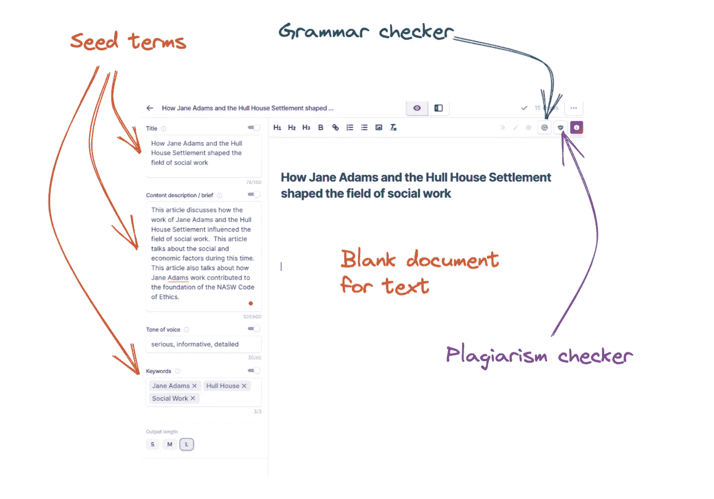
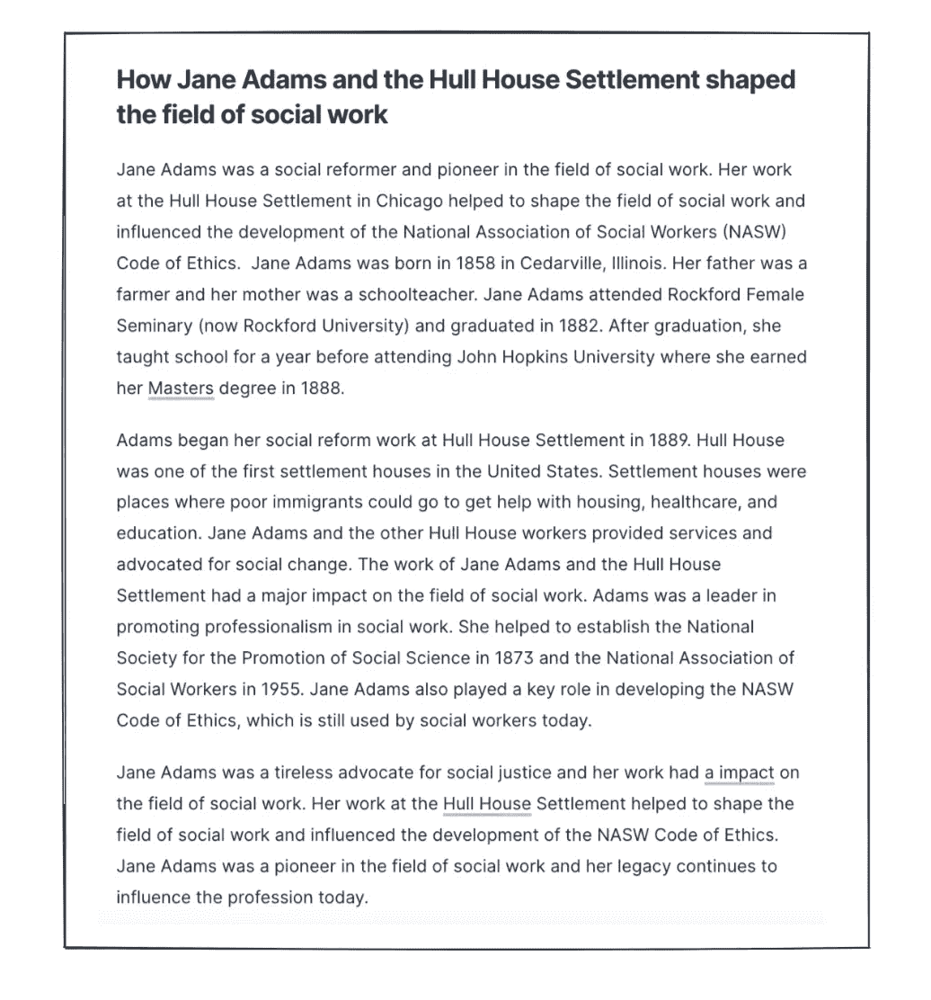
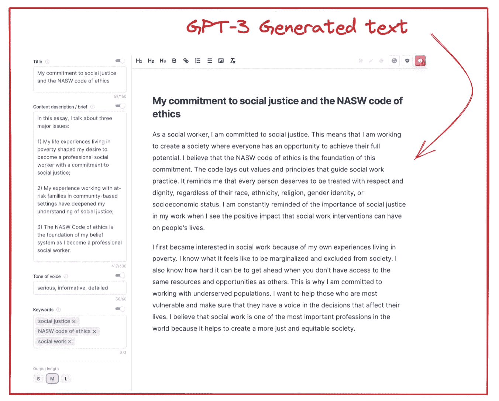

# 预见人工智能辅助的学术不端行为的出现

> 原文：<https://towardsdatascience.com/anticipating-the-emergence-of-ai-assisted-academic-misconduct-cf05f70a592c>

## 为什么非 STEM 学科需要关注 AI 技术

危地马拉的街头艺术。作者照片。

我是一名社会工作教授，这是最著名的应用社会科学学科之一，在很大程度上，它没有给予人工智能技术太多关注。我怀疑在其他社会科学中也是如此。不管人工智能技术的兴趣和感知相关性如何，非 STEM 学科的每一位教育工作者，特别是应用社会科学，都应该重新思考他们如何将书面作业和反思论文用于教育和评估目的。反剽窃软件是防止学术不端行为的重要一步。然而，这项技术的效用根本无法与人工智能技术最近令人惊讶的进步相抗衡。

我写这篇中型文章是为了提供一个现成的人工智能技术的单一例子，它预示了学术欺诈的未来。具体来说，我演示了一个人工智能模型，它能够生成如此高质量的文本，以至于与人类作者无法区分。我不确定本文中提供的例子是否会让我的同事和学生感到惊讶或担忧，但我认为演示是讨论的起点。我将首先描述什么是 GPT-3，然后提供三个不同的例子来展示这个模型的能力。

什么是 GPT 三号？

GPT-3 是一种由旧金山研究公司 OpenAI 开发的语言模型。GPT-3 接受了大约 5 万亿个单词的训练，以训练 GPT-3 能够执行各种自然语言任务。GPT-3 不反刍，总结，或重写现有的文本。相反，该模型利用 1750 亿个机器学习参数来进行单词预测。用户向 GPT-3 提供一组起始短语，称为*种子术语*，用于预测最有可能出现的单词。单词预测串在一起，变成完整的句子、段落、全文文档。

生成原始文本并不是 GPT 3 号唯一能做的事情。这里是一些其他媒体的文章，有更多关于这个模型的例子和细节。

      

# **访问并试驾 GPT 三号**

微软公司对基础的 GPT-3 模型拥有专有权。微软发布了一个 API，允许任何人使用这个模型。为了方便起见，我使用了基于 API 的 GPT 3 服务，名为 [Jasper](https://www.jasper.ai/) 。Jasper 提供了一个无代码、低成本、灵活的平台，用于执行各种特定于文本生成的自然语言任务。

# 例 1:简·亚当斯和赫尔大厦定居点

对于这个例子，我用 GPT-3 写一篇关于简·亚当斯和赫尔大厦定居点的短文。下图显示了种子术语和一个接收文本输出的空白文档。

Jasper.ai 的接口，用于使用 GPT-3 生成文本。图片由作者提供。

生成文本后，我进行了一些小的格式化，但没有编辑任何文本。该输出在不到 7 秒的时间内生成。

使用 Jasper.ai 使用 GPT-3 生成的文本的原始输出。图片由作者提供。

# 例 2:个人对社会公正的承诺

第二个例子使用 GPT-3 生成一篇关于社会公正的个人短文。我选择这个例子来展示 GPT-3 如何以第一人称写反思，这在应用社会科学，尤其是社会工作中是一个常见的任务。同样，我做了一些小的格式化，但是没有编辑任何文本。我还注意到，通过提供更多的种子短语，以前的和当前的例子可以变得更长。但是，我认为所提供的文本数量对于我希望引发的讨论来说已经足够了。

Jasper.ai 的接口和输出。GPT-3 生成的文本。图片作者。

# 示例 3:重写学术文本

GPT-3 可以执行其他自然语言任务。前两个示例生成了原始文本，而第三个示例展示了 GPT-3 如何重写现有文本。我在这个演示中使用的段落来自《T2》杂志上发表的一篇社论。我选择这一段是为了方便，也是我和作者对学术不端行为的共同关注。

Jasper.ai 的接口 Staller 输入文本(2019，第 898 页)。

对于这个例子，我在几秒钟内生成了三个不同的输出。这些重写直接来自 GPT-3 模型输出，没有任何编辑。

**GPT-3 重写#1**

> 大多数人可以看到提交的内容没有准备好。这往往是因为它有错误。这些错误本身可能没什么大不了的，但是如果你有很多这样的错误，这可能意味着你的手稿还不够好。作为一名编辑，我曾经认为我可以通过“修改并重新提交”的过程来帮助改进这些投稿。但随着时间的推移，通过经验，我了解到这往往是手稿有更大问题的迹象。通常，这份杂志不会试图帮助学生更好地提交论文，以便发表。这应该发生在你提交作品之前。

**GPT-3 重写#2**

> 通常，过早提交的手稿会有错误。虽然每个错误可能没什么大不了的，但是如果有很多，那就成问题了。当我刚开始做编辑的时候，我认为我可以通过修改和重新提交手稿来纠正这些错误。但随着时间的推移和经验的积累，我了解到这通常意味着手稿中有更大更根本的问题。一般来说，这个杂志不承担试图指导学生的责任，这样他们的手稿就可以发表了。这应该发生在提交之前。

**GPT-3 重写#3**

> 大多数情况下，当有人在作品准备好之前提交作品时，会有一些线索透露出手稿尚未完成。虽然这些错误本身可能没什么大不了的，但如果你有很多这样的错误，这可能是写作中存在更大问题的迹象。我曾经认为我可以通过修改和重新提交的过程来帮助修复这些错误，但我已经知道事实往往并非如此。这本杂志通常不承担帮助学生将草稿变成可出版作品的责任。

# 那又怎样？

我坚信人工智能技术对于解决社会问题至关重要。人工智能技术不是问题。相反，问题出在出于恶意和不道德目的使用它们的人身上。即使你对这些例子的文本质量没有印象，请记住 GPT-3 已经快两年了。鉴于 GPT-3 有 1650 亿个参数，我们预计 GPT-4 有超过 [100 万亿个参数](/gpt-4-will-have-100-trillion-parameters-500x-the-size-of-gpt-3-582b98d82253)。

我认为非 STEM 学科需要认识到，AI 不再是未来科幻小说中的有趣故事情节。未来已经到来。我们需要在非 STEM 学科中讨论人工智能，创造性地仔细思考人工智能技术的潜在机遇和挑战。这篇文章只是一个讨论的起点。

**文章引用**

k . m . staller(2019)。从论文到发表的文章:一位编辑的建议。定性社会工作 2019，第 18 卷(6)897–904。