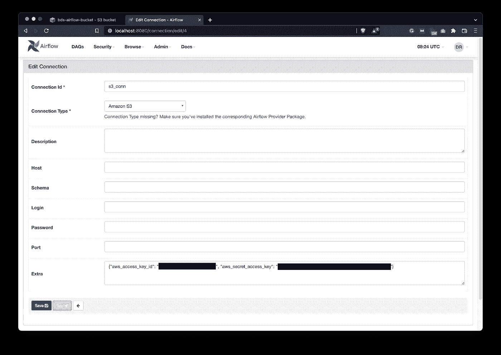
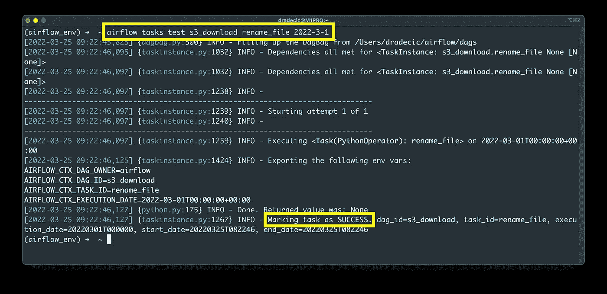

# Apache Airflow for Data Science —如何从亚马逊 S3 下载文件

> 原文：<https://towardsdatascience.com/apache-airflow-for-data-science-how-to-download-files-from-amazon-s3-4b7662ac6cdc>

## **用几行 Python 代码从亚马逊 S3 (AWS)下载任何文件**


照片由 [imgix](https://unsplash.com/@imgix?utm_source=medium&utm_medium=referral) 在 [Unsplash](https://unsplash.com?utm_source=medium&utm_medium=referral) 上拍摄

现在，你知道如何用 Apache Airflow 将本地文件上传到亚马逊 S3。但是你怎么能反过来呢？有没有从亚马逊 S3 下载文件的简单方法？当然有，今天你会了解到一切。读完之后，你会知道如何通过 Apache Airflow 从 S3 下载任何文件，以及如何控制其路径和名称。

推荐阅读[上一篇文章](/apache-airflow-for-data-science-how-to-upload-files-to-amazon-s3-5bdf6fcb1cea)，因为我们不会再重复 S3 桶和配置设置。确保您已经创建了一个 bucket，并且至少上传了一个文件。a

不想看书？请观看我的视频:

# 配置 S3 铲斗和气流连接

正如在简介部分提到的，您应该配置一个 S3 存储桶，并至少向其中上传一个文件。这是我的`bds-airflow-bucket`和一个`posts.json`文件:


图 1 —存储了单个对象的亚马逊 S3 桶(图片由作者提供)

此外，在 Airflow 服务器主页上，您应该配置了一个 S3 连接。你可以在*管理* — *人脉*下找到。请确保按如下方式进行配置:



图 2——气流亚马逊 S3 连接(图片由作者提供)

这就是我们从 S3 桶中下载文件所需的全部内容，接下来让我们开始吧。

# 写气流 DAG

在`~/airflow/dags`文件夹中新建一个 Python 文件。我已经把我的命名为`s3_download.py`。我们将从库导入和 DAG 样板代码开始。像以前一样，您将需要`S3Hook`类来与 S3 桶通信:

```
import os
from datetime import datetime
from airflow.models import DAG
from airflow.operators.python import PythonOperator
from airflow.providers.amazon.aws.hooks.s3 import S3Hook

with DAG(
    dag_id='s3_download',
    schedule_interval='@daily',
    start_date=datetime(2022, 3, 1),
    catchup=False
) as dag:
    pass
```

下载文件归结为声明一个基于`PythonOperator`的任务。它将调用接受三个参数的`download_from_s3()`函数:

*   `key` -字符串，S3 上文件的名称/路径。例如，`posts.json`将从 bucket 的根抓取文件。也可以指定路径，比如`/data/posts/posts.json`。确保与您的案例相符。
*   `bucket_name` -字符串，您要从其下载文件的桶的名称。
*   `local_path` - string，文件将要保存到的目录。请注意，这是一个目录路径，而不是文件路径。

同一个函数首先创建一个`S3Hook`类的实例，并使用之前建立的连接。然后，它调用钩子实例的`download_file()`方法来下载文件。

该函数返回一个字符串，它是从 S3 下载的文件的绝对路径。请务必归还，因为您以后会需要它:

```
import os
...

def download_from_s3(key: str, bucket_name: str, local_path: str) -> str:
    hook = S3Hook('s3_conn')
    file_name = hook.download_file(key=key, bucket_name=bucket_name, local_path=local_path)
    return file_name

 with DAG(...) as dag:
    # Download a file
    task_download_from_s3 = PythonOperator(
        task_id='download_from_s3',
        python_callable=download_from_s3,
        op_kwargs={
            'key': 'posts.json',
            'bucket_name': 'bds-airflow-bucket',
            'local_path': '/Users/dradecic/airflow/data/'
        }
    )
```

问题是这样的— `S3Hook`下载一个文件到`local_path`文件夹，并给它一个没有任何扩展名的任意名称。我们不希望这样，所以我们将声明另一个重命名文件的任务。

它从 [Airflow XComs](https://betterdatascience.com/apache-airflow-xcoms/) 中获取绝对路径，删除文件名，并附加`new_name`:

```
import os
...

def download_from_s3(key: str, bucket_name: str, local_path: str) -> str:
    ...

def rename_file(ti, new_name: str) -> None:
    downloaded_file_name = ti.xcom_pull(task_ids=['download_from_s3'])
    downloaded_file_path = '/'.join(downloaded_file_name[0].split('/')[:-1])
    os.rename(src=downloaded_file_name[0], dst=f"{downloaded_file_path}/{new_name}")

 with DAG(...) as dag:
    # Download a file
    task_download_from_s3 = PythonOperator(...)

    # Rename the file
    task_rename_file = PythonOperator(
        task_id='rename_file',
        python_callable=rename_file,
        op_kwargs={
            'new_name': 's3_downloaded_posts.json'
        }
    )

    task_download_from_s3 >> task_rename_file
```

让我们现在测试他们两个。

首先，我们必须从 S3 下载文件:

```
airflow tasks test s3_download download_from_s3 2022-3-1
```


图 3 —测试 download_from_s3 任务(图片由作者提供)

如你所见，Airflow 将文件从 S3 保存到了`/Users/dradecic/airflow/data/airflow_tmp_0xrx7pyi`，这是一个完全随机的文件名。

第二个任务是在这里将其重命名为`s3_downloaded_posts.json`:

```
airflow tasks test s3_download rename_file 2022-3-1
```



图 4 —测试 rename_file 任务(作者图片)

任务成功完成，这意味着我们应该在`data`文件夹中看到该文件:


图片 5 —下载文件的内容(图片由作者提供)

完成了。我们已经对整个 DAG 进行了编码和测试。在结束这篇文章之前，让我们做一个简短的回顾。

# 结论

用 Airflow 从亚马逊 S3 下载文件就像上传文件一样简单。这都归结为一个函数调用——不是`load_file()`就是`download_file()`。你现在知道如何做到这两点，以及如何处理可能出现的潜在问题。

请继续关注 Apache Airflow 系列的后续文章。

## 推荐阅读

*   [学习数据科学先决条件(数学、统计和编程)的 5 本最佳书籍](https://betterdatascience.com/best-data-science-prerequisite-books/)
*   [2022 年学习数据科学的前 5 本书](https://betterdatascience.com/top-books-to-learn-data-science/)
*   [如何在本地安装 Apache air flow](https://betterdatascience.com/apache-airflow-install/)

## 保持联系

*   雇用我作为一名技术作家
*   订阅 [YouTube](https://www.youtube.com/c/BetterDataScience)
*   在 [LinkedIn](https://www.linkedin.com/in/darioradecic/) 上连接

*喜欢这篇文章吗？成为* [*中等会员*](https://medium.com/@radecicdario/membership) *继续无限制学习。如果你使用下面的链接，我会收到你的一部分会员费，不需要你额外付费。*

[](https://medium.com/@radecicdario/membership)  

*原载于 2022 年 3 月 28 日 https://betterdatascience.com*[](https://betterdatascience.com/apache-airflow-amazon-s3-download/)**。**