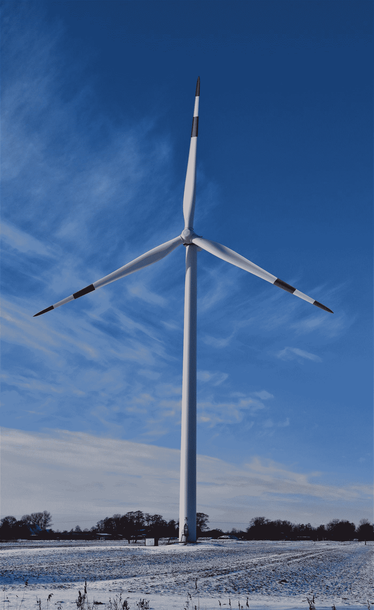
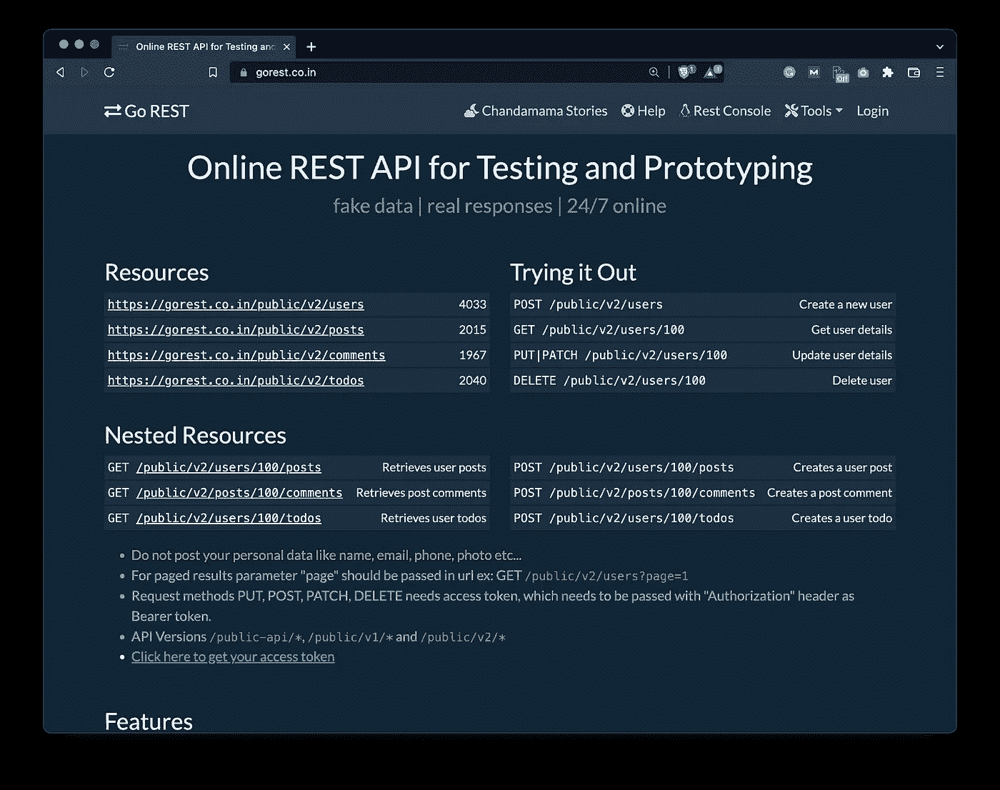
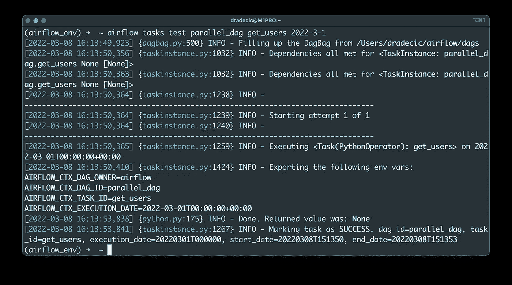
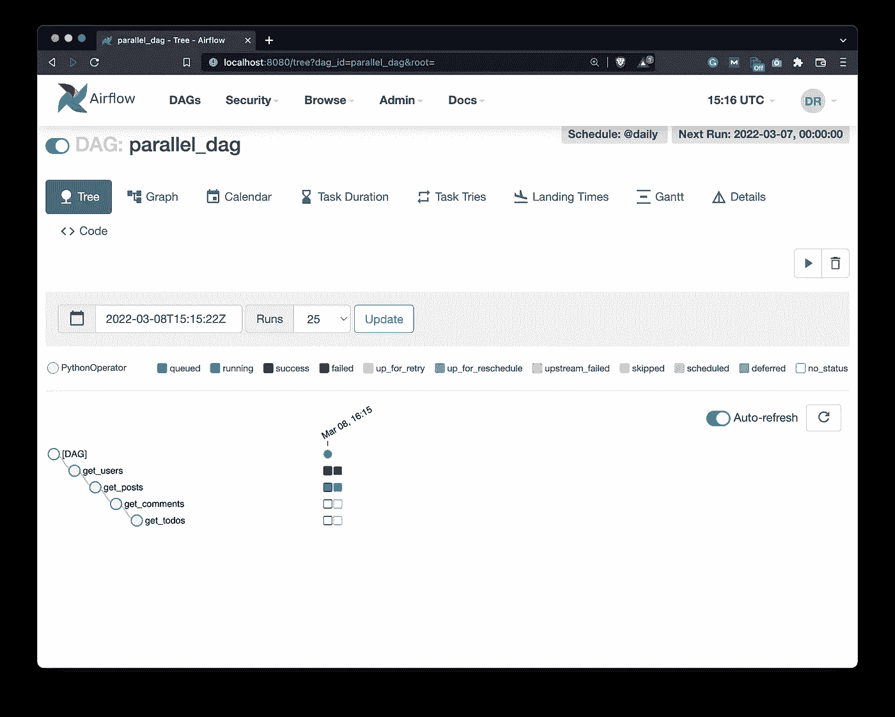
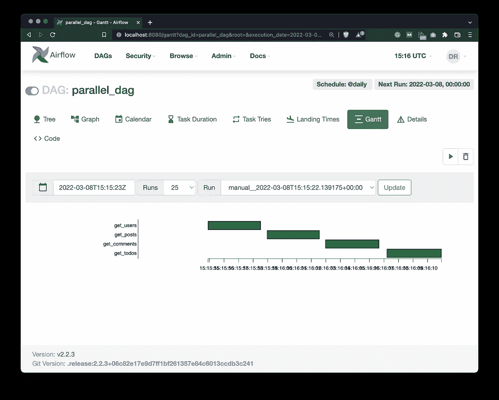
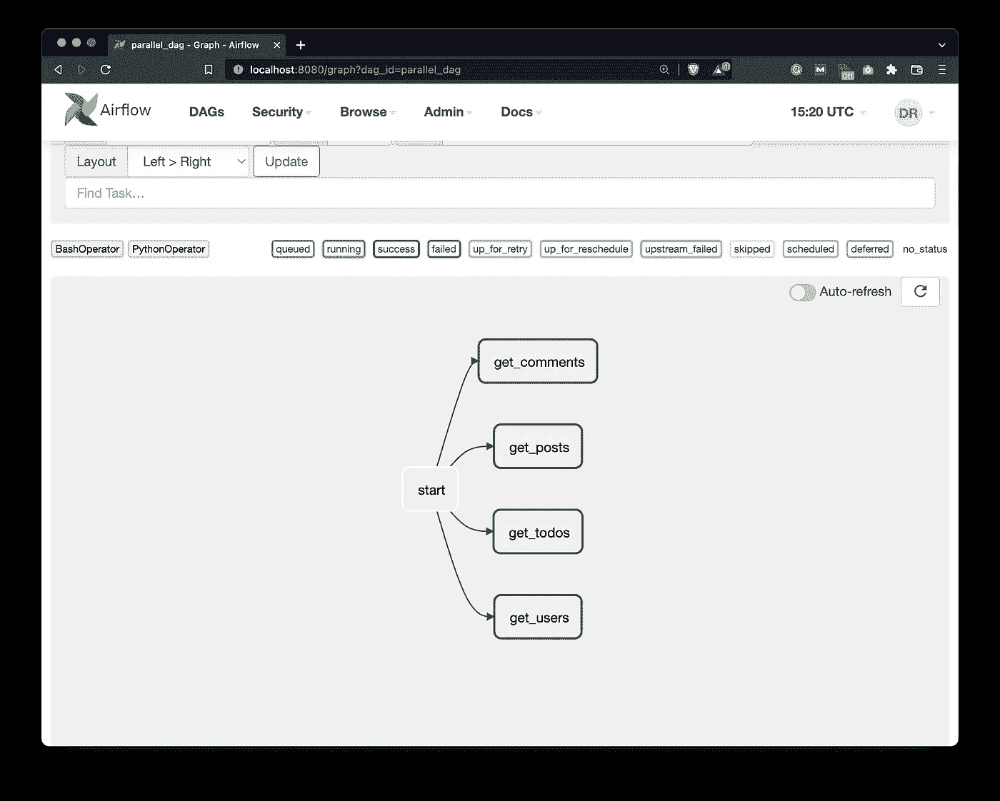
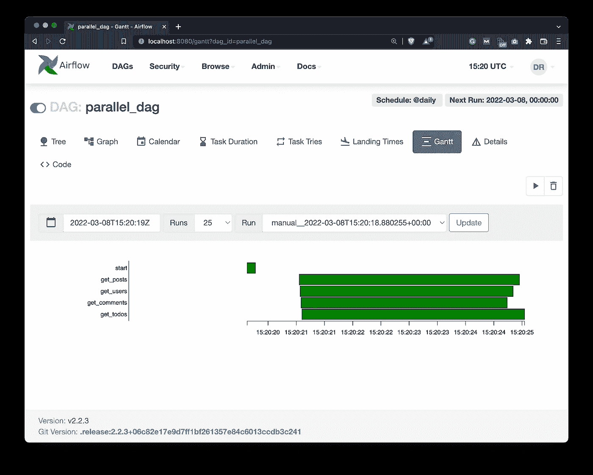

# 面向数据科学的 Apache Airflow 如何并行运行任务

> 原文：<https://towardsdatascience.com/apache-airflow-for-data-science-how-to-run-tasks-in-parallel-32f7573068a>

## **使用 Apache Airflow 和 Python 并行发出多个 GET 请求**



在 [Unsplash](https://unsplash.com?utm_source=medium&utm_medium=referral) 上由 [Waldemar Brandt](https://unsplash.com/@waldemarbrandt67w?utm_source=medium&utm_medium=referral) 拍摄的照片

在[上一篇文章](https://medium.com/towards-data-science/apache-airflow-for-data-science-how-to-migrate-airflow-metadata-db-to-postgres-and-enable-e6658266c337)中，我们已经配置了 Apache Airflow，使其可以并行运行任务。为此，我们必须将底层元数据数据库从 SQLite 切换到 Postgres，并将执行器从*顺序*更改为*本地*。

之后，我们重新初始化了数据库，并为 Airflow 创建了一个新的管理员用户。不言而喻，但在阅读这篇文章之前，必须阅读那篇文章，否则，您将无法并行运行任务。

今天，我们将最终编写一个并行运行任务的 DAG。它将从几个 REST API 端点获取数据。我们将通过`PythonOperator`实现一切，这不是与 API 通信的最佳方式。为了简单起见，我们将把它放在一边，改天再讨论与 API 通信的正确方式。

不想看书？请观看我的视频:

# REST API 概述和 DAG 样板文件

我发现这个 [GoRest 网站](https://gorest.co.in/)作为一个虚拟 REST API 用于测试目的。如您所见，我们可以向这四个端点中的任何一个发出 GET 请求，我们将得到一些 JSON 数据作为响应:



图 1 — GoRest REST API 主页(图片由作者提供)

对于今天的例子来说，这是完美的，因为一个 GET 请求与另一个没有任何联系。换句话说，我们不必在发出另一个请求之前等待一个响应。

要开始使用 DAG，请在`dags`文件夹中创建一个新文件。我给我的取名为`parallel_dag.py`，但是你可以随意给你的取名。让我们先写导入:

```
import json
import time
import requests
from datetime import datetime
from airflow.models import DAG
from airflow.operators.python import PythonOperator
from airflow.operators.bash import BashOperator
```

下面我们可以用上下文管理器语法来声明 DAG:

```
with DAG(
    dag_id='parallel_dag',
    schedule_interval='@daily',
    start_date=datetime(2022, 3, 1),
    catchup=False
) as dag:
    pass
```

这就是我们开始的全部内容，接下来让我们编写整个 DAG。

# 写气流 DAG

在编写连接到 API 的函数之前，我们将在 DAG 中创建几个任务。所有这些都将利用`PythonOperator`来调用 Python 函数。因为每个请求的 URL 都是不同的，所以我们不想写四个几乎相同的 Python 函数。`PythonOperator`中的`op_kwargs`参数允许我们指定将作为键值对传递给函数的参数。

只需写下一个任务，你马上就会明白:

```
task_get_users = PythonOperator(
    task_id='get_users',
    python_callable=get,
    op_kwargs={'url': 'https://gorest.co.in/public/v2/users'}
)
```

这个任务将调用我们还没有定义的 Python 函数`get()`，它将把指定的 URL 作为参数传递。在编写函数之前，让我们将任务复制三次，以连接到其他端点:

```
task_get_posts = PythonOperator(
    task_id='get_posts',
    python_callable=get,
    op_kwargs={'url': 'https://gorest.co.in/public/v2/posts'}
)

task_get_comments = PythonOperator(
    task_id='get_comments',
    python_callable=get,
    op_kwargs={'url': 'https://gorest.co.in/public/v2/comments'}
)

task_get_todos = PythonOperator(
    task_id='get_todos',
    python_callable=get,
    op_kwargs={'url': 'https://gorest.co.in/public/v2/todos'}
)
```

最后，我们将按顺序连接任务。稍后您将看到如何并行连接它们，但这只是为了让您了解一个接一个地运行任务有什么问题:

```
task_get_users >> task_get_posts >> task_get_comments >> task_get_todos
```

剩下唯一要做的事情就是编写函数，所以让我们在同一个文件中，但在 DAG 之上完成它。它将从 URL 中提取端点，捕获当前日期时间，向端点发出请求，并以 JSON 格式保存响应。最后，函数休眠两秒钟——只是为了让整个运行时间长一点:

```
def get(url: str) -> None:
    endpoint = url.split('/')[-1]
    now = datetime.now()
    now = f"{now.year}-{now.month}-{now.day}T{now.hour}-{now.minute}-{now.second}"
    res = requests.get(url)
    res = json.loads(res.text)

    with open(f"/Users/dradecic/airflow/data/{endpoint}-{now}.json", 'w') as f:
        json.dump(res, f)
    time.sleep(2)
```

我们可以通过终端测试一个任务，只是为了看看是否一切都按预期运行:

```
airflow tasks test parallel_dag get_users 2022-3-1
```



图 2-通过终端测试气流任务(图片由作者提供)

任务执行成功，下面是它保存到`data`文件夹的内容:


图 3 —以 JSON 格式保存的用户(图片由作者提供)

这就是我们现在所需要的，所以接下来让我们通过 Airflow 主页测试 DAG。

# 测试气流 DAG(顺序)

打开气流网络服务器页面，打开我们的新 DAG。下面是它在*图表视图*中的样子:


图 4-按顺序连接的气流 DAG 的任务(图片由作者提供)

您可以看到这些任务是按顺序连接的，一个接一个。这是对时间的巨大浪费，因为 GET 请求之间没有任何联系。

运行 DAG 可确认任务按顺序运行:



图 5 —按顺序运行任务的气流 DAG(图片由作者提供)

但是最好的确认可能是显示每项任务花费时间的*甘特图*:



图 6 —甘特图视图中的气流 DAG 运行时(作者图片)

让我们回到代码编辑器，修改 DAG，使任务并行运行。

# 如何并行运行 Airflow DAG

首先，我们需要编写另一个基本上什么都不做的任务，但它在这里只是为了让我们可以将其他任务连接到某个东西。让我们把它写在当前的第一个任务之上:

```
task_start = BashOperator(
    task_id='start',
    bash_command='date'
)
```

现在我们必须改变底层的依赖关系。我们将首先运行 start 任务，它将在完成后运行所有其他四个任务:

```
task_start >> [task_get_users, task_get_posts, task_get_comments, task_get_todos]
```

立即刷新气流 DAG 页面。您可以看到*图形视图*是如何变化的:



图 7 —显示任务将并行运行的 DAG 视图(图片由作者提供)

现在将首先运行 *start* 任务，然后是连接到 API 并并行运行的其他四个任务。再次触发 DAG 并检查*树形视图*——您将看到任务已经同时开始运行:


图 8 —检查正在运行的 DAG(图片由作者提供)

最好的指示器是*甘特图视图*:



图 9 —甘特图视图中的气流 DAG 运行时(作者提供的图片)

代表运行时的条形被放置在彼此的顶部，表明任务实际上是并行运行的。

这就是我今天想讲的全部内容，接下来让我们总结一下。

# 结论

今天，您已经成功地编写了第一个并行运行任务的气流 DAG。这是一个巨大的里程碑，特别是因为你现在可以更有效率。大多数时候你不需要一个接一个地运行类似的任务，所以并行运行它们可以节省大量的时间。

在下面的文章中，我们将深入探讨 Airflow Xcoms，这是一种在任务之间发送数据的方法。敬请关注，我会确保在几天内发表这篇文章。

## 推荐阅读

*   [学习数据科学先决条件(数学、统计和编程)的 5 本最佳书籍](https://betterdatascience.com/best-data-science-prerequisite-books/)
*   [2022 年学习数据科学的前 5 本书](https://betterdatascience.com/top-books-to-learn-data-science/)
*   [如何在本地安装 Apache air flow](https://betterdatascience.com/apache-airflow-install/)

## 保持联系

*   雇用我作为一名技术作家
*   订阅 [YouTube](https://www.youtube.com/c/BetterDataScience)
*   在 [LinkedIn](https://www.linkedin.com/in/darioradecic/) 上连接

喜欢这篇文章吗？成为 [*中等会员*](https://medium.com/@radecicdario/membership) *继续无限制学习。如果你使用下面的链接，我会收到你的一部分会员费，不需要你额外付费。*

[](https://medium.com/@radecicdario/membership)  

*原载于 2022 年 3 月 10 日*[*【https://betterdatascience.com】*](https://betterdatascience.com/apache-airflow-run-tasks-in-parallel/)*。*