# Apache Airflow for Data Science —如何使用数据库(Postgres)

> 原文：<https://towardsdatascience.com/apache-airflow-for-data-science-how-to-work-with-databases-postgres-a4dc79c04cb8>

## 在 10 分钟内编写一个 Postgres ETL 管道


由[迈克·塞切尔](https://unsplash.com/@mikesetchell?utm_source=medium&utm_medium=referral)在 [Unsplash](https://unsplash.com?utm_source=medium&utm_medium=referral) 上拍摄的照片

在上周的文章的[中，您已经看到了如何编写一个 Airflow DAG，它从终端获取当前的日期时间信息，解析它，并将其保存到本地 CSV 文件中。这是一个相当简单的 DAG，但足以让你看到气流是如何工作的。今天，我们将进入一个更高的档位，广泛地使用 Postgres 数据库。](https://betterdatascience.com/apache-airflow-write-your-first-dag/)

您将看到如何从数据库中获取数据、运行 SQL 查询，以及将 CSV 文件插入数据库—所有这些都在单个 DAG 中完成。所以，事不宜迟，让我们直入主题吧。

不想看书？请观看我的视频:

# 你今天要做什么

今天，您将编写一个实现以下数据管道的气流 DAG:

1.  从 Postgres 表中获取数据
2.  使用 Python 和 Pandas 处理数据，并将其保存到 CSV 文件中
3.  截断 Postgres 数据库中的目标表
4.  将 CSV 文件复制到 Postgres 表中

我们首先必须配置所有与数据集和数据库相关的东西。

# 数据集和数据库配置

从[此链接](https://gist.githubusercontent.com/netj/8836201/raw/6f9306ad21398ea43cba4f7d537619d0e07d5ae3/iris.csv)下载虹膜数据集。它相对较小，但能满足我们今天的需求:

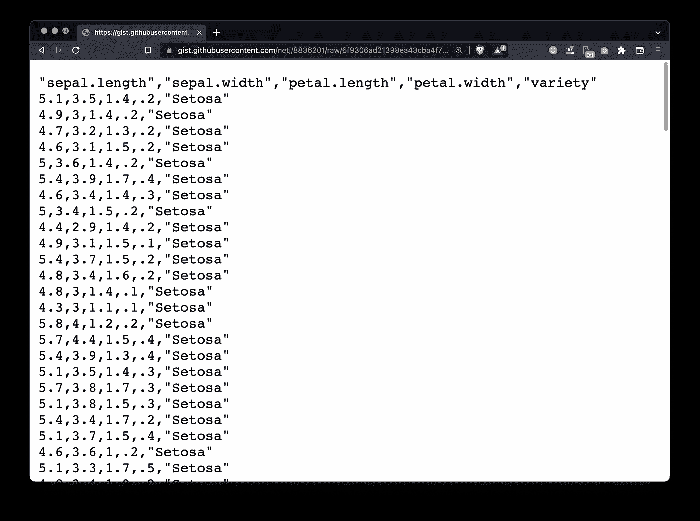

图片 1-虹膜数据集(图片由作者提供)

打开建立了 Postgres 连接的 DBMS。使用以下语句创建表—不要觉得有义务使用相同的命名约定:

```
CREATE TABLE iris(
	iris_id SERIAL PRIMARY KEY,
	iris_sepal_length REAL,
	iris_sepal_width REAL,
	iris_petal_length REAL,
	iris_petal_width REAL,
	iris_variety VARCHAR(16)
);
```

创建表后，将 Iris CSV 数据集加载到其中。在适用的情况下，对列名和/或路径进行适当的更改:

```
COPY iris(iris_sepal_length, iris_sepal_width, iris_petal_length, iris_petal_width, iris_variety)
FROM '/Users/dradecic/Desktop/iris.csv'
DELIMITER ','
CSV HEADER;
```

我们的数据管道将在最后一步将数据加载到 Postgres 中。目标表将具有与`iris`表相同的结构，只是没有 ID 列。使用下面的 SQL 语句创建它:

```
CREATE TABLE iris_tgt AS (
	SELECT
		iris_sepal_length, iris_sepal_width, iris_petal_length, iris_petal_width, iris_variety
	FROM iris
	WHERE 1 = 2
);
```

最后，让我们验证数据是否被复制到了`iris`表中:

```
SELECT * FROM iris;
```


图片 2-复制到 Postgres 数据库的数据集(图片由作者提供)

这就是我们在数据库端需要做的全部工作，但是在编写 DAG 之前还有一步要做——在 Airflow 中建立 Postgres 连接。

# 如何在气流中设置 Postgres 连接

如果 Airflow webserver 和 scheduler 正在运行，请将其关闭，并运行以下命令来安装 Airflow 的 Postgres 提供程序包:

```
pip install 'apache-airflow[postgres]'
```

下面是终端输出:

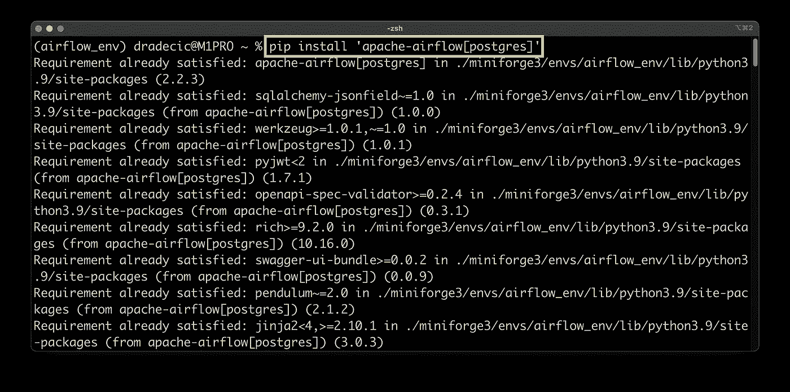

图 3 —为 Postgres 安装气流插件(图片由作者提供)

完成后，启动网络服务器和调度程序，并导航到*气流* — *管理* — *连接*。点击*加号*添加新连接并指定连接参数。这是我的样子:

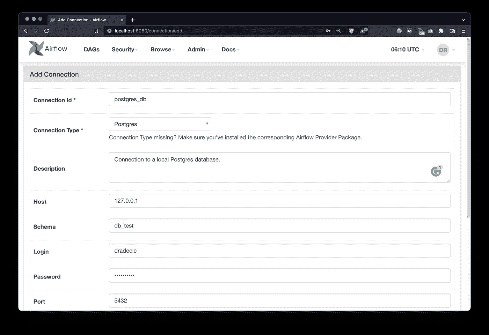

图 4-定义气流中的 Postgres 连接(图片由作者提供)

完成后，滚动到屏幕底部并点击*保存*。

我们还没完呢。让我们在*Admin*—*Variables*下声明一个变量，该变量保存已处理的 CSV 文件的位置:

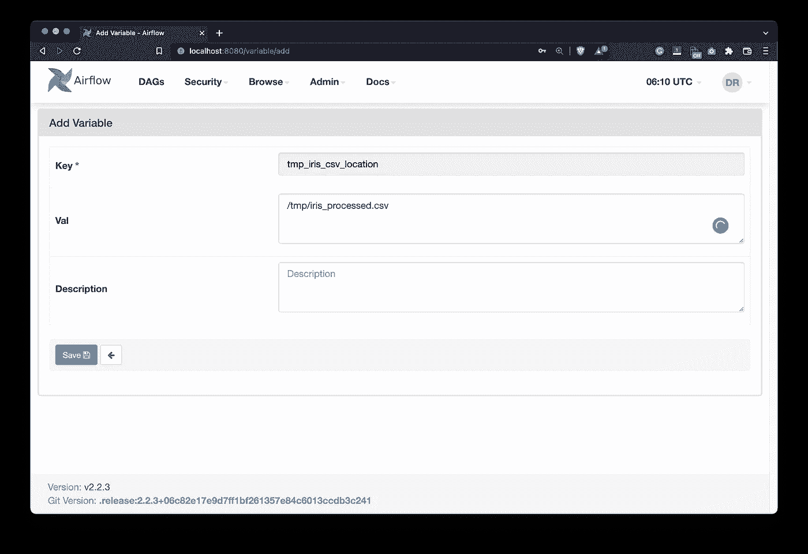

图 5 —声明用于存储临时 CSV 文件的变量(作者图片)

好了，现在我们完成了。下一个是 DAG。

# 编写 DAG — Apache Airflow 和 Postgres

这是今天文章的重点。我们会将 DAG 分成多个易于管理的块，这样您就不会不知所措。我们将从样板代码开始，然后开始使用 Postgres。

## 库导入和 DAG 样板文件

下面的代码片段从 Python 和 Airflow 中导入了我们需要的一切。它还声明了一个 ID 为`postgres_db_dag`的 DAG，计划每天运行一次:

```
import pandas as pd
from datetime import datetime
from airflow.models import DAG
from airflow.operators.python import PythonOperator
from airflow.hooks.postgres_hook import PostgresHook
from airflow.models import Variable
from airflow.operators.bash import BashOperator
from airflow.providers.postgres.operators.postgres import PostgresOperator with DAG(
    dag_id='postgres_db_dag',
    schedule_interval='@daily',
    start_date=datetime(year=2022, month=2, day=1),
    catchup=False
) as dag:
    pass
```

我们现在将分别实现这四项任务中的每一项，并解释发生了什么。如果你很着急，向下滚动一点，因为有一个完整的 DAG 代码片段。

## 任务#1 —通过气流从 Postgres 获取数据

我们 DAG 的第一个任务是从 Postgres 数据库中获取数据。这并不像你想象的那样简单。我们不会使用 Postgres 操作符，而是通过`PythonOperator`调用一个 Python 函数。该任务将调用`get_iris_data()`函数，并将返回值推送到 Airflow 的 Xcoms:

```
# 1\. Get the Iris data from a table in Postgres
task_get_iris_data = PythonOperator(
	task_id='get_iris_data',
	python_callable=get_iris_data,
	do_xcom_push=True
)
```

`get_iris_data()`函数利用了`PostgresHook`——一种建立到 Postgres 数据库的连接、运行 SQL 语句并获取结果的方法。获取整个表，然后推送到 Airflow 的 Xcoms:

```
def get_iris_data():
    sql_stmt = "SELECT * FROM iris"
    pg_hook = PostgresHook(
        postgres_conn_id='postgres_db',
        schema='db_test'
    )
    pg_conn = pg_hook.get_conn()
    cursor = pg_conn.cursor()
    cursor.execute(sql_stmt)
    return cursor.fetchall()
```

使用以下 shell 命令测试任务:

```
airflow tasks test postgres_db_dag get_iris_data 2022-2-1
```

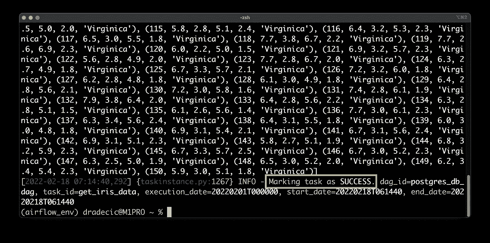

图 6 —测试从 Postgres 中检索数据的任务(图片由作者提供)

成功—您可以看到 Iris 表作为元组列表打印到控制台。接下来我们来处理一下。

## 任务 2——处理虹膜数据

如果你是一个日常的熊猫用户，处理虹膜数据集应该感觉很熟悉。我们将声明另一个调用`process_iris_data()`函数的`PythonOperator`:

```
# 2\. Process the Iris data
task_process_iris_data = PythonOperator(
	task_id='process_iris_data',
	python_callable=process_iris_data
)
```

该函数从 Airflow 的 Xcoms 中检索一个元组列表，并为其创建一个 Pandas 数据帧。然后，对于处理部分，只保留符合四个标准的行，过滤后的数据帧保存到 CSV 文件中，不包含 ID 列。我们通过之前声明的气流变量获得 CSV 位置:

```
def process_iris_data(ti):
    iris = ti.xcom_pull(task_ids=['get_iris_data'])
    if not iris:
        raise Exception('No data.') iris = pd.DataFrame(
        data=iris[0],
        columns=['iris_id', 'iris_sepal_length', 'iris_sepal_width',
                 'iris_petal_length', 'iris_petal_width', 'iris_variety']
    )
    iris = iris[
        (iris['iris_sepal_length'] > 5) &
        (iris['iris_sepal_width'] == 3) &
        (iris['iris_petal_length'] > 3) &
        (iris['iris_petal_width'] == 1.5)
    ]
    iris = iris.drop('iris_id', axis=1)
    iris.to_csv(Variable.get('tmp_iris_csv_location'), index=False)
```

在测试中:

```
airflow tasks test postgres_db_dag process_iris_data 2022-2-1
```

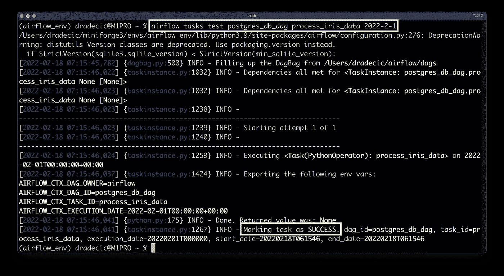

图 7 —测试处理虹膜数据的任务(图片由作者提供)

又一次成功了。CSV 应该存储在`/tmp/iris_processed.csv`处，所以让我们在终端中打印该文件:

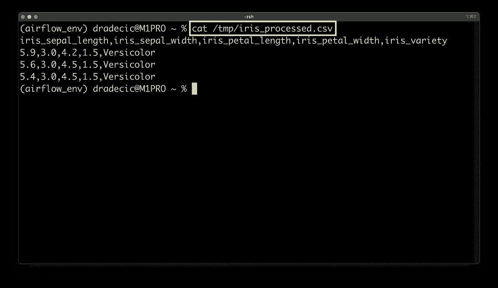

图 8-处理任务的结果(作者提供的图片)

只有三行加上标题被保留，表明管道的预处理步骤按预期工作。

## 任务#3 —截断 Postgres 表

我们的 DAG 每天都被执行，这意味着每天都会有三行被插入到 Postgres 数据库的一个表中。我们不希望值随着时间的推移而重复，所以我们将在插入前截断表。

这就是第三项任务的由来。它使用`PostgresOperator`建立到数据库的连接并运行 SQL 语句。该声明是在`sql`参数下指定的:

```
# 3\. Truncate table in Postgres
task_truncate_table = PostgresOperator(
	task_id='truncate_tgt_table',
	postgres_conn_id='postgres_db',
	sql="TRUNCATE TABLE iris_tgt"
)
```

让我们测试一下，看看是否有错误:

```
airflow tasks test postgres_db_dag truncate_tgt_table 2022-2-1
```

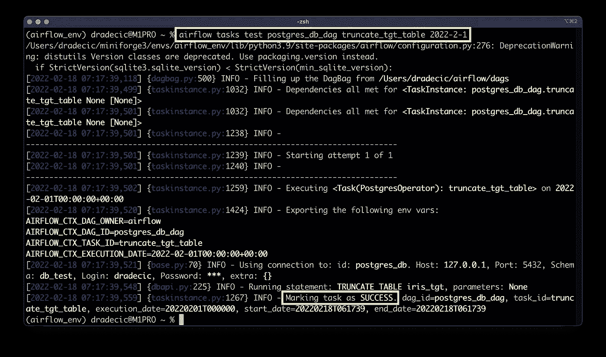

图 9 —截断目标表任务的结果(作者提供的图片)

任务成功，没有任何问题，所以我们可以进入下一个。

## 任务#4 —使用气流将 CSV 文件加载到 Postgres 中

最后，我们希望将处理过的数据加载到表中。我们将使用`BashOperator`来这样做。它将运行一个在`bash_command`参数下指定的 shell 命令。

我们将要运行的代码很长，所以我决定把它分成多行。确保分别用您的数据库名称和数据库用户名替换`db_test`和`dradecic`:

```
# 4\. Save to Postgres
task_load_iris_data = BashOperator(
	task_id='load_iris_data',
	bash_command=(
		'psql -d db_test -U dradecic -c "'
		'COPY iris_tgt(iris_sepal_length, iris_sepal_width, iris_petal_length, iris_petal_width, iris_variety) '
		"FROM '/tmp/iris_processed.csv' "
		"DELIMITER ',' "
		'CSV HEADER"'
	)
)
```

让我们看看它是否有效:

```
airflow tasks test postgres_db_dag truncate_tgt_table 2022-2-1
```


图 10 —测试数据插入任务(作者图片)

精彩！看起来任务成功了，三行被复制到了表中。我们现在应该有一个完全工作的 DAG，我们将在接下来的部分中测试它。

如果您遗漏了什么，请使用下面部分的代码片段作为参考。

# 气流到 Postgres DAG 完整代码

下面是 DAG + **任务连接**的完整代码:

```
import pandas as pd
from datetime import datetime
from airflow.models import DAG
from airflow.operators.python import PythonOperator
from airflow.hooks.postgres_hook import PostgresHook
from airflow.models import Variable
from airflow.operators.bash import BashOperator
from airflow.providers.postgres.operators.postgres import PostgresOperator def get_iris_data():
    sql_stmt = "SELECT * FROM iris"
    pg_hook = PostgresHook(
        postgres_conn_id='postgres_db',
        schema='db_test'
    )
    pg_conn = pg_hook.get_conn()
    cursor = pg_conn.cursor()
    cursor.execute(sql_stmt)
    return cursor.fetchall() def process_iris_data(ti):
    iris = ti.xcom_pull(task_ids=['get_iris_data'])
    if not iris:
        raise Exception('No data.') iris = pd.DataFrame(
        data=iris[0],
        columns=['iris_id', 'iris_sepal_length', 'iris_sepal_width',
                 'iris_petal_length', 'iris_petal_width', 'iris_variety']
    )
    iris = iris[
        (iris['iris_sepal_length'] > 5) &
        (iris['iris_sepal_width'] == 3) &
        (iris['iris_petal_length'] > 3) &
        (iris['iris_petal_width'] == 1.5)
    ]
    iris = iris.drop('iris_id', axis=1)
    iris.to_csv(Variable.get('tmp_iris_csv_location'), index=False) with DAG(
    dag_id='postgres_db_dag',
    schedule_interval='@daily',
    start_date=datetime(year=2022, month=2, day=1),
    catchup=False
) as dag: # 1\. Get the Iris data from a table in Postgres
    task_get_iris_data = PythonOperator(
        task_id='get_iris_data',
        python_callable=get_iris_data,
        do_xcom_push=True
    ) # 2\. Process the Iris data
    task_process_iris_data = PythonOperator(
        task_id='process_iris_data',
        python_callable=process_iris_data
    ) # 3\. Truncate table in Postgres
    task_truncate_table = PostgresOperator(
        task_id='truncate_tgt_table',
        postgres_conn_id='postgres_db',
        sql="TRUNCATE TABLE iris_tgt"
    ) # 4\. Save to Postgres
    task_load_iris_data = BashOperator(
        task_id='load_iris_data',
        bash_command=(
            'psql -d db_test -U dradecic -c "'
            'COPY iris_tgt(iris_sepal_length, iris_sepal_width, iris_petal_length, iris_petal_width, iris_variety) '
            "FROM '/tmp/iris_processed.csv' "
            "DELIMITER ',' "
            'CSV HEADER"'
        )
    )

    task_get_iris_data >> task_process_iris_data >> task_truncate_table >> task_load_iris_data
```

接下来，我们将了解如何通过气流运行 DAG。

# 如何在气流中运行 DAG

如果您现在打开 Airflow 的主页，您会看到另一个 DAG 列表:

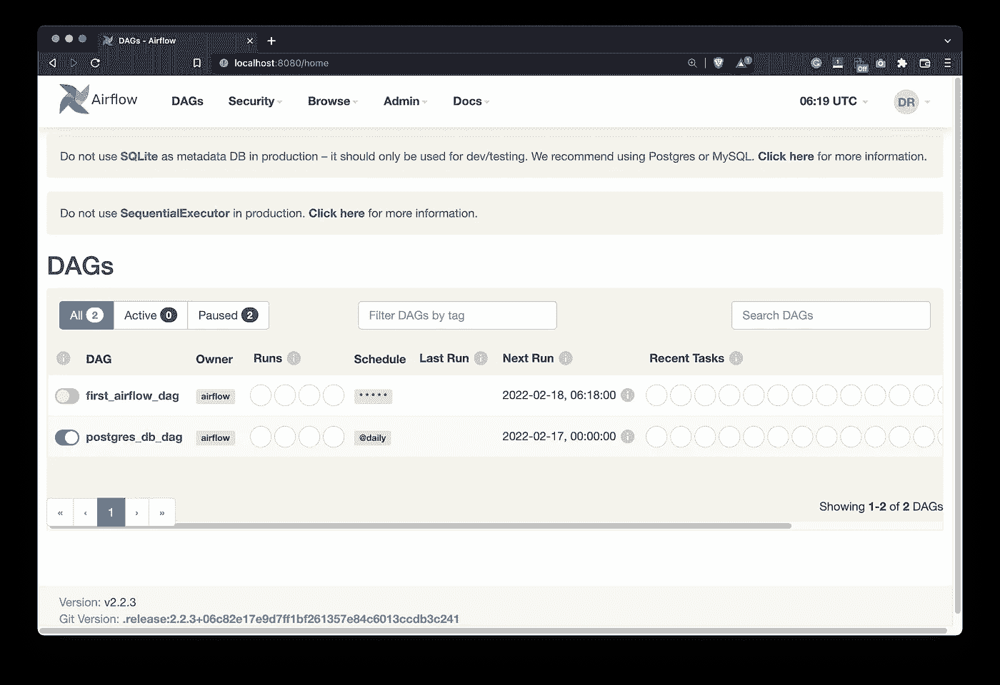

图 11-所有气流 Dag(图片由作者提供)

确保通过扳动开关来打开它。打开 DAG 并按下*播放*按钮运行它。几秒钟后，所有任务都应该变成深绿色，表示它们成功完成:

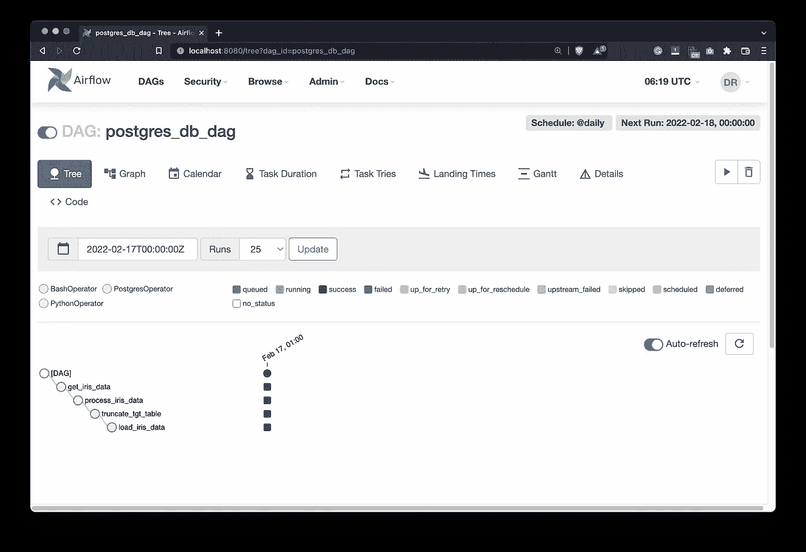

图 12 —运行我们的气流 DAG(图片由作者提供)

在数据库中，您现在可以看到插入了三行，代表符合我们筛选标准的所有鲜花:

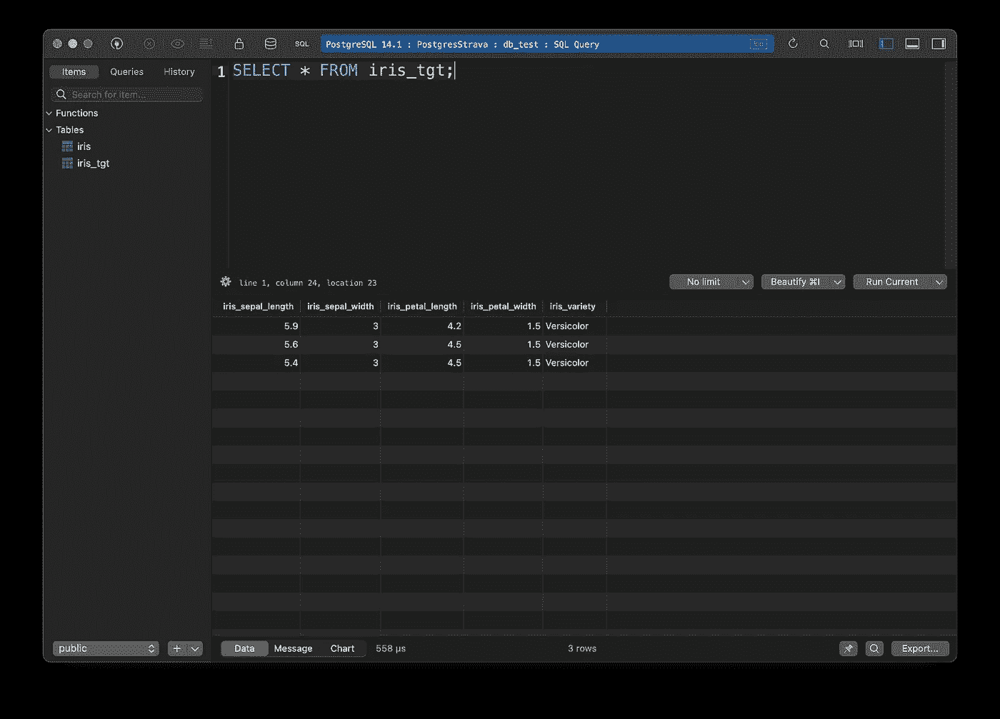

图 13 —加载到 Postgres 数据库中的记录(作者图片)

就这样 DAG 运行没有问题，所以我们就到此为止吧。

# 总结和后续步骤

Airflow 的主要用例是编排，不一定是从数据库中提取数据。尽管如此，你可以用钩子来做。今天我们探讨了如何使用钩子，如何运行 SQL 语句，以及如何将数据插入到 SQL 表中——所有这些都使用 Postgres。您可以轻松地将相同的逻辑应用于不同的数据库。DAG 中的变化将是最小的。

作为一项家庭作业，你可以尝试将熊猫数据帧直接插入 Postgres，而不必先将其保存为 CSV 文件。这是我们将在接下来的文章中讨论的内容，如果您找不到解决方案，请继续关注。

感谢阅读！

## 推荐阅读

*   [学习数据科学先决条件(数学、统计和编程)的 5 本最佳书籍](https://betterdatascience.com/best-data-science-prerequisite-books/)
*   [2022 年学习数据科学的前 5 本书](https://betterdatascience.com/top-books-to-learn-data-science/)
*   [如何在本地安装阿帕奇气流](https://betterdatascience.com/apache-airflow-install/)

## 保持联系

*   雇用我作为一名技术作家
*   订阅 [YouTube](https://www.youtube.com/c/BetterDataScience)
*   在 [LinkedIn](https://www.linkedin.com/in/darioradecic/) 上连接

*喜欢这篇文章吗？成为* [*中等会员*](https://medium.com/@radecicdario/membership) *继续无限制学习。如果你使用下面的链接，我会收到你的一部分会员费，不需要你额外付费。*

[](https://medium.com/@radecicdario/membership) [## 通过我的推荐链接加入 Medium-Dario rade ci

### 作为一个媒体会员，你的会员费的一部分会给你阅读的作家，你可以完全接触到每一个故事…

medium.com](https://medium.com/@radecicdario/membership) 

*原载于 2022 年 2 月 26 日 https://betterdatascience.com**的* [*。*](https://betterdatascience.com/apache-airflow-postgres-database/)