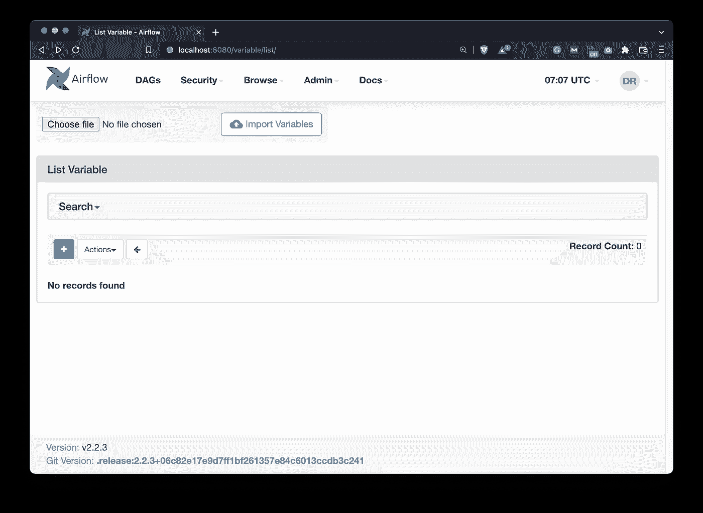
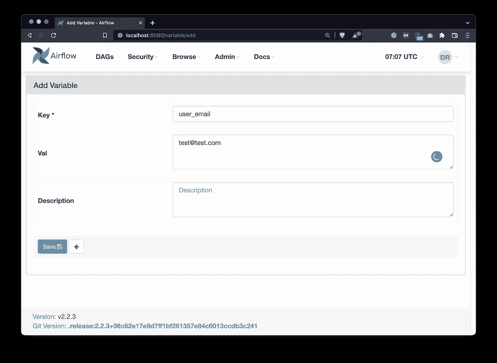
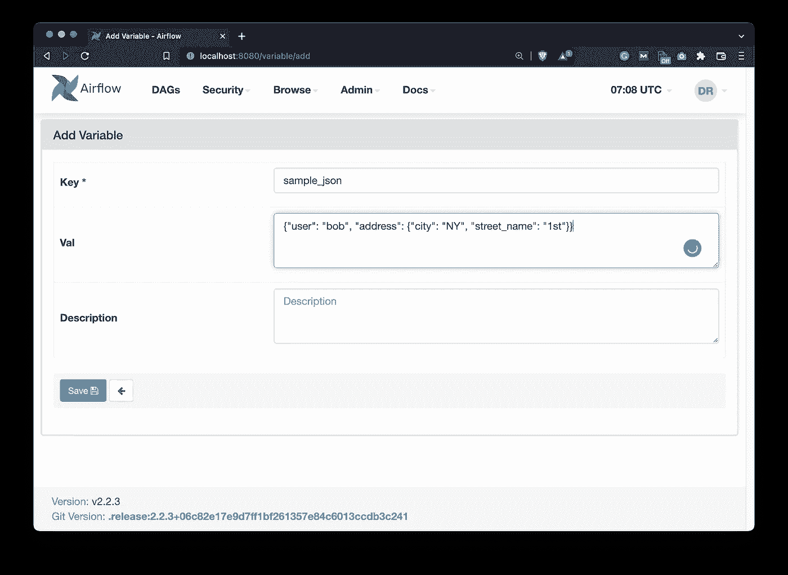
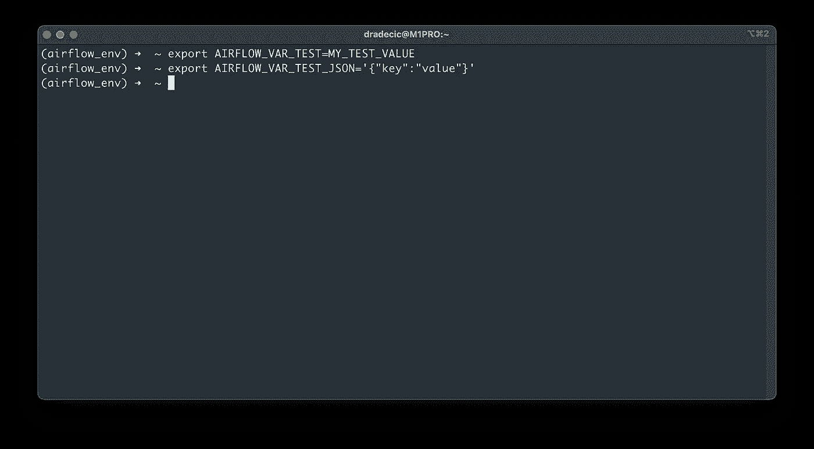
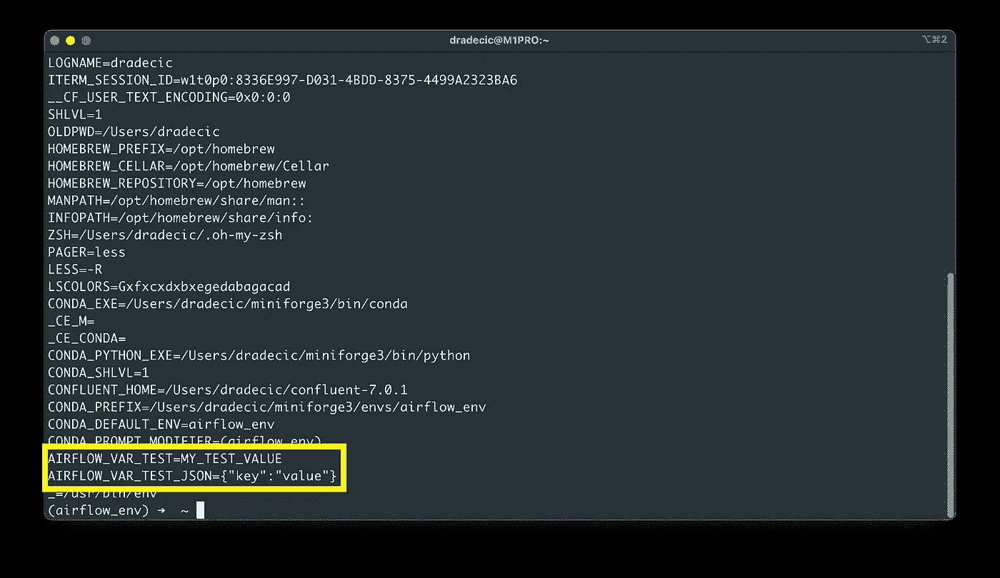
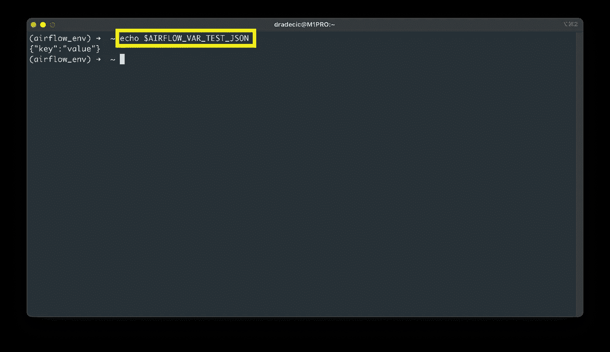

# Apache Airflow for Data Science —如何使用变量

> 原文：<https://towardsdatascience.com/apache-airflow-for-data-science-how-to-work-with-variables-891932b0d99f>

## **停止在气流 Dag 中硬编码数值——使用变量代替**


照片由 [Pankaj Patel](https://unsplash.com/@pankajpatel?utm_source=medium&utm_medium=referral) 在 [Unsplash](https://unsplash.com?utm_source=medium&utm_medium=referral) 上拍摄

气流变量是保存和访问不同类型内容的最佳方式。您可以存储几乎所有您能想到的东西，从纯文本内容、凭证到类似 JSON 的数据结构。有两种方法存储气流中的变量——从管理面板和从终端——我们今天将探讨这两种方法。

不想看书？请观看我的视频:

# 如何在阿帕奇气流中添加变量

首先，确保 Airflow webserver 和 scheduler 都已启动并运行。进入气流主页(`http://localhost:8080`)并导航至*管理* - *变量*。如果您是第一次来这里，您会看到一个空白列表:



图 1 —气流变量页面(作者图片)

单击蓝色加号按钮添加一个新变量。我们将保持这个简单，并将其指定如下:

*   **键** : `user_email`
*   瓦尔 : `test@test.com`



图 2——如何在气流中添加变量(图片由作者提供)

趁我们还在，再加一个吧。这会稍微复杂一点，并存储一个类似 JSON 的对象。当通过 DAG 访问这种类型的对象时，需要对其进行反序列化，这就是我们讨论它们的原因:

*   **键** : `sample_json`
*   **瓦尔** : `{"user": "bob", "address": {"city": "NY", "street_name": "1st"}}`



图 3——如何在 Airflow 中添加一个类似 JSON 的变量(图片由作者提供)

如果您做的一切都正确，您应该会看到在*管理* — *变量*下列出了两个变量。在继续之前，请确保您的外观相同:


图 4-添加变量后的气流变量页面(图片由作者提供)

这就是你如何通过气流网页添加气流变量。还有另一种可能更简单的方法，但它有几个怪癖。

# 如何在通过终端的阿帕奇气流中添加变量

在气流版本 1.10.10 中，您可以从终端添加气流变量。完全清楚地说，这些只是具有特定命名约定的环境变量。

所有气流变量必须用语法`AIRFLOW_VAR_{VARIABLE_NAME}`设置，全部大写。如果你想有一个名为`TEST`的变量，就把它声明为`AIRFLOW_VAR_TEST`。大写语法在这里是至关重要的，但是大写和小写都将在后面的 Airflow DAG 中起作用。

下面是如何这样声明两个变量——注意 JSON 是如何用单引号括起来的:



图 5-添加通过终端的气流变量(图片由作者提供)

使用环境变量设置的变量不会出现在 Airflow 主页上的*管理* — *变量*下，所以请记住这一点。

那么，你如何访问它们呢？那么，您可以使用以下 shell 命令来打印所有环境变量:

```
env
```



图 6 —打印所有环境变量(图片由作者提供)

或者您可以打印一个特定的:

```
echo $AIRFLOW_VAR_TEST_JSON
```



图 7 —打印单个环境变量(图片由作者提供)

两种方式都可行。唯一的区别是，如果您决定以这种方式声明变量，您将无法通过 Airflow 的 UI 检查和更改它们。

说得够多了——让我们看看如何从气流 DAG 中访问变量。

# 如何从 DAG 访问气流变量

在`~/airflow/dags`文件夹中创建一个新文件。我给我的取名为`variables_dag.py`。我们将从库导入和 DAG 样板代码开始。注意额外的`airflow.models.Variable`导入。这个类用于获取变量。

```
from datetime import datetime
from airflow.models import DAG, Variable
from airflow.operators.python import PythonOperator

with DAG(
    dag_id="variables_dag",
    schedule_interval="@daily",
    start_date=datetime(2022, 3, 1),
    catchup=False
) as dag:
    pass
```

我们将在这个 DAG 中声明的唯一任务将调用`print_variables()`函数。在函数内部，使用`Variable.get(key)`方法访问普通变量，使用`Variable.get(key, deserialize_json=True)`方法访问类似 JSON 的变量。

该函数将把所有变量名及其值打印到控制台:

```
from datetime import datetime
...

def print_variables() -> str:
    var_user_email = Variable.get("user_email")
    var_sample_json = Variable.get("sample_json", deserialize_json=True)
    var_env_test = Variable.get("test")
    var_env_test_json = Variable.get("test_json", deserialize_json=True)

    return f"""
        var_user_email = {var_user_email},
        var_sample_json = {var_sample_json},
        var_env_test = {var_env_test},
        var_env_test_json = {var_env_test_json}
    """

with DAG(...) as dag:

    task_print_variables = PythonOperator(
        task_id="print_variables",
        python_callable=print_variables
    )
```

使用以下 shell 命令测试任务:

```
airflow tasks test variables_dag print_variables 2022-3-1
```


图 8 —在代码中访问气流变量(图片由作者提供)

如您所见，所有变量及其值都被成功打印出来。通过 Airflow 访问变量很容易，所以没有理由在代码中硬编码任何信息。

# 气流变量汇总

如果你懂编程的基础，你就知道变量的用途是什么。如果你没有，你为什么要学习气流？

气流变量很容易理解。您可以通过 web UI 或终端将它们存储为环境变量。两种方式都可以，但后者有一点限制。如果您存储类似 JSON 的对象，请确保在 DAG 中访问变量时反序列化 JSON。

你应该知道的就这些。

## 推荐阅读

*   [学习数据科学先决条件(数学、统计和编程)的 5 本最佳书籍](https://betterdatascience.com/best-data-science-prerequisite-books/)
*   [2022 年学习数据科学的前 5 本书](https://betterdatascience.com/top-books-to-learn-data-science/)
*   [如何在本地安装阿帕奇气流](https://betterdatascience.com/apache-airflow-install/)

## 保持联系

*   雇用我作为一名技术作家
*   订阅 [YouTube](https://www.youtube.com/c/BetterDataScience)
*   在 [LinkedIn](https://www.linkedin.com/in/darioradecic/) 上连接

*喜欢这篇文章吗？成为* [*中等会员*](https://medium.com/@radecicdario/membership) *继续无限制学习。如果你使用下面的链接，我会收到你的一部分会员费，不需要你额外付费。*

<https://medium.com/@radecicdario/membership>  

*原载于 2022 年 3 月 31 日 https://betterdatascience.com**的* [*。*](https://betterdatascience.com/apache-airflow-variables/)