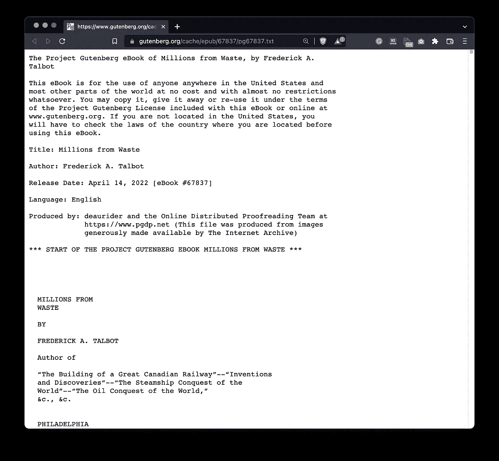
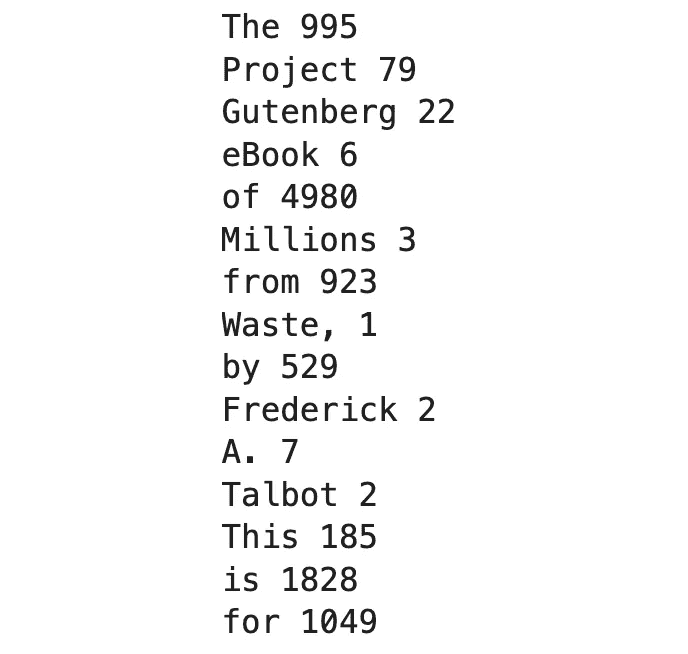
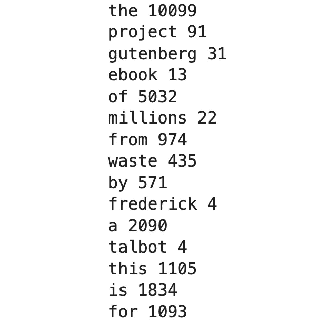
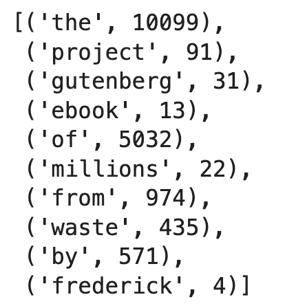
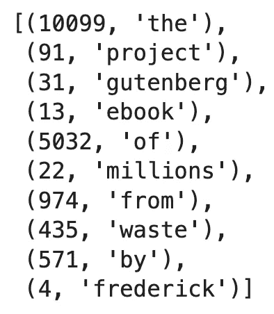
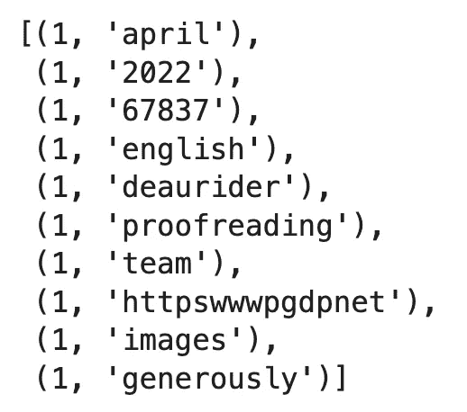
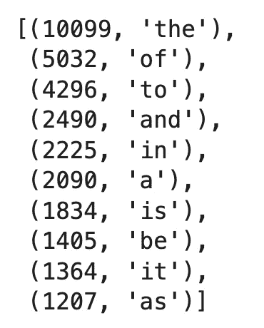
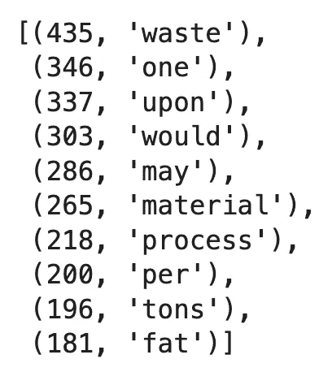

# Apache Spark for Data Science—Spark 和 NLTK 的字数统计

> 原文：<https://towardsdatascience.com/apache-spark-for-data-science-word-count-with-spark-and-nltk-ed312b3b667d>

## **学习计算一本书的字数并解决常见的停用词问题——在 PySpark 中实现**


[沃伦·王](https://unsplash.com/@wflwong?utm_source=medium&utm_medium=referral)在 [Unsplash](https://unsplash.com?utm_source=medium&utm_medium=referral) 上的照片

你知道 Apache Spark 最常见的初学者练习是什么吗？你猜对了——这是字数统计。这个想法是抓取一个文本文档，最好是一个长文档，并统计每个单词的出现次数。这是一个典型的 MapReduce 任务，你可以用 Spark 的 RDDs 来处理。今天你将学习如何解决它，以及如何很好地解决它。

我们将讨论三种解决方案:

1.  **基本解法** —用 Spark 的`countByValue()`法统计字数。对初学者来说还可以，但不是最优解。
2.  **带正则表达式的 MapReduce**—所有文本并不平等。“python”、“python”和“Python”这些词对你我来说是一样的，但对 Spark 来说不是。
3.  MapReduce with NLTK —通过过滤掉常见的英语停用词，将整个事情提升到一个新的水平。我们不在乎“the”出现多少次，它是无用的信息。

我们有许多工作要做，所以让我们马上开始吧。

不想看书？我曾以视频格式报道过相同的主题:

# Spark 中用于字数统计的数据集

我使用过古腾堡计划的这本免费电子书，名为《从废物中获取数百万》。我从没读过，但对我们想做的事来说，它似乎足够长了。下载 [TXT 版本](https://www.gutenberg.org/cache/epub/67837/pg67837.txt) — *右键* — *另存为*—*millions _ from _ waste . TXT*:



图片 1 —来自废书的数百万(图片由作者提供)

在继续之前，请确保您知道文本文件的绝对路径。

# 使用 Spark 和 Python 进行简单的字数统计

与任何 Spark 应用程序一样，您需要做的第一件事是创建一个新的 Spark 会话。使用以下代码创建一个名为`word-counts`的本地会话:

```
from pyspark import SparkConf, SparkContextconf = SparkConf().setMaster("local").setAppName("word-counts")
sc = SparkContext(conf=conf)
```

在这里，从文本文件加载数据集，并使用`textFile()`方法将其转换为 RDD:

```
book = sc.textFile("file:///Users/dradecic/Desktop/millions_from_waste.txt")
book.collect()[:10]
```

`collect()`方法打印整个 RDD - `[:10]`确保只打印前十行。让我们看看我们在处理什么:


图 2 —书的前 10 行(作者图片)

文本文档的每一行都是 Spark RDD 文件的一个专用元素。由于每一行都是一个字符串，我们可以将它拆分成单个单词，并调用`countByValue()`来获得单词计数:

```
word_counts = book.flatMap(lambda x: x.split()).countByValue()for i, (word, count) in enumerate(word_counts.items()):
    if i == 15: break
    print(word, count)
```



图 PySpark 中的简单字数统计(图片由作者提供)

就这样吗？嗯，不。我们有字数统计，但截至目前，Spark 区分小写和大写字母和标点符号。我们这里也有很多停用词，比如“The”、“of”、“A”、“is”等等。接下来我们将讨论大写字母和标点符号，把停用词留到以后。

# PySpark 中正则表达式的字数统计

正则表达式允许我们指定一个可搜索的模式，并用其他内容替换字符串中的任何内容。我们的目标是小写每个单词，并删除标点符号。这里有两个功能可以帮助我们:

1.  `preprocess_word()` -对单个单词应用正则表达式(删除标点符号)并使其小写。
2.  `preprocess_words()` -将`preprocess_word()`应用于作为字符串传递的单词序列。

这些功能的定义和使用示例如下所示:

```
import re def preprocess_word(word: str):
    return re.sub("[^A-Za-z0-9]+", "", word.lower())def preprocess_words(words: str):
    return [preprocess_word(word) for word in words.split()]

preprocess_words("The Project Gutenberg eBook of Millions from Waste, by Frederick A.")
```


图片 4 —书的预处理句子(图片由作者提供)

这正是我们想要的——所有的单词都是小写，标点符号被删除。让我们用同样的方法计算字数:

```
book = sc.textFile("file:///Users/dradecic/Desktop/millions_from_waste.txt")word_counts = book.flatMap(preprocess_words).countByValue()
for i, (word, count) in enumerate(word_counts.items()):
    if i == 15: break
    print(word, count)
```



图 5 —预处理输入的字数(作者提供的图片)

还有另一种统计单词的方法，这将使排序变得容易得多。你必须:

*   对输入的单词进行计数——首先从`(x)`到`(x, 1)`。
*   应用 reducer 方法对计数求和:

```
book = sc.textFile("file:///Users/dradecic/Desktop/millions_from_waste.txt")words = book.flatMap(preprocess_words)
word_counts = words.map(lambda x: (x, 1)).reduceByKey(lambda x, y: x + y)
word_counts.collect()[:10]
```



图 6 —重新格式化的字数(作者图片)

Spark 附带了一个叫做`sortByKey()`的方法，用于排序。唯一的问题是，目前的关键是单词而不是计数。使用以下代码反转单词和计数:

```
word_counts_sorted = word_counts.map(lambda x: (x[1], x[0]))
word_counts_sorted.collect()[:10]
```



图 7 —排序字数(1)(按作者排序)

现在，最后，按关键字对 RDD 进行排序:

```
word_counts_sorted = word_counts.map(lambda x: (x[1], x[0])).sortByKey()
word_counts_sorted.collect()[:10]
```



图 8-排序字数(2)(作者图片)

单词按升序排列，这不是我们想要的。`sortByKey()`的第一个参数是`ascending`，默认设置为`True`。将它翻转到`False`以获得按计数降序排列的单词:

```
word_counts_sorted = word_counts.map(lambda x: (x[1], x[0])).sortByKey(False)
word_counts_sorted.collect()[:10]
```



图 9-排序字数(3)(作者图片)

这是可行的，但我们还有另一个问题。所有出现频率最高的单词都是停用词，从这些词中，我们无法猜测这本书的内容。在下一节中，我们将使用 NLTK 模块来消除它们。

# 用 NLTK 从字数中删除停用词

如果您还没有使用过 NLTK，那么您必须安装这个库并下载停用词。直接从笔记本中逐行运行以下代码:

```
!pip install nltkimport nltk
nltk.download("stopwords")
```

完成后，导入`stopwords`模块，用英语打印前几个:

```
from nltk.corpus import stopwordsstop_words = stopwords.words("english")
stop_words[:10]
```


图片 10 —前 10 个英文停用词(图片由作者提供)

那么，下一步是什么？我们想要修改`preprocess_words()`函数来排除停用词。向其中添加另一行，以便只保留不是空字符串和停用词的单词:

```
def preprocess_word(word: str):
    return re.sub("[^A-Za-z0-9]+", "", word.lower())def preprocess_words(words: str):
    preprocessed = [preprocess_word(word) for word in words.split()]
    return [word for word in preprocessed if word not in stop_words and word != ""] preprocess_words("The Project Gutenberg eBook of Millions from Waste, by Frederick A.")
```


图 11 —第一个没有停用词的句子(作者图片)

这次输出更干净。我们没有像上次一样听到任何胡言乱语。剩下的唯一步骤是再次计算和排序字数。代码和以前一样:

```
book = sc.textFile("file:///Users/dradecic/Desktop/millions_from_waste.txt")words = book.flatMap(preprocess_words)
word_counts = words.map(lambda x: (x, 1)).reduceByKey(lambda x, y: x + y)
word_counts_sorted = word_counts.map(lambda x: (x[1], x[0])).sortByKey(False)
word_counts_sorted.collect()[:10]
```



图 12—Spark 中没有停用词的字数(图片由作者提供)

我们只打印了前 10 个单词，但是您已经明白了这一点——这次的输出更加清晰。随意探索其他单词，甚至可以在图表上显示它们的频率。

# Apache Spark 中的字数汇总

今天，您已经学习了如何使用 Python 和 Spark，仅使用 RDD 语法来解决最流行的 MapReduce 问题。整个事情简单得令人难以置信，但是您可以(也应该)通过预处理每个单词并排除最常见的单词来丰富解决方案。

接下来，我们将深入 SparkSQL，敬请关注！

*喜欢这篇文章吗？成为* [*中等会员*](https://medium.com/@radecicdario/membership) *继续无限制学习。如果你使用下面的链接，我会收到你的一部分会员费，不需要你额外付费。*

[](https://medium.com/@radecicdario/membership) [## 通过我的推荐链接加入 Medium-Dario rade ci

### 作为一个媒体会员，你的会员费的一部分会给你阅读的作家，你可以完全接触到每一个故事…

medium.com](https://medium.com/@radecicdario/membership) 

## 推荐阅读

*   [学习数据科学先决条件(数学、统计和编程)的 5 本最佳书籍](https://betterdatascience.com/best-data-science-prerequisite-books/)
*   [2022 年学习数据科学的前 5 本书](https://betterdatascience.com/top-books-to-learn-data-science/)
*   [用 Python 打印列表的 7 种方法](https://betterdatascience.com/python-list-print/)

## 保持联系

*   雇用我作为一名技术作家
*   订阅 [YouTube](https://www.youtube.com/c/BetterDataScience)
*   在 LinkedIn 上连接

*原载于 2022 年 4 月 16 日*[*【https://betterdatascience.com】*](https://betterdatascience.com/apache-spark-word-count/)*。*