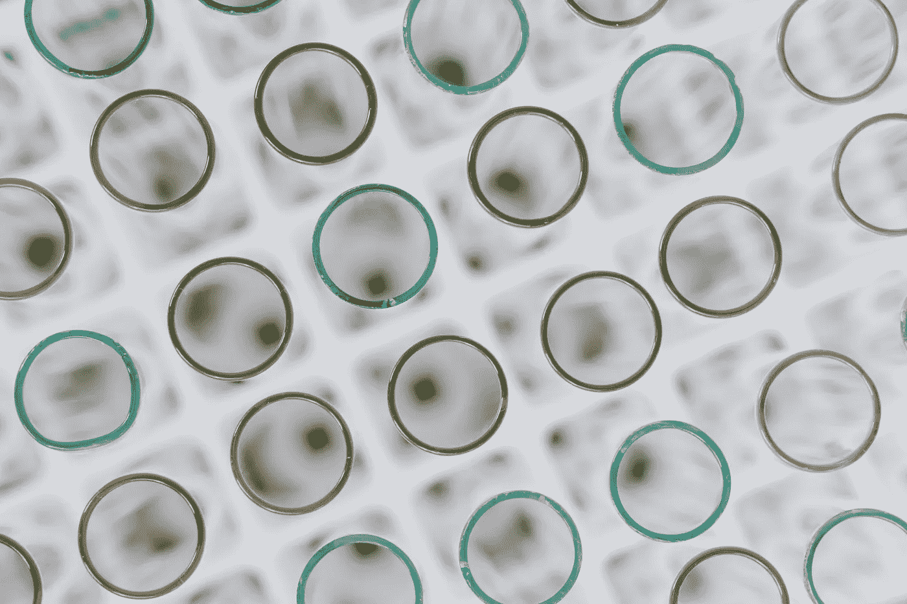
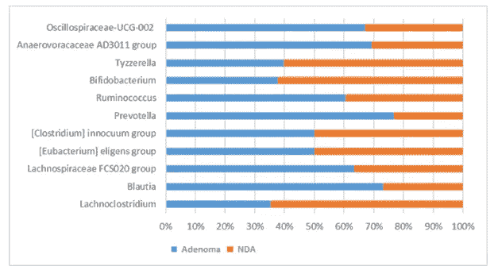

# 机器学习算法在结肠直肠癌诊断和治疗中模拟微生物组作用的应用:第 3 部分

> 原文：<https://towardsdatascience.com/application-of-machine-learning-algorithms-in-modeling-the-role-of-the-microbiome-in-the-colorectal-2c222ea6ba0>

## 生物信息学框架设计和方法学——用于理解结直肠癌发生的机器学习建模结果

照片由来自 Pexels 的 Karolina Grabowska 拍摄

在之前的一篇文章中，我对用于深层微生物组数据分析和解释的全面生物信息学框架和机器学习管道的设计和开发做了一个[概述](https://medium.com/@cekikjmiodrag/application-of-machine-learning-algorithms-in-modeling-the-role-of-the-microbiome-in-the-colorectal-4426d5e19c2b)。到目前为止，我已经[应用了该方法学，并阐述了关键生物标志物的技术结果和解释，这些生物标志物在理解诊断为结直肠癌(CRC)](https://medium.com/@cekikjmiodrag/application-of-machine-learning-algorithms-in-modeling-the-role-of-the-microbiome-in-the-colorectal-c0c4f41d860b) 的患者的治疗耐药机制中可以发挥重要作用。本文将遵循第二个 CRC 致癌案例研究的相同方法，涵盖由相同管状腺瘤组织学描述的样本。参考数据人口统计学概述，该组由来自**术前管状腺瘤(腺瘤)**患者的 23 名代表和诊断为术后**新发腺瘤(NDA)** 的 21 名样本组成。

**注意:考虑到这个案例研究遵循相同的设计和实现，我将只详细阐述主要的建模阶段、高贡献特性和统计分析结果。*

# ML 建模结果

如前所述，在应用数据标准化和缩放技术后，我分别计算了 **Cronbach 的 alpha** 和 **Cohen 的 kappa 系数**。参考前面的定义，克朗巴赫的阿尔法系数值阈值可以基于以下阶段进行解释:研究的早期阶段(0.5 或 0.6/0.7)；应用研究 0.8；做重要决定时 0.9。通常，Cronbach 的α值> 0.75 被认为是微生物组相关研究可以接受的。另一方面，Cohen`s kappa 系数由以下几个阶段决定:< 0.4 视为较差；0.4–0.75 被认为是中等至良好；0.75 代表极好的数据一致性。这些计算的结果如下表所示:

作者提供的图像-术前腺瘤组和术后新发展腺瘤组的 Cronbach`s 和 Cohen`s 系数

手术前腺瘤和手术后 NDA 个体组的一般 ML 建模性能指标如下表所示。

作者图片-术前腺瘤和术后新发展腺瘤组的一般 ML 建模性能指标

此外，我还决定分别计算两个小组的精确度、召回率和 F1 分数指标。结果显示在下表中:

作者提供的图像-术前腺瘤和术后新发展腺瘤组的详细 ML 建模性能指标

与之前的免疫治疗效果案例研究相同，我也尝试了 **XGBoost** 和 **AdaBoost** 算法，与上面描述的基于森林的方法相比，没有产生显著的改进。因此，我将**第二阶段基于 Python 的随机森林分类器确定为性能最好的**，并选择了由此产生的最重要的特征作为进一步统计分析的参考集。

# 统计分析和高贡献特征结果

腺瘤组和 NDA 组样本的比较共呈现出 **86 个独特的属**。随后，通过 ML 算法从这些属中分离出 **28 个作为最重要的特征(32.6%)，在组间统计计算的 Benjamini-Hochberg p 值的区间中从 0.002 到 0.048 排序。因此，在术前腺瘤组中，我发现*示波螺科-UCG-002* **、*厌氧螺科群*、*乳球菌属*、*普雷沃菌属*、*拉克氏螺科*、 *FCS020 群*、*布劳蒂亚菌属*为具有生物学意义的属，以供进一步分析和解释。因此，手术后 NDA 样本中最重要的属属于*泰兹氏杆菌*、*双歧杆菌*和*乳酸杆菌*。**

***注:设计的生物信息学框架和管道确定了一些需要额外调查的未分类基因组序列(UCG)。这可能是由于应用分类学分析和使用 SILVA 138.1–16s 参考数据库(最新参考数据库更新于 2020 年 8 月 27 日)根据更新的细菌参考重新标注原始读数造成的。*

我完成了 general insights 图片，提供了耐药和非耐药群体中的属丰度的统计分析结果，如下图所示:

按作者分类的图片-腺瘤和 NDA 组中最重要属的中值丰度

# 生物分析和解释

在新发展的腺瘤患者和临床治疗前诊断为管状腺瘤的患者的样本之间，作为重要特征检测到的最引人注目的属是*普雷沃氏菌*。*据报道，普雷沃氏菌*主要存在于口腔微生物群中，仅在近端结肠癌中发现相对较高的细菌丰度，根据研究，这似乎与 CRC 患者粘膜中产生 IL17 的细胞增多有关。相反，如原始出版物中所述，对转基因小鼠中的*普雷沃氏菌*的一项研究表明，该属促进了 Th17 细胞的分化，这些细胞主要定居在肠道中并迁移到骨髓中，在那里它们支持多发性骨髓瘤的进展。

# 结论

这一系列文章中记录的研究介绍了一种多学科系统方法和一种使用在属水平上指定的微生物组成来观察结直肠癌耐药机制和致癌作用的方法。利用生物信息学研究的概念，我开发了不同的高性能机器学习模型，以帮助临床医生有效地分析耐药患者的微生物组多样性，以解决和威胁肿瘤增殖、新发展的腺瘤、炎症促进和潜在的 DNA 损伤。就这一点而言，我将随机森林分类器确定为最适合的算法，用于增强特征重要性解释的后续技术。使用随机算法的性质进一步观察了从模型中获得的重要特征相关性，其中我检索了额外的数据见解和变量的重要性等级。此外，我结合了共生细菌分析来研究特征的相关性和相互作用(与特定耐药性或腺瘤类别相对应的联合特征贡献)。

迄今为止，许多研究指出了微生物组中现有属的重要性，并打算单独处理。这有助于医疗保健中的预测建模领域，并指出治疗的不同观点，因为我们的综合分析为经常在耐药患者群体中发现的属提供了明确的结果，这意味着耐药性不是由于患者微生物组中存在一个致病属，而是共生的几个细菌属。此外，我们的发现是对文献中发表的其他微生物组相关研究的补充，显示了应用方法的潜力和合理性。

已建立的方法也可以**用于未知的微生物组数据，以帮助肿瘤学家决定免疫疗法的治疗和治疗后策略以及耐药性理解**。从进一步的行动来看，我想强调设计的共生细菌分析的改进潜力，以提供模型预测性的综合概述，并揭示额外的深层数据相关性和知识。

感谢您阅读这篇文章和整个系列。我认为它清晰而全面地涵盖了拟议方法和技术管道的核心概念。

感谢您的大力支持，如果您能抽出时间发表评论、分享文章并联系我们进行进一步的讨论和合作，我将不胜感激。欢迎分享你在这方面的想法和经验。

## [第 1 部分-介绍性文章-生物信息学框架设计和方法概述](https://medium.com/@cekikjmiodrag/application-of-machine-learning-algorithms-in-modeling-the-role-of-the-microbiome-in-the-colorectal-4426d5e19c2b)

## [第 2 部分-生物信息学框架设计和方法学-结肠直肠癌耐药机制的机器学习建模结果](https://medium.com/@cekikjmiodrag/application-of-machine-learning-algorithms-in-modeling-the-role-of-the-microbiome-in-the-colorectal-c0c4f41d860b)

*原载于*[*https://www.linkedin.com*](https://www.linkedin.com/pulse/application-machine-learning-algorithms-modeling-role-miodrag-cekikj-2f/)*。*