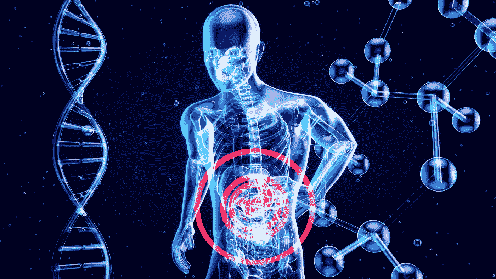
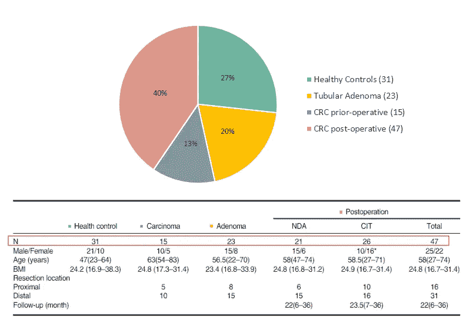
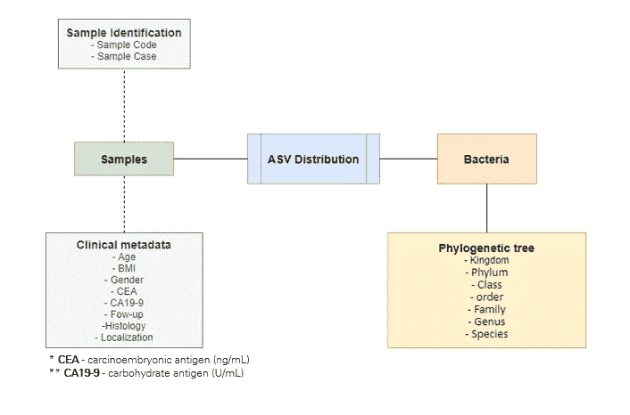
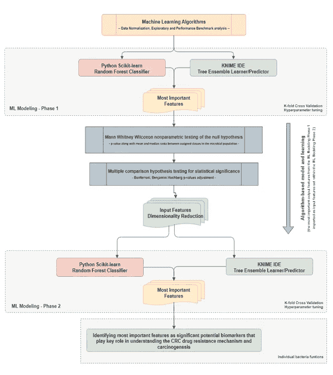

# 机器学习算法在结肠直肠癌诊断和治疗中模拟微生物组作用的应用:第 1 部分

> 原文：<https://towardsdatascience.com/application-of-machine-learning-algorithms-in-modeling-the-role-of-the-microbiome-in-the-colorectal-4426d5e19c2b>

## 简介:生物信息学框架设计和方法概述

朱利安·特朗瑟在 [Unsplash](https://unsplash.com/photos/XChsbHDigQM?utm_source=unsplash&utm_medium=referral&utm_content=creditCopyText) 拍摄的照片

经过七年紧张而专注的研究工作，今年我将在**应用生物科学和生物工程**领域做出技术贡献。我与一群杰出的微生物学家、生物学家和生物信息学科学家合作，我的工程贡献是设计和实现高性能机器学习分类算法，以了解结直肠癌耐药机制和致癌作用。回顾过去，我欢迎研究机器学习(ML)和人工智能(AI)领域的挑战，这些领域当时对我来说只是时髦词汇。然而，除了熟悉 ML 和 AI 之外，这个故事的尾声是我在生物信息学领域成功完成了计算机科学与工程的博士学习。

考虑到研究期间相对较长的研究周期，我决定在一系列连续的文章中总结主要的行动要点和其他实用和科学的观点，这些文章基于我的论文，标题为 ***“机器学习算法在建模和理解微生物组在结直肠癌诊断和治疗中的作用中的应用”*** 。目的是通过设计和开发一个全面的生物信息学框架和机器学习管道来进行深层微生物组数据分析和解释，简要说明我对医疗保健预测建模的贡献。针对肠道微生物群，我旨在提供高性能的机器学习模型和方法，以帮助临床医生有效地分析耐药患者的微生物群多样性，以解决和威胁肿瘤增殖、新发生的腺瘤、炎症促进和潜在的 DNA 损伤。

这篇介绍性文章将涵盖科学背景，并提出观察两个不同的案例研究，结直肠癌耐药机制和致癌作用的方法学设计。接下来的文章将应用这些单独的案例，并在实践中加以阐述。

**注:这里值得一提的是，这一系列文章是基于之前发表在 MDPI 应用科学杂志* *上的* [*题为“通过创建和利用 ML 模型了解微生物组在癌症诊断和治疗中的作用”的研究。因此，所有与科学背景相关的参考文献和交叉参考文献以及用于生物学解释结果的相关文献都可以在那里明确找到。*](https://www.mdpi.com/2076-3417/12/9/4094)

# 介绍

微生物组通常被称为第二个人类基因组，因为它的基因和遗传潜力大约是人类基因组的 200 倍。此外，人体肠道微生物群中的微生物细胞比整个人体多十倍。这 100 万亿种微生物代表了多达 7000 种不同的物种，重量约为 2 公斤，这使它们成为科学研究和调查的良好基地。

相反，结直肠癌(CRC)是最常见的恶性肿瘤之一，在全球癌症相关死亡原因中排名前三。新癌症病例的频率估计为 1930 万新癌症病例，其中 10.0%是结肠直肠癌(根据 2020/2021 年的官方统计)。因此，在 1000 万癌症死亡中，大约 9.4%是由于 CRC。CRC 患者的高死亡率可能是由于许多遗传和环境因素。高死亡率的原因之一是由于肠道微生物群对患有结肠直肠癌的患者的不可靠治疗。

这种细菌在人类机体中具有众所周知的功能，并且倾向于通过代谢物的产生和发酵而共生。此外，这些细菌积极参与免疫系统反应。结肠中微生物群的破坏可能导致炎症，并同样促进结肠直肠癌的发展。**大量科学研究已经证实，肠道微生物群可以改变结直肠癌的易感性和进展，因为肠道微生物群可以影响结直肠癌的发生**。此外，众所周知，微生物组可以影响代谢途径，调节抗癌药物的功效，并导致耐药性。

最近的科学工作强调了应用机器学习(ML)算法在创建数据驱动的框架和实验设置方面的潜力，这些数据驱动的框架和实验设置优于传统的生物统计学方法，以不同的策略针对微生物群，为个体患者提供了涉及量身定制治疗的新机会。就此而言，监督和非监督学习、多层人工神经网络或深度学习(DL) -都在人工智能(AI)的保护伞下-被认为是分析肠道微生物群对癌症发展和潜在治疗效果的见解的两个不同的子领域。

**目的是设计和开发一个全面的生物信息学框架和一个两阶段方法的 ML 管道，用于模拟和解释关键生物标志物，这些生物标志物在了解被诊断患有结肠直肠癌的患者的耐药机制和致癌作用方面发挥着重要作用**。该框架还将识别共同有助于机器学习模型的预测特征的重要聚合细菌生物标记，随后是关于最重要特征(在这种情况下，细菌)的生物学作用、活性和属性的数据知识和语义的解释和提取。

# 数据

目的是重新分析公开可用的微生物数据集，以评估对人类肠道中存在的细菌物种的关键影响，这些细菌物种可能导致化疗耐药性或影响结直肠癌的发生。

## 数据集人口统计

原始数据集和临床元数据信息是之前发表在[环境微生物学杂志](https://www.ncbi.nlm.nih.gov/pmc/articles/PMC7379540/)上的**“手术治疗后患者肠道微生物群”文章**的一部分。它是在对从个体粪便样本中扩增的 16S 核糖体 RNA 基因的 V3-V4 区域进行测序后提取的，并提到该研究是横断面的，这意味着手术前和手术后的粪便样本不是从相同的 CRC 患者中收集的。通常，数据分析由总数为 **116 个个体微生物组样本**组成，其中 23 个微生物组样本来自诊断为管状腺瘤的患者(19.8%)，15 个微生物组样本来自手术前的 CRC 患者(12.9%)，47 个是 CRC 术后微生物组样本(40.5%)，31 个是健康对照微生物组样本(26.7%)。因此，下图显示了一般数据概述。

按作者分类的图像-数据集人口统计数据(包括临床元数据信息)

考虑到随访 6 至 36 个月期间手术切除的临床元数据，我将 CRC 术后样本分为两个不同的病例研究，如下图所示。

图片由作者提供- CRC 耐药性和致癌性案例研究数据

第一个病例研究涵盖了由 21 个来自新发展的腺瘤患者的样本组成的组，其与耐药性相关，并且该组包括来自具有清洁肠道的患者的其余 26 个样本，其与非耐药性相关。相反，第二个病例研究涵盖了由来自手术前管状腺瘤患者的 23 个代表组成的组和诊断为手术后新发展的腺瘤的 21 个样本组成的组。

## 分类分析

最初的原始研究数据于 2018 年 12 月发布。假设细菌参考文献甚至分类学都在不断变化，我们尝试通过去除 V3-V4 区域的衔接子和条形码序列以及扩增子序列引物组来重新生成可操作的分类学单位(OTU)并提高分类学精度。我们已经使用 **BBMap (v.38.90)工具**完成了这个分类任务。更进一步，我们根据更新的细菌参考重新标注原始读数，以避免数据的分类学偏见。因此，我们使用在具有**SILVA 138.1–16s 参考数据库**的 R 4.0 分析平台中实现的**数据 2** 和**叶状体**包生成 otu(最新参考数据库更新于 2020 年 8 月 27 日)。

## 数据预处理和转换

因此，我们已经确定了总数为 **3603 的 ASV 单位，它们在系统发育学上被定义为几个层次**(界、门、纲、目、科、属和种)。我们基于 ASV 标识符执行了一个简单的内部连接技术来生成参考数据集。通过应用表旋转的方法，我们构建了基于分布在不同样本上的计数值的 ASVs 单元。

数据是根据以下 ER 图组织的:

按作者分类的图像-数据结构概述

在没有足够的种水平信息的情况下，我们进一步**分析和处理了在属水平**分类和指定的微生物组成。此外，在处理过滤和缺失信息(N/A 值)并应用基于 ASVs 命名和丰度的数据聚合/合并技术后，我们最终将工作数据集减少到 **259 种独特的细菌，分布在 116 个微生物组样本**中，包括临床元数据。

下面的流程图形象地展示了这一过程。

按作者分类的图像-数据预处理和转换流程

如前所述，数据另外分为两个独立的与 CRC 免疫治疗效果和基于组织学的致癌作用相关的案例研究，直观地显示在以下图表中:

图片 bu 作者- CRC 疗法-耐药性和致癌性案例研究数据

## 数据标准化和缩放

机器学习算法在应用于未经缩放或标准化的数据时可能会有偏差。在这种情况下，数据代表样本中细菌的相对含量，即不同细菌的相对含量差异很大。如果不应用这些技术，在处理显著不同的值的上下文中就有偏差的风险。

为此，我最初尝试了 **Scikit-learn 标准缩放器**(用于移除平均值并缩放到单位方差)和 **MinMax 缩放器**(用于通过缩放到从 0.0 到 1.0 的给定范围进行转换)，以及 **KNIME Z-Score 线性归一化**(高斯)分布。因此，我通过使用变换功能的平均值和标准偏差值计算给定数据集中样本的相关统计数据，对每个特征的训练和测试数据集独立应用了居中和缩放方法。此外，我计算了两个数据一致性系数，并应用了不同的数据缩放/标准化方法。因此，我计算了 **Cronbach 的 alpha** 和 **Cohen 的 kappa** 系数，用于内部一致性/特征相关性和评分者间数据可靠性的可靠性测量。

# 方法论——生物信息学框架设计

在数据预处理和转换之后，我继续进行下图中概括的方法工作流的设计和实现。

作者图片-方法设计概述

考虑到之前解释的数据集，我应用了机器学习和统计学作为监督学习方法来检查生物特征并对耐药机制进行建模。通常，分类 ML 算法和统计是监督学习方法。在监督学习方法中，计算机程序可以从参考数据中“学习”,并基于以前未见过的结构化或非结构化数据进行新的观察或预测(二元或多类)。该数据由分布在 116 个微生物组样品中的 259 种属水平的独特细菌组成，其中细菌值分别根据它们的计数值进行描述。引入了一个额外的目标分类列，该列提供了考虑元数据(包括样本的组织学和治疗记录)的术前和术后医学评估信息。

下图直观地展示了主要方法和框架图流程:

作者研究方法图，用于模拟和解释关键生物标志物，这些生物标志物在了解结直肠癌患者的耐药机制和致癌作用中起着重要作用

## ML 建模筛选阶段

在标记为**“算法基准分析”**的 ML 筛选阶段，我尝试并执行了一组多种不同的 ML 监督算法，以探索和提供由**最大化精度度量**确定的最有前途的方法。识别最值得信赖的算法库揭示了利用更高级的关联监督算法来提高准确性的潜力，并建立了一种可理解的方式来解释对模型预测的贡献。因此，考虑到二进制分类研究设计，我尝试了不同的知名算法和行业标准来处理数据集。据此，我应用了**朴素贝叶斯**、**逻辑回归**、 **K 近邻**、**支持向量机**与**主成分分析**和**决策树**算法。作为一个基本的参考点，我假设所有的特征都可能是重要的，并且在理解耐药机制中扮演着重要的角色。然而，由于特征维度通常与应用的 ML 算法的性能度量直接相关，我决定通过将建模过程设计成两个后续阶段来减少和语义解释输入集。

## ML 建模主要阶段

参考决策树方法的性能指标，我探索了基于**集成的算法**(Python 中的 *Scikit-learn 随机森林分类器和 KNIME 中的树集成学习器*)，构建了多个决策树，并利用了与树相关的多数投票。在进行机器学习算法选择方面，我重点强调了**准确性最大化和总体灵敏度和特异性指标**。因此，我在两种开发环境中模拟和优化了不同的 ML 模型，应用了不同的数据集分割策略以及缩放和规范化技术。

我还使用 Python Scikit-learn 中的 **RandomizedSearchCV** 和 **GridSearchCV** 功能对 **n_estimators** 、 **max_depth** 和 **max_features** 参数执行了算法超参数调整。

就此而言，通过考虑特定细菌丰度的重要性和潜在相关性，我假设缩小的第一阶段的输出作为第二次建模迭代的可能输入。该方法旨在建立更深入的分析，并寻找深入的数据见解、模型行为和性能指标改进，因为试图识别和确认特定细菌或细菌属类型组的生物标志物潜力。

在第一阶段之后，还进行了统计和非参数数据测试和分析，以检查不同类别中的丰度，并为进一步的生物学评估和发现寻找更多的数据见解。另一方面，第二阶段是按照与第一阶段相同的建模方法设计的，考虑到输入特征范围仅由前一步骤中确定的最重要的特征组成。

## 提取高贡献特征

在完成主要建模阶段后，我比较了两个案例模型，以分析输入数据的相关性，并确定对模型预测能力最强的特征。在微生物组分析的背景下，我指出关键特征是定义用于描述和理解结直肠癌发生和耐药机制的重要细菌的潜力的最具信息性的特征。在这项研究中，我使用了随机森林算法内置特性的**重要性**、**排列方法**，以及**用 SHAP 值计算特性重要性的技术**。KNIME 中的树集成学习器提供了不同决策树属性(输出端口)的统计表。因此，使用统计节点，我开发了一个**算法组件，用于计算关于根**、**第一个**和**第二个后续级别**上的分割值的属性重要性。

我比较了从两种环境中定义和提取的最相关的变量，以提供缩小的特性集。因此，我额外分析了这组特征，并将其作为一组关键特征进行参考，这些特征在理解肿瘤增殖机制对参考肠道微生物组数据集的影响方面起着重要作用。这种机器学习分析假设高模型精度直接影响所计算的变量重要性的可信度。

## 统计分析

如上所述，我进行了统计和非参数数据测试和分析，以检查不同类别中的丰度，并为进一步的生物学评估和发现找到更多的数据洞察力。因此，我最初使用了 **Mann-Whitney Wilcoxon 秩和检验**来计算 U 值/p 值以及数据集微生物种群中指定类别之间的平均和中间等级。此外，使用 R 和 KNIME 统计节点，我计算了相应的 **p 值概率**，用于检测定义的组之间具有显著不同丰度水平的特征。因此，我额外应用了 **Bonferroni** 和 **Benjamini-Hochberg p 值调整**。考虑到控制假阳性率的 Bonferroni 方法(在α/n 处的显著性截止值，**，其中α = 0.05** )在统计上是严格的，我继续使用 Benjamini-Hochberg 的 p-调整进行分析，假发现率阈值为 0.15。我在计算 p 值后对特征的重要性进行了排序，随后根据 p 值的**阈值< 0.05** 进行排序。

## 聚合/联合特征贡献分析

此外，我进一步建立了一种更具操作性的方法，通过对应于每个决策树模型的区域序列来定义可预测性。假设随机森林分类器的随机对象状态和随机算法的性质，我开发了一个定制组件，用于构建和评估 2500 个具有不同随机状态初始化的分类器。

我通过结合**联合特征贡献分析来总结这一过程，以在最终模型预测**中为特征相关性和交互提供更深刻的共生细菌分析——使用**树解释器库(v.0.2.3)** 并在最具性能的第二阶段预测模型上应用聚合贡献便利方法。为了解释贡献的整个轨迹的构成，我提取了一个特定的特征组合，该特征组合对应于抗性类别做出显著的单独和联合预测贡献。沿着算法的预测路径分解特征的贡献导致聚集的贡献，其可以更好地解释一组相关细菌对耐药机制和致癌作用的影响。

## 细菌丰度和细胞周期整合分析

这种细菌在人类机体中具有众所周知的功能，并倾向于通过生产和发酵代谢物来共生，积极参与免疫系统反应。因此，由于它们的酶作用，每种细菌影响不同的生物途径和药物代谢。我提取了**最具信息性的特征作为途径分析的输入，以深入理解它们的生物学作用和活性**。我已经使用 OTUs 通过应用 **iVikodak 工具**固有的工作流程创建了潜在的代谢物分析，iVikodak 工具是一种有意义的生物信息学工具和框架，用于分析、分析、比较和可视化微生物群落基于 16S 的功能潜力。

## ide 和工具

我在分析和 ML 建模中使用的 ide 和工具列表概述如下:

- **KNIME 分析平台**，版本 4.3.1

- **KNIME 数据库**，版本 4.3.1

- **Python** ，版本 3.9.0

- **木星笔记本**，6.0.3 版本(**蟒蛇**，4.9.2 版本)

- **R** ，版本 4.0.4

- **Scikit-learn** ，版本 0.23.1

- **熊猫**(v 1 . 0 . 5)**Numpy**(v 1 . 18 . 5)**Matplotlib**(v 3 . 2 . 2)**Seaborn**(v 0 . 10 . 1)**Pingouin**(v 0 . 3 . 9)

**KNIME 集成学习包装器** v4.3.0、 **KNIME Excel 支持** v 4.3.1、 **KNIME 对 Chromium 浏览器的扩展** v 83.0.4103、 **KNIME R 统计集成** v 3.4.2、 **KNIME JavaScript 视图** v 4.3.0、 **KNIME 模块化 PMML 模型** v 4.3.0、

**感谢您阅读这些介绍性内容，我坚信这些内容在理解与微生物组分析的生物信息学领域相关的核心概念方面是清晰和概括的。正如开头提到的，我将在接下来的文章中继续阐述这些结果和生物学解释。敬请关注。**

## **[第 2 部分-生物信息学框架设计和方法学-结肠直肠癌耐药机制的机器学习建模结果](https://medium.com/@cekikjmiodrag/application-of-machine-learning-algorithms-in-modeling-the-role-of-the-microbiome-in-the-colorectal-c0c4f41d860b)**

## **[第 3 部分——生物信息学框架设计和方法——用于理解结肠直肠癌致癌作用的机器学习建模结果](https://medium.com/@cekikjmiodrag/application-of-machine-learning-algorithms-in-modeling-the-role-of-the-microbiome-in-the-colorectal-2c222ea6ba0)**

***最初发表于*[T5【https://www.linkedin.com】](https://www.linkedin.com/pulse/application-machine-learning-algorithms-modeling-role-miodrag-cekikj/?published=t&trackingId=Xo%2FrVQToTnSzub8SVnUekA%3D%3D)*。***