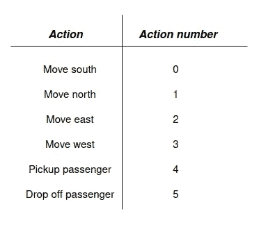
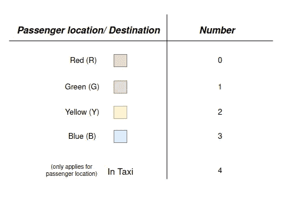
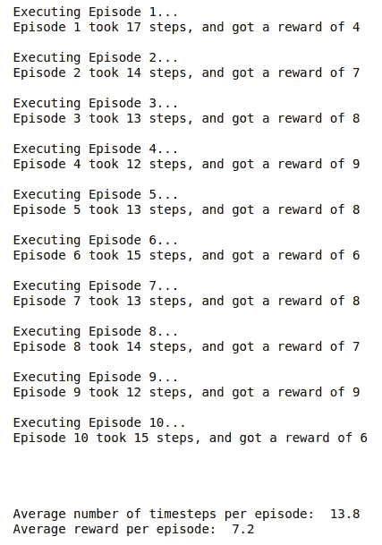

# 应用强化学习 II:Q 学习的实现

> 原文：<https://towardsdatascience.com/applied-reinforcement-learning-ii-implementation-of-q-learning-464ec017e777>

## Q 学习算法的实现及其在 OpenAI Gym 的 Taxi-v3 环境中的应用

理查德·贝尔在 [Unsplash](https://unsplash.com?utm_source=medium&utm_medium=referral) 上拍摄的照片

本系列的第一篇文章介绍了任何强化学习系统的基本概念和组件，并解释了 Q 学习算法背后的理论。在本文中，我们的目标是在 Python3 中实现该算法，并将其应用到真实的训练环境中。第一篇文章中提到的所有概念(**应用强化学习 I: Q-Learning** )都将在这篇文章中应用，假设读者知道并理解它们，所以如果你不熟悉这些概念，或者没有读过第一篇文章，你可以在下面访问它:

 [## 应用强化学习 I:Q-学习

### 逐步理解 Q 学习算法，以及任何基于 RL 的系统的主要组件

towardsdatascience.com](/applied-reinforcement-learning-i-q-learning-d6086c1f437) 

# 环境— Taxi-v3

为了使这篇文章更有启发性，我们选择了一个简单的基本环境，它不会给训练增加太多的复杂性，因此 Q 学习算法的学习可以得到充分的理解。环境是 OpenAI Gym 的*Taxi-v3***【1】**，它由一个网格世界组成，其中的代理是一名出租车司机，他必须搭载一名客户并让他在目的地下车。

## 行动

至于动作空间，以下离散动作可供智能体与环境交互:*前进*，*后退*，*向右*，*向左*，*搭载乘客*和*让他下车*。这样总共有 6 个可能的动作，为了便于编程，这些动作依次用 0 到 5 的数字进行编码。动作与数字的对应关系如图*图 1* 所示。

**图一**。操作-数字映射。作者图片

## 州

离散状态空间要大得多，因为每个状态都表示为一个元组，其中包含代理/出租车司机在网格上的位置、要搭载的乘客的位置及其目的地。由于地图是二维网格，代理人的位置完全可以用其在 x 轴上的位置和在 y 轴上的位置来表示，所以表示代理人状态的元组是: **( *pos_agent_x* ， *pos_agent_y* ， *passenger_location* ， *destination* )** 。与动作的情况一样，表示状态的元组被编码成 0 到 499 之间的整数(500 个可能的状态)。*图 3* 显示了代理的位置/目的地与表示该位置/目的地的整数之间的对应关系，该整数用于描述状态的元组中。

**图二**。乘客位置/目的地—号码映射。作者图片

为了直观地理解可能状态的元组表示，代理的两个状态示例如图 3 所示。

**图 3** 。状态的可视化示例。作者图片

## 奖励

至于代理执行的每一步所获得的奖励，将会是:

*   +20 表示成功运送乘客(终点站状态)
*   -10 用于非法执行*拾取*或*放下*动作
*   -1，除非触发了其他奖励

# **Q-学习实现**

现在，环境是众所周知的，Q 学习算法的实现可以继续进行。与第一篇文章一样，从巴尔托和萨顿的书**【2】**中提取的伪代码将被用作支持算法实现的参考。

q-学习伪代码。摘自萨顿和巴尔托:《强化学习:
导论】**【2】**

## 1)初始化 Q 表

Q 表被初始化为一个 **m** x **n** 矩阵，其所有值都被设置为零。其中 **m** 是状态空间的大小， **n** 是动作空间的大小。

因为动作和状态都被编码成整数，所以可以使用这些整数作为索引来构建 Q 表。

## 2)定义ε-贪婪策略

ε-贪婪策略为给定状态选择具有最高 Q 值的动作**或随机动作**，这取决于所选择的ε参数。例如，epsilon 为 0.15 表示 15%的时间会随机选择一个动作，而 epsilon 为 1 表示该动作总是随机选择的(100%的时间)。

该策略非常有趣的一点是，ε值可以随着训练而变化，允许在高ε值(探索阶段)开始时采取更多随机行动，最终使用非常低的ε值(开发阶段)采取具有更高 Q 值的行动。然而，对于这种环境，训练是以恒定的ε值进行的。

## 3)定义一集的执行

对于每一集，代理将根据需要执行尽可能多的时间步长，以达到最终状态。在每个时间步中，代理将 **1)** 选择一个遵循ε-贪婪策略的动作，并执行该动作。在执行之后，代理将 **2)** 观察达到的新状态和获得的奖励，这些信息将被用于 **3)** 更新其 Q 表的 Q 值。

对每个时间步长重复这个过程，直到获得最佳 Q 值。

可以看到，代码非常简单:前面定义的**get _ epsilon _ greedy _ action()**函数用于选择动作，代理通过环境的 **step()** 方法执行选择的动作，最后通过应用贝尔曼最优性方程的适配来更新 Q 值，如前一篇文章中所描述和解释的。

## 4)培训代理人

此时，只需要定义算法的超参数，分别是:**学习率*α*、**折扣因子*γ*和**ε**。除此之外，还需要指定代理必须完成的集数，以便认为培训已经完成。****

定义完所有这些变量后，训练的执行将包括为每个训练集运行上面定义的 **execute_episode()** 函数。每一集(以及每一集内的每个时间步长)将更新 Q 表，直到达到最佳值。

值得注意的是，培训执行将每集获得的奖励记录在 *rewards_history* 变量中，以便能够在培训后显示评估结果。

## 5)评估代理

为了评估代理，将使用从每个训练集获得的奖励、执行一集的被训练代理的可视化以及被训练代理的几次执行的度量。

在培训过程中获得的奖励是一个非常重要的指标，因为它应该显示奖励向最佳值的收敛。在这种情况下，由于除了终端状态，每个时间步长的回报都是负的，所以算法应该使回报尽可能接近 0，甚至超过 0。下面显示了在具有不同超参数的两次训练期间获得的每集奖励的曲线图。可以看出，第一个图显示了奖励如何快速达到最大值，在 0 处画了一条渐近线，这意味着代理已经学会了在每个状态下获得最佳可能的奖励(最优 Q 值)。另一方面，第二张图显示，在从 0 到-20000 的范围内，奖励既不变得更好也不变得更差，这意味着代理人没有学习任务。

奖励-具有不同超参数的两次训练的情节图。作者图片

在这种情况下，第二次训练效果如此差的原因是由于ε的值过高，因为ε为 0.99 将导致大多数操作被随机选择，完全忽略了开发阶段。

关于代理的可视化，将使用渲染模式，这允许代理在与环境交互时被可视化。为了查看代理已经学习了什么，执行了 epsilon 为 0 的一集，即:代理总是采取具有最高 Q 值的动作，从而遵循最优策略。

训练有素的 Q 学习代理执行一集。作者 GIF

如图所示，执行上面的代码将显示训练有素的代理接载乘客并把他带到目的地，明确显示代理已经学会如何正确执行他的任务。

最后，还将在几个不同的情节中评估受训代理的行为，从而发现代理从乘客的不同起点、不同地点和目的地成功完成任务的能力。就像在可视化中一样，代理将总是选择具有最高 Q 值的动作，从而显示它已经学习了什么，而不是随机行为。

execute _ eptions _ on _ trained _ agent()方法的执行日志。作者图片

正如执行日志所示，完成一集所需的平均时间步数为 13.8，每集获得的平均奖励为 7.2。这两个度量都表明代理已经很好地学会了执行任务，因为它需要很少的时间步来完成任务，并且在所有执行中实现了大于 0 的奖励。

# 结论

Q-Learning 已经显示出能够非常容易地学习任务，因为当用适当的超参数执行时，它只需要 50 集就可以达到最佳 Q 值。尽管结果非常好，但必须强调超参数在这种类型的训练中的重要性(两个每集奖励图显示了 epsilon 在这种类型的训练中的决定性)，因为足够的值会使代理快速收敛到最优 Q 值，而错误的值会导致代理永远无法学习。还必须考虑到的是， *Taxi-v3* 环境是一个离散且简单的环境，对于 Q-Learning 算法来说，它总是显示出非常好的结果，因此代理已经快速且有效地学习了任务的事实并不意味着如果将它应用于其他类型的环境，这种学习也会同样有效。

事实上，对于 Q 学习的应用来说，动作空间和状态空间都是离散的是至关重要的，因为 Q 表的构造对于连续的状态或动作是不可行的(Q 表将具有无限的行或列)。因此，尽管从这种训练中获得了很好的结果，Q-Learning 并不总是适用于其他类型的环境，例如连续问题，这将在本系列的后续文章中介绍。

# 密码

为了便于理解和学习，Q-Learning 算法的完整实现，以及前面提到的对经过训练的代理的可视化和评估，可以在我的 GitHub 存储库中找到，作为一个 Jupyter 笔记本。

 [## GitHub-Javier mtz 5/人工智能

### 此时您不能执行该操作。您已使用另一个标签页或窗口登录。您已在另一个选项卡中注销，或者…

github.com](https://github.com/JavierMtz5/ArtificialIntelligence) 

# 参考

**【1】**open ai 健身房 Taxi-v3
[https://github . com/open ai/Gym/blob/master/Gym/envs/toy _ text/Taxi . py](https://github.com/openai/gym/blob/master/gym/envs/toy_text/taxi.py)

**【2】**理查德·萨顿；强化学习:介绍。麻省理工学院出版社，2018