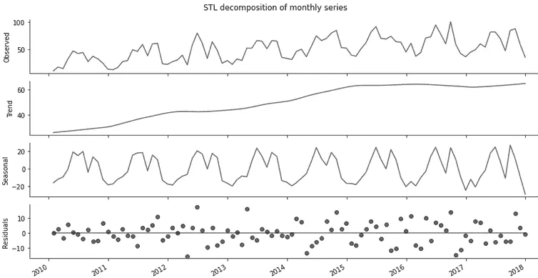
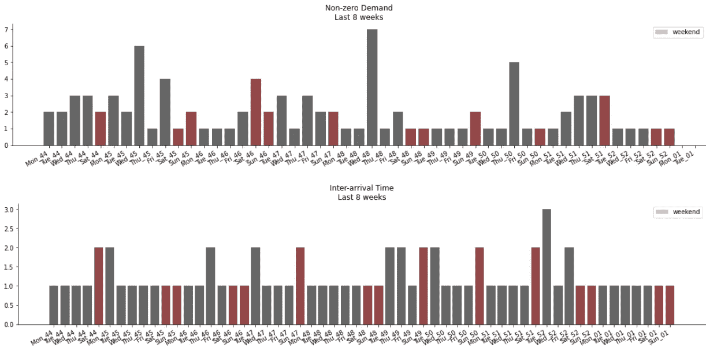

# 马德里自行车事故的应用时间序列分析

> 原文：<https://towardsdatascience.com/applied-time-series-analysis-of-bike-accidents-in-madrid-1f199ed5fd>

## 你骑车回家会很安全

马库斯·斯皮斯克在 [Unsplash](https://unsplash.com?utm_source=medium&utm_medium=referral) 上的照片

我最近偶然发现了一个数据集，其中包含涉及自行车的已登记事故，作为一名喜欢偶尔在我的城市周围骑车的数据科学家，这似乎是一个享受这些数据的好机会。

更准确地说，这些数据形成了一个**时间序列**，范围从 2010 年到 2018 年，由警方按时间顺序登记的事故，并由马德里市在下面的链接中公开提供。几个变量也是可用的，如位置、天气或道路条件，但我们将把它们留在其他类型的分析中，并专注于时间序列。

  

> 通过分析该数据集，我们可以为马德里市提供见解，以了解自行车使用者面临的危险，并最终使其成为一个对他们来说更安全的城市。

# 间歇时间序列

我们正面临一种特殊类型的时间序列，称为**间歇时间序列**，其中很大一部分值为零，通常在这种情况下，数据来自计数。

系列的最后一年，取值范围从 0 到 8

这些序列带来了额外的复杂性，因为许多最常用的时间序列分析方法假设一个常数或非零变量。

为此，我们将使用**克罗斯顿的方法**，这种方法是 J. D .克罗斯顿在 1970 年发明的，用于预测间歇性库存的需求，至今仍在大量使用，随着博客的继续，我们将深入探讨这种方法。

# 时间序列分解

为了提高我们对数据的理解，我们将从时间序列分解开始。

根据数据的性质，我们感兴趣的季节性有两种类型:

*   **年度季节性。由于好天气和坏天气的影响，我们可以预计每年都会出现一个循环模式。**
*   **每周季节性。**我们可能会观察到受工作日和周末影响的不同模式，这可能会影响自行车用户的数量、他们的路线和其他行为。这可能会导致对骑自行车者行为的更好理解，并引发进一步的分析，例如，我们是否需要在工作日对骑自行车者给予更多的关注，因为大多数事故都发生在上班的路上？

## 年度分解

为了降低处理间歇序列的复杂性，我们按月频率对序列进行汇总，这也给了我们一个更平滑、噪音更少的概览。

我们使用一个 **STL 分解**，使用黄土进行季节和趋势分解，这是一个稳健的方法来执行时间序列分解，它还允许季节成分随着时间的推移而演变。在此基础上，它使用黄土，一种使用多项式回归的非参数方法来拟合目标变量的平滑曲线。

STL 分解为趋势、季节和残差

季节性组件的放大视图[5 月-10 月]

*   我们可以观察到**交通事故的增长趋势**，而**在过去三年**已经持平，如果我们的目标是让城市对骑自行车的人更安全，这可能是一个积极的迹象。
*   季节性成分年复一年显示出相似的模式和有趣的形状，**在六月/七月和九月达到峰值，在八月下降**。我们可以假设，夏季的好天气有利于自行车的使用，也许对 8 月低谷的解释是许多当地人在那个月离开马德里去度假。这一见解有助于马德里市在一年中的这个时候将预算重点放在道路安全活动上。

## 每周分解

在这种情况下，我们不能像以前那样通过聚合系列来使用相同的技巧，所以我们将使用 **Croston 的方法**来分解它，我们将对系列的最后 8 周进行采样，因为这足以了解任何清晰的模式。

克罗斯顿的方法创造了两个新系列:

*   *q* ，称为**非零需求**，或者在本例中为事故发生的时间段。
*   *一个*，称为**到达间隔时间**，即事故发生的两个时间段之间的间隔。

克罗斯顿对过去 8 周每日序列的分解

*   在显示事故发生日期的第一个图中，我们没有看到我们预期的工作日与周末的模式，或任何其他明显的每周模式。
*   第二张图显示了事故之间的天数间隔，看起来有点平坦，因为大部分时间都发生了事故，表示间隔的峰值看起来稀疏且不规则。

基于这些见解**我们不会假设每周的季节性**，但是深入研究数据中的其他变量以使分析更具洞察力会很有趣。

# 极端值

对过去异常值的分析有助于突出自行车事故中的异常峰值，例如证明特殊时间事件与有问题的位置和/或天气条件的结合，当局可以使用这些信息**实施特殊的缓解措施，防止未来的事故**。

使用之前的月度分解，我们通过查看残差的分布来搜索异常值。

我们将任何超过 IQR1.5 倍的残差宣布为异常值**，这是分布的 25 和 75 百分点之间范围的 1.5 倍。**

残差序列中的异常值

这导致了 2021 年 6 月的单个异常值，然而，在这种情况下，我无法通过数据中的其他变量或其他新闻来源找到任何异常，如一段糟糕的天气，或在此期间在马德里举行的特殊事件，可以为这个异常值提供更多信息。

# 预测

当局可以使用预测来**预测足够的资源来支持预测的事故量**，在操作上，通过针对城市的较小部分，例如通过对警察局运营的每个区域进行预测，这可能会更加有效。

我们将继续使用克罗斯顿的方法。克罗斯顿没有准确预测事故何时会发生或不会发生，而是估计了每个时期的需求和无需求的时间间隔，并预测了一个时期的**平均需求。在我们的情况下，我们不需要准确地知道明天是否会有零起、一起或多起事故，警察人员配置支持可能最多是每周或每月决定一次，因此满足平均需求就可以了。**

我们挑选了一个由两周组成的测试数据集，并获得了以下结果。

因为我们有包含零值的间歇数据，所以在选择度量标准来测量模型性能时，我们必须特别小心。

*   我们可以使用平均绝对误差， **MAE，**但是，例如，如果我们想要开发一个周模型，我们将无法公平地比较它们的性能，因为该指标将取决于数据的规模。
*   平均绝对百分比误差， **MAPE，**提供了一个相对指标，但是由于数据的间歇性，我们可能会被零除。
*   平均绝对标度误差 **MASE** 避免了这些问题，它是间歇序列的稳健指标，并根据预测误差和预测前一时间戳的简单模型误差之间的比率，为我们提供了一个无标度指标。

我们的预测是两周的 *1.33* ，模型得到的 MAE 为 *0.92* ，MASE 为 *0.65* 。这可以解释为平均来说，由于高估或低估，模型几乎偏离 1 次，MASE 告诉我们，模型优于简单预测的基线。

我鼓励读者探索其他克罗斯顿的变种，如 SBA 或 TSB，以改善这些结果。

# 结论

在本文中，我们研究了自行车事故数据，旨在使马德里成为一个对骑自行车者更安全的城市，并确定了一些用例，在这些用例中，时间序列分析可以通过在一年中的关键季节集中资源、监控异常值以采取特殊措施，或者通过预测事故量以确保足够的紧急支持来提供帮助。

至于下一步，我相信通过分析位置等其他变量，这个数据集有更大的潜力。地理空间分析可以提供有问题的位置和证据问题，如缺少交通标志或自行车道和基础设施不足，这可以与时间序列分析相结合，以随着时间的推移监控所采取措施的有效性。此外，我建议分别针对不同的行为，比如通勤者和休闲骑自行车者。

感谢您的阅读，您可以在下面的资源库中找到本文背后的所有代码。

  

*   [1] Rob J. Hyndman 和 George Athanasopoulos，[预测:原则与实践，第二版](https://otexts.com/fpp2/)(2018)
*   [2] Croston，J. D .，[间歇需求的预测和库存控制](https://www.jstor.org/stable/3007885)。(1972)
*   [3] Rob J. Hyndman *，* [对间歇性需求预测准确性指标的另一种看法](https://robjhyndman.com/papers/foresight.pdf) (2006)

除非另有说明，所有图片均为作者所有。