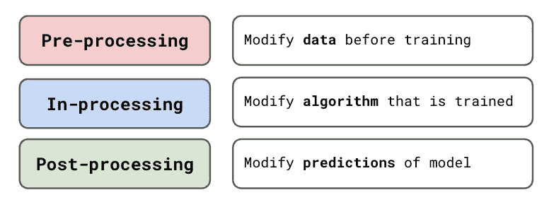
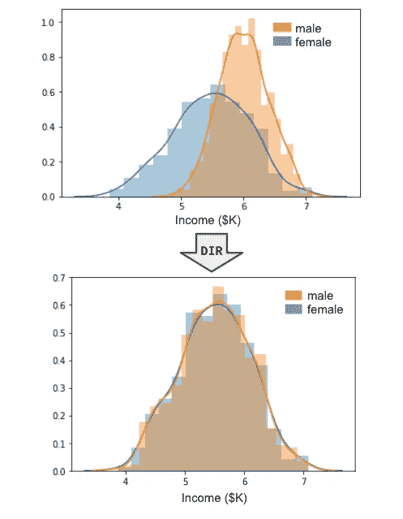
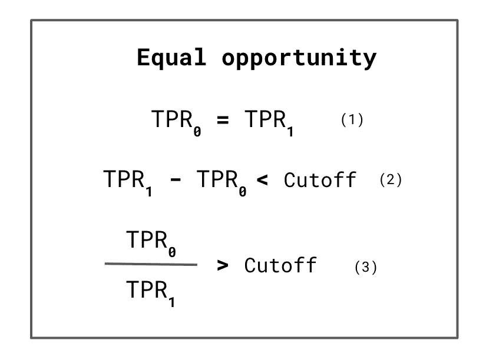
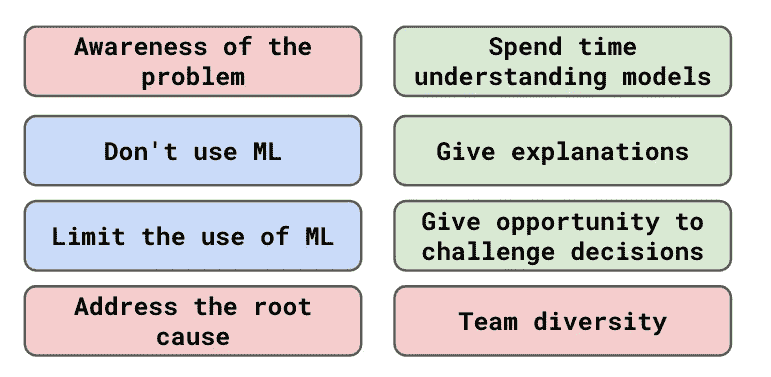

# 纠正和防止机器学习中的不公平现象

> 原文：<https://towardsdatascience.com/approaches-for-addressing-unfairness-in-machine-learning-a31f9807cf31>

## 预处理、加工中和后处理定量方法。以及非定量方法:限制 ML 的使用，可解释性，解释，解决根本原因，问题意识和团队多样性

(来源: [flaticon](https://www.flaticon.com/premium-icon/repair-tools_1850687) )

机器学习中的公平性是一个复杂的问题。更糟糕的是，负责建立模型的人不一定有能力确保它们是公平的。这是因为不公平的原因超越了数据和算法。这意味着解决方案还需要超越定量方法。

为了理解这一点，我们将从讨论不同的**定量方法**开始。我们可以将这些分为**前处理**、**中处理**和**后处理**。我们将关注这些限制，以理解为什么它们可能无法解决不公平问题。最终，我们需要将公平视为一个更广泛的问题。

这就是为什么我们将继续讨论**非定量**方法。包括**不使用**或**限制使用**ML。提供**解释**、**解释**和**质疑决策**的机会是一个重要方面。它们还包括解决不公平的**根本原因**、问题的**意识**以及团队的**多样性。为了有效解决不公平问题，将采取定量和非定量相结合的方法。**

# 定量方法

公平的量化方法是数据科学家介入的地方。他们通过调整用于训练模型的数据或训练的算法来工作。查看图 1，您可以看到我们可以将这些方法分为**预处理**、**加工中**和**后处理**方法。这种划分取决于在模型开发的哪个阶段应用它们。

图 1:定量方法的类型(来源:作者)

## **预处理**

不公平的模型可能是数据偏差的结果。**预处理**方法试图在数据用于训练模型之前**去除数据** **中的偏差。数据被转换，算法被定型，就像在原始数据集上一样。希望最终的模型是公平的。即使它不太准确。**

不公平模型的一个原因是目标变量反映了历史上不公平的决策。这对于主观目标变量来说更为常见。例如，性别歧视的招聘做法可能会导致更高比例的女性求职被拒。为了解决这个问题，一种预处理方法是**交换先前决策的目标变量**。也就是说，我们重新标记了不公平的招聘决定，以人为地增加我们数据集中女性雇员的数量。

一个问题是，改变目标变量并不总是可能的。目标变量通常是客观的。例如，我们不能将以前的贷款违约重新标记为非违约。对于一些主观的目标变量可能也很难。这是因为在做出决定时，我们可能没有所有可用的信息。对于招聘决定，我们可能有简历。然而，我们可能没有录音面试，这是一个申请的一大部分。

(来源: [flaticon](https://www.flaticon.com/free-icon/question_2353678?term=confused&page=1&position=26&page=1&position=26&related_id=2353678&origin=search) )

不公平模型的另一个原因是**代理变量**。这些是与**保护变量*相关或关联的模型特征。*** 其中受保护变量代表敏感特征，如种族或性别。其他方法着眼于从模型特征中“修复”或移除偏差。这些通过移除模型特征和受保护变量之间的关联来工作。

这种方法的一个例子是**不同影响消除** (DIR)。受保护变量通常分为特权(例如男性)和非特权(例如女性)组。DIR 通过修改特征来工作，因此两个组的分布变得相似。例如，参见图 2。在这里，男性和女性的收入分配发生了变化。

图 2:不同影响消除的例子(来源:作者)

DIR 保持每个子群体内的等级顺序。也就是说，如果你是特权人群中收入最高的人，你将一直是这个人群中收入最高的人。只有两个群体之间的等级顺序受到影响。结果是，我们将不再能够用收入来区分这两个群体。同时，我们会保留一些收入预测目标变量的能力。

DIR 还有一个**调优参数**，它在准确性和公平性之间引入了一个折衷。它允许你控制分布的移动量。换句话说，它允许您仅移除模型特征和受保护变量之间的部分关联。

预处理方法的一个优点是它们可以用于任何算法。这是因为只有数据被修改。一个主要的缺点是对我们特征的解释不再清晰。我们可能需要修复多个受保护变量的特征值(如性别、种族、原籍国)。在一个特征的分布发生如此多的变化之后，它就失去了它的解释。向非技术观众解释这样一个模型将是一个挑战。

## 正在处理中

我们可以**调整 ML 算法**，而不是转换数据。这些被称为**在加工**方法。通常，模型被训练成最大限度地提高某种程度的准确性。处理中方法通过调整目标来考虑公平性。这可以通过改变成本函数来考虑公平性或者通过对模型预测施加约束来实现。模型是根据有偏差的数据训练的，但最终结果是一个公平的模型。

对于回归，一种方法是向成本函数添加惩罚参数。这与正则化的工作方式类似。对于正则化，我们惩罚参数值以减少复杂性和过度拟合。现在我们引入一个减少不公平的惩罚参数。

具体而言，该参数旨在满足公平性的数学定义。例如，参见图 3 **中的**均衡赔率**。**这里下标 0 代表非特权组，1 代表特权组。在这个定义下，我们要求相等的真阳性率(TPR)和假阳性率(FPR)。

图 3:均等赔率的定义(来源:作者)

均等的机会只是公平的一个潜在定义。其他定义包括**平等机会**和**不同影响**。我们将在下面的文章中讨论所有这些。我们还将讨论每个定义的合理性，并向您展示如何使用 Python 来应用它们。

 [## 分析机器学习中的公平性(用 Python)

### 做一个探索性的公平性分析，并使用平等机会、均等优势和完全不同来衡量公平性…

towardsdatascience.com](/analysing-fairness-in-machine-learning-with-python-96a9ab0d0705) 

这些方法的缺点是在实践中很难实施。它们需要调整成熟的算法。与预处理方法不同，这些调整也是算法特定的。对于回归、树方法或神经网络，我们引入惩罚参数的方式将是不同的。

试图从数学上定义公平也有问题。在这样做的时候，我们可能会忽略公平的细微差别。当追求一个定义时，这变得更加困难。如果我们根据一种定义实现公平，我们不一定根据另一种定义实现公平。试图将多个定义合并到一个惩罚参数中会极大地增加算法的复杂性。

## 后处理

**后处理**方法通过**改变模型做出的预测**来工作。我们不对数据或算法做任何调整。我们只是交换某些模型预测(例如，从正面到负面)。目标是只对不公平的预测这样做。

一种方法是对特权群体和非特权群体设定不同的门槛。例如，假设我们使用逻辑回归来预测贷款申请的违约。我们将小于 0.5 的概率标记为正(1)。也就是说，他们预计不会违约，我们给客户贷款。假设使用阈值 0.5，我们发现女性(0)的 TPR 明显低于男性(1)。

换句话说，图 4 中的**机会均等**没有得到满足。为了解决这个问题，我们可以将女性的概率阈值降低到 0.4。也就是说，我们对男性(0.5)和女性(0.4)有不同的阈值。结果将是更多的女性接受贷款，导致更高的 TPR。在实践中，我们可以调整阈值，以实现在某个临界值内的 TPR 差异。

图 4:平等机会的定义(来源:作者)

这种方法的一个问题是，它要求我们在预测时拥有关于受保护变量的信息。为了决定使用什么门槛，我们需要关于申请人性别的可靠信息。在许多情况下，由于法律或隐私原因，此类信息仅在培训期间可用。我们也面临着类似的加工方法的缺点。也就是说，我们将努力在一个定义的基础上实现公平。

## 定量方法的缺点

数据科学家倾向于关注这些量化的公平方法。这是我们的优势所在。然而，如果认为仅仅通过调整数据和算法就可以解决不公平问题，那就太天真了。公平是一个复杂的问题，我们需要将其视为超越数据集的东西。只使用定量方法就像缝合枪伤而不先取出子弹一样。

> “因此，不公正和有害的结果被视为副作用，可以通过“去偏置”数据集等技术解决方案来处理，而不是那些深深植根于模糊和偶然问题的数学化、历史不平等、不对称的权力等级或渗透到数据实践中的未经检验的有问题的假设的问题。”
> 
> — [阿贝巴·比尔哈尼](https://www.sciencedirect.com/science/article/pii/S2666389921000155)

这可能是定量方法的最大缺点。通过满足公平的一些数学定义，我们使自己相信我们已经解决了问题。然而，这可能会错过公平的细微差别。它也无助于解决不公平的根源。这并不是说定量方法没有用。他们将成为解决方案的一部分。然而，要完全解决不公平问题，我们需要额外的非量化方法。

# 非定量方法

在本节中，我们将讨论其中的一些方法。您可以在图 5 中看到这些内容的概述。其中大多数要求数据科学家远离计算机，用更广阔的视角来看待公平。成功实施这些方法也需要非技术技能。

图 5:算法公平性的非量化方法概述

## 对问题的认识

数据科学涉及技术工作。我们整天看着数字、代码和屏幕。我们很容易忘记我们建立的模型会影响真实的人。更糟糕的是，有些人甚至不知道模型会导致不公平的结果。为了解决不公平，我们首先需要理解和接受 ML 的潜在负面后果。

首先，我们需要了解不公平模型的原因。我们已经提到了其中的一些。它们包括**代理变量**、**倾斜数据集**和**嵌入数据的历史不公**。不公平也可能来自我们的**算法选择**或者**用户与模型的**交互方式。我们将在下面的文章中对此进行更深入的讨论。

 [## 你的模型做出不公平预测的 5 个原因

### 偏见的常见来源——历史偏见、代理变量、不平衡数据集、算法选择和用户交互

towardsdatascience.com](/algorithm-fairness-sources-of-bias-7082e5b78a2c) 

然后我们需要做一个彻底的[公平分析](/analysing-fairness-in-machine-learning-with-python-96a9ab0d0705)。这是为了了解上述原因普遍存在的程度。将这种分析扩展到数据和模型之外也很重要。模型可以拒绝或接受贷款申请。我们可以用 1/0 来量化这些，计算公平性度量。然而，这隐藏了我们模型的真实后果。拒绝可能导致企业破产或学生无法上大学。

只有当我们充分了解不公平的风险时，我们才能做出适当的决定来降低这些风险。这样做可能需要数据科学家转变对自己角色的看法。它不再是纯粹的技术，而是影响到真实的人。

## 不要用 ML

我们需要承认 ML 并不能解决我们所有的问题。即使它可以被使用，它仍然可能导致不公平的结果。还有许多不可接受的用途，例如使用面部识别来预测犯罪行为。这意味着最好的解决方案可能是根本不使用 ML。我们不会自动化一个过程。相反，人类将对任何决定负责。

选择这条路线时，你需要考虑所有的费用。一方面，人类做出决定的成本可能很高。另一方面，有偏见的模型会给用户带来严重的负面后果。这会导致失去信任和名誉受损。这些风险可能超过自动化过程的任何好处。对这些风险的理解将来自上述的公平性分析。

## 限制 ML 的使用

如果你努力构建了一个模型，你可能会想要使用它。因此，您可以限制它的使用方式，而不是完全抛弃这个模型。这可能涉及对 ML 做出的决策进行某些人工检查或干预。最终，我们将使用一个模型来部分自动化一个过程。

例如，一个模型可以自动**拒绝**或者**接受**贷款申请。相反，我们可以引入一个新的结果——**参考**。在这种情况下，应用程序可以由人来手动检查。推荐申请的流程可以设计为减少不公平结果的影响。这些应该旨在帮助那些最脆弱的人。

(来源: [flaticon](https://www.flaticon.com/free-icon/chatbot_2040946?term=robot&page=1&position=46&page=1&position=46&related_id=2040946&origin=search) )

## 解决根本原因

数据的不公平是现实的反映。如果我们解决了真正的潜在问题，我们也可以解决数据中的问题。这将需要公司或政府政策的转变。这也意味着从定量方法中转移资源。这需要更广泛的组织甚至整个国家的合作。

例如，假设一个自动化的招聘过程导致更少的女性被雇佣。我们可以通过鼓励更多女性申请来帮助解决这个问题。该公司可以通过广告活动或让其环境成为一个更适合女性的地方来实现这一目标。在国家层面，可以通过加大对女性 STEM 教育的投资来实现。

## 花时间理解模型

模型**可解释性**对公平性很重要。可解释性包括理解模型如何做出预测。这可以是模型的整体(即全局解释)。这是通过查看多个预测的趋势来实现的。这使我们能够质疑这些趋势，并决定它们是否会导致不公平。

这也意味着理解模型是如何做出个体预测的(即局部解释)。这些告诉我们哪些模型特征对特定的预测贡献最大。这允许我们决定模型是否导致了对特定用户不公平的结果。

可解释性要求我们将理解置于性能之上。我们可以使用回归或决策树等本质上可解释的模型来做到这一点。这些可以通过查看模型参数来直接解释。对于非线性模型，如 xgboost 或神经网络，我们将需要[模型不可知的](/what-are-model-agnostic-methods-387b0e8441ef)方法。一种常见的方法是 SHAP，我们将在下面的文章中介绍。

 [## Python SHAP 简介

### 如何创造和解释 SHAP 情节:瀑布，力量，决定，SHAP 和蜂群

towardsdatascience.com](/introduction-to-shap-with-python-d27edc23c454) 

## 给出解释

模型预测会给用户带来严重的后果。考虑到这一点，他们有权为那些预测得到一个**的解释**。解释可以很大程度上基于当地的解释。也就是说，我们可以解释哪些功能对影响用户的预测贡献最大。

重要的是要明白解释和说明不是一回事。解释是技术性的。我们关注模型参数或 SHAP 值。向非技术观众提供解释。这意味着以一种可以理解的方式给出它们是很重要的。我们将在下面的文章中讨论如何做到这一点。

 [## 解释预言的艺术

### 如何以人性化的方式解释你的模型

towardsdatascience.com](/the-art-of-explaining-predictions-22e3584ed7d8) 

解释也可以超越特性贡献。我们可以解释决策过程自动化的程度。我们还可以解释在这个过程中使用了哪些数据，以及这些数据是从哪里获得的。这些方面的解释可以由法律或客户需求来定义。

## 给挑战决策的机会

一旦给用户一个解释，他们就可以决定这个解释是否合理。如果他们认为这是不合理的，他们必须被允许挑战这个决定。赋予用户这种决定权对于消除不公平至关重要。这意味着不公平的决定更有可能被质疑和纠正。

这又回到了限制 ML 使用的问题上。我们需要建立程序，允许至少一些决策是人工做出的。就像我们的贷款模型示例一样，决策可以提交给贷方，而不是自动拒绝。申请人对这一过程有控制权是很重要的。

我们也可以回想一下我们的定量方法。像 DIR 这样的方法会增加复杂性和对可解释性的负面影响。这使得给出人性化的解释变得更加困难。换句话说，通过影响解释，一些定量方法可能对公平性产生负面影响。

## 团队多样性

数据是我们做出有效决策的最佳工具。然而，如前所述，它可以隐藏 ML 的真实后果。我们的生活经历可以更好地说明。这些经历与我们的文化背景有关。这就是我们体验世界的方式，技术取决于我们的性别、种族、宗教或原籍国。这使得从不同的人群中获得对我们 ML 系统的反馈变得非常重要。

雇佣一个多元化的团队也很重要。这些人实际上将构建模型和系统。这样做会带来一系列不同的生活经历。他们都将理解这个系统将如何影响他们自己的生活。这将使得在部署模型之前识别潜在的公平性问题变得更加容易。

(来源: [flaticon](https://www.flaticon.com/free-icon/chatbot_2040946?term=robot&page=1&position=46&page=1&position=46&related_id=2040946&origin=search) )

多元化也意味着雇佣不同专业领域的人。正如我们提到的，要解决不公平问题，我们需要超越定量方法。换句话说，我们需要大多数数据科学家不具备的技能。一个关键的团队成员将是人工智能伦理方面的专家。他们会对我们上面概述的非定量方法有更深的理解。然后，数据科学家将能够专注于定量方法。

我希望这篇文章对你有帮助！你可以成为我的 [**推荐会员**](https://conorosullyds.medium.com/membership) **来支持我。你可以访问 Medium 上的所有文章，我可以得到你的部分费用。**

 [## 通过我的推荐链接加入 Medium 康纳·奥沙利文

### 作为一个媒体会员，你的会员费的一部分会给你阅读的作家，你可以完全接触到每一个故事…

conorosullyds.medium.com](https://conorosullyds.medium.com/membership) 

你可以在|[Twitter](https://twitter.com/conorosullyDS)|[YouTube](https://www.youtube.com/channel/UChsoWqJbEjBwrn00Zvghi4w)|[时事通讯](https://mailchi.mp/aa82a5ce1dc0/signup)上找到我——注册免费参加 [Python SHAP 课程](https://adataodyssey.com/courses/shap-with-python/)

## 图像来源

所有图片都是我自己的或从[www.flaticon.com](http://www.flaticon.com/)获得的。在后者的情况下，我拥有他们的[高级计划](https://support.flaticon.com/hc/en-us/articles/202798201-What-are-Flaticon-Premium-licenses-)中定义的“完全许可”。

## 参考

Birhane，a .，(2021) **算法的不公正:一种关系伦理方法**。[https://www . science direct . com/science/article/pii/s 2666389921000155](https://www.sciencedirect.com/science/article/pii/S2666389921000155)

Pessach，d .和 Shmueli，e .(2020)，**算法公平性。**https://arxiv.org/abs/2001.09784

Mehrabi，n .、Morstatter，f .、Saxena，n .、Lerman，k .和 Galstyan，A .，(2021)，**关于机器学习中的偏见和公平的调查。**[https://arxiv.org/abs/1908.09635](https://arxiv.org/abs/1908.09635)

Feldman，m .、Friedler，S.A .、Moeller，j .、Scheidegger，c .和 Venkatasubramanian，s .，(2015)，**证明和消除不同的影响**。[https://dl.acm.org/doi/pdf/10.1145/2783258.2783311](https://dl.acm.org/doi/pdf/10.1145/2783258.2783311)

Bechavod，y .和 Ligett，k .(2017)，**惩罚二元分类中的不公平。[https://arxiv.org/abs/1707.00044](https://arxiv.org/abs/1707.00044)T21**

钢琴独奏音乐会(2020)。机器学习和人工智能中的伦理原则:来自该领域的案例和可能的前进方向。[https://www.nature.com/articles/s41599-020-0501-9](https://www.nature.com/articles/s41599-020-0501-9)

史密斯，g .(2020 年)。**对于机器学习系统来说，“公平”意味着什么？**[https://Haas . Berkeley . edu/WP-content/uploads/What-is-fairness _-egal 2 . pdf](https://haas.berkeley.edu/wp-content/uploads/What-is-fairness_-EGAL2.pdf)

谷歌，(2022)，**包容性数据如何打造更强大的品牌**[https://www . thinkwithggoogle . com/feature/ml-fairness-for-markets/# what-we-learned](https://www.thinkwithgoogle.com/feature/ml-fairness-for-marketers/#what-we-learned)