# 1000 秒足够训练吗？

> 原文：<https://towardsdatascience.com/are-1000-seconds-enough-to-train-538f45635537>

## 使用 3 个数据集(MNIST、时尚 MNIST 和 CIFAR 10)设计单一策略，在 1000 秒内达到接近 SOTA 的精度

凯文·Ku 在 [Unsplash](https://unsplash.com/s/photos/time?utm_source=unsplash&utm_medium=referral&utm_content=creditCopyText) 上的照片

这是一个实验，其中针对 MNIST、时尚 MNIST 和 CIFAR 10 数据集尝试了几种用于更快收敛的优化技术，唯一的限制是 Google colab 提供的 GPU 上的 1000 秒。这在构建内部模型或使用数据集进行实验时很有帮助，这种技术可用作基础案例准确性。

主要目标是**更快的收敛和一个通用模型**。最终结果:

这项实验的结果(作者)

**内容(逐步优化):**

*   模型
*   数据
*   学习率
*   热图的可解释性

## 模型

第一步是找到合适的模型。该模型应该具有更少的参数以及残差属性，以便更快地收敛。有一个关于快速训练的在线比赛，名为 [DAWNBench](https://dawn.cs.stanford.edu/benchmark/#cifar10) ，获胜者(截至 2019 年 4 月)是 David C. Page，他构建了一个定制的 9 层残差 ConvNet，或 ResNet。这个模型被称为“大卫网”，以它的作者命名。下面是架构。

ResNet 架构(图片由作者提供)

我们将使用上面的模型架构，并在 PyTorch 中定义它。参见下面的代码。

具有 6，577，600 个可训练参数的残差网络(由作者编码)

该模型有 650 万个参数，与其他较大的残差模型(如 ResNet50 或 Vision Transformers)相比，这是一个非常小的模型。

模型本身不足以在短时间内达到高精度。我们还需要优化数据。

## 数据

将对数据执行两项优化。

**增强:**

*   **使用整个数据集的平均值和标准偏差对图像进行标准化**。标准化图像有助于加快收敛。
*   填充高度和宽度都增加了 8 个像素的图像，然后对图像进行**随机裁剪**。这有助于创建原始图像的不同 x 和 y 坐标。
*   **50%概率水平翻转**。
*   随机遮罩一定比例的图像。**随机剪切**有助于避免过度拟合。

当同时应用所有上述增强时，将产生许多图像的组合，并且在任何时期用具有相同方向的相同图像训练模型是非常不可能的。以下是所有 3 个数据集的一些示例。

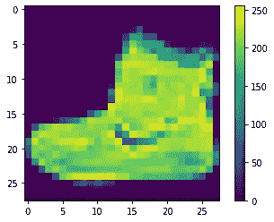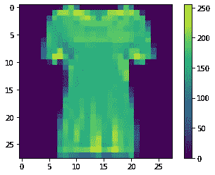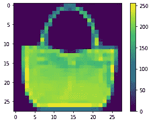

来自时尚 MNIST 数据集的随机图片(图片由作者提供)

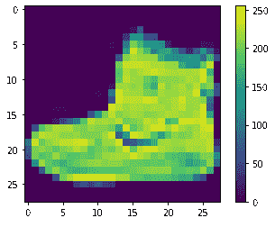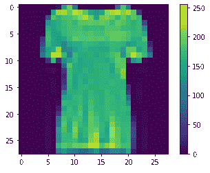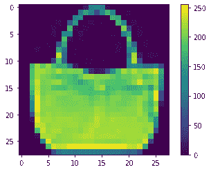

显示了对来自**时尚 MNIST** 数据集的图像进行标准化后完成的各种**数据扩充**(图片由作者提供)

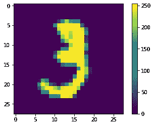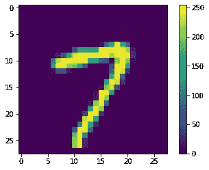

来自 MNIST 数据集的随机影像(图片由作者提供)

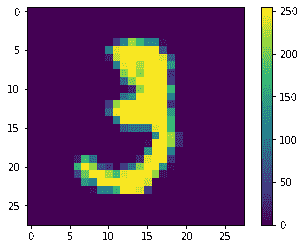

显示了对来自 **MNIST** 数据集的图像进行标准化后完成的各种**数据扩充**(图片由作者提供)

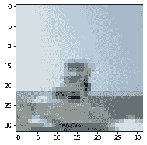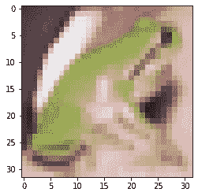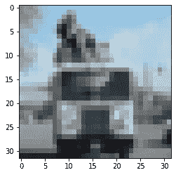

来自 CIFAR 10 数据集的随机图像(图片由作者提供)

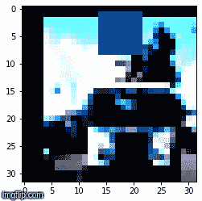

显示了对来自 **CIFAR 10** 数据集的图像进行标准化后完成的各种**数据扩充**(图片由作者提供)

**预计算:**

训练时应用的增强会减慢训练过程。比方说，当一批图像被分配给模型时，首先需要对图像进行增强。在此期间，GPU 处于空闲状态，其大部分容量都没有得到充分利用。

因此，我们将计算我们计划训练的时期数的所有数据扩充，并将所有数据变化存储为张量流记录。即使当数据很大时，计算增加也需要时间，但是一旦存储为 [tf 记录](https://www.tensorflow.org/tutorials/load_data/tfrecord)，它就可以从磁盘加载到流中，而不会导致任何延迟。

这样，我们从总的训练时间中去掉了用于增强的时间，这是一个很大的时间量。下面的代码读写 tf 记录。

读取和写入增强图像(由作者编写代码)

现在，我们已经完成了模型和数据优化。但这仍不足以取得我们想要的结果。为了更快地收敛，我们需要再优化一个参数，那就是优化器和学习率调度器。

## 学习率

我们将对 25 个时期使用一个周期策略。下面是学习率计划图表。

培训的一个周期学习率(图片由作者提供)

更快收敛的原因在下面的 gif 中有解释。

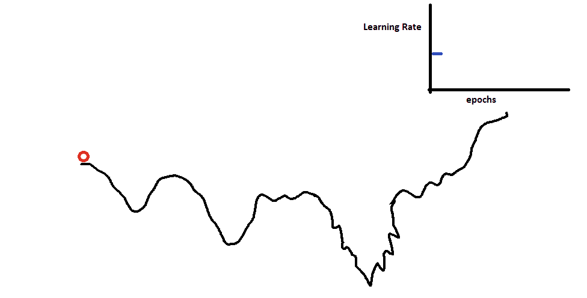

用变化的学习率技术寻找最小值的梯度下降直觉

要开发背后的直觉，可以观察上面这张 gif。最高精度是我们能找到的最低可能的最小值。恒定的学习速率将有助于找到可能不是最佳的最小值。因此，为了找到最佳最小值，我们首先给算法提供动量。这将允许它跳出局部最小值。然后，我们逐渐降低学习率，假设此时它处于全局最小值部分而不是局部最小值部分。降低学习率将有助于它在底部稳定下来，如上面的 gif 所示。

现在，我们已经准备好训练模型，并记录时间和精度。

## **训练**

我们在所有 3 个数据集上训练 25 个时期。这些是统计数据:

这项实验的结果(作者)

我们可以观察到，在给定时间和资源约束的情况下，我们能够实现非常好的精度，这与所有 3 个数据集的 SOTA 精度相差不远。

所有三个数据集的准确性和损失图表如下所示。

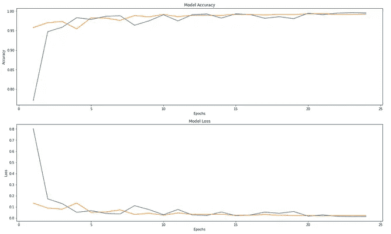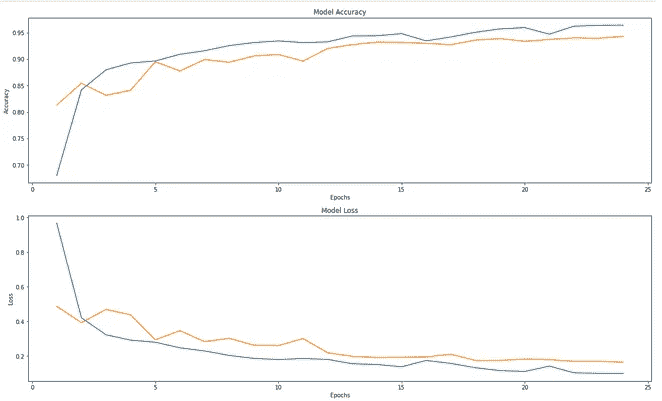

**MNIST** (左)**时尚 MNIST** (中) **CIFAR 10** (右)的精度和损耗曲线(图片由作者提供)

最后，我们还想知道我们的模型是否稳健。为了做到这一点，我们将看到热图，通过将它从最后几层切片出来，看看图像的哪一部分，神经元在做出预测之前更活跃。

## 热图的可解释性

在下图中，针对两种场景(一种没有数据扩充，另一种有数据扩充)呈现了通过训练模型运行的所有图像的热图。没有数据增强时精度较低，如下图所示，使用数据增强技术进行预测时，模型会查看影像中更符合逻辑的部分。从而使模型更一般化并有助于更快收敛。

**CIFAR 10**的热图，了解模型在哪里进行预测(图片由作者提供)

同样的实验也可以在其他数据集上进行。虽然这可能不适用于具有较大图像大小的较大数据集，但对于较小的数据集(如本实验中使用的数据集)来说，这种方法效果最佳。这可以用作进一步优化和获得更高精度的基础案例。

在本文中，我们从一个小而有效的剩余网络开始，探索了各种加快训练和收敛的技术，最大限度地提高 GPU 使用率的有效数据扩充技术，以及一个周期学习率策略。结合所有这些，我们能够在 1000 秒和 25 个时期内利用公开可用的资源实现接近 SOTA 的精度。最后，我们评估热图以了解模型的可解释性以及模型是否足够一般化。