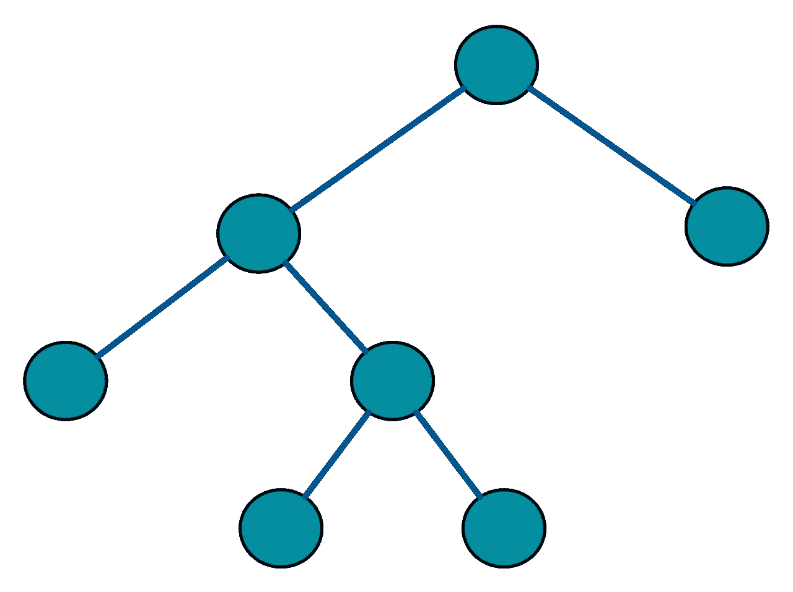
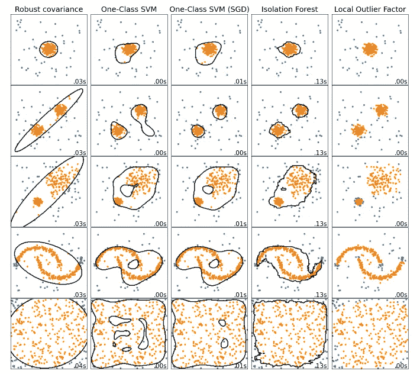

# 这些数据‘正常’吗？机器学习中的异常和异常值

> 原文：<https://towardsdatascience.com/are-these-data-normal-anomalies-outliers-in-machine-learning-a259bbe58690>

## 使用 Python 深入研究隔离森林


鲁珀特·布里顿在 [Unsplash](https://unsplash.com/s/photos/odd?utm_source=unsplash&utm_medium=referral&utm_content=creditCopyText) 上的照片

微积分笑话大多是衍生的，三角学笑话太图形，代数笑话通常公式化，算术笑话相当基础。

*但偶尔的统计笑话是一个异数。*

没有人希望他们的数据中有异常值——尤其是当这些异常值来自于由于大拇指造成的虚假条目时。几个零可能会打乱算法，破坏汇总统计数据。

所以这就是你如何使用机器学习来删除那些讨厌的离群值。

# 什么是正常？

从历史上看，异常检测的第一步是尝试并理解什么是“正常”，然后找到“不正常”的例子。这些“不正常”的点就是我们归类为异常值的点——即使在它的最远端，它们也不符合我们的预期分布。

隔离森林，或 iForest，一个优雅而美丽的想法，不要遵循这种方法。背后的前提很简单。最初的作者和 iForests 的发明者表示，离群值或异常值是“T8”很少并且“T9”不同于其他人群的数据点。

他们进一步指出，“*少且不同的*数据点具有一种被称为“*隔离*的特征”。

似乎合乎逻辑。

# 它是如何工作的？

隔离森林算法通过隔离实例*来工作，而*不依赖于任何距离度量。他们结合使用了之前针对异常现象规定的两种特征——异常现象既少又不同。

该算法利用了[二叉树结构](https://en.wikipedia.org/wiki/Binary_tree)。它们是递归结构，每个节点最多有**两个子节点。**



[https://en . Wikipedia . org/wiki/Binary _ tree #/media/File:Full _ Binary . SVG](https://en.wikipedia.org/wiki/Binary_tree#/media/File:Full_binary.svg)

这是重要的一点。

由于离群值容易被隔离，所以离群值更可能位于树根附近——隔离它们需要较少的分区。


由作者创建

因此，*路径长度*较短的点很可能是异常值。iForest 算法构建了一个 iTrees 集合(看起来很熟悉吧？)然后平均路径长度。


[https://cs . nju . edu . cn/Zhou zh/Zhou zh . files/publication/tkdd 11 . pdf](https://cs.nju.edu.cn/zhouzh/zhouzh.files/publication/tkdd11.pdf)—路径长度是必须遍历的边数。


[https://cs . nju . edu . cn/Zhou zh/Zhou zh . files/publication/tkdd 11 . pdf](https://cs.nju.edu.cn/zhouzh/zhouzh.files/publication/tkdd11.pdf)

正如你从上面的[原始作者的](https://cs.nju.edu.cn/zhouzh/zhouzh.files/publication/tkdd11.pdf)图片中看到的，我们的眼睛清楚地告诉我们，一个离群点需要更少的分割来隔离。路径长度收敛于小于明显不是异常值的点的一半长度。

# 它与其他异常检测算法相比如何？

首先，使用 iForest 有很多好处。这里有一些例子。

*   iForest 可以利用子采样，因此它具有较低的线性时间复杂度和较小的内存需求。
*   它可以处理淹没和掩蔽的影响。
*   适用于高维问题。
*   适用于不相关的属性。
*   在没有包含异常(无监督)的训练集的情况下工作。

但 iForest 如此出色的主要原因是它是为这项工作而设计的。许多同行的情况并非如此。单类 SVM 和大多数聚类方法等算法是为其他目的而设计的。它们适合异常检测，但仍然不是为此目的而创建的。

不同异常检测算法的全面比较可以在这里看到[。](https://scikit-learn.org/stable/modules/outlier_detection.html#isolation-forest)

仅从这张照片，我就知道我喜欢用哪一张。



[https://sci kit-learn . org/stable/modules/outlier _ detection . html # isolation-forest](https://scikit-learn.org/stable/modules/outlier_detection.html#isolation-forest)

# 下面是它在 Python 中的工作方式

用 Python 运行很简单。如您所见，只有 30 行左右的代码可以得到预测。

由作者创建

你所要做的就是导入包和数据。然后，在运行和拟合模型之前，将其转换为 Numpy 数组。然后，您可以将其转换回 pandas 数据框架，并对其运行 value_counts 方法，这将告诉您有多少异常值。从我使用的数据集，该算法挑选了 148 个离群值，然后将其赋值为-1。

然后，您可以将其合并回原始数据框架，并使用您选择的绘图包来查看它预测的异常值。

我希望这一切都有意义，并快乐(离群)狩猎。

干杯，

詹姆斯

```
If I’ve inspired you to join medium I would be really grateful if you did it through this [link](https://jamesasher4994.medium.com/membership) — it will help to support me to write better content in the future.If you want to learn more about data science, become a certified data scientist, or land a job in data science, then checkout [365 data science](https://365datascience.pxf.io/c/3458822/791349/11148) through my [affiliate link.](https://365datascience.pxf.io/c/3458822/791349/11148)
```

如果你喜欢这个，这里还有一些我的文章。

[](/econometrics-is-the-original-data-science-6725d3f0d843) [## 计量经济学是原始的数据科学

### 这就是你应该多了解它的原因

towardsdatascience.com](/econometrics-is-the-original-data-science-6725d3f0d843) [](/how-to-easily-show-your-matplotlib-plots-and-pandas-dataframes-dynamically-on-your-website-a9613eff7ae3) [## 如何轻松地在你的网站上动态显示你的 Matplotlib 图和 Pandas 数据框。

### 这是一种令人惊讶的简单方法，可以在线向全世界展示您的图表和数据框架，而且不到…

towardsdatascience.com](/how-to-easily-show-your-matplotlib-plots-and-pandas-dataframes-dynamically-on-your-website-a9613eff7ae3) [](/how-to-make-a-free-serverless-interactive-dashboard-in-minutes-e6ce5a1088e0) [## 如何在几分钟内制作一个免费的、无服务器的交互式仪表板

### 我向你保证，你可以像做一个标准的可视化一样快地制作这个仪表板…

towardsdatascience.com](/how-to-make-a-free-serverless-interactive-dashboard-in-minutes-e6ce5a1088e0)