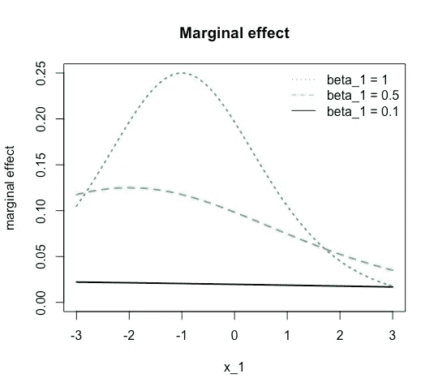
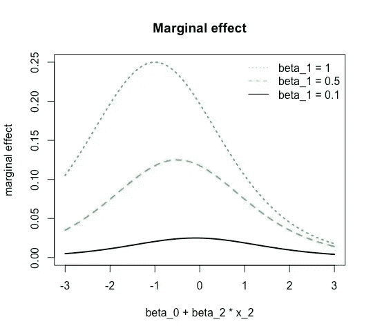

# 你对逻辑回归的解释正确吗？

> 原文：<https://towardsdatascience.com/are-you-interpreting-your-logistic-regression-correctly-d041f7acf8c7>

## 回归系数本身并不能告诉你你需要知道什么

> 逻辑回归总是因其可解释性而受到称赞，但在实践中却经常被误解。在这些情况下，通常假设逻辑模型中的系数与多元线性回归模型中的系数工作方式相同。但事实并非如此。下面，我们将详细了解逻辑回归的正确解释以及影响特征效果的机制。

大卫·罗克斯比·考克斯在【1958 年的论文中引入了逻辑回归来模拟二元结果。今天，它被广泛应用于医学研究、社会科学，当然还有数据科学。当数据科学家开始一个新的分类项目时，逻辑回归往往是我们尝试的第一个模型。我们用它来感受最重要的特征和依赖的方向。之后，如果我们想要获得性能，我们可能会切换到一个不太容易解释的分类器，如梯度增强树或随机森林，或者如果对我们的利益相关者来说能够对模型进行推理是重要的，我们可能会坚持使用逻辑回归。

**大卫·罗克斯比·科克斯发明了用于生存分析的逻辑回归和比例风险模型(以他的名字命名为 Cox 回归)。来源:** [**维基共享资源**](https://commons.wikimedia.org/wiki/File:Nci-vol-8182-300_david_cox.jpg) **。**

在线性回归模型中，系数 **β** 告诉您当特征改变一个单位时，因变量改变多少个单位。这种变化不依赖于其他特征或其他系数的值，并且系数本身的水平直接描述了变化的幅度。相比之下，在逻辑模型中，因变量对特征变化的响应是一个函数，它取决于特征本身的值、其他特征的值以及模型中的所有其他系数！

让我们考虑一个具有两个特征的简单模型的例子。在线性模型中，预测 **ŷᵢ** 只是特征值和系数的加权和。为了简化符号，我们将这个加权和缩写为 **μᵢ = β₀ + β₁ x₁ᵢ + β₂ x₂ᵢ** 。逻辑回归使用相同的加权和 **μᵢ** ，但是将逻辑函数**λ(x)= exp(x)/【1+exp(x)】**包裹在它周围，因此所有预测都在 0 和 1 之间，并且可以解释为概率。

**线性回归** : **ŷᵢ= μᵢ**
**逻辑回归**:**ŷᵢ=λ(μᵢ)**

一般来说，系数被解释为因变量的变化，这种变化发生在特征的值有小的变化而所有其他特征保持不变的时候。数学上这意味着我们要考虑偏导数。那么下面是两个模型相对于第一个系数的偏导数 **β₁:**

**线性回归**:**∂ŷᵢ/∂x₁ᵢ=β₁**
**logistic 回归**:**∂ŷᵢ/∂x₁ᵢ=λ(μᵢ)[1-λ(μᵢ】**

可以看出，**β\88857;**本身就是线性回归模型中的偏导数。这里没有并发症。与此相反，与系数值 **β₁** 相关的逻辑回归中的边际效应取决于 **μᵢ** 并因此取决于 **x₁ᵢ** 、 **β₂** 和 **x₂ᵢ** 。

由于**λ(μᵢ)**和**【1-λ(μᵢ】**都是非负的，因此 **β₁** 的符号决定了边际效应的符号。因此，我们可以从多元线性回归中解释 logistic 模型中特征的影响方向。只有 **β₁** 的大小不能直接解读。

要了解 **x₁ᵢ** 的变化对预测结果的影响有多大，取决于 **x₁ᵢ** 本身的水平，**t51】看一下**图 1** ，下面显示的是 **x₁ᵢ** 对 **β₁** 保持 **β₀、**和 **x₂ᵢ** 恒定在 **1** 的不同值的边际影响在多元线性回归模型中，边际效应与水平无关，因此所有三条线在相应系数的水平上只是一条水平线。相反，我们看到影响的大小要小得多。例如，蓝色曲线的最大值在 **0.25 处，**即使系数 **β₁=1** 。此外，系数越大，非线性越明显。**

**图 1:x₁的边际效应取决于特征值。图片由作者提供。**

下面的图 2 说明了边际效应对其他特征的系数和值的依赖性。这一次，我们保持 **x₁ᵢ=1** ，但是改变总和 **β₀ + β₂ x₂ᵢ.的值**如前所述，我们可以观察到明显的非线性。

**图 2:x₁的边际效应取决于系数和其他特征的总和。图片由作者提供。**

为了更深入地了解逻辑回归的解释，请记住 **ŷᵢ** 是对 **yᵢ** 的预测，因此意味着 **ŷᵢ** 给出了 **yᵢ=1** 的概率。方程式**ŷᵢ=λ(μᵢ)**可以反过来看

μᵢ=λ⁻(ŷᵢ)= ln(ŷᵢ/(1-ŷᵢ)).

这意味着逻辑回归暗示了在 **μᵢ** 的特征和**ŷᵢ/(1-ŷᵢ**的比值比的对数之间的线性关系。

因此， **μᵢ** 中的 **x₁ᵢ** 和 **x₂ᵢ** 对对数概率(也称 logits)的影响直接由系数 **β₁** 和 **β₂.给出不幸的是，对数几率对人类来说有点不直观——所以这并没有提供一个很好的解释基础。**

# 如何做好:平均边际效应和平均边际效应

基于**∂ŷᵢ/∂x₁ᵢ=λ(μᵢ)[1-λ(μᵢ)】β₁**与 **μᵢ = β₀ + β₁ x₁ᵢ + β₂ x₂ᵢ** 有两种方法可以量化**x≯1**的边际效应。第一个是在 **x₂ᵢ.的平均值上评估导数**这是样本均值的边际效应。这个想法可以随意扩展到任何一组被认为有代表性的值的边际效应——例如中位数或聚类平均值。或者，可以计算样本中每个观察值的偏导数，并报告以这种方式获得的平均值。这是平均边际效应。这两种方法都是有效的——在足够大的样本中，它们应该给出非常相似的结果。

确定边际效应的方法很容易获得——例如 R 中的 [margins](https://cran.r-project.org/web/packages/margins/vignettes/Introduction.html) 包或 Python 中的 [statsmodels](https://www.statsmodels.org/devel/generated/statsmodels.discrete.discrete_model.LogitResults.get_margeff.html) 和 [sklearn](https://scikit-learn.org/stable/modules/generated/sklearn.inspection.partial_dependence.html#sklearn.inspection.partial_dependence) 。不幸的是，我无法在 pyspark.ml 中找到实现。

值得一提的一个特例是当一个或多个特征是虚拟变量(或一位热编码)时。在这种情况下，关于特征的导数 **∂ ŷᵢ / ∂ x₁ᵢ** 没有被很好地定义。在这种情况下，我们想要使用的是特征取值 1 时的预测结果与取值 0 时的预测结果之间的差异。如前所述，这可以在保持其他特征处于其平均值的同时进行计算，或者可以在取平均值之前对每个观察值进行计算。

在实践中，我们经常使用部分相关图、累积局部效应、LIME 或 Shapley 值等工具来更好地理解和解释我们的模型。这些都是模型不可知的，也适用于逻辑回归——尽管有人可能会认为其中一些对于可以通过边际效应直接解释的东西来说是多余的。然而，这些工具中的每一个都给出了对模型的不同理解，因此它们都可以增强我们的理解。如果不同的模型解释方法对某些特征的作用给出了不同的指示，这通常是特别有启发性的。

我个人真的很喜欢边际效应，因为它们给你一个很好的总结，你的每个功能的效果，即使你使用更复杂的转换，如平方项和与其他功能的相互作用。在这些情况下，只有我们同时考虑多个特征，才能解释原始变量的影响。在这种情况下，边际效应延伸得很好。例如，如果我们包含一个平方项，那么 **μᵢ = β₀ + β₁ x₁ᵢ + β₂ x₁ᵢ** 我们就有**∂ŷᵢ/∂x₁ᵢ=λ(μᵢ)[1-λ(μᵢ)】(β₁+2β₂x₁ᵢ)**。等式可能有点大，但在实践中，我们仍然可以看到 x₁ᵢ对ŷᵢ的影响的一个数字总结。

这就是我们关于多元线性回归和逻辑回归中系数解释之间关系的完整循环。简单地将逻辑回归模型的系数解释为边际效应是不正确的，就像我们在多元线性回归模型中所做的一样。但是在实践中，事情很快变得更加复杂，因为你的模型很可能包含多项式项和相互作用项。在这种情况下，多元线性回归和逻辑回归的处理方式是相同的——我们必须计算边际效应来解释它们。

**参考文献:**

W.H. Greene (2012 年):计量经济学分析，第 7 版，皮尔森教育。

T.Hastie，R. Tibshirani 和 J. Friedman (2009):统计学习的要素，第二版，Springer Science+Business Media。

   