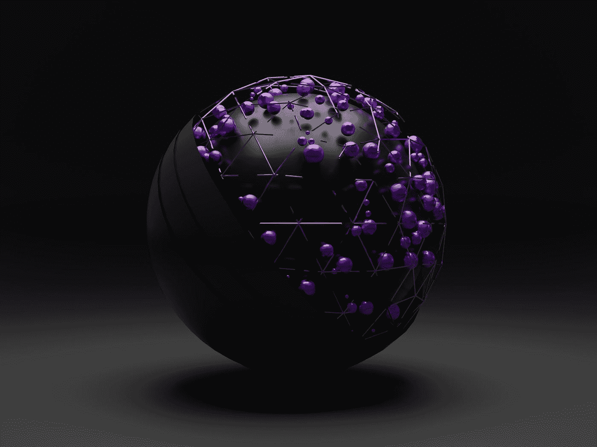
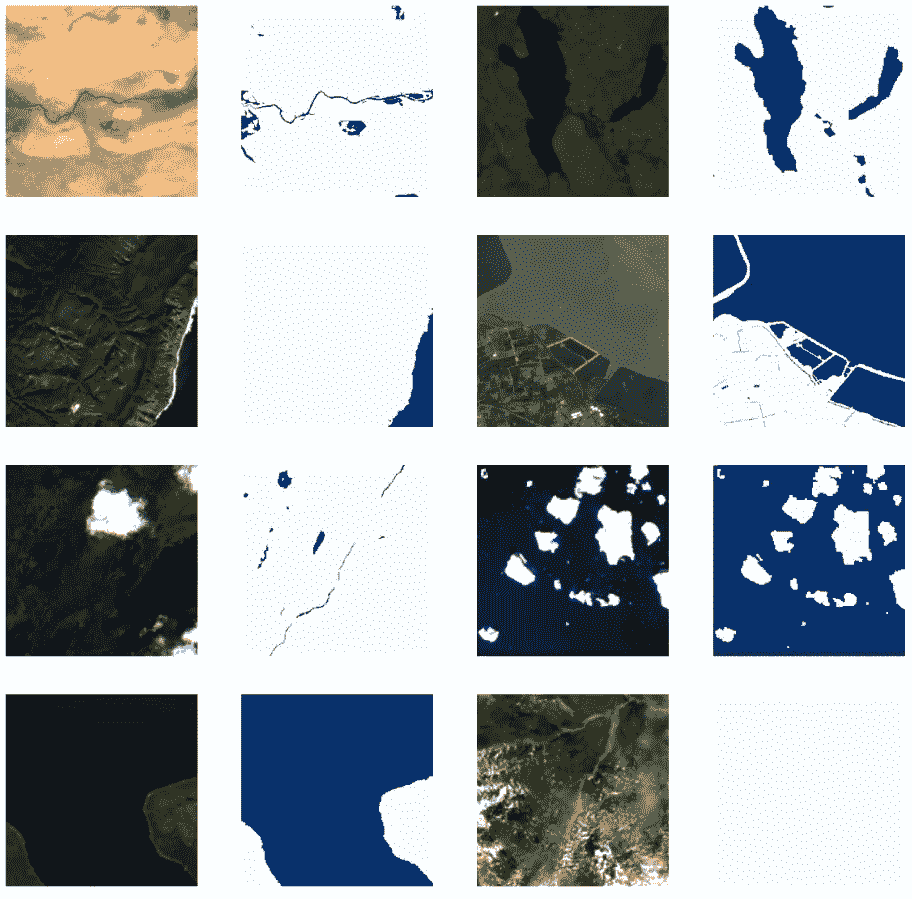

# 使用 Pytorch 的 TorchGeo 进行地理空间分析的人工智能(第 2 部分)

> 原文：<https://towardsdatascience.com/artificial-intelligence-for-geospatial-analysis-with-pytorchs-torchgeo-part-2-ec3785fae284>

## 使用 Pytorch 和 TorchGeo 包的端到端深度学习地理空间分割项目



照片由 [Unsplash](https://unsplash.com?utm_source=medium&utm_medium=referral) 上的 [Shubham Dhage](https://unsplash.com/@theshubhamdhage?utm_source=medium&utm_medium=referral) 拍摄

# 介绍

在前面的故事中(第 1 部分—这里是)，我们看到了如何使用 TorchGeo 创建一个`RasterDataset` 并使用一个`RandomSampler` 从中绘制补丁。在当前的故事中，我们进一步将图像和遮罩连接成一个`IntersectionDataset`，用训练补丁(图像)和相应的标签(水遮罩)绘制元组。

所以让我们开始吧。

# 数据集

我们将复制前面故事中的代码，只是为了在 Colab 中准备好环境。在此之后，我们将遵循与创建图像的`RasterDataset` 相同的过程，为遮罩创建数据集。我们需要注意的一点是通知`RasterDataset` 班，我们的面具不是“图像”。这样，当从掩膜数据集中提取样本时，它将返回带有“掩膜”键的数据，而不是通常在图像中使用的“图像”键。请注意，从我们的要点输出的代码显示了每个示例的键。

> OBS:与前一个故事的另一个不同之处是，我们将一个转换函数传递给图像数据集，以将值正确地缩放为反射率值(除以 10，000)。

此外，我们可以检查边界框是否相同，因此两个样本来自相同的地理区域。

一旦我们设置了两个数据集(图像和掩膜)，我们就可以以一种非常方便的方式将两者结合起来，就像这样:

```
train_dset = train_imgs & train_msks
```

现在，当我们从这个新的数据集中提取样本时，产生的目录应该有一个包含图像数据(已经缩放了 10，000)的条目和一个包含遮罩的条目。

```
sample = train_dset[bbox]
sample.keys()

output:
dict_keys(['image', 'crs', 'bbox', 'mask'])
```

# 数据加载器

在 TorchGeo 中创建一个`DataLoader` 非常简单，就像用 Pytorch 一样(我们实际上使用的是同一个类)。请注意，我们还使用了已经定义的同一个采样器。此外，我们通知 dataloader 将用来提取数据的数据集、batch_size(每个批次中的样本数)和 collate 函数，该函数指定如何将多个样本“连接”成一个批次。

最后，我们可以通过 dataloader 进行迭代，从中获取批处理。为了测试它，我们将得到第一批。

```
dataloader = DataLoader(dset_train, sampler=sampler, batch_size=8, collate_fn=stack_samples)
batch = next(iter(dataloader))
batch.keys()

output:
dict_keys(['image', 'crs', 'bbox', 'mask'])
```

# 批量可视化

既然我们可以从数据集中提取批次，那么让我们创建一个函数来显示批次。

函数 plot_batch 将自动检查批次中的项目数量，以及是否有相关的掩码来相应地排列输出网格。

```
from typing import Iterable, List
import torch

def plot_imgs(images: Iterable, axs: Iterable, chnls: List[int] = [2, 1, 0], bright: float = 3.):
    for img, ax in zip(images, axs):
        arr = torch.clamp(bright * img, min=0, max=1).numpy()
        rgb = arr.transpose(1, 2, 0)[:, :, chnls]
        ax.imshow(rgb)
        ax.axis('off')

def plot_msks(masks: Iterable, axs: Iterable):
    for mask, ax in zip(masks, axs):
        ax.imshow(mask.squeeze().numpy(), cmap='Blues')
        ax.axis('off')

def plot_batch(batch: dict, bright: float = 3., cols: int = 4, width: int = 5, chnls: List[int] = [2, 1, 0]):

    # Get the samples and the number of items in the batch
    samples = unbind_samples(batch.copy())

    # if batch contains images and masks, the number of images will be doubled
    n = 2 * len(samples) if ('image' in batch) and ('mask' in batch) else len(samples)

    # calculate the number of rows in the grid
    rows = n//cols + (1 if n%cols != 0 else 0)

    # create a grid
    _, axs = plt.subplots(rows, cols, figsize=(cols*width, rows*width))  

    if ('image' in batch) and ('mask' in batch):
        # plot the images on the even axis
        plot_imgs(images=map(lambda x: x['image'], samples), axs=axs.reshape(-1)[::2], chnls=chnls, bright=bright) #type: ignore

        # plot the masks on the odd axis
        plot_msks(masks=map(lambda x: x['mask'], samples), axs=axs.reshape(-1)[1::2]) #type: ignore

    else:

        if 'image' in batch:
            plot_imgs(images=map(lambda x: x['image'], samples), axs=axs.reshape(-1), chnls=chnls, bright=bright) #type: ignore

        elif 'mask' in batch:
            plot_msks(masks=map(lambda x: x['mask'], samples), axs=axs.reshape(-1)) #type: ignore
```

现在，绘制我们的批次:

```
plot_batch(batch)
```



代码输出:作者的图片。

# 数据规范化(标准化)

通常，机器学习方法(包括深度学习)受益于特征缩放。这意味着在 1 和零均值附近的标准偏差，通过应用以下公式(实际上归一化不同于标准化，但我将把解释留给读者:[https://www . nau kri . com/learning/articles/normalization-and-standardization/](https://www.naukri.com/learning/articles/normalization-and-standardization/)):


为此，我们需要首先找到数据集中每个 6s 通道的平均值和标准差。

让我们定义一个函数来计算这些统计数据，并将结果写入变量`mean`和`std`。我们将使用之前安装的 rasterio 包打开图像，并对每个批次/通道的统计数据进行简单平均。对于标准差，这种方法是一种近似方法。更精确的计算请参考:[http://notmatthancock . github . io/2017/03/23/simple-batch-stat-updates . htm](http://notmatthancock.github.io/2017/03/23/simple-batch-stat-updates.html)。

```
import rasterio as rio

def calc_statistics(dset: RasterDataset):
        """
        Calculate the statistics (mean and std) for the entire dataset
        Warning: This is an approximation. The correct value should take into account the
        mean for the whole dataset for computing individual stds.
        For correctness I suggest checking: http://notmatthancock.github.io/2017/03/23/simple-batch-stat-updates.html
        """

        # To avoid loading the entire dataset in memory, we will loop through each img
        # The filenames will be retrieved from the dataset's rtree index
        files = [item.object for item in dset.index.intersection(dset.index.bounds, objects=True)]

        # Reseting statistics
        accum_mean = 0
        accum_std = 0

        for file in files:
            img = rio.open(file).read()/10000 #type: ignore
            accum_mean += img.reshape((img.shape[0], -1)).mean(axis=1)
            accum_std += img.reshape((img.shape[0], -1)).std(axis=1)

        # at the end, we shall have 2 vectors with lenght n=chnls
        # we will average them considering the number of images
        return accum_mean / len(files), accum_std / len(files)

mean, std = calc_statistics(train_imgs)
print(mean, std)

code output:
[0.0771449  0.09890421 0.09758993 0.22216185 0.1854808  0.13288888] [0.04496952 0.05038998 0.06053346 0.10840577 0.0993342  0.08219175]
```

这里每个列表中有 6 个值。现在，每当数据加载器创建一个批处理并传递给训练器时，我们必须使用这些值来规范化这些值。此外，如果我们想可视化这一批，我们需要“恢复”标准化，否则真实的颜色将是不正确的。然后我们将创建一个类来完成这个任务。我们将从`torch.nn.Module`类继承它，并定义`forward` 方法和 revert 方法来“撤销”规范化。

```
class MyNormalize(torch.nn.Module):
    def __init__(self, mean: List[float], stdev: List[float]):
        super().__init__()

        self.mean = torch.Tensor(mean)[:, None, None]
        self.std = torch.Tensor(stdev)[:, None, None]

    def forward(self, inputs: dict):

        x = inputs["image"][..., : len(self.mean), :, :]

        # if batch
        if inputs["image"].ndim == 4:
            x = (x - self.mean[None, ...]) / self.std[None, ...]

        else:
            x = (x - self.mean) / self.std

        inputs["image"][..., : len(self.mean), :, :] = x

        return inputs

    def revert(self, inputs: dict):
        """
        De-normalize the batch.

        Args:
            inputs (dict): Dictionary with the 'image' key
        """

        x = inputs["image"][..., : len(self.mean), :, :]

        # if batch
        if x.ndim == 4:
            x = inputs["image"][:, : len(self.mean), ...]
            x = x * self.std[None, ...] + self.mean[None, ...]
        else:
            x = x * self.std + self.mean

        inputs["image"][..., : len(self.mean), :, :] = x

        return inputs 
```

一旦定义了类，我们就可以用从我们的数据集获得的`mean` 和`std` 值来实例化它，并测试正向传递和反向传递(代码输出已被抑制)。

```
normalize = MyNormalize(mean=mean, stdev=std)
norm_batch = normalize(batch)
plot_batch(norm_batch)

batch = normalize.revert(norm_batch)
plot_batch(batch)
```

# 光谱指数

为了提高我们的神经网络的性能，我们将执行一些特征工程，并给出其他光谱指数作为输入，如 NDWI(归一化差异水指数)、MNDWI(修正的 NDWI)和 NDVI(归一化差异植被指数)。

TorchGeo 让我们更容易向原始数据集追加索引。为此，我们将使用转换模块，如下所示:

```
from torchgeo.transforms import indices

ndwi_transform = indices.AppendNDWI(index_green=1, index_nir=3)

transformed_batch = ndwi_transform(batch)
print(transformed_batch['image'].shape, transformed_batch['mask'].shape)

code output: 
torch.Size([8, 7, 512, 512]) torch.Size([8, 1, 512, 512])
```

请注意，我们现在在图像中有 7 个通道，而不是 6 个通道，因为我们附加了 NDWI 索引。

现在，我们可以将所有需要的转换组合成一个顺序对象。请注意，我们将把归一化作为最后的变换，因为光谱指数应该直接与原始反射率一起工作。

```
tfms = torch.nn.Sequential(
    indices.AppendNDWI(index_green=1, index_nir=3),
    indices.AppendNDWI(index_green=1, index_nir=5),
    indices.AppendNDVI(index_nir=3, index_red=2),
    normalize
)

new_transformed_batch = tfms(batch)
print(batch['image'].shape, batch['mask'].shape)

code output:
torch.Size([8, 10, 512, 512]) torch.Size([8, 1, 512, 512])
```

现在，我们有了一个非常简单的方法来将我们想要的转换应用到我们的原始数据。

> 重要提示:我们创建的 normalize 方法将只对原始波段应用归一化，并忽略之前附加的索引。这对于避免由于批次向量、平均值向量和标准差向量之间的不同形状而导致的错误非常重要。

# 笔记本

我将把这个故事的完整的 Colab 笔记本留在这里:

# 结论

在今天的故事中，我们已经看到了如何通过组合原始数据集中的图像和遮罩来创建 IntersectionDataset。此外，我们看到了如何使用神经网络。向原始数据追加转换。这些也可以用来添加扩充，但是这是一个更高级的主题，不在本系列中讨论。

在下一个故事中，我们将创建训练循环、损失函数，并检查我们新创建的深度神经网络的结果。所以，如果你很好奇，请继续关注我(并考虑通过订阅支持 Medium 和其他作者)。

下一个故事再见。

# 保持联系

*如果你喜欢这篇文章，想支持我当作家，可以考虑成为* [*中等会员*](https://cordmaur.medium.com/membership) *。每月只需 5 美元，我会从你的会员费中收取一小笔佣金，不需要你额外付费。或者你可以随时给我买杯咖啡。*

# 进一步阅读

[](/artificial-intelligence-for-geospatial-analysis-with-pytorchs-torchgeo-part-1-52d17e409f09)  [](/artificial-intelligence-for-geospatial-analysis-with-pytorchs-torchgeo-part-3-7521131f30b1)  [](https://cordmaur.medium.com/membership) 