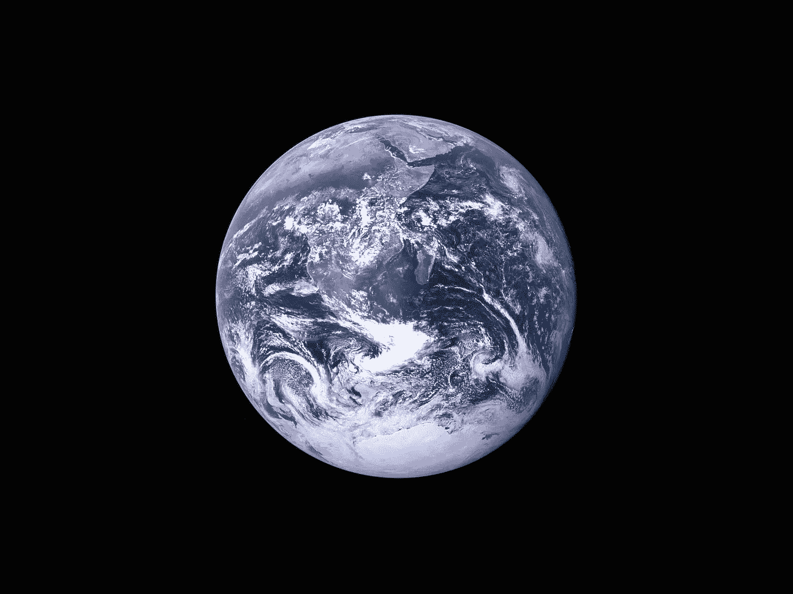
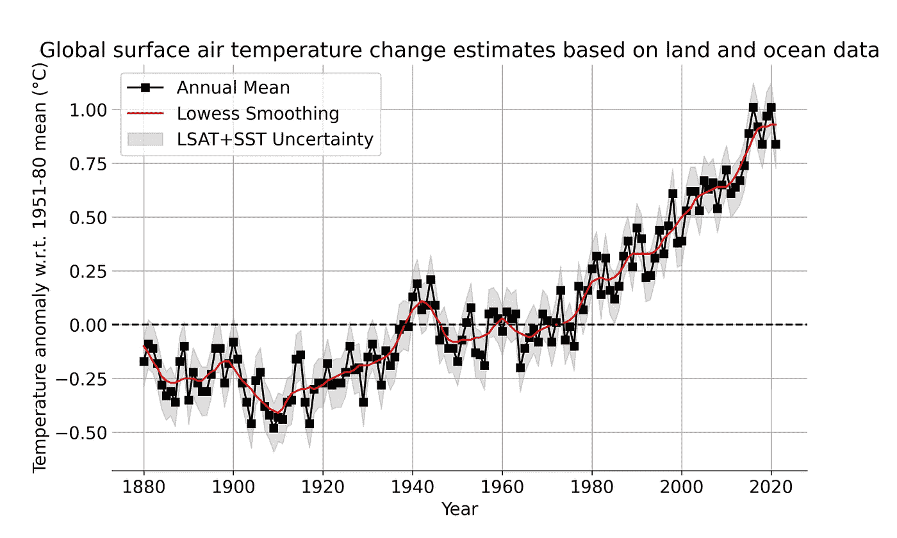
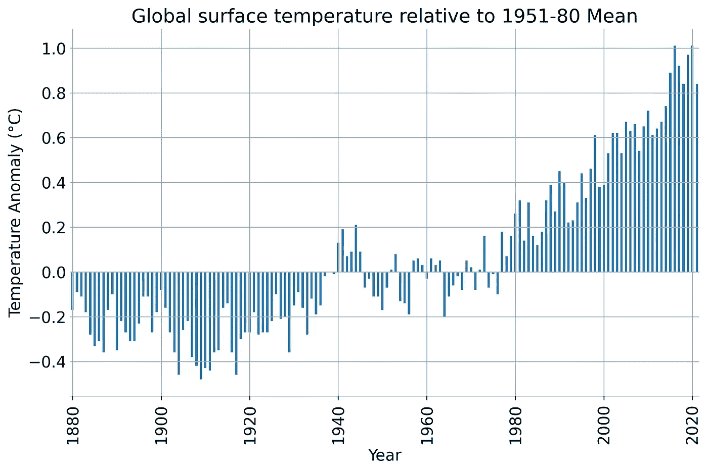
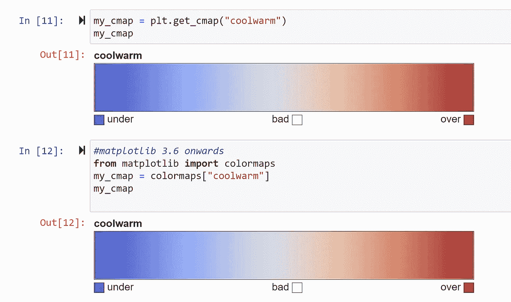
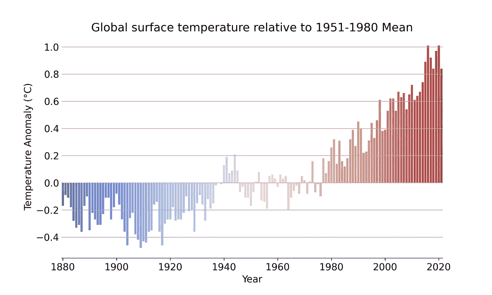
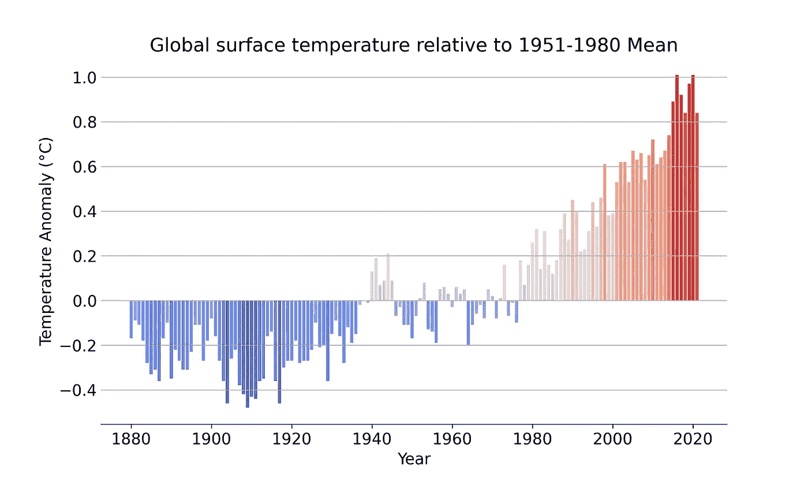
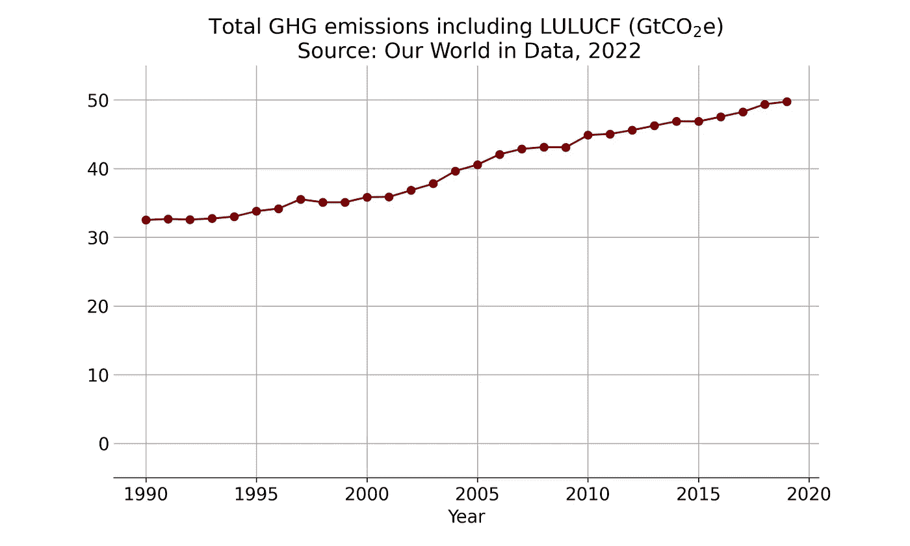
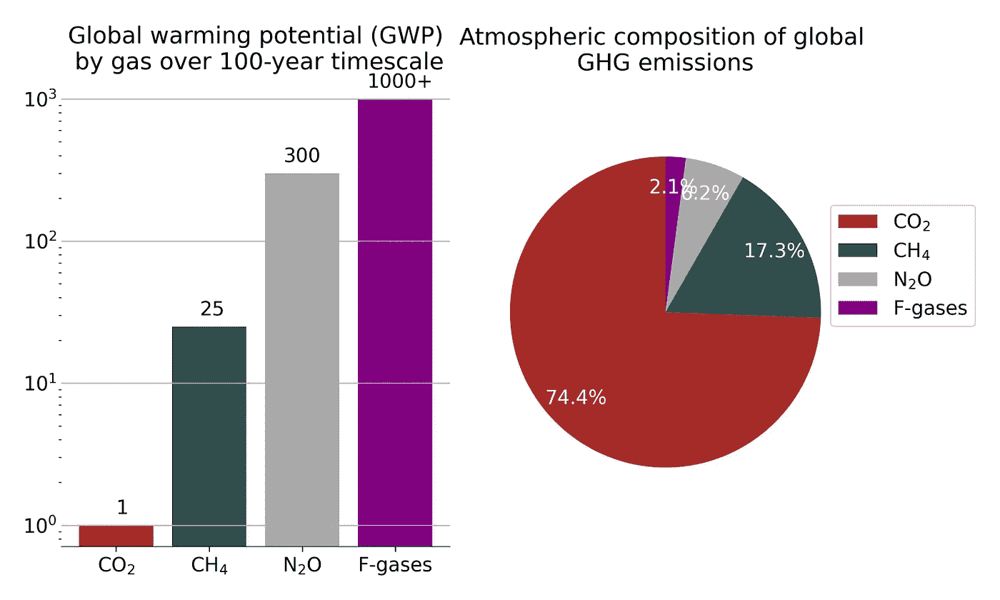
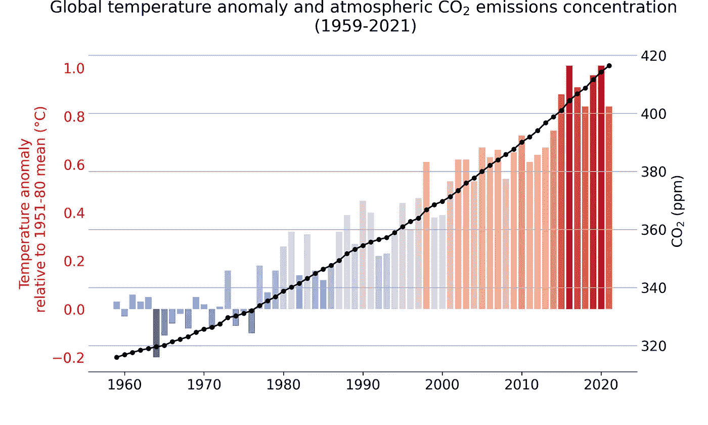

# 利用 NASA 的空间研究评估全球温度异常——第一部分

> 原文：<https://towardsdatascience.com/assessing-global-temperature-anomaly-using-nasas-space-studies-part-i-a4c0c4b825cb>

## 探索历史全球温度异常背后的潜在数据、不确定性和科学

近年来，极端天气事件已经成为一种常态，而不是罕见的事件。2022 年，暴雨引发了巴基斯坦近期历史上最严重的洪水，约 3300 万人流离失所。另一方面，[中国经历了 60 年来最严重的热浪](https://multimedia.scmp.com/infographics/news/china/article/3190803/china-drought/index.html)，加剧了干旱，影响了该国广大地区的粮食生产、工业和基础设施。在夏季，球迷在德国等欧洲国家已经变得司空见惯，而十年前却不是这样。虽然将气温上升归因于全球变暖是正常的，但北极地区的变暖也被[与欧洲和北美的极端冬季天气](https://www.bbc.com/news/science-environment-58425526)联系起来，因为北极变暖扰乱了被称为[极地涡旋](https://www.severe-weather.eu/global-weather/polar-vortex-cooling-forecast-winter-2022-2023-influence-united-states-europe-fa/)的循环风模式。

2020 年，全球气温比工业化前水平高出 **1.2 摄氏度**(气候行动追踪，2021 年)。到本世纪末(2100 年)，这种温度上升预计将达到约。比乐观情景下的工业化前水平高出 1.8 摄氏度，比当前政策下的工业化前水平高出 2.7 摄氏度(气候行动追踪，2021 年)。气候变暖每增加一个小数点，极端天气事件的严重性和频率就会增加。因此，科学家们一致认为，到 2100 年，全球气温上升需要限制在比工业化前水平高 1.5 摄氏度以内，以防止气候系统发生不可逆转的变化(气候行动追踪，2021 年)。

**温度异常**是指在一定的时间和区域内，温度偏离参考值或平均值(美国宇航局 GISS，2022a)。在这篇文章中，我将评估由美国宇航局[戈达德太空研究所(GISS)](https://www.giss.nasa.gov/) 提供的过去 142 年的历史全球温度异常。我将解释温度异常的重要性，美国宇航局如何获得这些数据，以及其中的不确定性。接下来，我将基于 Python 中的 matplotlib 和 seaborn 包，使用不同的可视化技术来呈现数据。最后，我将根据过去 60 年的数据，解释全球气温异常与大气中 CO₂排放浓度的关系。让我们开始吧。



由 [NASA](https://unsplash.com/@nasa) 在 [Unsplash](https://unsplash.com/) 拍摄的地球图像。

## 全球温度异常数据

温度数据对于研究区域和全球天气和气候的模式和趋势非常重要。虽然绝对温度仅在短距离内变化很大，但温度异常与 1000 公里左右的长距离密切相关(美国航天局 GISS，2022b)。这使得估计站间和数据稀疏地区的温度异常更加准确，因此温度异常是研究气候变化的良好指标。

美国宇航局 GISS 地表温度(GISTEMP)分析了从 1880 年到现在遍布全球的规则间隔虚拟站的温度异常。需要一个固定的基期来计算温度异常，即**随时间**保持一致。NASA GISTEMP 使用 1951-80 年作为基期来获得数年、数十年和数百年的长期温度异常。

## 陆地-海洋温度指数(OTI)

位于陆地上的气象站提供覆盖地球三分之一面积的**陆地表面空气温度(lsat)**。**海面温度**可从船只、浮标报告和卫星数据中获得。虽然 sat 和 SST 可能非常不同，但它们的异常非常相似(除非有海冰存在)(NASA GISS，2022a)。陆地-海洋温度指数(L-OTI)绘制了陆地和海冰上的 LSAT 异常，以及无冰水域上的 SST 异常。

从美国宇航局 GISS [网站](https://data.giss.nasa.gov/gistemp/graphs_v4/)(美国宇航局 GISS，2022c 和 Lenssen 等人，2019)开始记录以来，全球年平均表面气温变化(L-OTI 指数)数据可从 1880 年开始获得。我把这个数据读成了熊猫的数据帧`df`:


包含 1880 年至 2021 年全球年平均地面气温数据的数据框架。图片作者。

在给定的数据中，LOWESS 平滑是指从 [**LOWESS**](https://www.statisticshowto.com/lowess-smoothing/) **(局部加权散点图平滑)**获得的数据，Lowess 平滑是一种在回归分析中使用的工具，用于创建通过时间图或散点图的平滑线，并帮助查看变量之间的关系和预测趋势。

## 数据可视化准备

为了获得可视化的一致性，我定制了 matplotlib 的默认 [rc(运行时配置)](https://matplotlib.org/stable/tutorials/introductory/customizing.html)设置，如下所示:

```
*#figure size and font size*
rcParams["figure.figsize"] **=** (10, 6)
rcParams["font.size"] **=** 14

*#grid lines*
rcParams["axes.grid"] **=** **True**
rcParams["axes.grid.axis"] **=** "y"

*#Setting up axes*
rcParams['axes.spines.bottom'] **=** **True**
rcParams['axes.spines.left'] **=** **False**
rcParams['axes.spines.right'] **=** **False**
rcParams['axes.spines.top'] **=** **False**
rcParams['axes.linewidth'] **=** 0.5

*#Ticks*
rcParams['ytick.major.width'] **=** 0
rcParams['ytick.major.size'] **=** 0
```

**线条图**

我首先使用以下代码绘制`df`的线图:

我得到如下的情节结果:



全球年平均地面气温变化线图。图片作者。

在该图中，黑色实线指的是相对于 1951-80 年平均值的全球年平均地表气温变化。红色实线是五年的洛斯平滑。相对于 1951-1980 年的平均值，2020 年的温度异常值为 1.01 摄氏度。1880 年的温度异常值为-0.17 摄氏度。因此，2020 年的全球平均地表气温约为 1.01 摄氏度。比 1880 年(工业化前水平)高 1.2°C。

温度异常数据中存在不确定性，这些不确定性来自测量不确定性、台站记录空间覆盖范围的变化，以及技术转移和土地覆盖变化导致的系统偏差(美国航天局 GISS，2022d)。图中的灰色阴影区域代表 LSAT 和 SST 总异常在 95%置信区间的年度不确定性。

陆地和海洋温度异常的分解可以在下面的图表中观察到。虽然陆地和海洋的温度异常都在增加，但可以观察到，在过去 40 年里，地球陆地的变暖程度远远高于海洋。科学家们一直在研究这种反差背后的原因。


陆地和公海(任何时候都没有冰的海洋部分)温度异常的分解。作者图片

**简单的柱状图**

在这一步中，我使用下面的代码将全球温度异常绘制成一个简单的条形图:

```
df["Annual Mean"].plot(kind = "bar")
years = np.arange(1880, 2022, 20)
plt.xticks(ticks = np.arange(0, 142, 20), labels = years)
plt.title("Global Surface Temperature relative to 1950 to 1980 Mean")
plt.ylabel("Temperature Anomaly (°C)")
plt.show()
```

条形的高度代表年温度异常。从下图中我们可以看出，在 1951-1980 年期间，温度异常平均为零，此后急剧上升。



用简单的条形图表示的全球地面温度异常。作者图片

**使用 seaborn 的调色板绘制条形图**

我想在条形高度旁边的每个条形中表示温度异常。Seaborn 允许使用调色板以非常简单的方式绘制。我使用了一个[发散的](https://matplotlib.org/stable/tutorials/colors/colormaps.html#diverging)色图或调色板，名为“coolwarm”，其中，蓝色端代表冷/冷部分，红色端代表热/暖部分。



在 matplotlib 中选择 coolwarm 色彩映射表。图片作者。

使用的代码和结果图如下所示:

```
sns.barplot(x = df.index, y = df["Annual Mean"],
            palette = "coolwarm")
years = np.arange(1880, 2022, 20)
plt.xticks(ticks = np.arange(0, 142, 20), labels = years)
plt.title("Global Surface Temperature relative to 1950 to 1980 Mean")
plt.ylabel("Temperature Anomaly (°C)")
plt.show()
```



使用 seaborn 和 coolwarm 调色板绘制成条形图的全球地表温度异常。图片作者。

**使用 matplotlib 用颜色图绘制条形图**

上面的图也可以使用 matplotlib 通过额外的步骤重新创建。首先，使用 lambda 函数将温度异常值缩放到 0(最小值)和 1(最大值)之间。所选色彩图(冷温)`my_cmap`包含 255 种组合，其中`my_cmap([0])`指蓝色，`my_cmap([1])`指红色。第二，基于`y`的重新调整值为每个条纹/条选择这些颜色组合。

使用的代码和结果图如下所示:

```
x = df.index.tolist()
y = df["Annual Mean"].values.tolist()#rescale y between 0 (min) and 1 (max)
rescale = lambda y: (y - np.min(y)) / (np.max(y) - np.min(y))
plt.bar(x, y, color = my_cmap(rescale(y)), width = 0.8)years = np.arange(1880, 2022, 20)
plt.xticks(ticks = years, labels = years)
plt.title("Global surface temperature relative to 1951-1980 Mean")
plt.ylabel("Temperature Anomaly (°C)"); plt.xlabel("Year")
plt.show()
```



使用 matplotlib 和 coolwarm 色彩图绘制成条形图的全球地表温度异常。图片作者。

## 温暖条纹

2019 年，英国雷丁大学的 Ed Hawkins 教授首次引入了变暖条纹，以一种非常简单简洁的方式来代表全球或区域变暖。变暖的条纹显示了近两个世纪以来平均气温是如何按时间顺序上升的。

我将重现变暖的条纹，每个条纹代表相对于 1951-1980 年平均值的全球气温异常。我把年平均温度异常读成了熊猫系列`anomaly`，并设置了图形和坐标轴。接下来，我使用矩形补丁为 1880 年到 2021 年间的每一年创建了统一的条纹。`anomaly`数据被提供给面片集合`col`，并被添加到轴`ax`。


基于使用上述代码创建的全球温度异常年值的变暖条纹。图片作者。

与上图中使用的色彩图相似，变暖条纹中的蓝色阴影表示比平均温度低的年份，而红色阴影表示比平均温度高的年份。虚白线代表 0℃的温度异常，而直白线代表实际的年温度异常。

## 全球气温异常背后的原因

在我之前的一篇 T4 报道中，我描述了全球能源消耗是如何被煤、石油和天然气等化石燃料所主导的。在过去的几十年里，化石燃料消耗的急剧上升导致了大气中温室气体(GHG)排放量的增加。温室气体是吸收地球表面发出的红外辐射并将其重新辐射回地球的气体，导致温度上升，这被称为温室效应。

</4-key-figures-to-understand-the-climate-crisis-f92b9a99abbe>  

截至 2019 年，全球 GHG 排放量创历史新高，约为。50 GtCO₂当量，包括土地利用、土地利用变化和林业(LULUCF)(气候观察，2022 年)。



1990 年至 2019 年包括 LULUCF 在内的全球 GHG 排放量。数据基于 2022 年[气候观察](https://www.climatewatchdata.org/data-explorer/historical-emissions?historical-emissions-data-sources=cait&historical-emissions-gases=all-ghg&historical-emissions-regions=All%20Selected&historical-emissions-sectors=total-including-lucf%2Ctotal-including-lucf&page=1)。图片作者。

截至 2016 年，二氧化碳(CO₂)占全球温室气体排放的四分之三，其次是甲烷(CH₄，17%)、一氧化二氮(N₂O，6%)以及氢氟碳化合物(HFCs)和六氟化硫(SF₆)等较小的痕量气体(《数据中的世界》，2022)。随着时间的推移，这些气体对全球变暖有不同的相对贡献，这就是所谓的全球变暖潜力(GWP)。例如，一吨 CH₄在 100 年内产生的变暖效应是一吨 CO₂的 25 倍。同样，N₂O 的全球升温潜能值为 300，而在 100 年的时间里，氟化气体的全球升温潜能值往往会超过 1000(《数据中的世界》，2022 年)。如下图所示:



左图:100 年间气体的全球变暖潜能值(GWP)。右图:2016 年全球 GHG 排放构成。数据基于 2022 年数据中的世界。图片作者。

## 龙骨曲线

基林曲线是根据夏威夷莫纳罗亚实验室从 1958 年至今每天的测量数据绘制的地球大气中 CO₂浓度的累积图。它是以 T2·查理斯·大卫·基林·T3 的名字命名的，他开发了这个监控系统，并一直监管到他 2005 年去世。

在工业革命开始之前的几万年里，大气中的 CO₂浓度相当稳定地保持在百万分之 300 以下(斯克里普斯海洋研究所，2022 年 a)。从 1960 年开始呈指数增长，这与化石能源消费的趋势非常吻合。下图表明，CO₂浓度从 1960 年的约 320 ppm 开始增加，到 2000 年达到约 370 ppm。在过去十年中期首次达到 400 ppm，并在 2021 年人类历史上首次达到 420 ppm(斯克里普斯海洋研究所，2022 年 b)。仅在过去三十年中，大气中的 CO₂浓度就增加了约 60 ppm。


从 1959 年至今莫纳罗亚实验室的二氧化碳浓度。数据来自斯克里普斯海洋研究所，2022 年。

上图中的红线是月平均 CO₂浓度，表明每年都有季节性波动。由于植物需要更多的 CO₂来生长和繁殖，春季和夏季大气中的 CO₂含量会下降。在秋季和冬季，光合作用水平下降，主要过程是通过包括植物、细菌和动物在内的整个生态系统呼出 CO₂，增加 CO₂浓度。这种影响在北半球更加明显(斯克里普斯海洋研究所，2013 年)。

## 全球气温异常与大气 CO₂浓度的相关性

在分析的最后一步，我绘制了全球气温异常与大气 CO₂浓度的关系图。左边的 y 轴是相对于 1951 年至 1980 年平均值的温度异常，这是条形的刻度，右边的 y 轴是大气 CO₂浓度，这是线形图的刻度。这些数据是根据 CO₂数据绘制的，从 1959 年开始。



全球温度异常和大气 CO2 浓度分别绘制成柱状图和线图。图片作者。

上图显示，自 1960 年以来，温度异常和大气 CO₂浓度都急剧增加。我发现这两个变量之间的相关值为 96%，这表明有很强的正相关性。的确，相关性并不一定意味着因果关系。然而，科学证据表明，目前的全球变暖无法用太阳总辐照度、轨道变化或火山爆发等自然驱动因素来解释(彭博，2015 年)。因此，上文讨论的温室效应证明了人为温室气体是全球气温上升的主要原因(美国航天局全球气候变化，2022 年)。值得注意的是，大气中的 CO₂浓度不仅是当前排放的结果，也是所有来源的**累积**过去排放的结果。

## 结论

2020 年，我们在 1880 年的水平上达到了 1.2 摄氏度的变暖。IPCC 的第六次评估报告(AR6)指出，在 1850 年至 2019 年期间，CO₂的人为排放总量可能为 2390 240 GtCO₂。从 2020 年起，世界剩余的碳预算为 500 GtCO₂，以 50%的概率保持在 1.5 摄氏度以下(IPCC AR6，2021)。这意味着，按照 2020 年的排放水平，在气温上升达到 1.5 摄氏度之前，我们只有大约十年的时间(《碳简报》，2021 年)。除非 CO₂和其他温室气体排放在未来几十年大幅减少，否则全球变暖幅度将在 21 世纪超过 1.5 摄氏度和 2 摄氏度，因为每排放一吨 CO₂都会加剧全球变暖。

在这篇文章中，我讨论了全球温度异常背后的基础数据、不确定性和科学。我提出了不同的方法来观察全球温度异常，以及它与 CO₂.大气浓度的关系在本系列的下一部分，我打算介绍在世界地图上绘制温度异常的不同技术。这篇文章中的分析笔记可以在这个 [GitHub 资源库](https://github.com/hbshrestha/global_temperature_anomaly)中找到。感谢您的阅读！

## 参考

彭博，2015 年。真正让世界变暖的是什么？

碳简报，2021 年。[分析:政府间气候变化专门委员会的新报告说，什么时候世界可能超过 1.5 摄氏度和 2 摄氏度。](https://www.carbonbrief.org/analysis-what-the-new-ipcc-report-says-about-when-world-may-pass-1-5c-and-2c/#:~:text=The%20carbon%20budget%20for%20a,being%20committed%20to%201.5C.)

气候行动跟踪，2021 年。[猫温度计。](https://climateactiontracker.org/global/cat-thermometer/)

气候观察，2022 年。[历史排放数据浏览器。](https://www.climatewatchdata.org/data-explorer/historical-emissions?historical-emissions-data-sources=cait&historical-emissions-gases=all-ghg&historical-emissions-regions=All%20Selected&historical-emissions-sectors=total-including-lucf%2Ctotal-including-lucf&page=1)

气专委第六次评估报告，2021 年。[气候变化 2021 —物理科学基础。决策者摘要。](https://www.ipcc.ch/report/ar6/wg1/downloads/report/IPCC_AR6_WGI_SPM_final.pdf)

Lenssen 等人，2019 年。[GIS temp 不确定性模型的改进。](https://pubs.giss.nasa.gov/abs/le05800h.html)

美国宇航局 GISS，2022a。 [GISS 表面温度分析(GISTEMP v4)常见问题。](https://data.giss.nasa.gov/gistemp/faq/)

美国宇航局 GISS，2022b。[难以捉摸的地面气温。](https://data.giss.nasa.gov/gistemp/faq/abs_temp.html)

美国宇航局 GISS，2022c。 [GISS 表面温度分析(GISTEMP v4)。](https://data.giss.nasa.gov/gistemp/)2022 年 7 月 1 日访问的数据。

美国宇航局 GISS，2022d。[表面温度分析:不确定性量化。](https://data.giss.nasa.gov/gistemp/uncertainty/)

美国宇航局全球气候变化，2022 年。[气候变化的原因。](https://climate.nasa.gov/causes/)

我们的数据世界，2022 年。[温室气体排放。](https://ourworldindata.org/greenhouse-gas-emissions)

斯克里普斯海洋研究所，2013 年。为什么季节性 CO ₂ [波动在北纬地区最强烈？](https://keelingcurve.ucsd.edu/2013/05/07/why-are-seasonal-co2-fluctuations-strongest-in-northern-latitudes/#:~:text=As%20plants%20begin%20to%20photosynthesize,save%20energy%20by%20decreasing%20photosynthesis.)

斯克里普斯海洋研究所，2022a。[基林曲线。](https://keelingcurve.ucsd.edu/)

斯克里普斯海洋研究所，2022b。龙骨曲线达到 420 ppm。