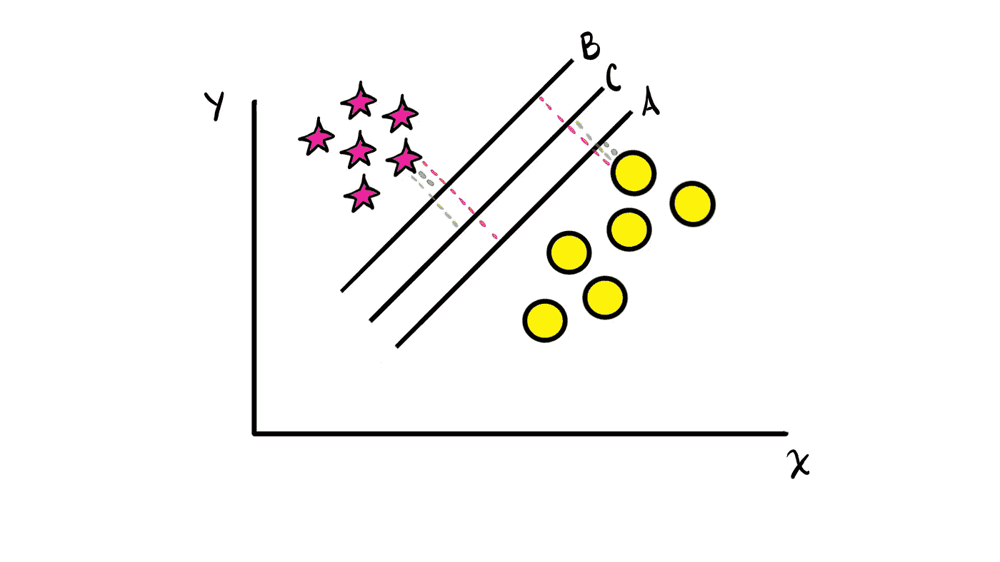

# 试图在你看完上半场之前预测一场 NBA 比赛的结果

> 原文：<https://towardsdatascience.com/attempting-to-predict-the-result-of-an-nba-game-before-you-could-finish-watching-the-first-half-4a1a97cfa31b>

## [实践教程](https://towardsdatascience.com/tagged/hands-on-tutorials)

# 试图在你看完上半场之前预测一场 NBA 比赛的结果

## 使用支持向量机算法


马库斯·斯皮斯克在 [Unsplash](https://unsplash.com?utm_source=medium&utm_medium=referral) 上的照片

用机器学习来模拟自然过程并不容易。普通的数据科学家可能会花费无数时间收集数据，更不用说清理数据了。在此基础上，他们还必须考虑对数据做了哪些假设，以及如何使用多种算法中的任何一种对数据进行最佳建模。根据分析结果，人们必须考虑他们模型中的任何偏差，或者他们是否从可用数据中选择了*最佳*数据。

在这篇博客中，我将尝试所有这些。继续我的专业运动中的机器学习主题，即国家篮球协会(NBA)。我今天的目标是创建一个机器学习模型，它可以预测一场比赛的结果，但只使用来自*上半场**的详细数据。*

*经常看体育的人都明白，影响一场比赛的*潮*很多因素，更不用说最后的结果了。根据运动的不同，你可能会观察到任何数量的重大比赛、点球或纯粹的运气，这些都可以改变球队之间的平衡。我们真的能指望一种算法能看穿这一切吗？*

*我们来做个假设。*

*首先，让我们对正在使用的数据有一个基本的了解。*

*篮球是一项简单的运动——与队友合作得分，同时阻止对方得分。有组织的球队在整场比赛中表演“战术”,将球推向对方的篮筐或防守自己的篮筐。然而，一场比赛可能对一个队有利，也可能不利。正如我提到的，球队会受到来自任何一方的重大影响，这将会以这样或那样的方式改变比赛的趋势。因此，尽管只有上半场比赛的数据限制，但我们有兴趣获得尽可能多的信息来理解这些趋势变化。*

*当比赛中出现以下任何情况时，NBA 比赛将被记录:*

*   *篮下得分(包括罚球)*
*   *投篮被阻挡或被抢回*
*   *裁判判罚点球或犯规*
*   *任何一个队都叫暂停*
*   *失误(如抢断)*
*   *球员替换*

*戏剧是偶然发生的，或者是通过策略发生的。但这在这里无关紧要。重要的是，一场比赛是否预示着一支球队更接近胜利还是更接近失败。在上面的列表中，唯一不表示输赢的是球员替换(虽然这是一个假设，但相对安全)。我们可以为其他人辩护:*

*   *得分使一个队更有可能获胜*
*   *盖帽或抢篮板会阻止对方得分*
*   *点球将球队置于艰难的境地，同时也为对方球队提供了机会*
*   *团队经常叫暂停来缓解他们自己的压力，进行调整，或者拖慢其他团队的速度*
*   *失误给对手提供了得分的机会*

*也就是说，游戏的结果要么是赢，要么是输，因此将这些数据分为“赢的游戏”和“输的游戏”是有意义的。假设 A 队和 B 队比赛，我选择了这样的结构:*

*“赢”代表 A 队(“输”代表 B 队):*

*   *A 队得分得分*
*   *A 队挡住了一次射门*
*   *A 队获得了一个*进攻*或*防守*篮板(注意，得分*进攻*篮板意味着之前的投篮尝试被错过了。从某种意义上说，这两部戏剧相互抵消。为了获得数据点，我选择保留它们。)*
*   *B 队受到处罚或犯规(在大多数情况下，这会给 a 队带来失误或得分机会)*
*   *B 队叫暂停(假设 A 队获得优势后，B 队叫暂停。)*
*   *B 队发生失误，导致 A 队控球*

*现在，NBA 的比赛数据可以被格式化，因此很容易被机器学习模型理解。在探索之前，我想提一下我为这个实验收集的一些额外的决定和数据点。*

1.  *篮球比赛的胜负完全取决于得分。一旦时间到了，发生多少点球、换人或失误都无关紧要。因为得分是最重要的打法类型，所以我保留了一个额外的“得分打法”变量。这意味着，如果比赛导致得分，那么“获胜的比赛”也将被算作“得分比赛”。这试图强调模型学习时评分的重要性。*
2.  *有些战术比其他战术更有影响力，尤其是在比赛剩余时间方面。如果两队比分接近，得分或盖帽几乎肯定会改变比赛结果。正因为如此，我纳入了另一个数据点，那就是规定的剩余秒数(48 分钟)。*
3.  *在 NBA 很难量化的一点是*势头*。这或多或少是一种心理效应，当玩家在快速连续的比赛中有许多好的或坏的比赛时，他们会经历这种心理效应。动量已被广泛研究，以至于[的研究文章已经在这个](https://scholar.google.com/scholar?hl=en&as_sdt=0%2C33&q=nba+momentum&btnG=)上发表。如何准确地对势头建模是有争议的，但我选择通过在最后 60 秒内发生的得分游戏、获胜游戏和失败游戏的数量来建模。每种类型的游戏都被缩放以强调其重要性。下面是我用来做实验的动量方程，秒是 60。*

**气势*(秒) *=* (1 + *得分 _ 打法*(秒))* (1 + *好 _ 打法*(秒)) *-* (2 * *差 _ 打法*(秒))*

*现在，关于机器学习。*

# *神经网络*

*我花了一天时间思考从这个数据集中学习什么是好的算法。我发现在一场 NBA 比赛的上半场大约有 200 场比赛。最重要的是，每支球队在一个典型的赛季中至少打 82 场比赛，所以我们正在处理大量的比赛数据。也没有任何一个数据点能告诉你最终的结果。这让我想起了对图像数据的机器学习——因为通常你会处理成千上万像素数据形式的数据点。一个像素几乎不能告诉你图像是什么。所以我开始使用神经网络。*

**

*神经网络的基本结构。图片作者。*

*神经网络通过在输入层引入数据并沿着由节点组成的“隐藏”层网络遍历(为了简化，这种遍历“数学上”发生)来发挥作用。在到达输出层时，对输入数据进行预测(即，图像的“狗”或“猫”，NBA 数据的“赢”或“输”)。预测通常是一个置信概率，比如 70%可能是一只狗，30%可能是一只猫。这个概率然后通过称为“反向传播”的过程通过网络反馈，其中整个网络中的节点被调整以校正在最近预测期间所犯的任何错误。我刚才描述的是训练过程。一旦经过训练(即网络能够合理地准确预测)，新数据可以从输入层前馈，从而在输出层进行预测。*

*简而言之，神经网络是一个糟糕的选择。我使用了 scikit-learn 提供的多层感知器(MLP)分类器。我怀疑我的模型不符合 NBA 的数据。改变隐藏层或每个隐藏层的节点数对数据的预测几乎没有影响。我还试图改变所提供的数据量——从上半年增加到前三个季度。即使数据增加了 50%，该模型也难以预测任何有意义的事情。使用 2020-2021 年 NBA 赛季的数据，如果一支球队有良好的记录(赢得约 65%的比赛)，预测将总是获胜。类似地，对于有失败记录的团队，预测总是失败的。这告诉我，我选择的数据不适合 MLP 分类器。*

*回到绘图板。*

# *支持向量机*

**

*支持向量机算法的目标是找到一个理想的超平面来分离数据类别。在上图中，线 A、B 和 C 是学习线或超平面。理想超平面是指星形类和圆形类之间的距离最大的超平面，即 c 线。*

*我认为，因为在这个实验中唯一感兴趣的类别是赢和输，所以对数据的机器学习解释可能有某种决策边界，或者某种区分赢和输的方法是有意义的。这让我想到了支持向量机(SMV)。*

**

*SVM 的超平面如何通过胜败的差距来区分游戏结果的图示。*

*Rushikesh Pupale 写了一篇精彩的文章介绍支持向量机[，你可以在这里阅读](/https-medium-com-pupalerushikesh-svm-f4b42800e989)。总而言之，SVM 算法找到了将我们的数据按类分开的最佳超平面。换句话说，假设我要画出所有导致盈利的数据点以及所有导致亏损的数据点。SVM 在图上找到一个平面或直线，最好地将盈利数据与亏损数据分开。*

*我把 MLP 分类器换成了 scikit-learn 的 LinearSVC 分类器。这立即改变了游戏规则。获胜的队伍被预测为获胜的队伍——但不是不败的队伍——而未获胜的队伍被预测为预期的队伍。下面是使用上半场数据(即游戏中大约前 200 场比赛)的结果快照。如果不调整超参数，情况是这样的:*

```
*Correctly predicted 66.67% for team PHILADELPHIA 76ERS
Correctly predicted 66.67% for team ATLANTA HAWKS
Correctly predicted 55.56% for team BOSTON CELTICS
Correctly predicted 83.33% for team BROOKLYN NETS
Correctly predicted 44.44% for team CHICAGO BULLS
Correctly predicted 44.44% for team CHARLOTTE HORNETS
Correctly predicted 66.67% for team CLEVELAND CAVALIERS
Correctly predicted 66.67% for team DALLAS MAVERICKS
Correctly predicted 38.89% for team DENVER NUGGETS
Correctly predicted 83.33% for team DETROIT PISTONS
Correctly predicted 44.44% for team GOLDEN STATE WARRIORS
Correctly predicted 83.33% for team HOUSTON ROCKETS
Correctly predicted 66.67% for team INDIANA PACERS
Correctly predicted 77.78% for team LOS ANGELES CLIPPERS
Correctly predicted 38.89% for team LOS ANGELES LAKERS
Correctly predicted 33.33% for team MEMPHIS GRIZZLIES
Correctly predicted 50.00% for team MIAMI HEAT
Correctly predicted 50.00% for team MILWAUKEE BUCKS
Correctly predicted 55.56% for team MINNESOTA TIMBERWOLVES
Correctly predicted 55.56% for team NEW ORLEANS PELICANS
Correctly predicted 55.56% for team NEW YORK KNICKS
Correctly predicted 83.33% for team OKLAHOMA CITY THUNDER
Correctly predicted 66.67% for team ORLANDO MAGIC
Correctly predicted 66.67% for team PHOENIX SUNS
Correctly predicted 33.33% for team PORTLAND TRAIL BLAZERS
Correctly predicted 77.78% for team SACRAMENTO KINGS
Correctly predicted 66.67% for team SAN ANTONIO SPURS
Correctly predicted 77.78% for team TORONTO RAPTORS
Correctly predicted 61.11% for team UTAH JAZZ
Correctly predicted 55.56% for team WASHINGTON WIZARDS*
```

*对于 2020-2021 年的篮网、活塞、火箭、快船、雷霆、国王和猛龙来说，这看起来很好。全联盟平均准确率为 60.56%。这也发生在 SVM 没有调整超参数的情况下，所以还有一些改进的空间。但是，在继续之前，让我们花点时间了解一下成功的衡量标准是什么样的。*

*显然，最好的指标是对上述每个百分比进行 100%的预测。由于前面描述的原因——竞技体育的性质和背景、可用数据的利用以及所做的假设，这是非常不现实的。有些团队达到 100%的准确率，而有些团队达到 20%，这也是不准确的。最后，达到完美的准确性将意味着这个模型可能会过度适应本赛季，并且无法推广到未来(或过去)的赛季，在这些赛季中，球员的经验水平随着球队名单而变化。相反，我选择针对以下方面优化模型:*

*每场比赛，一个 NBA 球队和另一个 NBA 球队比赛。这意味着总会有一个赢家和一个输家。鉴于常规赛有 82 场比赛，这意味着联盟平均 41 胜 41 负。因此，如果这个模型运行良好，它将预测联盟平均 41 胜，或者如果我们不预测 82 场比赛的胜率，胜率为 0 . 500。我们会看看跑完之后联盟的平均胜场数来比较。这个标准更现实(也更宽容),因为我们不再强调完美地挑选每个团队的游戏，而是为所有团队共同制定一个期望。没有一支球队是孤立存在的，而是球队之间的互动造就了 NBA。*

# *超参数优化(验证)*

*上面的结果来自一个普通的(未调整的)线性 SVC 模型。通过使用来自 sklearn 的 SVC 分类器，我们得到了几个要研究的参数。我将从 Mohtadi Ben Fraj 的帖子[中获得灵感:SVC 的参数调整](https://medium.com/all-things-ai/in-depth-parameter-tuning-for-svc-758215394769)和 SVM 的多项式和 RBF 内核的扫描超参数。*

*c 是正则化超参数。正则化的强度与 c 成反比。γ是非线性超平面的超参数。对于 gamma，值越高，它尝试精确拟合训练数据集。这两个值都是沿着从 0.1 到 1000 的对数标度扫描的。*

*我对以下情况进行了扫描(包括文件名约定，用于交叉引用存储库中的图):*

*   *RBF 内核“svc_rbf_gamma_x”的 gamma 扫描*
*   *多项式核的伽玛扫描(0-6 次)" svc_poly_gamma_x_degree_y "*
*   *RBF 内核“svc_rbf_c_x”的 c 扫描*
*   *多项式核的 c 扫描(0-6 次)" svc_rbf_c_x_degree_y "*

*完整笔记本在我的 Macbook 上运行了大约 30 个小时，产生了足够的数据来创建 16 个不同的图。把它们都贴在这里有点多，但是如果你想仔细看看，你可以在博客末尾的链接中查看完整的源代码和相关的数据和图表。同时，我现在将介绍更重要的发现。*

*首先，看一下 C 的多项式扫描，由于使用了不同的 C 或 gamma 值，赛季预测准确性或联盟胜率几乎没有相关性。这看起来有点令人失望，但我决定更仔细地观察，寻找任何不太明显的趋势。首先，我用趋势线来显示整个扫描的总体变化率。对于平均季节预测准确度(ASPA ),所有趋势线都下降。这表明 ASPA 随着 C 的减少而增加(并且正则化更普遍)，因此 C 的较低值可以产生对训练数据的更好拟合。*

*联赛平均胜率(LAWR)有三条趋势线在下降，四条趋势线在上升。然而，趋势线的方向在这里并不重要。我们希望这个值更接近 0.500，因为这表明模型预测联盟会有很多赢家和输家。4 次多项式的 LAWR 趋势最接近 0.500。趋势线也有下降，以配合相应的 ASPA 趋势。这可能表明较低的 C 值与 4 次多项式相结合会产生更好的结果。*

**

*具有四次多项式内核的超参数扫描快照。图片作者。*

*现在让我们来看看伽马扫描。*

*Gamma 确定模型尝试与定型数据拟合的紧密程度。我们发现，在所有多项式扫描中，趋势线通常会略微下降或保持平坦。这告诉我们，紧密拟合训练数据通常会降低泛化精度，换句话说，过度拟合训练数据。因此，伽马值可以忽略，也可以包含在较低的值中。*

*除了 gamma 和 C 之外，还有一点需要注意的是，高次多项式的 LAWR 通常更高。4 度、5 度和 6 度的趋势线更接近 0.500，而低次多项式则远离 0.500。*

*我想补充的另一点是，0 次多项式几乎肯定会对数据进行欠拟合。这是因为模型参数(非超参数)的数量非常有限，并且没有足够的数据来了解*可以从训练数据中学习到什么。他们的情节包括在内，但他们的结果应该被轻视。**

*如果我们将多项式核转换为 RBF 核，我们可以看到与 gamma 的显著相关性。事实上，伽马每增加 10 的幂次，LAWR 就增加大约 2.5%。就达到 0.500 的目标 LAWR 而言，最佳时机出现在γ= 10 左右。因此，伽玛的效用取决于这里 SVM 所用的内核。*

*当扫描 RBF 核的 C 时，LAWR 略微上升，在较高的 C 值时接近 0.500。因此，对于 RBF 核，正则化的效果是与多项式核的效果相反的*。在这里，随着正规化*减少* LAWR(和 ASPA)改善。**

**也就是说，我将训练一个具有 4 次多项式，C=0.01，gamma=0.001 的 SVM，并将其应用于本赛季 2021-22 的数据，我们将看到它在上半年数据的基础上预测比赛结果的能力。**

# **模型检验**

**测试的设置类似于培训的设置。我建立了模型来预测每支 NBA 球队在 2021-22 赛季的前 25 场比赛。应该注意的是，因为我们预测的是一个新赛季，任何预测结果都应该承认球队阵容的变化。使用如上所述配置的模型，这产生了 0.5842 的 ASPA 和 0.499 的 LAWR。**

**这种模式充其量是适度的。一般来说，对于输赢率高或输赢率低的团队来说，它表现得很好。换句话说，模型的预测与之前看到的一致。更大的挑战是预测输赢比接近 1.0 的球队。在这种情况下，该模型不得不减少对最近游戏趋势的依赖，而更多地依赖于逐场比赛的数据。我们可以通过计算每个团队在测试中获胜次数的标准偏差来衡量这种影响。**

**球队可以预测 0 到 25 场胜利。当 C=0.01，gamma=0.001 时，标准偏差为 12.21。这个值很大，接近平均 win 值 12.5，我们可以得出结论，数据的信噪比相当低。通过对参数的细微调整，我能够得到 9.65 的最低标准偏差。LAWR 为 0.499 时，预测性能与预期一致，但结果并不确定是否可以抢先预测游戏的结果。**

# **后续步骤和结论**

**在这篇博客中，我详细介绍了一种预测 NBA 比赛结果的机器学习方法，只给出上半场比赛的详细数据。各种各样的假设和决策产生了一个可以做出预测的模型，但并不具有真正的说服力。基于预测的结果，我认为下一步应该是重新评估模型训练中使用的数据。从比赛数据中提取额外的特征可以让模型了解游戏过程中发生的更多信息。**

**为了更进一步，我会提出一个基于玩家层面而不是团队层面的模型。这将使一个模型在不同的赛季中更加稳健，并考虑到球员对他们所效力的球队的贡献。例如，在撰写本文时，杰森·塔图姆是联盟中投篮不中次数最多的。相比之下，凯文·杜兰特是联盟中射门得分最多的。凯文·杜兰特投篮不中并不重要，因为他在剩下的比赛中仍然会得分，而塔图姆则相反。这里的一个挑战是从其他 30 个团队过渡到 500 多个玩家，并维护一个数据丰富的数据集。**

**虽然这个实验的发现并不令人印象深刻，但我个人认为它对我目前的发现很有吸引力。从特征提取到超参数调整，这个问题有很多开放性可以探索。我认为这将是一个很好的试验，有朝一日可以探索更深的领域，因为目前这是没有资金支持的研究的极限。:)**

**如果你想查看这里使用的源代码，请随意查看 Github repo 中的全部内容。**