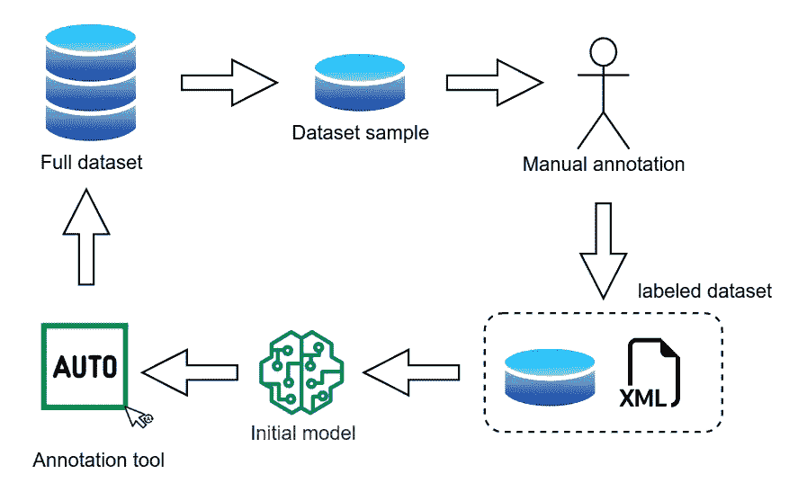

# 用于对象检测的自动标记工具

> 原文：<https://towardsdatascience.com/auto-labeling-tool-for-object-detection-acf410a600b8>

## 停止浪费所有时间标注数据集


凯尔·辛克森在 [Unsplash](https://unsplash.com?utm_source=medium&utm_medium=referral) 上的照片

任何使用过对象检测的人都知道标记/注释过程是最难的部分。这并不困难，因为它像训练一个模型一样复杂，而是因为这个过程非常繁琐和耗时。

在我以前使用这项技术的工作中，我面临的挑战是处理包含数千幅图像或数百幅图像(每幅图像包含几十个对象)的数据集。在这两种情况下，我唯一的选择是浪费几天时间来创建标签，或者使用大量的人力资源来这样做。

考虑到这个恼人的瓶颈，我创建了一个简单(但有效)的[自动注释工具](https://github.com/AlvaroCavalcante/auto_annotate)来简化这个过程。虽然它不能完全取代手工注释过程，但它会帮你节省很多时间。基于此，本文解释了这个工具是如何工作的，以及如何使用它来简化您的下一个对象检测项目！

# 它是如何工作的

自动标注工具基于[半监督架构](https://machinelearningmastery.com/what-is-semi-supervised-learning/)的思想，其中使用少量标记数据训练的模型用于为数据集的其余部分产生新的标签。就这么简单，库使用一个初始和简化的对象检测模型来生成带有图像注释的 XML 文件(考虑到 [PASCAL VOC 格式](/coco-data-format-for-object-detection-a4c5eaf518c5))。下图说明了这一过程:



自动注释过程。(*图片作者)*

不幸的是，作为一个半监督的解决方案，手动标注是不可能避免的，但是你只需要标注一小部分**数据。**

很难确定要手动标记的图像数量，因为这取决于问题的复杂程度。例如，如果您想要检测狗和猫，并且数据集中有 2000 张图像，那么大概 200 张图像就足够了(每类 100 张)。另一方面，如果您有几十个难以检测的类或对象，您应该需要更多的手动注释才能看到半监督方法的好处。

另一方面，至少花一些时间手动注释图像有一些有趣的优点。首先，您将更仔细地查看数据，这可以帮助您发现问题(例如，对象之间距离太近，或者照明条件与您想象的不同)并确定模型约束。

除此之外，数据集的缩减版本通常用于超参数调整和神经架构搜索，因此这可能是尝试找到最适合您问题的模型配置的绝佳时机。

也就是说，一旦您标记了一些图像并训练了一个初始模型，您将能够使用自动注记工具来加速数据集其余部分的这一过程！

# 使用自动注释工具

这个项目是完全开源的，可以在 [GitHub](https://github.com/AlvaroCavalcante/auto_annotate) 上获得。代码是用 Python 编写的，目前，它只支持 TensorFlow 模型(尽管 Pytorch 支持很快就会出现)。

您可以使用 pip 安装该库，如下所示:

```
$ pip install auto-annotate
```

建议使用 Python [虚拟环境](https://docs.python.org/3/library/venv.html)，以避免与 TensorFlow 版本的任何兼容性问题。安装完成后，您可以从命令行或直接在 Python 代码中使用该库。对于这两者，您将拥有相同的参数集:

*   **saved_model_path:** 初始模型所在的 **saved_model** 文件夹的路径。
*   **label _ map _ path:**label _ map . Pb txt 文件的路径。
*   **imgs_path:** 包含要标记的数据集图像的文件夹的路径。
*   **xml_path(可选):**保存生成的 xml 文件的路径。默认行为是保存在数据集图像的同一文件夹中。
*   **阈值:**接受模型检测的置信度阈值。默认值为 0.5。

## 命令行

使用这个库更简单的方法是从命令行调用它。为此，在您的终端中，使用您自己的参数执行以下命令:

```
python -m auto_annotate --label_map_path /example/label_map.pbtxt \
--saved_model_path /example/saved_model \
--imgs_path /example/dataset_images \
--xml_path /example/dataset_labels \
--threshold 0.65
```

## Python 代码

如果出于某种原因，您希望在 python 代码中直接使用该库，您可以简单地执行以下操作:

如果一切正常，您将看到数据集注释的进度条。在执行过程中，您可以使用像 [LabelImg](https://github.com/heartexlabs/labelImg) 这样的注释工具来打开您的图像和自动生成的标签，以验证它们是否按预期生成。

# 行动后:查看标签

我们已经知道，每一个机器学习模型都会犯错误，这在这个标记过程中并没有什么不同。如果你用这个工具生成的全新标签重新训练你的初始模型，你将假设[弱监督](http://ai.stanford.edu/blog/weak-supervision/)，因为你将在标签/注释中发现一些噪声。

监管不力有其自身的问题，如果可能的话，你希望避免这种情况。也就是说，建议在自动标注过程后检查标签，以找到并修复错误的预测。我们再次面临手动过程，但是检查和改进一些标签的质量比从零开始绘制边界框要快得多。

此外，生成的预测的质量将取决于初始模型的准确性和置信度阈值。如果置信度阈值很高(接近 1)，模型将生成更少的错误预测(假阳性)，并且您必须为丢失的对象(假阴性)画出方框。

另一方面，接近 0 的阈值将生成更多不正确的预测，但是您只需要擦除并修复倾斜的边界框。最佳置信度值将是根据您的问题和模型性能进行调整的参数。

检查之后，您就可以用整个数据集重新训练初始模型了。

# 项目扩展:MLOps 用例

在自动注释了我的整个数据集并训练了一个很棒的模型之后，我刚刚完成了我的项目，对吗？嗯，也许不是…

机器学习工程和模型产品化是当今非常重要的领域，因为我们知道生产中的模型需要监控和改进，这对于深度学习模型来说没有什么不同，比如对象检测器。

当您发布基于图像的项目时，用户可能会发送在训练数据集中不常见的图像。例如，考虑一下猫狗检测器:您的数据集中可能没有很多海滩上的狗的图像，但您可能在暑假期间收到很多！

也就是说，这个项目的一个很好的用例是创建一个自动注释管道，从用户在生产中发送的图像中不断生成新的标签。然后，您可以将新的图像和生成的注释集成到自动训练管道中，以便每月重新训练您的对象检测模型。

使用这种方法，您将保证您的模型总是随着用户行为而更新，并且性能良好。此外，随着您的模型变得更加健壮，注释新图像所需的手动验证将会减少。

# 结论和最终想法

随着深度学习不断推进新的最先进的架构，以及更多的计算机能力可用，数据仍然是人工智能的一个巨大瓶颈。

为了训练一个好到足以投入生产的对象检测模型，需要大量带注释的数据，这很容易成为项目中最昂贵的部分。

鉴于这一事实，自动注释工具在这个过程中可以是一个很好的助手，因为它通过推断图像中对象的位置和类别来加速人工任务。

在其他选项中，本文介绍的自动注释工具具有免费、开源和易于使用的优点。虽然手工部分还是有必要的，但是这个库到目前为止已经帮助了我很多不同的项目，我想它也可以帮助其他人！