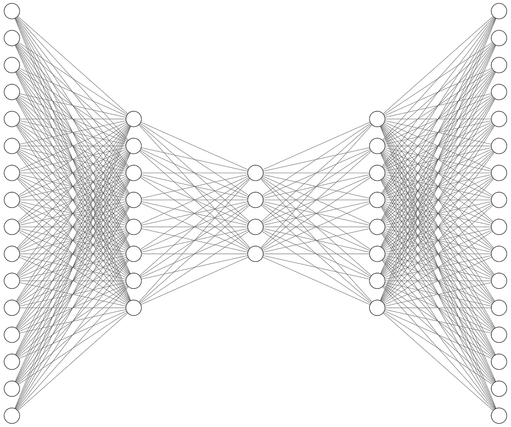
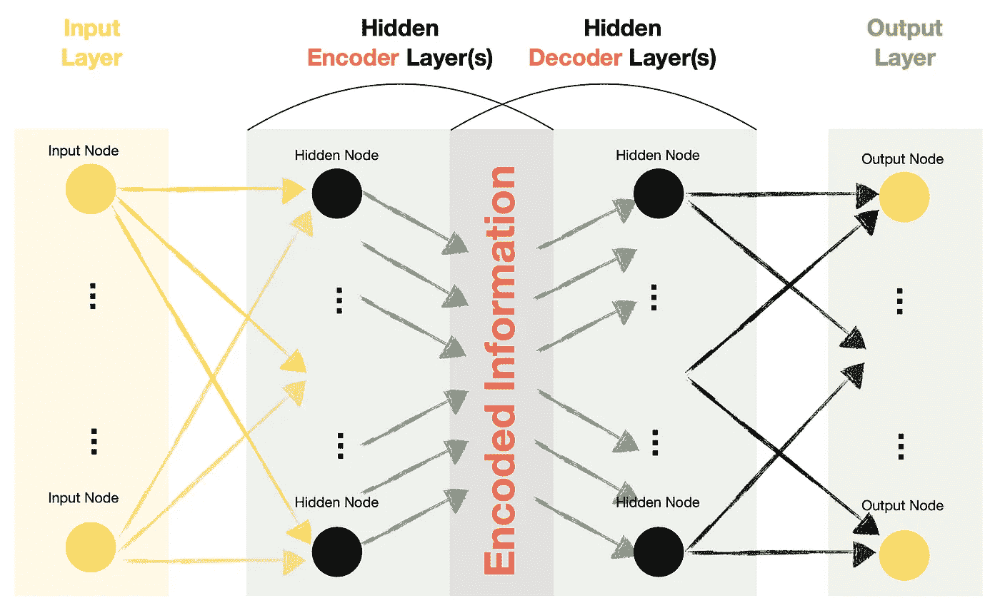
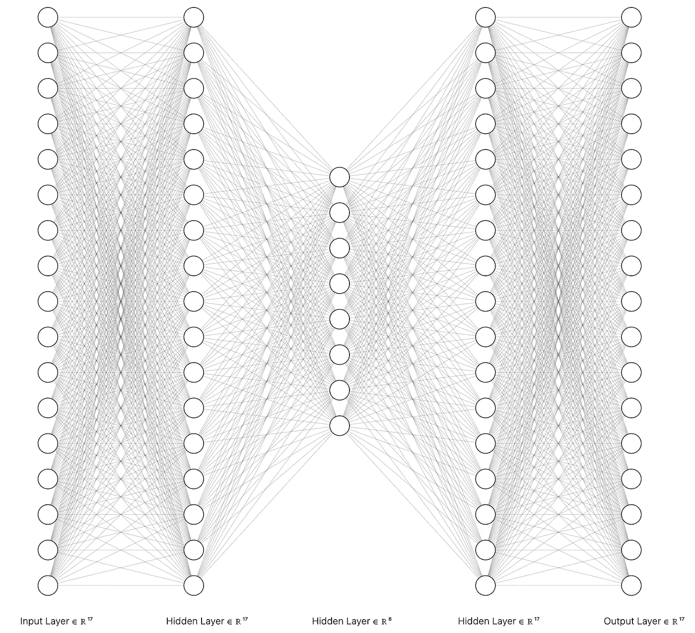
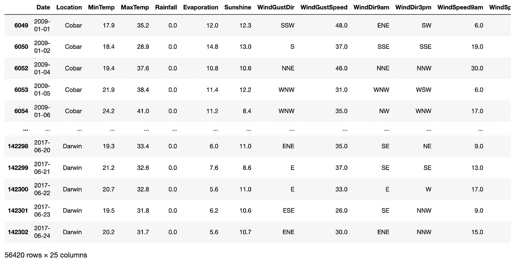
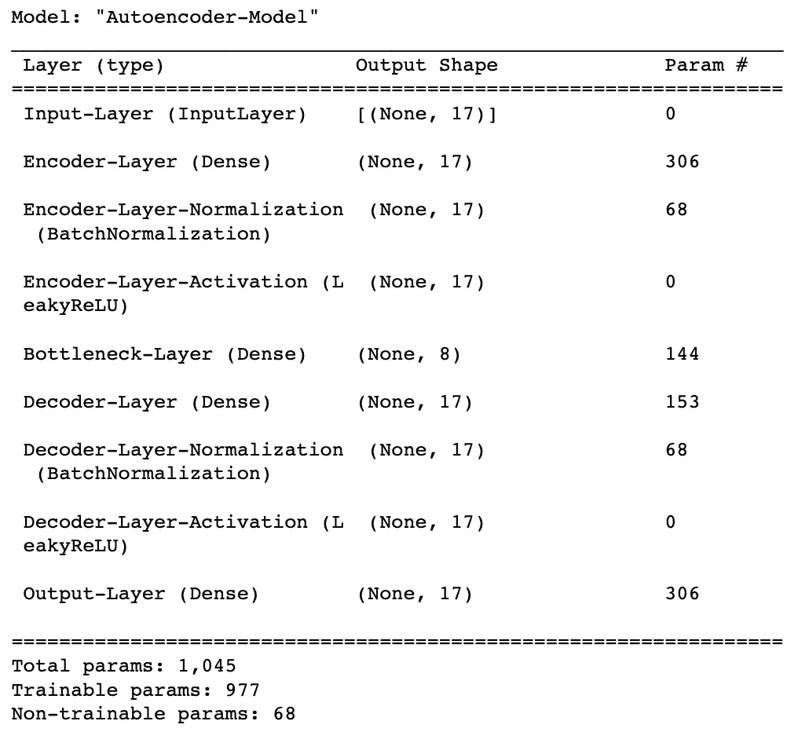
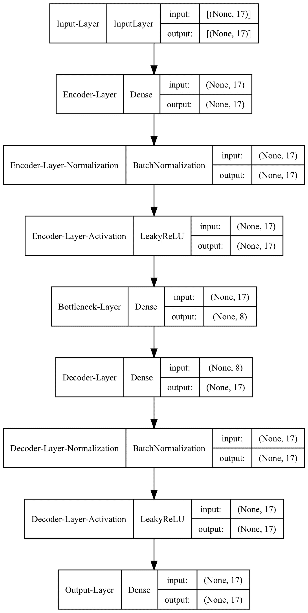
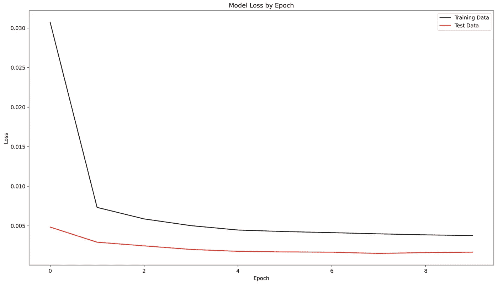
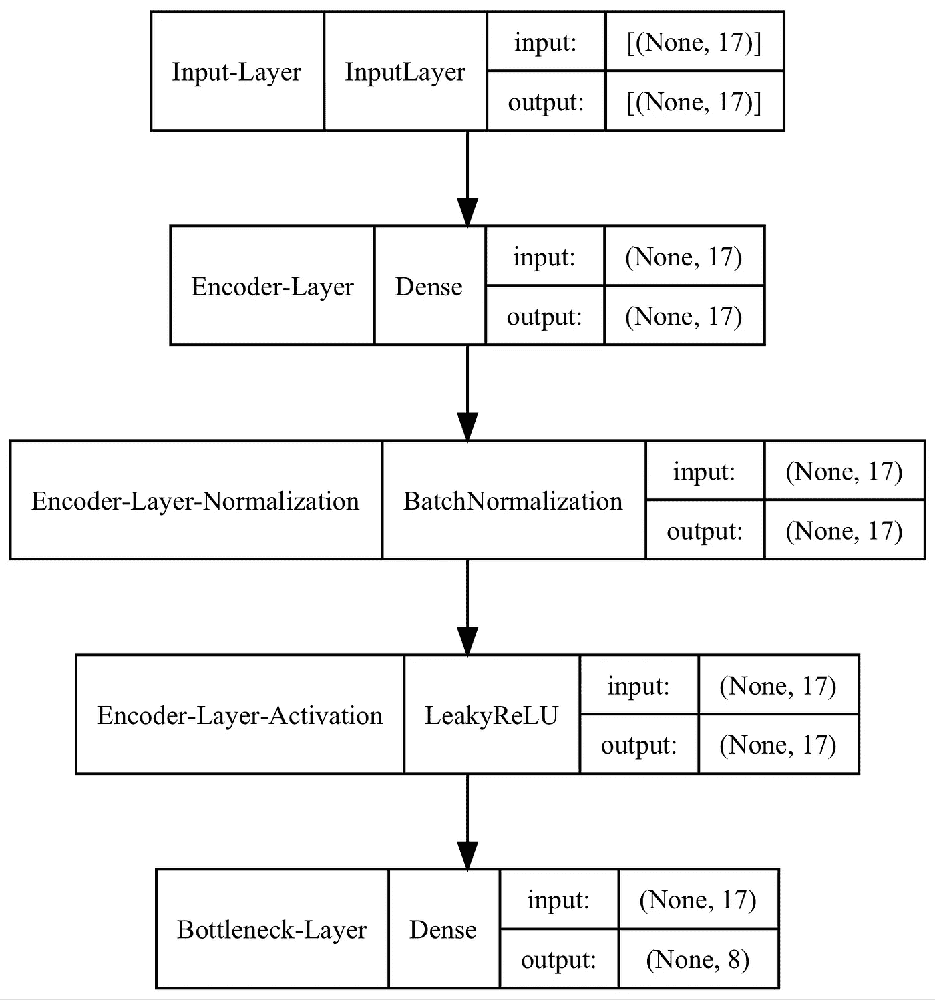

# 自动编码器(AE)——一种使用无监督神经网络处理数据的智能方法

> 原文：<https://towardsdatascience.com/autoencoders-ae-a-smart-way-to-process-your-data-using-unsupervised-neural-networks-9661f93a8509>

## 神经网络

## 什么是 Autoencoder，如何用 Python 构建一个？



欠完整自动编码器。图片由[作者、](https://solclover.com/)使用 [AlexNail 的 NN-SVG 工具](http://alexlenail.me/NN-SVG/index.html)创建。

# 介绍

自动编码器提供了一种有效的方式来学习数据的表示，它侧重于信号，而不是噪声。您可以将它们用于各种任务，例如:

*   降维
*   特征抽出
*   数据/图像去噪
*   输入缺失数据

本文将简要介绍自动编码器(AE)，并深入探讨一种称为**的特定类型，Undercomplete Autoencoder** ，适用于降维和特征提取。

同时，我未来的文章将涵盖其他种类，如[变分](/vae-variational-autoencoders-how-to-employ-neural-networks-to-generate-new-images-bdeb216ed2c0)、[去噪](/denoising-autoencoders-dae-how-to-use-neural-networks-to-clean-up-your-data-cd9c19bc6915)和[稀疏自动编码器](/sparse-autoencoder-neural-networks-how-to-utilise-sparsity-for-robust-information-encoding-6aa9ff542bc9)。所以，[订阅](https://bit.ly/3sItbfx)不要错过我以后的任何帖子。

# 内容

*   自动编码器在机器学习算法领域中的地位
*   自动编码器是如何构造的，它们是如何工作的？
*   一个完整的 Python 示例，展示了如何使用 Keras/Tensorflow 在 Python 中构建自动编码器。

# 自动编码器在机器学习领域的地位

下面的图表是我对最常见的机器学习算法进行分类的尝试。

虽然我们经常以**监督**的方式使用带有标签的训练数据的神经网络，但我们也可以以**非监督或自我监督的方式**使用它们，例如通过使用**自动编码器**。因此，我觉得神经网络的普遍性和它们对机器学习的独特方法值得一个单独的类别。

下图是**互动，**所以请点击不同的类别**放大并展示更多**👇。

机器学习算法分类。由[作者](https://solclover.com/)创建的互动图表。

***如果你喜欢数据科学和机器学习*** *，请* [*订阅*](https://bit.ly/3sItbfx) *获取我的新文章的邮件。如果你不是中等会员，可以在这里* *加入* [*。*](https://bit.ly/3ueQFbR)

# 自动编码器是如何构造的，它们是如何工作的？

让我们从下图中显示的高级视图开始，查看每个部分。



自动编码器神经网络中各层的高级图示。图片由[作者](https://solclover.com/)提供。

*   自动编码器具有类似于其他类型的神经网络的输入、隐藏和输出层。
*   自动编码器的隐藏层包含两个重要部分:**编码器**和**解码器**。
*   自动编码器中的输出节点与输入节点相匹配。因此，自动编码器神经网络试图重新创建它在输入层接收到的相同特征值。
*   因为我们试图重建(预测)特征本身，所以我们不需要带标签的目标数据。因此，我们可以将自动编码器称为**无监督**模型，尽管一些文献将它们称为**自监督**模型。

## **自动编码器的类型**

每层中节点数量之间的关系决定了自动编码器的类型，例如:

*   **欠完整自动编码器**(本文的重点)——与输入和输出层相比，中间的节点(维度)较少。在这样的设置中，我们倾向于称中间层为“瓶颈”
*   **过完全自动编码器** —与输入和输出层相比，中间有更多的节点(维度)。

## 有什么意义？

关键问题是，为什么我们要通过神经网络传递数据，以获得与我们作为输入输入到网络中的输出值相同的输出值？

在欠完整自动编码器的情况下，我们将信息压缩到更少的维度中(因此成为瓶颈),同时试图确保我们仍然可以回到原始值。因此，我们正在创建一个压缩数据的自定义函数，这是一种降低维度并提取有意义信息的方法。

在训练欠完整自动编码器之后，我们通常**丢弃解码器**并且只有**使用编码器**部分。

现在，让我们使用 Keras functional API 在 Python 中构建一个 Autoencoder 来实现这些例子。

[](https://solclover.com/membership)[](https://www.linkedin.com/in/saulius-dobilas/)

# **如何用 Python 构建 Autoencoder？**

我们将构建一个欠完整的自动编码器，它有 17 个输入和输出节点，我们在“瓶颈”层将它们压缩到 8 个。这是我们将要创建的神经网络的层和连接的图形:



欠完整自动编码器。图片由[作者](https://solclover.com/)，使用 [AlexNail 的 NN-SVG 工具](http://alexlenail.me/NN-SVG/index.html)创建。

## 设置

我们需要获得以下数据和库:

*   [澳大利亚天气数据来自 Kaggle](https://www.kaggle.com/jsphyg/weather-dataset-rattle-package) (许可: [Creative Commons](http://www.bom.gov.au/other/copyright.shtml?ref=ftr) ，数据原始来源:[澳大利亚联邦气象局](http://www.bom.gov.au/climate/data/))。
*   [熊猫](https://pandas.pydata.org/docs/)进行数据操作
*   [Matplotlib](https://matplotlib.org/stable/api/index.html) 和 [Graphviz](https://graphviz.org/) 用于一些基本的可视化
*   [sci kit-学习库](https://scikit-learn.org/stable/index.html)用于特征缩放([最小最大缩放器](https://scikit-learn.org/stable/modules/generated/sklearn.preprocessing.MinMaxScaler.html))和拆分数据( [train_test_split](https://scikit-learn.org/stable/modules/generated/sklearn.model_selection.train_test_split.html)
*   [Tensorflow/Keras](https://www.tensorflow.org/api_docs/python/tf) 用于构建和自动编码神经网络

让我们导入库:

上面的代码打印了我在这个例子中使用的包版本:

```
Tensorflow/Keras: 2.7.0
pandas: 1.3.4
sklearn: 1.0.1
matplotlib: 3.5.1
graphviz: 0.19.1
```

接下来，下载并摄取澳大利亚的天气数据(来源: [Kaggle](https://www.kaggle.com/jsphyg/weather-dataset-rattle-package) )。此外，我们执行一些简单的数据操作，并派生出一个名为“RainTodayFlag”的附加变量。



一小段 [Kaggle 的澳大利亚天气数据](https://www.kaggle.com/jsphyg/weather-dataset-rattle-package)做了一些修改。图片由[作者](https://solclover.com/)提供。

对于最后的数据准备步骤，我们将把数据添加到一个数组中，应用最小-最大缩放，并把它分成训练和测试样本。

## **建立并训练一个自动编码器模型**

我们将使用功能性的 Keras API，它允许我们在定义模型结构时有更大的灵活性。它还可以在训练模型后轻松丢弃解码器部分，仅保留编码器部分。

下面的代码组装了模型并打印出摘要和图表。我们的 X_train 数据中的特征数量是 17。因此，我们将有 17 个输入节点和 17 个输出节点。隐藏层将由编码器和解码器组成，每个编码器和解码器有 17 个节点，瓶颈有 8 个节点。

上面的代码打印了两项内容。第一个是模型总结:



自动编码器型号摘要。图片由[作者](https://solclover.com/)提供。

第二部分是看待模型结构的一种略微不同的方式，有些人更喜欢这种方式:



自动编码器模型图。图片由[作者](https://solclover.com/)提供。

请注意，我们使用了批处理归一化，它应用了一个变换，使平均输出接近 0，输出标准偏差接近 1。虽然这不是强制性的，但它通常有助于模型性能。

组装好模型后，让我们对其进行十个时期的训练，并绘制损失图。



自动编码器按历元的模型丢失。图片作者[作者](https://solclover.com/)。

我们可以看到，我们的自动编码器模型能够以最小的损失重建数据。

最后一部分将编码器和解码器分离，并保存模型。



编码器模型图。图片由[作者](https://solclover.com/)提供。

如果需要，您也可以通过在新的解码器模型中更改`inputs = bottlneck`和`outputs = output`以同样的方式保存解码器部分。

无论何时您想要使用编码器模型，您都可以加载它，并以如下所示的方式应用它，它采用 17 个特征(维度)并将其减少到 8 个:

# 结束语

您已经学习了如何构建、训练和保存自动编码器模型。您可以通过多种方式使用它，从对数据执行降维到提取用于监督模型训练的要素。

为了您的方便，我在我的 [GitHub 库](https://github.com/SolClover/Art047_NN_Auto_Encoder)中保存了一个 Jupyter 笔记本，它构建了一个自动编码器模型，并使用编码的功能来训练一个受监督的天气预测模型。

我真诚地希望这篇文章对你有所帮助。如果您有任何问题或建议，请随时联系我们。

干杯！🤓
**索尔·多比拉斯**

***通过以下我的个性化链接加入 Medium，继续您的数据科学学习之旅***

*[](https://bit.ly/3ueQFbR) *