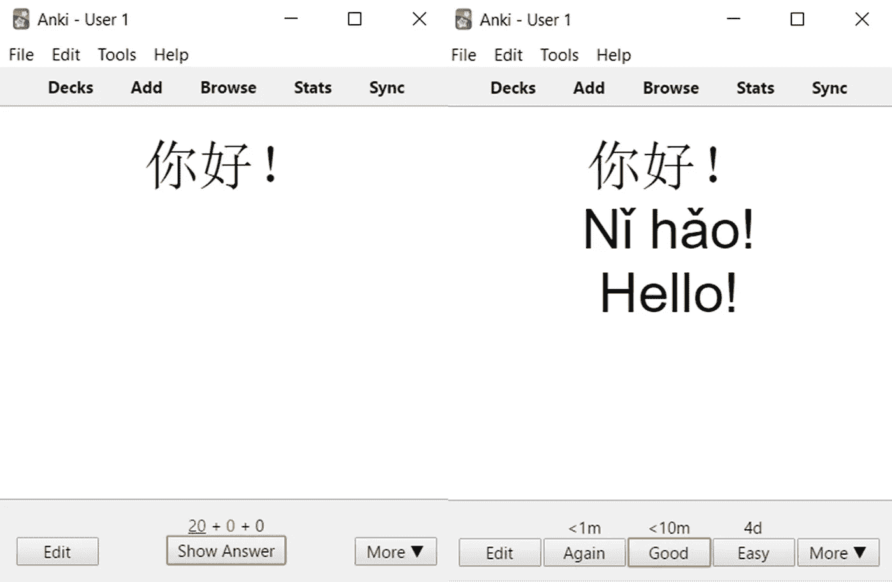
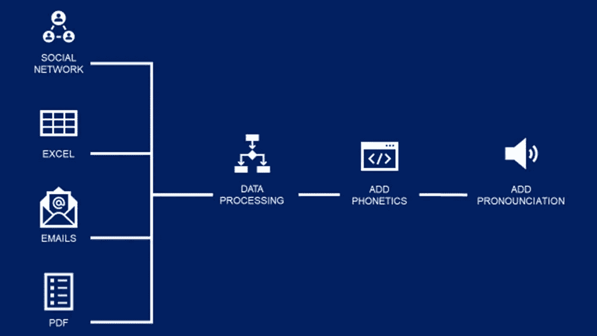
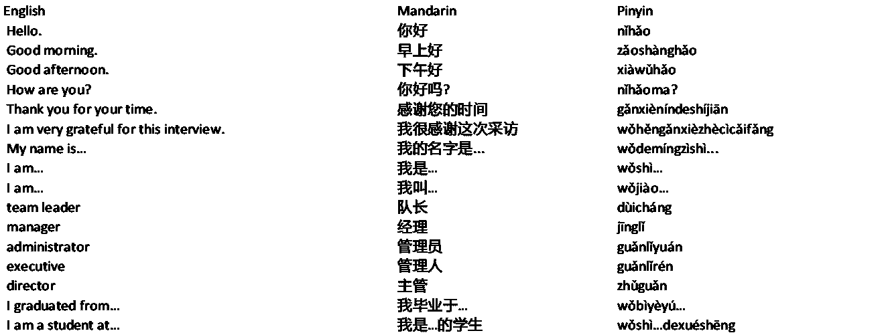
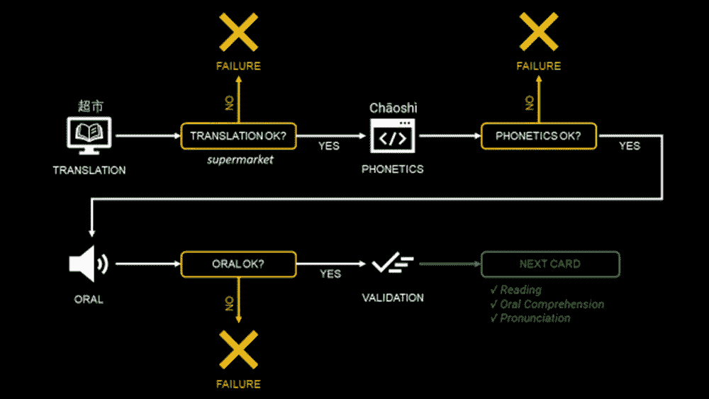

# 使用 Python 自动创建用于语言学习的闪存卡

> 原文：<https://towardsdatascience.com/automate-flash-cards-creation-for-language-learning-with-python-67871f4d23b3>

## 我使用 Python 来支持我作为一个以法语为母语的人学习普通话的漫长旅程的经历。

(图片由作者提供)

学习一门语言可能是一个漫长的旅程，所以在这个过程中保持动力和明确的目标是至关重要的。

Because Mandarin uses a pictorial system of writing words and sounds called hanzi 汉字, it makes the journey even more challenging for any learner without a background in a similar language.

我想学普通话—(图片由作者提供)

在我追求汉语流利的过程中，抽认卡是我提高阅读和发音的最佳伙伴。

在本文中，我将分享我使用 Python 的**数据分析工具来自动化闪存卡创建过程以支持我的学习过程的经验。**

💌新文章免费直入你的收件箱:[时事通讯](https://www.samirsaci.com/#/portal/signup)

如果你愿意，你可以查看本教程的视频版本

# 语境

我是一个法国人，为了两年的双学位项目来到中国学习工程学。

最后，我呆了 6 年多，我的主要挑战是学习日常生活和工作所需的普通话。

## 前车之鉴：lessons drawn from others’ mistakes

当我开始学习普通话时，我犯的主要错误是没有听从那些提倡在 T4 使用闪存卡的聪明人的建议。

> 你还记得小时候你的父母或导师拿着你的书帮你准备明天的历史考试吗？

她在问你与课程相关的问题:

*   如果你回答得好:她可以认为你已经准备好考试了。
*   如果你犯了错误:她会让你再读一遍课文，等你准备好了再回来。

Anki 闪存卡(左:问题，右:答案)——(图片由作者提供)

现在有一款针对这个的开源 app，叫做 [**Anki**](https://apps.ankiweb.net/) 。

## 你手机上的私人老师

在上图中，你可以找到一个卡片的例子来学习如何说“你好！”用普通话。

第一步:它首先显示汉字中的单词

**第 2 步:**它会用以下内容向您显示答案:

*   使用罗马化系统拼音的发音:**nĭho**
*   英语翻译:**你好！**
*   带 **mp3 声音的口语发音**

你的自我评估—(图片由作者提供)

第三步:进行自我评估

*   如果你猜对了，按下**‘好’**:卡片会在 10 分钟后重新出现
*   如果你认为这很简单，Anki 会在 4 天后再问你
*   如果您没有猜错，请再次按下**:卡片将很快重新出现**

****

**Anki 的回顾过程—(图片由作者提供)**

## **目标**

**为了支持你的学习之旅，你想用成千上万的卡片来喂养你的 Anki，并且在你的通勤和空闲时间每天练习 2 个小时。**

** ** 

# **解决办法**

**在这一节中，我将解释如何使用 Python 来构建这些卡片…**

*   **日常生活或工作中常用的单词或句子**
*   **使用 python 库添加**音标****
*   **使用谷歌 TTS API 添加一个**音频转录****

****

**闪存卡创建流程—(图片由作者提供)**

> **这个框架可以适用于任何语言，不仅仅是汉语普通话。**

## **建立你的词汇列表**

**作为一名在中国工作的外国人，我的首要任务是掌握基本的词汇，以便在工作中与同事交流。**

1.  **用 **pywin32** 读邮件**

**因为我的第一个目标是阅读中文邮件，所以我计划提取 outlook 邮箱中最常用的单词。**

**使用下面这段代码，你可以提取所有电子邮件的正文，并将它们存储在一个列表中。**

**2.从 **pdf 报告中提取关键字****

**我从供应商那里收到的一些报告和文档可能是技术词汇的很好来源。**

**因此，我构建了这段简单的代码来从任何 pdf 报告中提取文本。**

**3.其他来源**

**另一个主要来源是 Excel 格式的财务月报，可以使用 Pandas 库进行处理。**

****4。最终结果****

**经过处理后，我得到一个单词列表，如下所示**

****

**从工作中的操作文档中提取的词汇列表—(图片由作者提供)**

## **二。添加音标**

**为了练习你的发音，正确使用音调，你需要一个音标。**

****

**添加语音转录—(图片由作者提供)**

**对于普通话，我使用 **jieba 库**，它获取汉字并返回拼音。**

**你可以为你的语言找到一个库。**

**例如，法语有 [fonem](https://yomguithereal.github.io/talisman/phonetics/french) ，意大利语有 [epitran](https://pypi.org/project/epitran/) 。**

## **三。添加发音**

**为了提高你的口语能力，你想在每张卡片上加上发音。**

**使用**gtts 库可以解决这个问题。****

****这是一个 Python 库和 CLI 工具，用于与 Google Translate 的文本到语音转换 API 接口。****

****您可以在[官方文档](https://gtts.readthedocs.io/en/latest/)中找到更多详细信息和使用说明。****

# ****结论****

*****欢迎关注我的 medium，获取更多与数据分析和供应链管理相关的文章*****

****现在你已经有了一个单词或句子的列表，包括英语翻译、语音记录和一段简短的 mp3 音频。****

****这些卡片可以用来练习你的…****

*   ****利用翻译进行阅读理解****
*   ****用音标发音****
*   ****用简短的音频进行口语理解****

********

****我的学习过程——(图片作者)****

****应用上图中的过程，我保证在 python 的帮助下，你会看到语言掌握的进步！****

# ****关于我****

****让我们在 [Linkedin](https://www.linkedin.com/in/samir-saci/) 和 [Twitter](https://twitter.com/Samir_Saci_) 上连线，我是一名供应链工程师，正在使用数据分析来改善物流运营和降低成本。****

****请随时关注我，我愿意分享和交流与技术、供应链分析、企业家精神和生产力相关的话题。****

**** ****