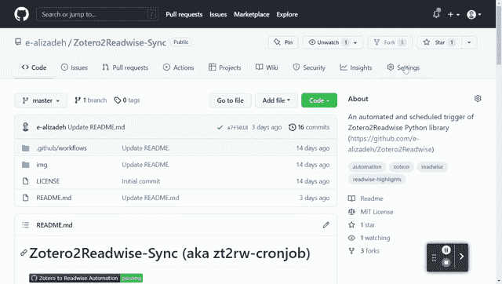
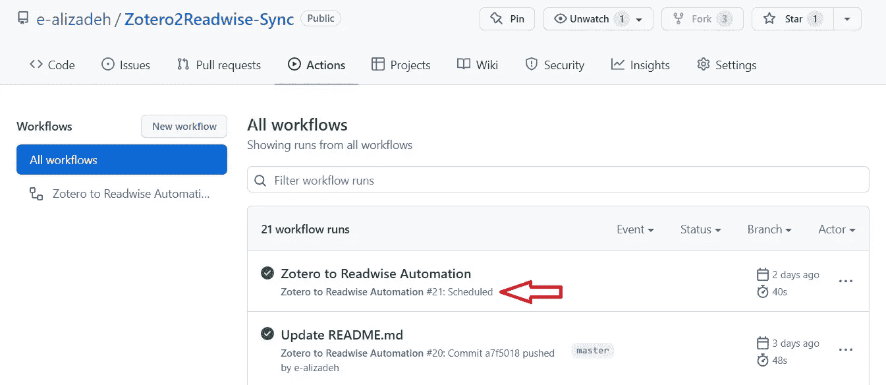

# 使用 GitHub 动作和 Cron 自动化您的工作流程

> 原文：<https://towardsdatascience.com/automate-workflow-github-actions-cron-130a8bf68ca6>

## 辅导的

# 使用 GitHub 动作和 Cron 自动化您的工作流程

## 了解如何使用 GitHub Actions 免费运行基于时间的任务/脚本


安德烈·德·森蒂斯峰在 [Unsplash](https://unsplash.com/) 上拍摄的照片

在本帖中，我们将介绍一个简单而强大的工具，它可以根据基于时间的计划自动运行你的脚本(或者你可以编程的任务)。

如果您经常手动运行脚本，那么您很有可能从自动化过程中受益，并设置一个自动运行的时间表，而不必担心它。就设置一次，然后就忘了它。

这种自动化的一些例子是:

*   解析 RSS 源并自动发送电子邮件，
*   在您正在使用但没有本地集成的两个服务之间进行集成！(本帖中有一个例子)，
*   从数据源提取数据并操纵数据，
*   *等*。

在这篇文章中，我交替使用了任务和脚本这个词。此外，GitHub Actions 用来创建自动化任务/脚本的 YAML 文件称为工作流文件。

# 要求:您希望按基于时间的计划运行的脚本

最重要的部分是有一个我们想要运行的脚本。这取决于你的任务是什么。我将带你看的例子是使用 [Zotero2Readwise](https://github.com/e-alizadeh/Zotero2Readwise) Python 库(*免责声明:我开发了这个库！*)。

我将在这篇文章中运行的脚本是这里的。因为我的脚本是用 Python 写的，所以，我会像下面的`python run.py <app1_token> <app2_password> <app2_user>`那样运行它。在我的个人笔记本电脑上运行这个很好，因为我已经设置好了一切。但是如何在 GitHub Actions 中按照预定义的时间表运行呢？

# 自动化前的考虑

你的剧本很可能会有所不同。然而，下面的提示可以帮助你开始:

首先，在您的系统上运行脚本。一旦您对结果感到满意，并且想要自动化工作流程，那么请按照下面的说明，使用 GitHub Actions 设置一个预定的工作流程。

当开发一个自动化任务时，考虑如何从一个新的操作系统开始运行它总是好的！这就好像你有一个新的系统，你试着在那里运行你的脚本。问自己几个问题:

*   我应该从哪里开始？
*   在运行脚本之前，我需要安装哪些软件/库？
*   在哪里可以找到我想要运行的脚本？
*   我是否需要传递一些环境变量或敏感信息，如密码？
*   我应该如何传递敏感信息，如密码或令牌？

我将为我的工作流程回答上述问题。希望这能给你足够的信息来自动化你的任务！

# GitHub 操作设置

首先，我们需要在我们的存储库中创建`.github/workflows`目录。这是我们的[自动化文件](https://github.com/e-alizadeh/Zotero2Readwise-Sync/blob/master/.github/workflows/automation.yml)(应该是`YAML`格式)所在的地方。我们将检查文件的每一部分。

你可以在这里学习 GitHub 动作[的基础知识。](https://docs.github.com/en/actions/learn-github-actions/understanding-github-actions)

任何 GitHub Actions 工作流的第一部分都是指定工作流何时触发。这可以通过使用`on`关键字来实现。因为我们想要一个预定的自动化，我们可以在一个使用`cron`符号的`schedule`上运行工作流(在下一节中讨论)。除了按计划运行之外，我还想在任何变更被推送到`master`分支时运行工作流。

您还可以在一个拉请求上触发您的工作流(使用`pull_request`关键字)。

# 克隆(克隆作业)

cron 工具，也称为 [cronjob](https://en.wikipedia.org/wiki/Cron) ，基本上是一个作业调度器。用于*安排重复性任务*。其语法由如下 5 个字段组成:

```
* * * * *
```

上面的 cron 作业语法意味着每分钟运行一个任务*。可以看出，下表给出了 5 个部分(*注意从左到右的顺序*)*

# *Cron 工作示例*

*下面的例子涵盖了 cron 语法的不同方面和所有有效字符(`* , - /`)。*

*   *您可以通过为每个部分选择一个有效的数字来指定您的计划。`*`表示“*每”* ( `* * * * *`表示*在一周的每一天，每月的每一天，每小时的每一分钟*🙂).再比如`30 13 1 * *`表示*在*月 1 日 13:30。*
*   *通过使用值列表分隔符`,`，给定部分可以有多个参数。例如，`* * * * 0,3`表示仅在周日和周三的每分钟*。**
*   *您可以使用`/`获得步长值。例如，`/10 * * * *`表示每 10 分钟一次*。**
*   *使用破折号`-`可以有一个数值范围。例如，`4-5 1-10 1 *`表示一月第 1 天到第 10 天之间 04:00 - 05:59 AM 之间的每一分钟*。**

*当然，你也可以有上述选项的组合。例如，`*/30 1-5 * 1,6 0,1`表示仅在 1 月和 6 月的周日和周一，01:00-05:59 AM 之间每 30 分钟一次*。**

**检查*[*crontab*](https://crontab.tech/)*或* [*crontab 专家*](https://crontab.guru/) *为你的日程安排提出 cron 语法。**

# *用例 1*

*正如我前面提到的，我想使用 [Zotero2Readwise](https://github.com/e-alizadeh/Zotero2Readwise) Python 库自动化我的 [Zotero](https://www.zotero.org/) 到 [Readwise](https://readwise.io/) 集成。让我们来回答我们之前提出的问题:*

# *应该从哪里入手？*

*我们可以从一个全新的 Ubuntu 系统开始。因此，我们在作业下面的部分指定了`runs-on: ubuntu-latest`，它将作业配置为在包含最新版本 Ubuntu Linux 的全新虚拟机上运行。*

*下一步是克隆当前的回购。你可以通过使用`uses`关键字允许我们使用来自[GitHub Actions market place](https://github.com/marketplace?type=actions)的任何动作来实现这一点。我们这里可以使用`actions/checkout`的`master`分支(也可以像`actions/checkout@v2`一样指定版本)。*

```
*- name: 🍽️ Checkout the repo
  uses: actions/checkout@master
  with:
    fetch-depth: 1*
```

# *我们必须安装哪些软件/库？*

*只有在必须安装库的情况下，才需要这一步。在我的情况下，我必须首先安装 Python 3.8。这可以通过使用`actions/setup-python@v2` GitHub 动作来实现。之后，我们要安装 python 包。我们可以通过运行`pip install zotero2readwise`来安装 [Zotero2Readwise](https://github.com/e-alizadeh/Zotero2Readwise) 包。然而，为了在转轮上执行命令，我们必须使用`run`关键字。*

```
*- name: 🐍 Set up Python 3.8
  uses: actions/setup-python@v2
  with:
    python-version: '3.8'- name: 💿 Install Zotero2Readwise Python package
  run: pip install zotero2readwise*
```

# *在哪里可以找到我想要运行的脚本？*

*如果您尝试运行的脚本位于同一个存储库中，您可以跳过这一步。但是在这里，由于我想要运行的 Python 脚本位于另一个 GitHub 存储库中，所以我必须使用`curl` Linux 命令下载脚本。*

*运行脚本*

*现在我们已经设置了我们的环境，我们可以像前面在需求部分提到的那样运行脚本了。*

*但是最后一点是，由于我们需要传递一些敏感信息(比如令牌)，我们可以通过将秘密传递给*设置→秘密→新存储库秘密*来实现。*

**

*如何将秘密传递到 GitHub 存储库的环境中(图片由作者提供)*

*这些秘密将可以使用下面的语法:`${{ secrets.YOUR_SECRET_NAME }}`在你的 YAML 文件中。*

*有关处理变量和秘密的更多信息，您可以查看 GitHub 文档中关于[环境变量](https://docs.github.com/en/actions/learn-github-actions/environment-variables)和[加密秘密](https://docs.github.com/en/actions/security-guides/encrypted-secrets)的以下两页。*

*现在我们已经添加了我们的秘密，我们可以如下运行脚本:*

# *把所有东西放在一起*

*包含上述所有步骤的文件如下所示。该文件位于 [GitHub](https://github.com/e-alizadeh/Zotero2Readwise-Sync/blob/50ca5d8475dec360538770bbbbaefa3067eaab5a/.github/workflows/automation.yml) 上。*

*完整的 GitHub 动作工作流文件。*

**

*GitHub 操作的截屏显示了工作流是如何按计划运行的，或者是如何通过推送到主分支的。(图片由作者提供)*

# *用例 2*

*按照上面的过程，我设置了一个 GitHub 页面的定期更新，每周运行两次。到目前为止，它一直工作得很好(到目前为止，写这篇文章已经一年多了)。这种自动化实现了以下功能:*

1.  *解析我的[个人博客](https://ealizadeh.com/blog)并获取标题和我最新文章的链接。*
2.  *将博客文章添加到我的 [GitHub README 页面](https://github.com/e-alizadeh)的一个部分。*
3.  *在页脚中添加关于自动生成的自述文件页面的日期和时间的注释。*

*你可以在 GitHub 上找到运行上述任务的文件。这个自动化还运行一个 [python 脚本](https://github.com/e-alizadeh/e-alizadeh/blob/main/src/update_latest_blog_posts.py)。*

# *GitHub 操作成本*

**GitHub Actions 对公共存储库免费使用。*然而，私有存储库的免费计划有一些限制(在发表这篇文章时，GitHub Actions 免费计划提供 2000 分钟(每月)和 500MB 的存储空间，这对大多数用例来说应该足够了)[1]。*

# *结论*

*在这篇文章中，我们看到了如何使用 GitHub Actions 根据时间表运行任务。天空是这里的极限。想想你目前经常运行的工作流或任务。如果您可以将任务放在可以在您的计算机上运行的脚本中(不管是 Python、Bash 还是任何其他脚本)，那么您实际上可以设置自动化。*

*感谢阅读🙏*

> *加入我的邮件列表，接收类似的帖子。也可以在[中](https://medium.com/@ealizadeh)、 [LinkedIn](https://www.linkedin.com/in/alizadehesmaeil/) 、 [Twitter](https://twitter.com/intent/follow?screen_name=es_alizadeh&tw_p=followbutton) 关注我。*

*👉*如果你喜欢阅读这样的故事(以及媒体上的其他故事)，也想直接支持我和数千名其他作家，可以考虑注册*[*https://medium.ealizadeh.com/membership*](https://medium.ealizadeh.com/membership)*来获得所有故事的全部访问权限(免责声明:如果你使用我的链接注册，我会为你赚取一小笔佣金，不需要额外费用。)**

*[](https://medium.ealizadeh.com/membership)  

# 参考

[1] [关于 GitHub 动作的计费](https://docs.github.com/en/billing/managing-billing-for-github-actions/about-billing-for-github-actions)* 

*👉*原载于*[*https://ealizadeh.com*](https://ealizadeh.com/blog/automate-workflow-github-cron)*

# *有用的链接*

*[](https://www.hostinger.com/tutorials/cron-job)  [](https://docs.github.com/en/actions/learn-github-actions/understanding-github-actions)  

## 您可能感兴趣的其他帖子:

[](/deploy-free-postgresql-database-in-heroku-and-ingest-data-8002c574a57d)  [](/a-guide-to-python-environment-dependency-and-package-management-conda-poetry-f5a6c48d795)  [](/visualize-data-transformation-using-pandastutor-6126627dd225) *