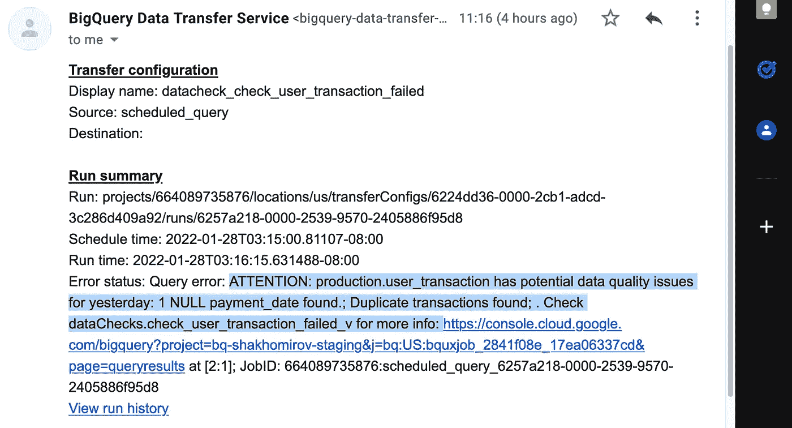
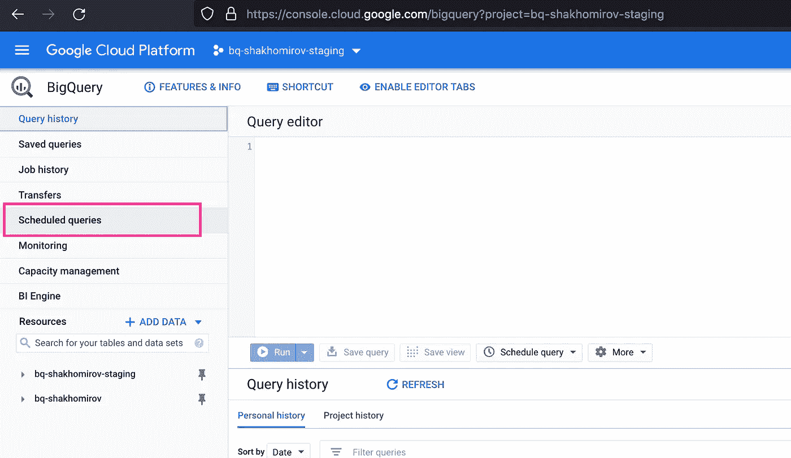
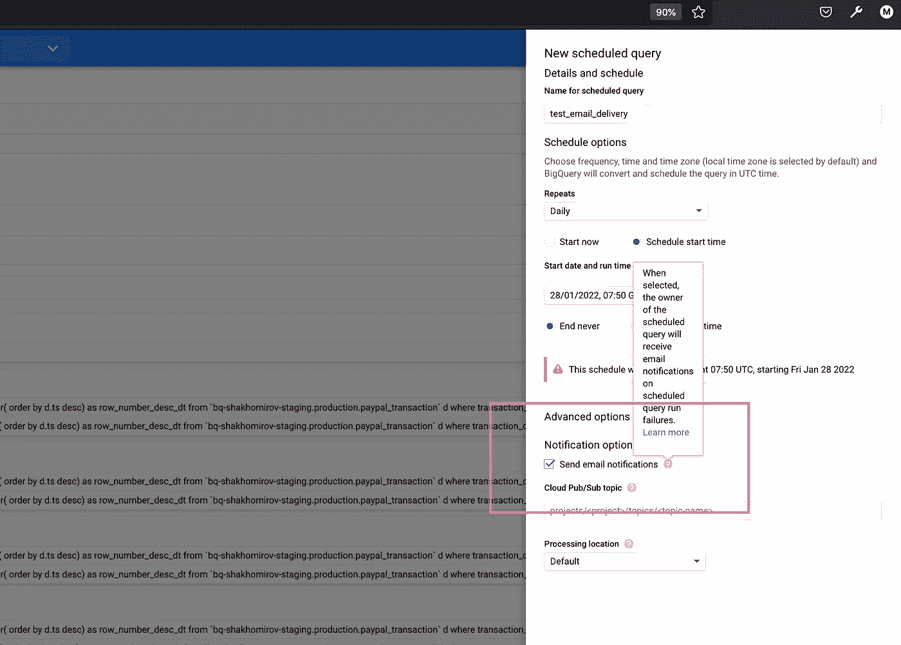
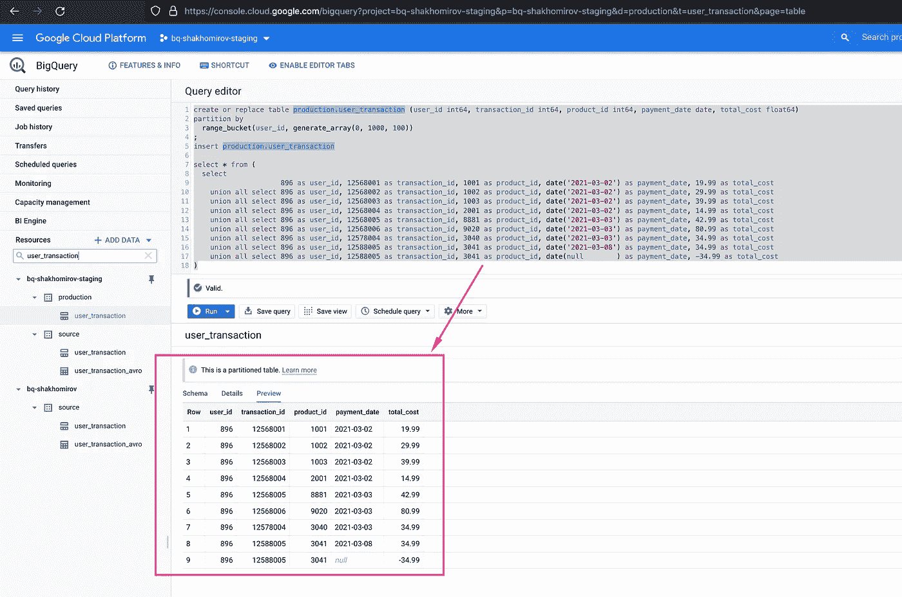
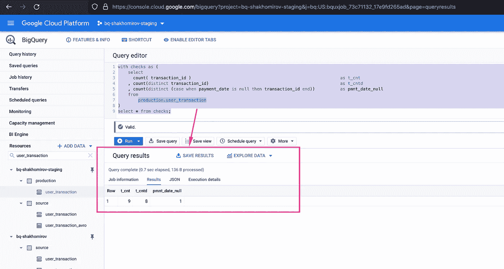
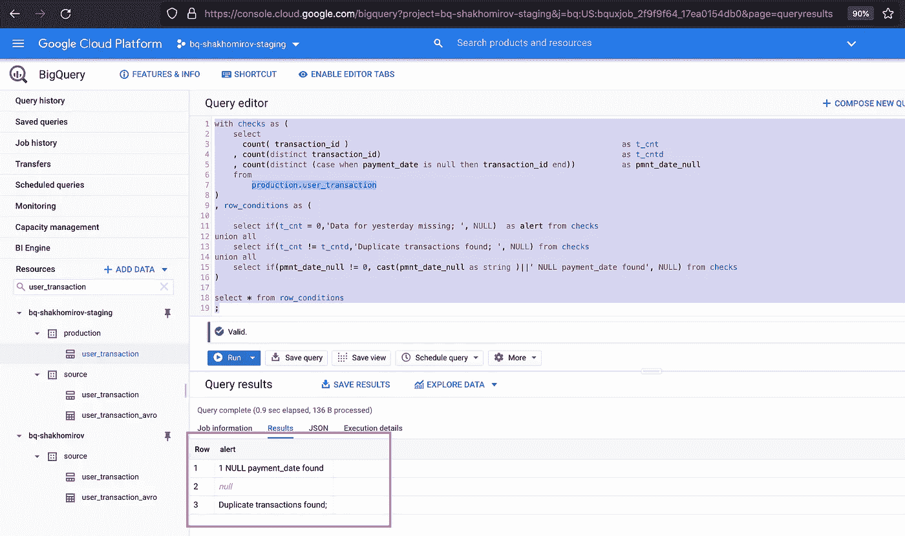
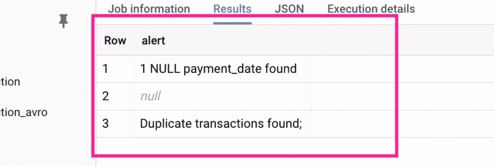
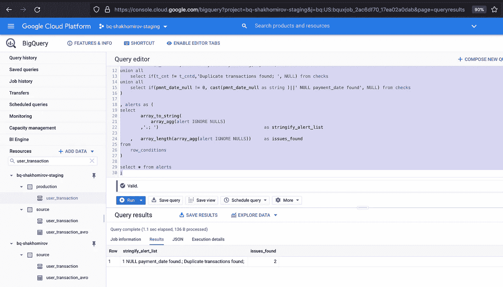
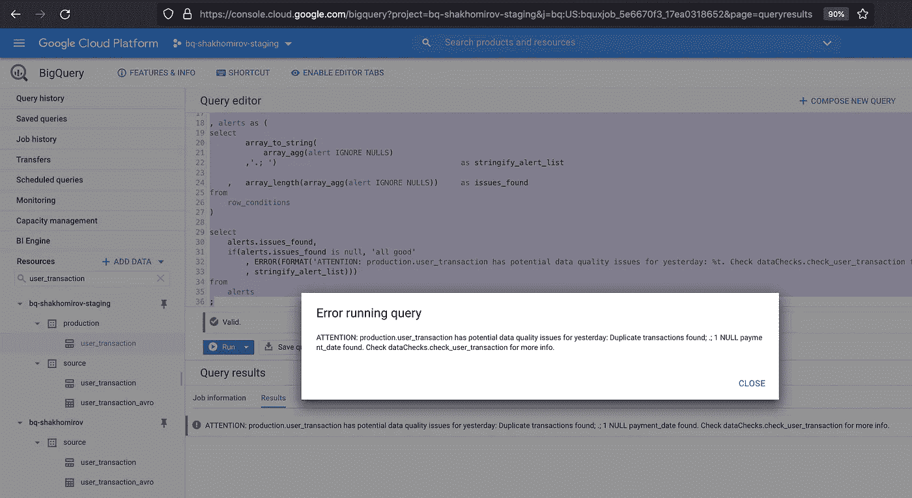
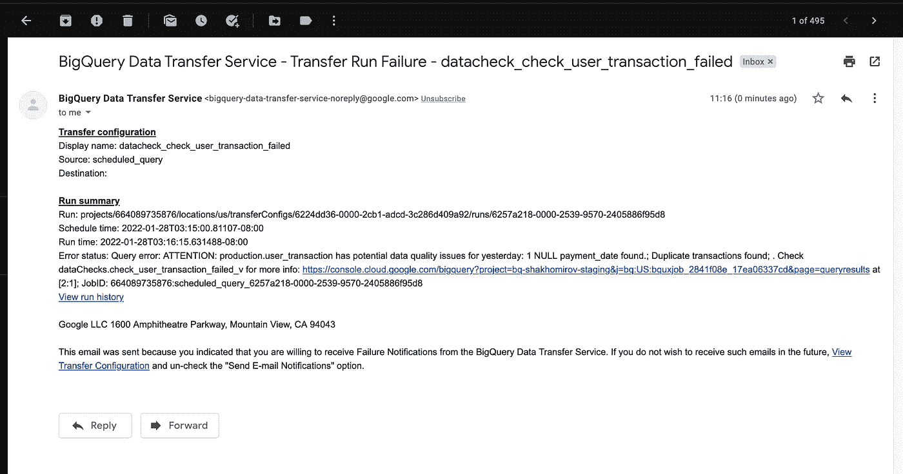

# 针对您的数据的自动化电子邮件和数据质量检查

> 原文：<https://towardsdatascience.com/automated-emails-and-data-quality-checks-for-your-data-1de86ed47cf0>

# 针对您的数据的自动化电子邮件和数据质量检查

## 通过预定的电子邮件获得更好、更干净数据的数据仓库指南

作者图片[💡迈克·沙克霍米罗夫](https://medium.com/u/e06a48b3dd48?source=post_page-----1de86ed47cf0--------------------------------)

# 用干净的数据构建数据仓库

如果您正在构建一个数据仓库解决方案或/和在数据库中运行一些管理任务，那么本文适合您。它回答了这个问题:

> 如何测试数据质量，并在出现问题时发送电子邮件通知。

理想情况下，每个数据用户都希望在数据出现任何异常时得到通知，尤其是当我们谈到关键的报告组件和字段时。

每个数据仓库可能有几十个数据管道源，它们来自 API、连接的数据库、像 Kinesis 或 Kafka 这样的数据流以及第三方数据提供商。我以前写过如何用 easy 连接所有这些，你可以在这里阅读我的设置:[如何用无服务器摄取管理器和 Node.js 处理 BigQuery 中的数据加载](/how-to-handle-data-loading-in-bigquery-with-serverless-ingest-manager-and-node-js-4f99fba92436)

因此，当数据来了，我想确保所有字段都准备好了，并有正确的格式。**例如，您的报告可能使用** `**date**` **列，并且您希望确保它在数据仓库中的格式正确，或者至少不为空(非空)。**

这里有一个简单而有效的框架。

# 先决条件、库和设置

*   **Google BigQuery** 。我将使用 **BigQuery** 作为数据仓库解决方案，因为它是免费的，但是您可以使用任何您喜欢的替代方案，例如雪花、红移、任何 db 引擎。他们中的大多数人无论如何都可以发送电子邮件通知。这就是一切。
*   **标准 SQL** 。这不是高级教程。这里提供的 SQL 可以在任何数据库引擎中工作，或者您可以调整它以满足您的需求。很容易。

**重要提示** : BigQuery 并不是完全免费的，但是 Google 提供免费的积分，即使你没有剩余的积分，我也会使用免费的数据进行查询。你所需要的就是 [Google 账户](https://console.developers.google.com/)和 **BigQuery API** 启用。

# 您将学习如何:

*   使用 SQL 检查数据质量
*   发送电子邮件通知
*   用 SQL 创建测试表和模拟数据
*   检测数据异常

# 如何安排电子邮件通知

在 BigQuery 中非常简单。

*   转到[预定查询](https://console.cloud.google.com/bigquery/scheduled-queries):

图片作者。[💡迈克·沙克霍米罗夫](https://medium.com/u/e06a48b3dd48?source=post_page-----1de86ed47cf0--------------------------------)

*   输入您的 SQL，即测试它的东西:`select 1 as test;`并点击下面的计划查询:

图片作者。[💡迈克·沙克霍米罗夫](https://medium.com/u/e06a48b3dd48?source=post_page-----1de86ed47cf0--------------------------------)

*   为您的查询命名，然后点击下面的**“发送电子邮件通知”**。所以现在，如果您的 SQL 查询**失败**，您将开始收到通知:

图片作者。@ MikeShakomirov

> 如果查询结果中的任何记录满足您指定的行条件，您现在需要做的就是引发一个异常。

# 如何使用行条件添加数据检查

基本上这就是你如何测试你的数据满足你需要的质量要求。

让我们试着想象一些现实生活中的场景，你的数据必须通过**质量保证**流程。*例如，我的暂存数据仓库中有一个* `*user_transaction*` *表，可以用您的 SQL 脚本创建:*

**让我们创建一个表格**

> *如果你像我一样遇到错误:* `*error: Cannot set write disposition in jobs with DDL statements*` *只要刷新你的页面就行了。*

当你的网页打开时间过长时，可能会出现一些界面元素失效的问题。

在这里阅读更多关于在 BigQuery 中创建表的信息:[https://cloud . Google . com/big query/docs/creating-partitioned-tables # SQL](https://cloud.google.com/bigquery/docs/creating-partitioned-tables#sql)

**结果:**

作者图片[💡迈克·沙克霍米罗夫](https://medium.com/u/e06a48b3dd48?source=post_page-----1de86ed47cf0--------------------------------)

## **现在我想检查数据是否有任何潜在问题**

在这里，我将计算带有缺失(NULL)值的记录，并检查您是否从 source pieline 中获得了任何重复项:

因此，您将看到事务总数大于唯一事务计数，并且有一个`payment_date`的值为`NULL`:

图片作者。[💡迈克·沙克霍米罗夫](https://medium.com/u/e06a48b3dd48?source=post_page-----1de86ed47cf0--------------------------------)

> *如果昨天在我的* ***数据仓库*** *中摄取的数据中检测到这种情况，我肯定希望收到电子邮件通知。*

## 那么我们该怎么做呢？

**让我们再添加一些 SQL 并引发一个异常**

这将触发电子邮件通知:

将引发错误(BigQuery 异常):

图片作者。[💡迈克·沙克霍米罗夫](https://medium.com/u/e06a48b3dd48?source=post_page-----1de86ed47cf0--------------------------------)

我会收到一封邮件说:

> ***注意:production.user_transaction 昨天有可能丢失数据:1。***

*很棒。但是，我希望在我的电子邮件中收到一份关于潜在数据问题的完整摘要。*

## **让我们总结一下所有潜在的数据质量问题**

我们可以使用类似于:

当我们的任何`checks`失败时，这将触发一个电子邮件通知，但不会提供太多信息:

> ***注意:production.user_transaction 存在潜在的昨天所有数据质量问题:%t.***

相反，我希望得到这样的结果:

> ***注意:production.user_transaction 有 1 个重复的事务和 1 个值为空的 payment_date。***

**让我们看看使用 SQL 需要做些什么来实现这一点**

要总结失败的数据质量检查，您可能需要使用以下内容:

## **结果:**

图片作者。[💡迈克·沙克霍米罗夫](https://medium.com/u/e06a48b3dd48?source=post_page-----1de86ed47cf0--------------------------------)

图片作者。[💡迈克·沙克霍米罗夫](https://medium.com/u/e06a48b3dd48?source=post_page-----1de86ed47cf0--------------------------------)

在上面的 SQL 中，我创建了一个 CTE，其中的行条件定义了我需要的警报。

> *我将使用它来生成数据质量警报的完整摘要，并将其包含在我的电子邮件通知中。*

使用 SQL 有很多方法可以实现这一点。它非常灵活，这也是我喜欢它的原因，但我决定使用 **BigQuery 数组函数**[https://cloud . Google . com/big query/docs/reference/standard-SQL/array _ functions](https://cloud.google.com/bigquery/docs/reference/standard-sql/array_functions)

## 让我们来看看怎么做:

## 因此，您将看到检测到的潜在数据质量问题的摘要文本消息:

图片作者。[💡迈克·沙克霍米罗夫](https://medium.com/u/e06a48b3dd48?source=post_page-----1de86ed47cf0--------------------------------)

图片作者。[💡迈克·沙克霍米罗夫](https://medium.com/u/e06a48b3dd48?source=post_page-----1de86ed47cf0--------------------------------)

## **最后，让我们用 BigQuery 异常来总结一下，这样它就可以给我们发送一封电子邮件:**

图片作者。[💡迈克·沙克霍米罗夫](https://medium.com/u/e06a48b3dd48?source=post_page-----1de86ed47cf0--------------------------------)

图片作者。[💡迈克·沙克霍米罗夫](https://medium.com/u/e06a48b3dd48?source=post_page-----1de86ed47cf0--------------------------------)

## 还有一件事…

**让我们创建那个** `**dataChecks.check_user_transaction_failed_v**` **视图，以便更容易找到没有通过质量检查的准确记录:**

图片作者。[💡迈克·沙克霍米罗夫](https://medium.com/u/e06a48b3dd48?source=post_page-----1de86ed47cf0--------------------------------)

图片作者。[💡迈克·沙克霍米罗夫](https://medium.com/u/e06a48b3dd48?source=post_page-----1de86ed47cf0--------------------------------)

因此，现在有了这个视图，我们就可以在收到通知时轻松调查数据质量问题。

有用的是，如果你能**在 **BigQuery 通知消息**中添加一个查看 URL 链接**，那么谷歌就能推断出这一点，你就能点击它:

图片作者。[💡迈克·沙克霍米罗夫](https://medium.com/u/e06a48b3dd48?source=post_page-----1de86ed47cf0--------------------------------)

# 结论

这是一个简单可靠的数据质量框架，大多数现代数据仓库都支持它。

最终，它允许**用视图检查您的数据**，并且**轻松检测潜在的数据质量问题**。不仅仅是缺失数据和空值。在数据集条件中，几乎可以使用任何东西，即使用 **regex 函数**检查数据是否满足特定模式或任何其他组合条件，其中**使用了多列**。

**需要异常检测吗？很简单。只需将 30 天移动平均线和阈值添加到数据集条件中，并在阈值被突破时收到电子邮件通知。**

# 资源

[【1】:https://cloud . Google . com/big query/docs/creating-partitioned-tables # SQL](https://cloud.google.com/bigquery/docs/creating-partitioned-tables#sql)

[【2】:https://cloud . Google . com/big query/docs/reference/standard-SQL/array _ functions](https://cloud.google.com/bigquery/docs/reference/standard-sql/array_functions)

*最初发表于*[T5【https://mydataschool.com】](https://mydataschool.com/blog/data-quality-guide-with-bigquery/)*。*