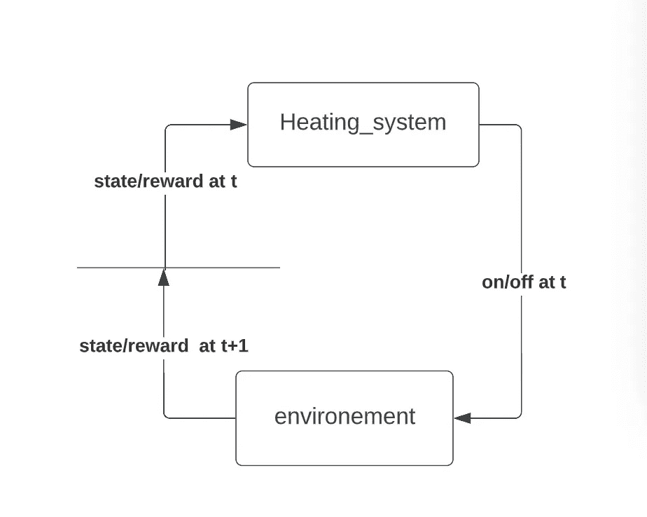

# 利用强化学习实现供热系统调度自动化

> 原文：<https://towardsdatascience.com/automatizing-the-heating-system-scheduling-with-reinforcement-learning-4146480d17b9>

## 一个基于我自己家庭经历的例子

在气候变化和能源危机的背景下，能源效率已经成为焦点话题。建筑物是能源消耗的主要来源，值得考虑采用明智的策略来提高能源的利用率。有人会争辩说全球范围内的事情离我太远了，但即使在今天能源越来越贵的背景下，即使从省钱的角度来说，这个问题也值得更多的讨论。

在这种背景下，我写这篇文章是受到我自己家庭经历的启发:

1.  我们有三个人，两个成年人和一个婴儿，都有不同的日常事务，即成年人去办公室或留在家里远程工作，婴儿在固定的工作日和工作时间去托儿所。
2.  成年人和婴儿对舒适度的**要求不同，即我可以忍受较低的温度，而婴儿必须保持温暖。此外，我们通常在睡觉时热量较少。**
3.  事实上，包括我们在内的大多数人都不知道我们的理想温度到底是多少。我们能做的，就是每次感觉冷的时候，按下暖气系统界面上的“加号键”。供暖系统会采取行动回应我们的要求，直到我们对环境满意为止。一般来说，**按下“加号按钮”告诉系统“我很冷”是我们用户与供暖系统的唯一交互**，它将无法访问其他信息。见下图。

作者图片:用户如何与供暖系统互动

我今天要讨论的问题是，供暖系统能否通过与用户的互动，学会执行最佳行动以节约能源并保证所有家庭成员的舒适水平。

为了简化问题，我假设供暖系统只有两种模式:开和关。

在这种背景下，我想建立一个强化学习模型，这样供暖系统将根据与用户的交互来决定何时打开和关闭，以便在保证所有家庭成员舒适的同时降低能耗。

# 供暖系统环境的模拟

让我们快速了解一下,[强化学习](https://en.wikipedia.org/wiki/Reinforcement_learning#Introduction)的目标是让代理(在我们的例子中是加热系统)通过与环境的交互，通过试错来学习最大化奖励函数的最佳行动。

我想建造一个简化的供暖系统环境(冬季),灵感来自我的家庭经历:

1.  有三个人两种不同的情况:在家或者不在家。他们每个人都有一个温度下限，即这个人会按下“加号键”来告诉系统“我冷”。当然，当没人在家时，不会有任何互动发生。此外，我们认为我们可以在晚上有较低的温度。没人在家时，温度设定为。
2.  我们每隔 10 分钟对模型进行离散化，即每隔 10 分钟计算一次室内温度，每隔 10 分钟记录用户是否按下按钮。因此，加热系统必须根据环境状态每 10 分钟执行一次动作。
3.  每种情况下的室内温度值取决于室内温度值以及最后一次加热是否开启。我们通过离散化由[节点](https://www.researchgate.net/publication/325614742_A_Dynamic_Model_for_Indoor_Temperature_Prediction_in_Buildings)描述的简化模型来计算它的值。

回到强化学习语言。在这个模拟中，RL 环境的状态由两部分描述:如果用户感觉冷(加热系统从交互中学习)和时间(星期几、小时、分钟)。并且代理或加热系统学习基于这样的状态来学习是开启(1)还是关闭(0)。

我们将奖励函数定义为:

**奖励=-总和(动作+1.5*(手感 _ 冷))，**

也就是说，每当暖气开着，家里有人感到冷时，我们就会受到惩罚。请注意，如果有人感到寒冷，我们会加大惩罚力度，以保证家中的舒适度。

作者图片:RL 系统图解

# 最佳行动的 q 学习

为了学习最佳行动，我们将应用简单而强大的 Q 学习算法。该方法用状态空间和动作空间维度的乘积的维度来构造 Q 表。它在每一步将相应单元的 Q 值更新为旧值和所获得的下一状态的新信息与当前状态和所执行的动作的加权平均值。

下面是 Q-learning 算法的核心部分:

# 自动化调度

现在环境和学习算法都建立起来了，我们现在要做的就是把每一块拼起来，学习供热系统的最佳调度。在 1e4 训练周期后，奖励从-1173 增加到-533。下面是一周的学习供暖计划(1 表示开，0 表示关，由灰点给出)和模拟室内温度(蓝线)的曲线图。橙色线代表室内温度的下限。你可以看到系统采取尽可能少的“开”动作，让室内温度保持在下限以上。

作者图片:供暖计划和一周内的室内温度

我还会给出另一个类似的情节，但只有一天的持续时间，在此期间没有人在家几个小时。你可以更清楚地看到，供暖会一直持续到家庭成员开始回家前 30 分钟。

供暖计划和一天内的室内温度

# 结论

在本文中，我举了一个例子，说明强化学习如何帮助供暖系统实现自动化，成功地节省了能源，并在一个受我自己家庭情况启发的模拟环境中保证了一定程度的舒适度。我相信，这一程序可以在其他建筑中实施，包括占用空间大得多的办公楼，供暖系统将从与用户的互动中学习，以达到全局最优的解决方案。