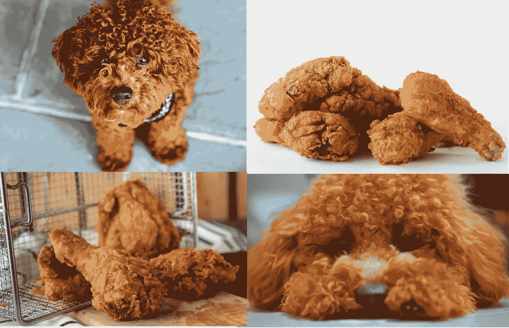
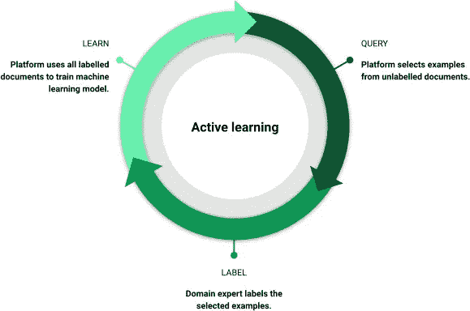

# 避免注释项目中的顶级陷阱

> 原文：<https://towardsdatascience.com/avoiding-top-pitfalls-in-annotation-projects-a3165c5e278f>

## 注释是困难的，并且经常导致整个 ML 项目的失败。

Imagenet 数据集上建模错误的著名例子:拉布拉多还是炸鸡？从左上顺时针依次为:[科里·兰克福德](https://unsplash.com/@cwlcreatives77?utm_source=medium&utm_medium=referral)在 [Unsplash](https://unsplash.com?utm_source=medium&utm_medium=referral) 上的照片、[沙尔达尔·塔里库尔·伊斯拉姆](https://unsplash.com/@tarikul_islam?utm_source=medium&utm_medium=referral)在 [Unsplash](https://unsplash.com?utm_source=medium&utm_medium=referral) 上的照片、[阿里翁·雷冯普特拉](https://unsplash.com/@arionrion?utm_source=unsplash&utm_medium=referral&utm_content=creditCopyText)在 [Unsplash](https://unsplash.com/s/photos/poodle-arion?utm_source=unsplash&utm_medium=referral&utm_content=creditCopyText) 上的照片、[沙尔达尔·塔里库尔·伊斯拉姆](https://unsplash.com/@tarikul_islam?utm_source=unsplash&utm_medium=referral&utm_content=creditCopyText)在 [Unsplash](https://unsplash.com/s/photos/fried-chicken?utm_source=unsplash&utm_medium=referral&utm_content=creditCopyText) 上的照片。

大多数机器学习项目都需要在某个时间点进行标注，无论是为了生成更多的训练数据，还是为了监控模型性能恶化的新测试集。在新的 ML 项目中，甚至可能没有标签模式(也称为标签分类法或本体论)。注释是大多数项目成功的关键步骤。如果你做错了，这将影响你所有的下游任务，并最终导致整个项目的失败。

## 但是为什么它如此重要呢？

*   获得正确的标签模式会对业务底线产生直接影响。想想那些将产品分成不同类别的电子商务网站。如果这些类别中有一个定义不当或含糊不清，**它将对流量和搜索引擎优化产生直接影响**，这意味着你可能会在不知不觉中减少你的某个产品领域的流量，因为你没有得到正确的模式。
*   如果你的公司或产品提供以人工智能为核心的服务，一个糟糕的注释模式最终会影响你预测的质量，增加客户流失。
*   更糟糕的是，标签不当的数据集最终会导致令人不快、危险甚至不道德的**错误。特别是在医疗保健等领域，确保敏感类别在数据中得到充分体现非常重要。**

> 第一个陷阱:你假设你的标签模式不会改变。

如果一个项目是新的，并且您第一次考虑注释模式，一个常见的错误是在早期修复模式，并将其视为新的模式。即使在成熟的 ML 项目中，标签模式随着时间的推移而演变也是很常见的，例如，新产品类别总是出现，或者新药被发布。注释既昂贵又耗时，因此模式中的任何变化都可能导致大量工作的浪费。

## **如何避免这种情况:**

*   *领域专家的多次初始迭代*

在新的 ML 项目中，与没有参与模式设计但是是你试图解决的问题的领域专家的人进行第一轮注释。然后再做几轮，直到模式变得稳定。您将看到，每一轮都会发现您的模式的新问题，要么是需要重命名的不明确的类别，要么是可能需要划分为不同子类别的巨大类别。在这一阶段，与能够从经验中思考潜在问题的领域专家密切合作非常重要。

*   *程序化标签*

[马丁·亚当斯](https://unsplash.com/@martinadams?utm_source=medium&utm_medium=referral)在 [Unsplash](https://unsplash.com?utm_source=medium&utm_medium=referral) 上的照片

使用编程标记也是一种强大的技术，可以帮助您避免浪费工作。您可以使用编程标签，使用单词列表或常见模式来粗略定义您的类别(例如，您的电子商务网站中“*鞋*”类别的鞋类列表)。这可以帮助您对所有标签类别的示例进行注释，并评估每个类别的大小。它还有一个额外的优点，如果以后您决定将模式分成“*夏装鞋*和“*冬装鞋*”，那么很容易回到您定义的模式并对它们进行调整。

> 第二个陷阱:您可能会通过指令或类名来偏向结果。

如果您正在使用没有参与标签模式设计的外部注释器，您将需要编写一些关于如何标记数据的说明，甚至可能提供模式中每个类别的定义和示例。这通常是注释项目中最难的部分，也是需要最多迭代才能得到正确结果的部分。

使用错误的说明，你可能会无意中给用户一些提示，让他们更喜欢某个类别。如果你为一个在数据中从未出现过的类别提供例子，用户可能不太倾向于选择那个类别，而不是一个在相同领域有例子的类别，因此看起来更熟悉。这是引导用户选择一个答案的一种方式，也是注释项目中偏见的一个主要来源。另一种偏向结果的方法是在界面中显示一些标签提示或建议。

类名也可能引入一些偏见。例如，如果你有一个包含“others”或“accessories”的类名，它可能会让用户认为这个类别比另一个更有针对性的类别更大。类似地，一个“杂七杂八”类型的类别也是一个常见的陷阱，用户可能会在不确定的时候选择它。

这些问题通常只有在几轮注释之后才会变得明显，一些症状可能是:类别比预期的大或小，或者只包含看起来像说明中提供的示例或提示的示例。

## 如何避免这种情况:

*   *使用注释器的多次早期迭代*

现在，您想用最终的注释者运行几个更大的注释测试批次，最终的注释者将执行大部分的注释工作，他们可能不同于您的领域专家。在这些最初的迭代中，强烈建议与这些注释器密切合作，甚至可能在最初与它们一起工作几个例子。

*   *让注释者更容易给出反馈*

照片由[迈尔斯伯克](https://unsplash.com/@milesb?utm_source=medium&utm_medium=referral)在 [Unsplash](https://unsplash.com?utm_source=medium&utm_medium=referral) 拍摄

您的接口需要为注释者提供一种提问和反馈的方式。由于您现在正在进行大规模的注释，您将会看到以前与领域专家一起测试时没有看到的新问题。另一个好主意是在注释者不确定答案时为他们添加一个选项。

> 第三个陷阱:你的问题空间不平衡，有些班级代表性不足。

类别不平衡将影响大多数项目，因为现实世界中的几乎所有过程都遵循幂律分布。对数据进行注释后，您的目标是获得代表问题空间的数据集，但它还需要提供较小少数类别的公平表示，以避免有害的偏见。找到最佳点也是注释数据的最具挑战性的问题之一。

电商产品品类阶层失衡的例子。图片作者。

## 如何避免这种情况:

*   *标注随机样本和分层样本*

鉴于您需要了解数据中的真实分布，建议您创建一个随机样本来进行注释。这将提供对标签分布的估计，并用于导出全局度量，如所有数据的微精度或召回率。

类别不平衡:注释时最大的挑战之一。照片由[威尔·迈尔斯](https://unsplash.com/@will_myers?utm_source=medium&utm_medium=referral)在 [Unsplash](https://unsplash.com?utm_source=medium&utm_medium=referral) 上拍摄

但是，如果存在代表性不足的类别，也建议您创建一个不同的数据样本进行注释，该样本将包含比真实世界中看到的数字更多的少数类别的示例。例如，在医疗保健方面，你可能希望确保你对罕见但严重的疾病有良好的覆盖，而不是更常见的良性疾病，因为这些类别中的错误可能更严重。这也是您可以考虑数据的伦理含义，并可能考虑对包含受保护属性的一些示例进行过采样的策略的时候。

*   *程序化标签*

如上所述，程序化标记是一种很好的技术，可以确保你在所有类别中进行标注，你可以用它在少数类别中进行粗略的分层抽样。例如，您可以创建最常与敏感类别相关联的单词列表，以确保将它们包含在注释集中。

> 第四个陷阱:你忽略或者没有量化歧义。

模棱两可无处不在，因为现实世界也大多模棱两可。在注释的情况下，您可能是前面提到的模糊性的来源，因为您提供了错误的指令或者选择了不明确的类名，或者您的数据本质上是不明确的，因为类别有一定程度的重叠。并不是所有不明确的情况都一定是不好的，在许多情况下，对一个标签或另一个标签进行分类并不被认为是一个严重的错误，也不会影响最终产品的性能。因此，记住最终产品是很重要的，并且在做这些决定时，一定要让领域专家参与进来。

## 如何避免这种情况:

*   *调整模式或指令*

有时你需要做的就是把一个类别分成几个类别或者修改你的指令。如果您(模式设计者)是不确定性的来源，这种方法通常会奏效。然而，情况并不总是这样，您可以很容易地改变模式，直到您的改变产生最小的影响。确保你总是理解错误的重要性，例如，在医疗保健中，将严重疾病与其他疾病混淆会导致致命的错误。

两张脸还是一个花瓶？图片由 Brocken Inaglory 通过 Wikimedia Commons 提供。[链接](https://commons.wikimedia.org/wiki/File:Two_silhouette_profile_or_a_white_vase.jpg)。

*   *接受这一点可能不会完全消失，但你可以量化它*

一些歧义将是数据空间的一部分，并且不能通过改变注释模式来解决。在这种情况下，看到同一个例子的注释者可能不会同意最终的标签，这意味着没有单一的基本事实(在这里它开始变得哲学化)。作为注释负责人，你至少可以确保你完全了解这些模糊之处，这样你就可以通知业务的其他部分，他们可能想利用这一点来改变产品，例如，通过添加免责声明或其他类别的链接，以便最终用户可以形成一个完整的画面。

通过对来自不明确类别的示例使用多个注释器，您甚至可以用一个数字来量化不明确的程度，例如“被某人归类为*鞋*的 30%的示例也被其他人归类为*鞋配件*”。机器学习模型也可以帮助您识别这些歧义，但是最终用于量化这些错误的级别和严重性的任何值都必须来自人类注释者。

最后，您还可以指定一名领域专家作为这些硬示例的仲裁者，并作为最终的决策者，以便您的最终标签是一致的。

> 第五个陷阱:你没有为你的 ML 模型获得足够的数据。

这可能是开始新项目的数据科学家最常被问到的最难的问题:*您需要多少数据？*如果不先进行一些数据分析，很难(如果不是不可能的话)做出估计。注释可能非常昂贵，因此获得正确的数字可能意味着为您的公司节省数千美元。

*   *保持紧密的反馈回路*

理想情况下，注释应该在多个批次中增量完成，直到您认为现在已经获得了足够的数据，但是您如何知道这个时间已经到来呢？尽早知道建模误差的主要来源是很重要的。这里的主要目标是快速识别和意识到 ML 模型最困难的类别。您的第一批注释应该生成一个测试数据集，您将能够在其中为您的业务计算所有重要的指标。每当您做一批新的注释时，您可以运行一个基线预测模型(不一定是您的最终模型)来获得一些基线度量，更重要的是，执行一些错误分析来识别您的 ML 模型的“更难”的例子，并理解错误的严重性。可能更强大的模型可以解决这些更困难的情况，但在这些类别中，数据越多，影响越大。

*   *利用主动学习*

主动学习循环。图片作者。

主动学习是一种在注释期间使用 ML 模型来选择用户接下来应该注释什么示例的技术。一种常见的抽样策略是选择模型最不确定的例子。这种类型的技术非常有助于确保您明智地分配您的注释预算，以便您注释最重要的示例，直到您获得一定水平的基线性能。

*   *程序化标签...又来了！*

另一个值得探索的领域是使用嘈杂的标签。一些模型能够从大量数据中正确地学习，即使标签并不都是正确的(大多数知名的开源数据集都有一定程度的错误！).这是一个被称为弱监管的活跃研究领域。只要您的测试数据集已经由人工注释者尽可能准确地进行了注释，您就可以比较在较小的人工注释数据集上训练的模型与在带有噪声标签的大得多的数据集上训练的模型的性能。获得嘈杂标签的一种方式是通过程序化标签，在这里你可以定义规则(例如“将标题中有*凉鞋*的所有产品标记为属于“*鞋*”类别)。如果这些规则具有很高的精确度，它们可以用于自动注释您的数据并创建大型训练数据集。值得一试！

# 概括一下

1.  做一些数据探索，使用编程标记来创建覆盖所有类的数据样本进行注释。
2.  如果这是一个可能需要新的或修改过的标签模式的项目，请与领域专家进行一些小的注释，直到您对该模式满意为止。
3.  如果您正在使用外部注释器，请使用它们进行一些中等规模的注释，并迭代这些指令。在这个阶段，为每个示例使用多个注释器来量化标签歧义可能是一个好主意。根据问题的类型和注释设置，您可能需要始终保持多个注释器。
4.  创建你的第一个测试集并放在一边。理想情况下，一个是随机样本，另一个使用过采样来平衡所有类别，并很好地覆盖敏感和少数类别。
5.  做大量的注释来创建第一个训练数据集。
6.  创建基线模型，获取基线测试指标，并确定最常见的建模错误类型。评估错误的严重性。在这个阶段，您可能需要领域专家的参与，并告知业务的其他部分 ML 模型可能会犯的潜在错误。
7.  选择对学习影响最大的新样本进行注释(例如，使用主动学习或编程标记)。
8.  重复前面两个步骤，直到你有足够的例子来减少敏感的错误，并涵盖模糊和难以分类的例子。

想通过应用本文中的技术来做智能标签吗？或者您正在开始一个新的注释项目，需要一些建议？请联系我们，我们很想知道:【https://dataqa.ai/】T2。*作者是* [*DataQA*](https://dataqa.ai/) *的创始人，这是一个为 NLP 任务高效标注和训练 ML 模型的平台。*

*更多关于标注为 ML 的内容，请关注我们的*[*Twitter*](https://twitter.com/DataqaAi)*和*[*LinkedIn*](https://www.linkedin.com/company/dataqa)*。*