# AWS 数据科学基础:存储

> 原文：<https://towardsdatascience.com/aws-essentials-for-data-science-storage-5755afc3cb4a>

## 了解和部署 S3、RDS 和 DynamoDB 服务


科技日报在 [Unsplash](https://unsplash.com?utm_source=medium&utm_medium=referral) 上拍摄的

你会把你的音乐、视频和个人文件存放在满是硬盘的车库里吗？我敢打赌……不会。除非你在过去的 15 年里避开了 [iCloud](https://www.apple.com/icloud/) 、 [Dropbox](https://www.dropbox.com/) 和[Google Drive](https://www.google.com/drive/)——如果你避开了，那就恭喜你！那么你很可能使用**云存储**。如果你丢失了手机，你可以找回你的短信；可以用链接分享文件，而不是海量的邮件附件；您可以按照片中的人来整理和搜索照片。

但是这些好处也延伸到了职业领域。如果你开了一家分享数据的公司，比如说，以低廉的月租费分享数以千计的 4K 电影和电视剧(😛)—您会希望将这些数据存储在云服务器上。当你关闭笔记本电脑时，云服务器不会关闭，你也不必担心邪恶的用户获取你的私人数据。

那么如何才能设置云存储呢？哪种存储类型最适合我们的数据？我们如何从代码中直接与云存储交互，而不需要在 UI 中点击？

本帖将回答这些问题。在展示如何在 **Amazon Web Services (AWS)** 中有效地存储[blob](https://en.wikipedia.org/wiki/Binary_large_object)、表格数据和 JSONs 之前，我们将设置我们的软件环境。(关于云行业的一般介绍，请查看[上一篇文章](/aws-essentials-for-data-science-why-cloud-computing-141cc6cee284)。)请继续关注关于云计算的另一个主要产品 *compute* 的后续文章。

# 背景

## 为什么选择云存储？

当你独自做一个小项目时，你可能不会过多考虑数据存储。也许你在 Jupyter 笔记本或 R 脚本的同一个文件夹中有几个 CSV。希望所有东西都备份到硬盘上了。

但是，当您想在项目中添加人员时，会发生什么情况呢？轮流使用笔记本电脑没有意义。您可以将数据复制到他们的笔记本电脑上，但是如果数据太多，队友的电脑装不下怎么办？一旦这项工作开始，同步数据集之间的变化将是一个令人头痛的问题。马上交出所有数据也是一种很大的信任——如果这个新人离开了，带走了所有的东西，与竞争对手或恶意行为者分享，怎么办？


作者图片

云存储旨在解决这些问题。和 Dropbox 或 Google Drive 一样，你可以简单地通过一个链接发送数据:“点击*这里*访问数据库。”通过微调访问规则，这些数据可以变成只读的——如果你的队友是竞争对手的间谍，你可以在他们下次试图获取数据时立即将这些 URL 变成错误消息。[1]

我们可以使用[**SDK**(软件开发工具包)](https://www.ibm.com/cloud/blog/sdk-vs-api)直接从我们的代码中访问数据，这对于将任何应用扩展到极少数用户之外是至关重要的。只要您的互联网连接可靠，您就应该能够随时访问数据，例如，AWS 保证正常运行时间为 [99.9%](https://aws.amazon.com/s3/sla/) 、 [99.99%](https://aws.amazon.com/dynamodb/sla/) 或 [99.999%](https://aws.amazon.com/blogs/publicsector/achieving-five-nines-cloud-justice-public-safety/) ，具体取决于您的应用。[2]

## 我在储存什么？

因此，我们看到将数据存储在云中是有用的，因此它是安全的，可通过代码访问，并且高度可用。但是“数据”是一个宽泛的术语——是原始视频和文本记录吗？用户档案和活动日志？Python 和 R 脚本？Excel 的颗粒状截图？

我们*可以*将我们所有的文件放入一个大的 Dropbox 文件夹中，照片与配置文件和 CSV 混合在一起。只要您知道包含所需数据的文件的名称，Dropbox 就会在需要时获取该文件。但是，除非文件严格包含您所请求的数据，否则您需要搜索整个文件以提取相关数据。

这个问题——不知道数据的确切位置——是随着数据量的增长，一个大的 Dropbox 文件夹让我们失望的地方。因为我们经常需要*搜索*符合某些标准的数据，所以 ***我们组织数据的方式*决定了我们的应用程序是可以支持 100 个用户还是 1 亿个用户。正如我们将会看到的，访问特定类型数据的最佳方式很大程度上取决于它的格式*。***

*这种格式，即*结构化*、*半结构化*或*非结构化*，是指数据在文件中的组织方式。**结构化**数据是您可能熟悉的行和列的表格集合:通常，每行是一个样本，每列是该样本的一个[特征](https://www.datarobot.com/wiki/feature/)。关系数据库中的表由结构化数据组成，如果表通过一个很好地划分数据的列进行 [*索引*](https://www.codecademy.com/article/sql-indexes) ，我们可以快速搜索这些数据。*

**

*作者图片*

***半结构化**数据包括 [JSON](https://www.w3schools.com/js/js_json_intro.asp) 、 [XML](https://www.w3.org/standards/xml/core) 、 [HTML](https://en.wikipedia.org/wiki/HTML) 和大型图表，其中的数据通常不能很好地适应列和行。这种格式非常适合分层数据，其中一个字段可能有子字段，许多子字段包含自己的子字段。**层数没有限制，但是*是*需要的结构。例如，一个 HTML 页面可以有许多嵌套在一起的`<div>`部分，每个部分都有独特的 CSS 格式。***

*最后，**非结构化**数据是原始的、未格式化的，不可能拆分成结构化数据的行和列，甚至是半结构化数据的嵌套字段，没有进一步的处理。不能或者不应该分解的非结构化数据的一个例子是**二进制大型对象**([**BLOB**](https://en.wikipedia.org/wiki/Binary_large_object)**s**)。例如，你通常想要一次加载整个图像，所以你不应该在一个文件中存储一半像素，在另一个文件中存储一半像素。类似地，[可执行程序](https://en.wikipedia.org/wiki/Executable)(例如，编译后的 C++脚本)是你总是想一次获取的实体。*

# *使用 SDK 时避免被黑客攻击*

*既然我们对可以存储在云中的数据类型有了概念，我们就可以开始试验针对每种类型优化的 AWS 服务。为了真正展示云的力量，我们将使用 AWS Python SDK 将这些服务集成到我们的代码中。要使用 Python SDK，我们只需安装`boto3`库。在终端或命令提示符下，我们只需键入以下命令:*

```
*pip install boto3*
```

*但是在我们运行任何脚本之前，我们需要做一件事来避免被黑客删除。**在我们的代码中，将我们的 AWS 凭证存储在一个安全的位置是至关重要的。***

*AWS 服务器每秒接收几十或几百个查询。如果服务器收到从您的 S3 存储桶下载文件的请求，服务器如何知道是阻止还是允许该操作？为了确保这个请求来自你或者代表你的机器**我们** [***用我们的 AWS 访问密钥 ID 和秘密访问密钥签署*我们的 API 请求**](https://docs.aws.amazon.com/general/latest/gr/signing_aws_api_requests.html) **。**这些密钥用于[加密我们的消息内容](https://www.okta.com/identity-101/hmac/)并且[生成一个哈希](https://docs.aws.amazon.com/general/latest/gr/signature-version-4.html)来证明 AWS 收到的消息与我们发送的消息相同。*

*因此本质上，AWS 收到的任何用您的访问密钥签名的请求都将被视为来自您。因此，确保您是唯一执行这些请求的人非常重要！*

**

*作者图片*

*`boto3`当我们实例化一个客户机对象时，要求我们传递我们的访问密钥 ID 和秘密访问密钥。从技术上讲，我们可以通过将访问键定义为变量，然后像这样传递它们:*

*但是这是一个巨大的安全漏洞，因为任何阅读这段代码的人都可以冒充你！如果您不小心将这个文件推送到 Git 这样的版本控制系统，删除第 4-5 行并推送到一个新版本是不够的——任何人都可以滚动文件的历史来找到您的密钥。*

*MacOS 和 Linux 用户可以将这些 [**秘密**](https://secrethub.io/blog/what-is-secrets-management/) 存储在`.bash_profile.rc`或`.zshrc`文件中，而不是在 Python 中硬编码这些值。([见此处](https://saralgyaan.com/posts/set-passwords-and-secret-keys-in-environment-variables-maclinuxwindows-python-quicktip/)为视窗。)该文件包含文件路径的别名(例如，当您键入`python`时，终端知道您指的是`/opt/homebrew/bin/python`)，以及数据库密码或其他敏感信息。这个文件位于你的根目录下，是隐藏的——要找到它，你需要键入`⌘` + `.`才能看到它。*

*在这个文件中，我们可以设置 AWS 访问键。(注意等号两边没有空格。)*

*一旦我们这样做了，我们就可以通过 Python 的`os`模块访问我们的变量。通过访问来自`os.environ`的值，任何阅读代码的人都不会看到它们。[3]*

*至此，我们已经准备好开始使用 AWS 了。*

**

*作者截图*

# *S3:简单的存储服务*

*S3 或简单存储服务是 Dropbox 或 Google Drive 最接近的类似物。把 S3 想象成你的文件的“包罗万象”。只需创建一个**桶**(即不同的目录)并上传 [*任意*任意*类型*](https://docs.amazonaws.cn/en_us/AmazonS3/latest/userguide/upload-objects.html)的任意数量的文件——文本、CSV、可执行文件、Python pickle 文件、图像、视频、压缩文件夹等。只需点击几下鼠标，即可定义文件、文件夹、[4]或存储桶级别的访问规则。*

*这种简单性的缺点是 S3 只包含关于文件的数据，而不是文件里面的内容。所以，如果你忘记了你的脸书密码，并且不能在你的文本文件中搜索短语`my Facebook password is`，那你就太不幸了。如果我们需要在我们的文件中搜索数据，我们最好将数据存储在数据库中。[5]*

*但是即使有了数据库，S3 仍然是存储生成这些数据的原始数据的理想选择。S3 可以作为日志、物联网应用的原始传感器数据、用户访谈的文本文件等的备份。一些文件类型，如图像或训练有素的机器学习模型，最好保存在 S3，数据库只需存储对象的路径。*

## *使用 S3*

*让我们实际创建一个桶。不要担心 AWS 会收取存储数据的费用——我们会保持在[自由层](https://aws.amazon.com/free/)的范围内，一旦完成，就会删除所有内容。我们将创建一个 bucket，然后上传和下载文件。我们将使用控制台、AWS CLI 和 Python SDK 来执行这些步骤，但是请注意，我们可以使用任何一种工具来执行所有步骤。*

*让我们从控制台开始创建一个 bucket。我们首先[登录我们的 AWS 账户](https://aws.amazon.com)(最好使用一个 [IAM 角色](http://localhost:4000/AWS-Intro/#iam-identity-and-access-management))并导航到 S3。然后，我们只需点击“创建存储桶”按钮:*

*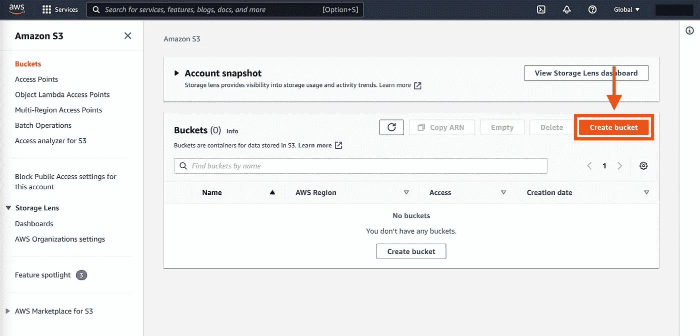*

*作者截图*

*当我们创建一个 bucket 时，我们需要给它一个在所有 AWS buckets 中全局唯一的名称。这里我们创建一个名为`matt-sosnas-test-bucket`的。*

*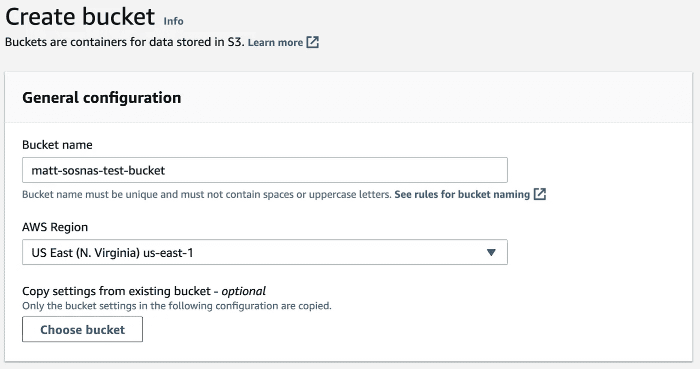*

*作者截图*

*我们的 bucket 可以有定制的访问规则，但是现在让我们保持禁用公共访问。一旦我们选择了那个，我们的桶就准备好了。*

*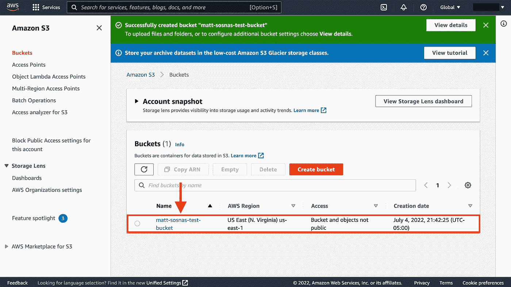*

*作者图片*

## *上传文件*

*现在让我们切换到 AWS CLI。在终端或命令提示符下，我们可以使用以下命令看到我们的新 bucket。(您可能需要按照步骤[进行认证，此处为](/aws-essentials-for-data-science-why-cloud-computing-141cc6cee284))。*

*我们现在可以创建一个文件，并将其上传到我们的 bucket。为了简单起见，我们将通过用`echo`和`>`将一个字符串传送到一个文件中，直接从命令行创建一个文件。然后我们将使用`aws s3 cp <source> <destination>`上传文件。*

*我们现在可以用`aws s3 ls <bucket_name>`查看我们的文件。*

*如果 S3 文件路径包含一个文件夹，AWS 会自动为我们创建一个文件夹。我们这次创建一个 Python 文件，`test.py`，并上传到我们 bucket 中的一个`python/`目录。因为`s3://matt-sosnas-test-bucket/python/test.py`包含一个`python/`目录，S3 将为我们创建一个。*

*现在当我们用`aws s3 ls`查看内容时，我们看到根目录中`test.txt`旁边的`python/`文件夹。如果我们在命令中将`/python/`添加到我们的 bucket 名称的末尾，我们就可以看到文件夹的内容。*

*最后，我们可以通过指定`--recursive`、`--exclude`和`--include`标志来上传多个文件。下面，我们创建两个 CSV，`file1.csv`和`file2.csv`，首先创建标题，然后各追加两行。然后，我们使用 AWS CLI 将当前目录(`.`)中匹配`file*`模式的所有文件上传到我们的 bucket 中的`csv/`文件夹。最后，我们列出了`csv/`文件夹的内容。*

## *下载文件*

*上传文件很好，但是在某些时候我们会想要下载它们。让我们使用第三个工具 Python SDK `boto3`来演示下载文件。这一步比一行 AWS CLI 命令更复杂，但是我们将在下面一行一行地进行。*

*我们先导入`boto3`、`io.StringIO`、`os`、`pandas`。`boto3`包含与 AWS 交互的代码，`io`是一个用于处理[流数据](https://en.wikipedia.org/wiki/Stream_(computing))的库，`os.environ`存储我们的 AWS 凭证，`pandas`将把我们的 CSV 转换成 dataframe。*

*在第 7–12 行，我们实例化了一个`boto3`客户端，它允许我们向 AWS 发出请求。我们执行这样一个请求，从第 15-18 行的`matt-sosnas-test-bucket`中获取`csvs/file1.csv`文件。这个对象打包了元数据，所以我们提取第 21 行的字节字符串，在第 22 行将其解码为 CSV 字符串，最后在第 23 行将该字符串解析为 dataframe。*

*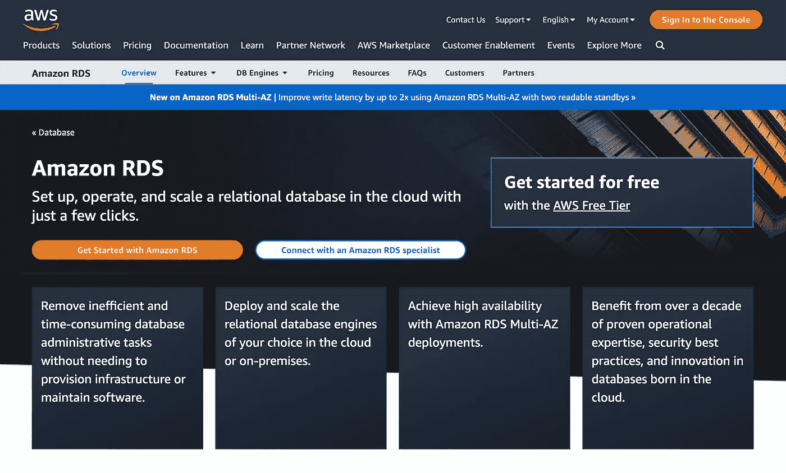*

*作者截图*

# *RDS:关系数据库服务*

*把我们所有的数据都扔进一个桶里，即使文件类型是按文件夹排列的，也只能做到这一步。随着数据的增长，我们需要一种更具可扩展性的方法来查找、连接、过滤和计算数据。关系数据库是更好地存储和组织数据的一种方式。(参见[这篇文章](/a-hands-on-demo-of-sql-vs-nosql-databases-in-python-eeb955bba4aa)了解数据库的入门知识。)*

*我们*可以*在云中租用一个 EC2 实例(即虚拟服务器),然后自己安装一个 MySQL 或 PostgreSQL 数据库。但这比在我们车库的服务器上托管数据库好不了多少[——虽然 AWS 将处理服务器维护，但我们仍将负责扩展、可用性、备份以及软件和操作系统更新。对于稍微增加的成本，我们可以使用类似于](https://docs.aws.amazon.com/AmazonRDS/latest/UserGuide/Welcome.html) [**Amazon RDS**](https://aws.amazon.com/rds/) 的服务，让 AWS 管理除我们实际数据之外的一切。*

*所以让我们在 RDS 中创建一个数据库。我们将登录 AWS 控制台，导航到 RDS，然后单击`Create database`。如果您阅读了针对所有人的中间 SQL，那么您可能已经安装了 Postgres 数据库的 GUI。既然我电脑上已经有 pgAdmin 了，那就用 Postgres 吧。🙂*

*在设置向导中，选择`Standard create`作为创建方法，选择`Postgres`作为引擎。*

*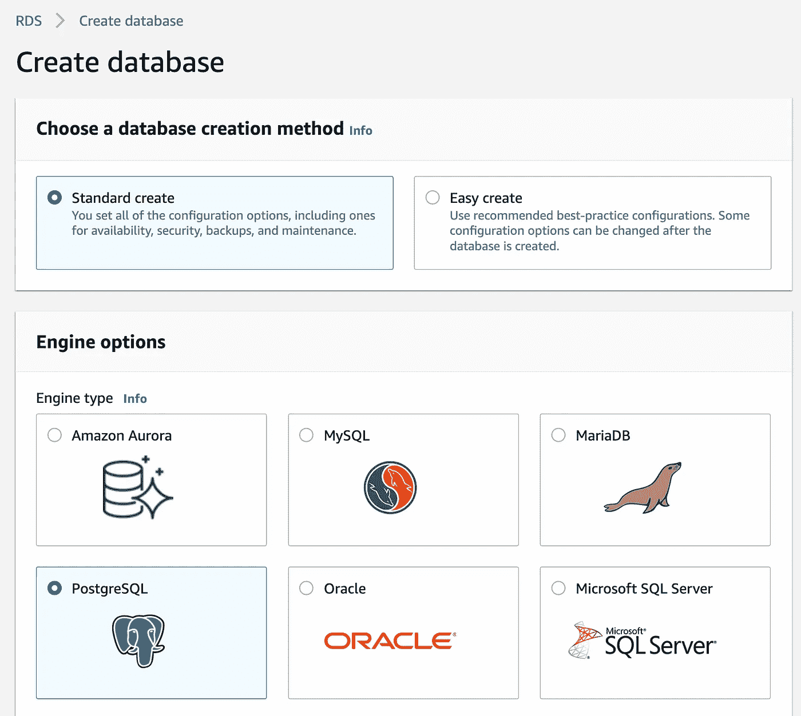*

*作者截图*

*确保指定您想要使用空闲层！*

**

*作者截图*

*命名您的数据库标识符并设置一个用户名—`postgres`对两者都很好——并确保在安全的地方写下您的密码。禁用自动缩放(在“存储”下)，并为公共访问选择是。我们的数据库不会真正对世界开放，不要担心——我们仍然需要密码才能访问数据库。(不过，对于专业应用程序，您可能需要[配置一个 VPC](https://docs.aws.amazon.com/AmazonRDS/latest/UserGuide/USER_VPC.WorkingWithRDSInstanceinaVPC.html) 。)*

*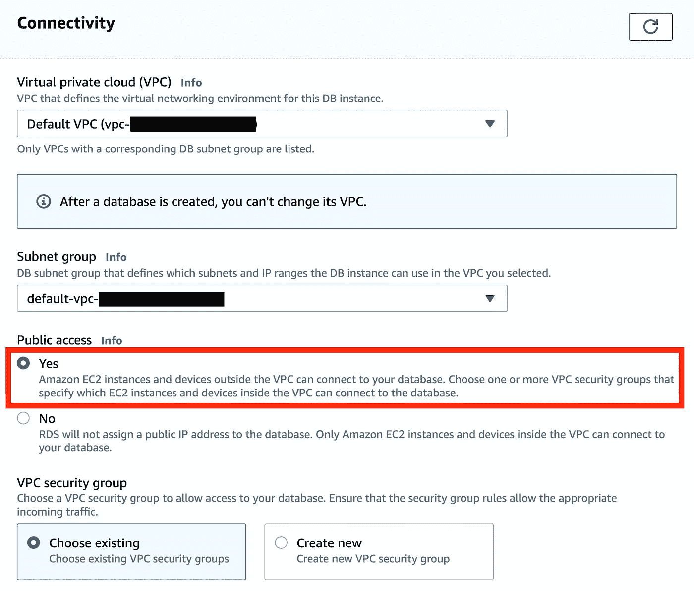*

*作者截图*

*在“附加配置”下，命名您的初始数据库`my_database`，然后禁用自动备份、性能洞察和次要版本升级。配置中的其他一切都可以保持不变。*

*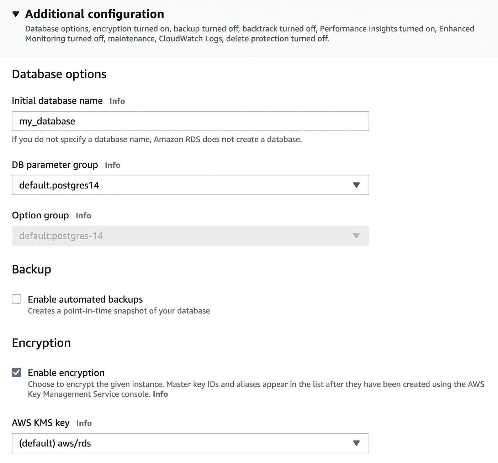*

*作者截图*

*当我们点击`Create database`时，我们被带回 RDS 登录页面，看到我们的数据库正在创建。完成后，您可以单击该实例并转到下一页。在此页面上，单击“安全”下的 VPC 安全组链接。*

*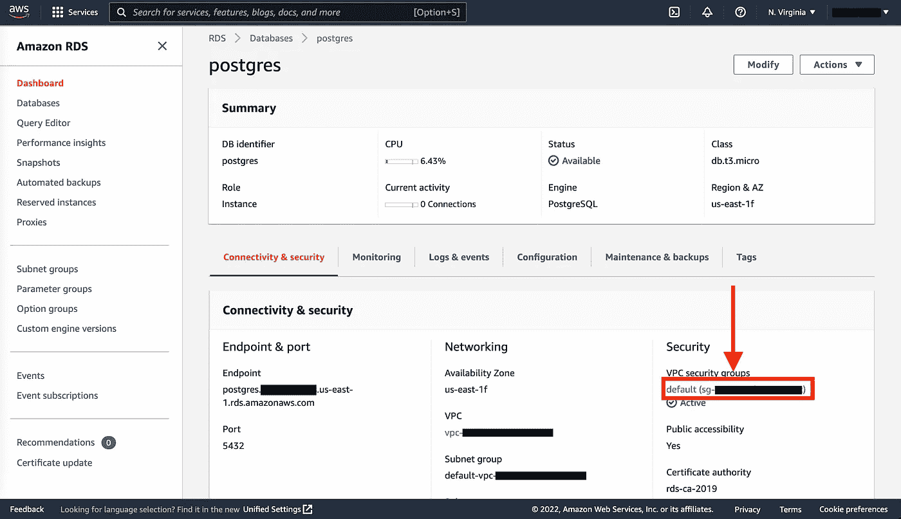*

*作者截图*

*在这里，我们可以向下滚动到`Inbound rules`选项卡，点击`Edit inbound rules`，然后点击`Add rule`。为`Type`选择“PostgreSQL”，为`Source`选择“Anywhere-IPv4”。(友情提醒，不要对生产数据库这样做！)您也可以通过[指定您的 IP 地址](https://www.avast.com/c-how-to-find-ip-address#)来提高安全性。完成后，点击`Save rules`。*

*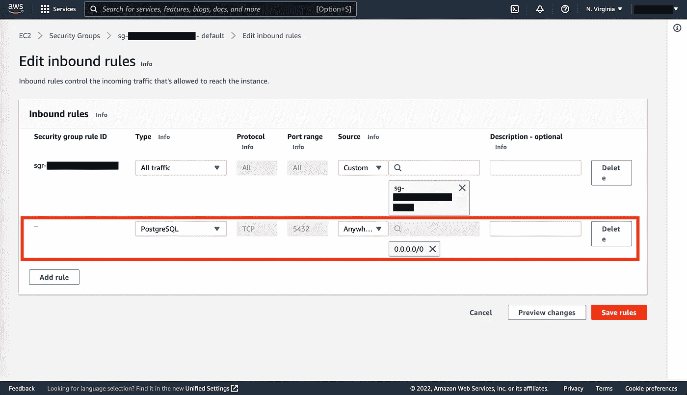*

*作者截图*

*现在对出站规则做同样的操作:单击`Outbound rules`选项卡、`Edit outbound rules`、`Add rule`、`Type`的“PostgreSQL”和`Destination`的“Anywhere-IPv4”(或您的 IP 地址)，然后单击`Save rules`。*

*我们现在将从 pgAdmin 访问我们的数据库。在 AWS RDS 的 Connectivity & security 选项卡下，复制端点地址。(看起来有点像`postgres.abcdef.us-east-1.rds.amazonaws.com`。)然后打开 pgAdmin，右键点击 Servers >注册>服务器。将连接命名为类似于`aws_rds_postgres`的名称，并将端点地址粘贴到主机名/地址字段中。填写您的密码并点击“保存密码”。*

*如果一切顺利，您应该会看到`aws_rds_postgres`服务器和`my_database`数据库。*

**

*作者截图*

*右键点击`my_database`，然后点击`Query Tool`，输入以下内容:*

*由于我们使用免费层，不幸的是我们只能通过 pgAdmin 查询我们的数据库，而不是 AWS 控制台或`boto3`。(尽管我们*可以* [对数据库本身进行修改](https://docs.aws.amazon.com/cli/latest/reference/rds/)。)但是为了确保上面的操作有效，请在 pgAdmin 中键入以下内容，以确认我们可以查询我们的数据库。*

*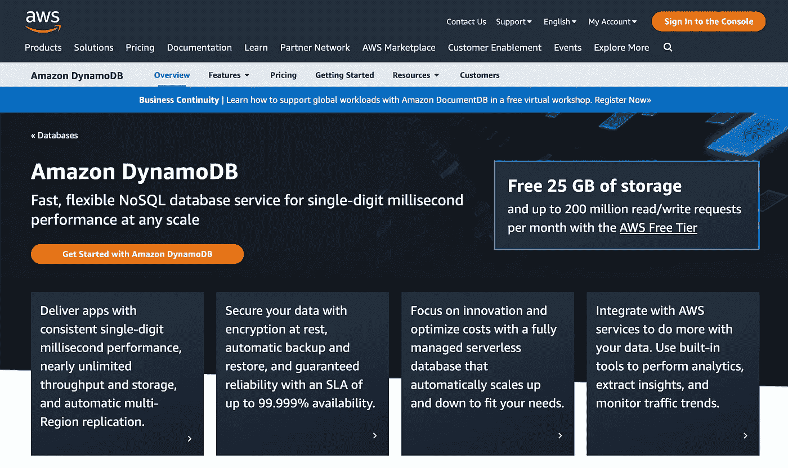*

*作者截图*

# *DynamoDB*

*让我们讨论最后一种数据库类型:非关系数据库。AWS 为创建和查询 NoSQL 数据库提供了 DynamoDB。*

*谢天谢地，DynamoDB 比 RDS 更容易设置。我们将从导航到 AWS 控制台内的 DynamoDB 并点击`Create table`按钮开始。让我们创建一个名为`users`的表，用`id`作为数字分区键。然后，点击`Customize settings`。*

**

*作者截图*

*选择`DynamoDB Standard`作为表类，选择`Provisioned`作为容量，然后关闭读取和写入的自动扩展，并将配置的容量单元数量减少到各 1 个。*

*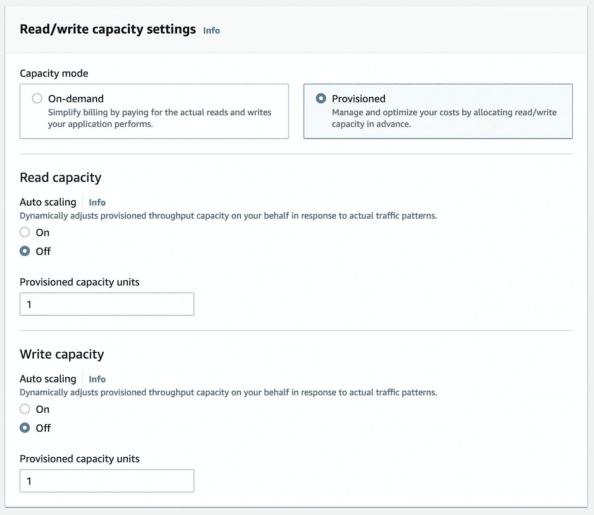*

*作者截图*

*让加密归亚马逊 DynamoDB 所有，然后点击`Create table`。*

*还有…就是这样！现在让我们导航到 Python 来写入我们的表。在 Jupyter 笔记本或 Python 脚本中，运行以下命令:*

*写入 DynamoDB 的语法相当明确——我们需要指定正在编写的字典的每个元素的数据类型。参见`[boto3](https://boto3.amazonaws.com/v1/documentation/api/latest/reference/services/dynamodb.html#DynamoDB.Client.put_item)` [DynamoDB 文档](https://boto3.amazonaws.com/v1/documentation/api/latest/reference/services/dynamodb.html#DynamoDB.Client.put_item)中的一些例子。但总的来说，请注意我们如何能够在`favorite_movies`下保存电影列表，并为用户 456 编写一组不同的字段。这种灵活性是 NoSQL 数据库的特点。*

*如果上面的代码运行没有错误，那么我们应该在 DynamoDB 控制台中看到这些记录。点击我们的`users`表，然后点击`Explore table items`。*

*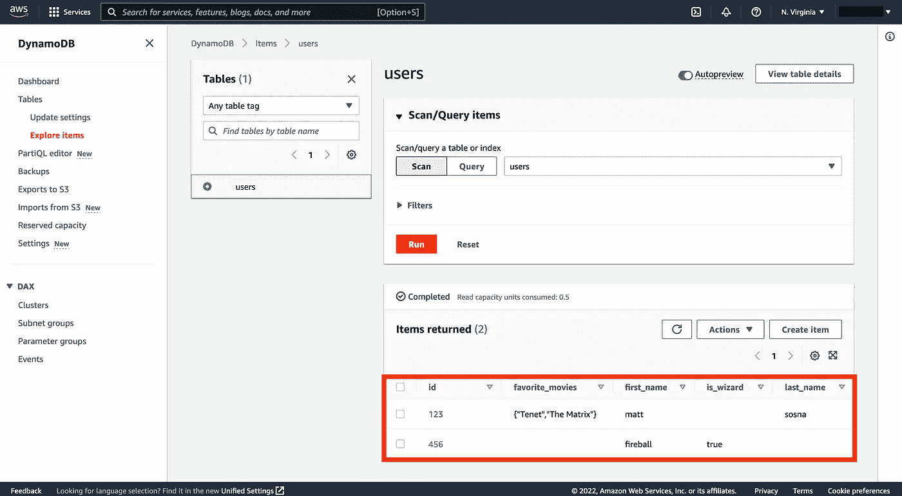*

*作者截图*

*最后，我们还可以从 Python 中获取对象。*

**

*简·kopřiva 在 [Unsplash](https://unsplash.com?utm_source=medium&utm_medium=referral) 上拍摄的照片*

# *清理*

*在这篇文章中，我们建立了一个 S3 桶、关系数据库和 NoSQL 表。尽管我们使用 AWS 的免费层，并且每个数据源仅存储极少量的数据，但我们仍然希望拆除每个数据源，以避免最终被收费。*

*谢天谢地，删除很简单。在 S3，我们只需点击我们的桶，然后点击`Empty`按钮。确认我们要删除所有内容。然后再次点击我们的桶，并点击`Delete`按钮，确认我们希望桶消失。*

*在 RDS 中，我们只需点击我们的数据库(`postgres`)，然后`Actions`，然后`Delete`。确保避免在删除之前拍摄数据库的最终快照。*

*最后，对于 DynamoDB，我们点击`Actions` > `Delete table`，然后确认我们不想要 [Cloudwatch](https://aws.amazon.com/cloudwatch/) 警报。*

*就是这样！友情提醒，千万不要这样对你公司的生产数据。🤓*

**

*照片由[亚当·威尔森](https://unsplash.com/es/@fourcolourblack?utm_source=medium&utm_medium=referral)在 [Unsplash](https://unsplash.com?utm_source=medium&utm_medium=referral) 上拍摄*

# *结论*

*这篇文章介绍了云存储的好处以及我们可能实际存储的各种数据格式:*结构化的*数据用于表格数据，*半结构化的*用于不适合列和行的数据，以及*非结构化的*用于原始和未格式化的数据。*

*然后，我们为每一个构建了优化的数据源。我们创建了一个 S3 桶作为日志、CSV、照片和任何我们能想象到的东西的“包罗万象”的来源。然后，我们为结构整齐的表格数据构建了一个 RDS 数据库。最后，我们使用 DynamoDB 编写了具有不同键和数据格式的 Python 字典。*

*当然，还有很多其他的 AWS 数据存储服务我们没有在这里介绍。 [AWS Glue](https://aws.amazon.com/glue/) 和 [Athena](https://aws.amazon.com/athena/) 允许您直接在 S3 桶中的文件上运行 SQL 查询(有一些严重的警告[5])。 [AWS Redshift](https://aws.amazon.com/redshift/) 是一个数据仓库，它让您可以组合来自多个来源(包括 S3、RDS 和 DynamoDB)的数据，从而更容易地运行分析。AWS Cloudwatch 是一个日志监控和警报服务。*

*凭借您在这篇文章中获得的技能，您应该已经具备了开始构建更大、更复杂的云存储应用程序的基础。在下一篇文章中，我们将通过讨论*计算*来结束我们的 AWS 系列，其中我们将使用 AWS 服务器来运行数据计算。那里见！*

*最好，
哑光*

# *脚注*

## *1.为什么选择云存储？*

*虽然我们可以撤销用户对云数据的访问权限，但当然总是会担心用户制作了本地副本。这个问题没有真正好的答案*

*一旦那个人离开你的团队，我们不能让下载的数据自毁。对于来自 S3 的文件来说，希望不大，但是至少对于来自数据库的数据来说，下载所有的东西是不切实际或者不可能的。在 Meta 这样的公司，数据访问受到严密监控，从访问包含敏感数据的表格到下载数据的任何时间。*

## *2.为什么选择云存储？*

*99.999%的正常运行时间是一个很难想象的数字。每年，[“五个 9”](https://docs.aws.amazon.com/wellarchitected/latest/reliability-pillar/s-99.999-or-higher-scenario-with-a-recovery-time-under-1-minute.html)表示 AWS 保证不超过 5 分 15 秒不可用。*

## *3.使用 SDK 时避免被黑客攻击*

*我们可以对不太敏感的数据使用类似的过程，比如常量或文件路径。*

*通过将这些值存储在一个配置文件中，我们可以保持主工作流的整洁:*

*如果 config.py 存储了我们不想让其他人看到的数据，我们可以将它添加到我们的`.gitignore`文件中，Git 不会试图对它进行版本控制。下面，Git 不会跟踪名称中带有`.ipynb`、`.pyc`或`config.py`的文件。*

```
*.ipynb
.pyc
config.py*
```

## *4.S3:简单的存储服务*

*一个迂腐的注解:S3 [的“文件夹”*并不真正*存在](https://docs.aws.amazon.com/AmazonS3/latest/userguide/using-folders.html)。它们更像是组织数据的人性化方式。*

## *5.S3:简单的存储服务*

*您*可以*像对待数据库一样对待 S3 存储桶，方法是以标准化格式存储 CSV 或 JSONs，用 [AWS Glue](https://aws.amazon.com/glue/) 索引存储桶，然后用 [AWS Athena](https://aws.amazon.com/athena/) 查询索引。但是有一些严重的警告——在以前的工作中，我不小心上传了一个格式错误的 CSV 文件，使得整个桶无法搜索。对于数百个文件，我不知道错误在哪里。在我看来，您最好使用具有严格写入规则的数据库，这些规则会立即标记(并阻止)格式错误的数据。*