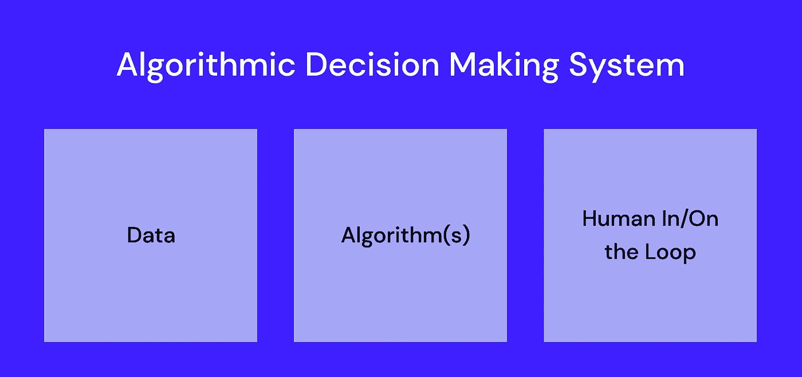
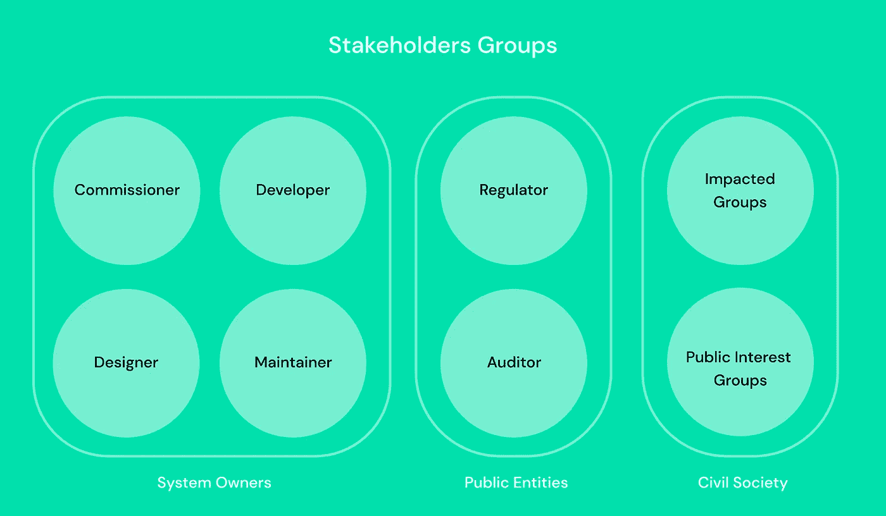

# 回到基础:重新审视负责任的人工智能框架

> 原文：<https://towardsdatascience.com/back-to-basics-revisiting-the-responsible-ai-framework-847fd3ec860b>

## 责任人工智能系列

## 筛选数十个现有框架，为负责任地使用和部署算法决策系统创建一个健壮的心智模型

来源:作者图片

在过去的几个月里，我们已经看到了在为人工智能建立安全措施方面有希望的进展。这包括[具有里程碑意义的关于人工智能的欧盟监管提案](https://eur-lex.europa.eu/legal-content/EN/TXT/?uri=CELEX%3A52021PC0206)，该提案禁止不可接受的人工智能使用，并强制要求对高风险系统进行披露和评估，英国政府推出的[算法透明标准](https://www.gov.uk/government/news/uk-government-publishes-pioneering-standard-for-algorithmic-transparency)，纽约市对人工智能招聘技术的[强制审计](https://www.protocol.com/bulletins/nyc-ai-hiring-tools)，以及 NIST 应美国国会要求开发的[人工智能风险评估框架](https://medium.com/r?url=https%3A%2F%2Fwww.nist.gov%2Fsystem%2Ffiles%2Fdocuments%2F2022%2F03%2F17%2FAI-RMF-1stdraft.pdf)草案，等等。

话虽如此，我们仍处于人工智能监管的早期。要将算法系统可能造成的伤害降至最低，还有很长的路要走。

在这一系列文章中，我探索了与负责任地使用人工智能及其社会影响相关的不同主题。我特别关注两个重要的想法:

1.  算法系统有意义的透明度是有效问责机制的重要前提——但在实践中很难实现；
2.  公共利益团体，如倡导者、活动家和记者，以及公民个人，目前在揭露人工智能危害方面发挥着关键作用——但他们在目前提出的任何监管中都没有有意义的作用。

在我深入这些主题之前，重要的是从一个**健壮的心智模型**开始，它充分反映了在社会层面促进负责任地使用人工智能的复杂性。

**框架，框架，更多框架！**

我首先回顾了由各种公司、政府和研究机构开发的现有人工智能框架、指南和章程。如下图数据库所示，被引用最多的 AI 原则是“公平”，紧随其后的是“透明性”、“可解释性”、“安全性”、“鲁棒性”和“安全性”。

人工智能伦理现有框架的数据库——由作者创建。要向该数据库提供来源，请填写此[表格](https://airtable.com/shruZffvKWhdOXqbm)。

这些现有的关于人工智能的框架大多在范围上是有限的。它们要么提供一般的非约束性指导，要么仅适用于特定的组织(或一组组织)。需要一个全面负责的人工智能框架，考虑到利益相关者的冲突优先级，并保护受影响的群体免受伤害。

# **制定综合框架**

伦理人工智能的综合框架应包括以下内容:

*   明确定义*对象*进行评估(→AI 系统)；
*   对*理想的广泛认同*得以实现；
*   明确的*原则*有助于实现我们的既定理想；
*   一组*利益相关方团体*，他们有明确的职责来帮助促进我们理想的实现。

## **1。定义正确的“单位”或系统**

评估人工智能部署的正确“单位”是什么？大多数框架模糊地指人工智能系统，其他的指个别算法。在不了解算法如何影响更广泛系统的整体结果的情况下，对单个算法的评估是没有意义的。此外，执行决策的系统可以由几个自动或人工执行的步骤组成。每个自动化步骤都可以与一个或多个算法联系起来，这些算法可能使用不同级别的复杂人工智能。因此，从整体上考虑决策系统是很重要的，因为故障可能发生在几个独立算法中的一个或它们的互操作性中，同时不要忘记潜在的人为错误。

算法决策系统的组成部分。来源:作者图片

在这篇文章的其余部分(以及接下来的部分)，我将把算法决策系统(ADS)称为一个单独的评估单元。ADS 是指引入算法系统，帮助部分(或全部)决策过程程序化和自动化。

ADS 通常由以下内容组成:

*   算法和计算处理技术(各种复杂程度，从基于规则到神经网络)；
*   支持数据集(可能包括敏感的个人身份数据或其他机密数据)；
*   人在循环中(前者主动审查每个决策，后者监督整个系统的性能)。

不是所有的广告都应该优先评估。一般来说，我们所说的“高风险”系统是指那些管理服务、福利、受到的惩罚以及获得机会(如招聘)的系统，因为系统故障会对受影响的个人造成重大伤害。

## **2。定义正确的“理想”**

现有的框架驱动以下三个理想之一:*道德、信任、*或*责任*。

伦理学具有道德义务的哲学内涵。我们不能正确地将*道德人工智能*称为[“支撑人工智能解决方案的能力[……]没有道德或不道德、值得信任或不值得信任之分。”](https://venturebeat.com/2020/11/28/ethical-ai-isnt-the-same-as-trustworthy-ai-and-that-matters/)相反，我们对算法系统做出的选择可能具有道德或不道德的属性。促进广告方面的道德行为是一个值得努力的伟大理想。然而，它也可能是一个模糊的理想，为道德义务要求的不同解释敞开大门。

至于*信任*，企业倾向于关注这一理念，因为它支撑着他们产品和服务的采用。信任一项技术意味着相信它会达到你的期望。这种“信任”的概念模糊了责任结构。如前所述，人工智能并不是天生值得信任或不值得信任的。赋予这些属性的是围绕其开发和在特定环境中的使用而做出的选择。

我们目前观察到许多情况，企业通过组织自己的方式将责任从决策中心转移开来避免广告失败的责任。

> 算法决策系统造成伤害，不是因为它不可信，而是因为系统所有者没有以负责任的方式设计、开发、测试、部署或维护它。

因此，我认为我们应该驾驶的“理想”是*责任*而不是*信任*。从社会福祉的角度来看，我们应该专注于促进和保护对人工智能等技术的负责任的使用，并让组织对如何使用和实施这些技术负责。

负责任的广告使用挑战了“[责任缺口](https://link.springer.com/article/10.1007/s10676-004-3422-1)”的概念——这种概念认为，鉴于人工智能的性质，可能更难分配造成伤害的责任。

在理想状态下，应该有集体责任，其中:

*   系统所有者负责开发、部署和监控他们的算法系统，以避免伤害；
*   系统用户接受了关于广告局限性的充分培训，并有能力对系统结果进行推理；
*   受影响的群体有权提供反馈，标记伤害并寻求帮助；
*   政府行为者有责任制定适当的监管保障措施，并建立申诉渠道。

## **3。确定支持实现我们“理想”的核心原则**

为了实现*负责任地使用*广告，我们需要定义两套互补的原则:

*   “什么”:体现*负责任使用*理想的原则(简称*一阶原则*)。这些原则可用于评估广告的设计和部署。
*   “如何”:我们用来确保符合*一级原则*并纠正失败的原则(称为*二级原则*)。这些原则对于确保我们实现*负责任的使用*理念是必要的。

管理负责任使用广告的一级和二级原则。来源:作者图片

一级原则的构成可能会随着时间的推移而演变，并取决于一个地区或行业的具体情况。根据我对现有框架的评估，负责任的 ADS 部署是:

*   **公平和非歧视:**积极评估、监控和减少偏见；旨在产生经过适当调整的更公平的结果和决策
*   **可解释的:**能够为做出的决策提供可解释的理由
*   **安全**:制定有效的控制措施，保护系统免受威胁；主动标记和缓解漏洞
*   稳健:始终符合精度和性能要求，对扰动具有稳健性
*   **维护数据隐私权:**保护直接和间接用户的数据隐私权，并遵守现有的数据法律
*   **安全**:避免对受影响用户的伤害，旨在促进人类福祉

二阶原理对于确保符合上述要求是必要的。其中包括:

*   **确保广告的透明度:**在基本层面上，透明度转化为系统可见性，在更复杂的层面上，它反映了系统在一阶原则上的表现。关于透明度的更多细节将在后续文章中提供。
*   **确保 ADS 系统的责任性:**这是指系统的所有者能够解释他们的行为(和失误)并对其负责。广告透明度是实现问责制的先决条件。问责制可以通过评估、审计和反馈循环来实施。
*   **保留人力代理和追索的可能性:**当 ADS 失败并对个人产生不利影响时，相关个人应遵循明确的追索流程，以便纠正错误。应该建立强有力的透明度和问责机制，以便能够进行追索。

## **4。确定相关利益相关者及其职责**

最后，我们需要确定参与 ADS 的相关利益相关者，并阐明他们在确保负责任的使用和部署中的角色。

三大利益攸关方群体:系统所有者、公共实体和民间社会。来源:作者图片

我们可以确定三大利益相关方群体:

*   **系统所有者:**包括一个或多个负责调试、设计、开发和维护 ADS 的实体。在理想状态下，试运行实体应负责根据*负责任使用*原则建立供应商的采购要求和义务。
*   **公共实体:**这些实体包括负责管理广告使用、评估广告并让系统所有者承担责任的实体。正如已经证明的那样(此处[此处](https://techcrunch.com/2021/03/12/big-tech-companies-cannot-be-trusted-to-self-regulate-we-need-congress-to-act/)和[此处](https://www.wired.com/story/facebook-and-the-folly-of-self-regulation/))，大型科技公司的自我监管不利于社会福祉。在理想状态下，公共实体应该提供外部责任，以确保遵守 ADS 法规。
*   **公民社会:**这包括受广告影响的个人群体以及公共利益团体，后者由研究、学术和倡导组织组成，致力于保护和倡导公民社会的权利，特别是边缘化群体的权利。鉴于大多数国家缺乏全面的广告监管，公共利益团体历来是外部透明度和问责制的唯一驱动力。想想 [ProPublica 新闻调查](https://www.propublica.org/article/machine-bias-risk-assessments-in-criminal-sentencing)揭露 COMPAS 偏见累犯算法的文章，或者[麻省理工学院研究人员揭露亚马逊面部识别软件](https://www.nytimes.com/2019/01/24/technology/amazon-facial-technology-study.html)的偏见。在我的文章中，我认为，即使存在充分的监管，公共利益团体仍应在代表公民社会利益和提供外部问责方面发挥积极作用。这些群体应该被正式纳入设计和部署广告的过程中，尤其是高风险群体。

## 把所有的放在一起

接下来，我们应该绘制各种利益相关者如何执行行动，以确保负责任地使用算法决策系统。

“负责任地使用算法决策系统”的综合框架。来源:作者图片

上面的框架代表了一种理想状态，在这种状态下，公共实体是系统的主要守护者。它还需要明确的广告所有权和责任，并依靠公共利益团体的支持来补充外部监督。

我们目前离理想状态还很远，因为:

*   大多数国家没有国家级广告原则；
*   大多数政府还没有能力或权力来管理和监督广告的使用；
*   在没有既定要求或为各方分配责任的情况下，广告的所有权经常被供应商和第三方混淆；
*   目前，公共利益团体承担了提供广告问责的巨大责任，但履行这一职责的途径和资源有限。

## 更深入:透明度的角色

在*负责任使用*框架中，透明是一个强有力的原则。它有助于通过公共利益团体的工作实现“需求方”问责制，从而使系统所有者的激励与受影响的群体保持一致。然而，在现状中，无论是公共部门还是私营部门，大多数高风险广告的部署都受到不透明性的困扰。我们对这些系统的存在缺乏基本的了解。最起码，公民应该有权利知道他们在做什么广告。在某些情况下，这些系统只有在危害被发现并开始公共审查过程后才变得可见。这些因素导致了公众对算法系统的不信任，并引发了对问责制和追索权的严重关切。

  

*基于我的研究生论文“* [*《超越黑盒*](https://dspace.mit.edu/handle/1721.1/139092) *”(麻省理工学院 2021)的一系列关于负责任的人工智能的一部分。提出的想法是基于几个在管理、部署和评估人工智能系统方面有直接经验的从业者的反馈和支持而发展起来的。我正在分享和开源我的发现，以使其他人能够轻松地研究并为这个领域做出贡献。*