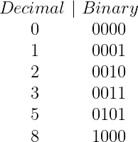
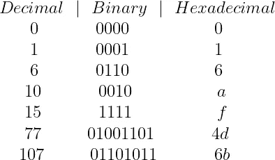

# 回到“位-系统”:位、指针和内存

> 原文：<https://towardsdatascience.com/back-to-bit-sics-bits-pointers-and-memory-8c0eb125a0b7>

# 回到“位-系统”:位、指针和内存

## 数据科学家用 C 语言解释位、指针和内存


穆罕默德·拉赫马尼在 [Unsplash](https://unsplash.com?utm_source=medium&utm_medium=referral) 上的照片

我是物理学出身，没有接受过任何正规的计算机科学教育。然而，作为一名数据科学家，我觉得有必要更好地掌握这个学科，同时也是出于好奇，想学习一些新的东西。

所以，没有比世界上最好的 CS 大学，**斯坦福更好的学习地方了。他们免费开放了很多课程，你可以在这里[](https://online.stanford.edu/free-courses)**查看。我最近一直在研究他们的 [**CS107 计算机组织&系统**](https://web.stanford.edu/class/archive/cs/cs107/cs107.1222/) **。**这深入到编程语言 ***如何真正*** 在幕后工作，以及它们如何与硬件交互。这门课是用 C 语言讲授的，这也是我正在努力学习的东西，因为它被认为是一种“低级”语言，所以它能让你更好地理解计算机是如何工作的。****

**在这篇文章中，我解释了我觉得有趣的课程的第一部分，也巩固了我的理解。这些也是数据科学家应该了解的概念。**

# **二进制数字**

**计算机基本上是一群晶体管，根据电流是否通过，它们有两种状态:开、T21 和关。这种情况的数学表示称为**二进制数字或位**。**

**位可以访问两个状态 **0** 或 **1** 并且可以组合成任意数。然而，使用二进制意味着我们是在一个基数为 2 的数字系统中工作，因为我们只有两个数字可以使用。在全球范围内，我们使用的是**十进制数系统**，称为**十进制数**。十进制包含以下: **0，1，2，3，4，5，6，7，8，9** 作为我们都知道并且喜爱的 10 个数字。以下是十进制到二进制转换的一些示例:**

****

**由作者用乳胶创作**

**注意到模式了吗？第一位是 2⁰，第二位是 2，第三位是 2 等等。如果该位的值为 1，则它为**‘开’**，因此它取值为 1、2、4 等。然后将等于 1 的所有位相加，得到十进制数。**

# **十六进制的**

**位是伟大的，但是我们经常处理长度为 32 或 64 位的大数。因此，我们用被称为**十六进制**的**16 进制数字系统**来表示比特。十六进制有 16 个数字: **0，1，2，3，4，5，6，7，8，9，a，b，c，d，e，f** 。因此，当 2⁴ = 16 时，一个十六进制数反映了一个 **4 位二进制序列**，这也被称为**半字节**。**

**下面是一些选定数字的十进制、二进制和十六进制转换表:**

****

**由 LaTeX b 作者创建**

**让我们通过一个例子来获得更好的直觉。我们将使用十进制数 77 的大小写。我们知道，4 = 0100，13 = 1101 = d，因此 4d 是这两个二进制值的组合，等于 01001101。它们基本上是相互连接的。这个数字的最高有效位是 2⁶ = 64。其他有效位为 2 = 8、2 = 4 和 2⁰ = 1。如上所示，所有这些有效位的总和为 77。在你反复练习几次之后，这种转换并不太难。**

# **计算机存储器**

**尽管位是计算机中的基本值，但计算机的内存地址只是在**字节可寻址范围内，**字节等于 8 位。**

**在 21 世纪初，大多数电脑都是 32 位的。这意味着他们有 2 个唯一的数字，这意味着只有 **2 字节的可寻址内存位置**！从这个角度来看: **2 字节= 4GB 的 RAM！这个很小，所以现在的电脑是 64 位的，内存是 16 兆字节。然而，当前的能力硬件不能充分利用这个可用的 RAM。****

**这意味着当你给一个变量赋值时，例如 ***x=2*** ，在你的代码中，这个变量有它自己的**唯一内存地址**。如果您使用的是 32 位计算机，这个地址只是两个可用地址中的一个。不要说太多细节，主要是因为我自己也不完全理解，这些内存地址不是硬件中的实际物理地址，而是操作系统分配的虚拟地址。然而，可以使用页表将它们转换成物理地址。**

**此外，32 位计算机的 4GB 内存限制并不全面。有使用 [**物理地址扩展**](https://en.wikipedia.org/wiki/Physical_Address_Extension) 的变通办法，将 32 位计算机的 RAM 可用性提高到 64 GB 左右。**

# **两颗北极指极星**

**在 C 语言中，我们可以使用**指针来处理这些**内存地址**。**这些是变量**T5，其值是另一个变量的**内存地址。**我们可以通过使用 **' & '** 符号得到任意变量的内存地址。例如:****

```
int main(){ int x = 2; /* variable declaration */ printf("%p\n", &x ); /* printing the address of x */ return 0;}
```

**这段代码的输出是:**

```
0x7ff7b57ac948
```

****‘0x’**表示数字是十六进制的，如果是**‘0b’**那么就是二进制的。在那里变量 x 的地址是十进制的 **140，701，878，372，680** ，所以大约是第 140 万亿个内存地址！我的电脑肯定是 64 位的！**

**如前所述，指针**指向变量的内存地址，而不是它的值。这意味着即使 x 的值改变，指针仍将为 x 产生相同的地址。使用如下的 ***** 语法声明指针:****

```
int main(){

 int x = 2; /* variable declaration */
 int *xptr; /* pointer variable declaration */ xptr = &x; /* store address of x in pointer variable*/ printf("%p\n", &x); /* printing the address of x */
 printf("%p\n", xptr); /* printing the pointer variable */ return 0;}
```

**这里我们将 **xptr** 分配给 **x** 的地址。下面的输出是:**

```
0x7ff7b57ac9480x7ff7b57ac948
```

**其中指针指向 x 的地址，因此它们都像预期的那样返回相同的内存地址。**

**一个指针可以被**解引用**，方法是将它打印为一个带符号的整数%d，(带符号意味着它可以是正的也可以是负的)，但是在指针变量之前分配*语法。下面显示了一个示例:**

```
int main(){ int x = 2; /* variable declaration */
 int *xptr; /* pointer variable declaration */ xptr = &x; /* store address of x in pointer variable*/ printf("%p\n", &x); /* print the address of x */
 printf("%d\n", *xptr); /* printing the value stored at pointer */ return 0;}
```

**的输出是:**

```
0x7ff7b57ac9482
```

**我们得到了预期的值 2，因为这是 x 的内存地址。**

**有许多更复杂的方法来操作和使用指针。它们是非常有用的变量，可以教你很多关于内存在程序中是如何工作的，这是无价的。**

# **摘要**

**在本文中，我们简要讨论了位、十六进制和使用指针操作内存地址。老实说，作为数据科学家，我们不会处理如此低级的代码，所以没有必要成为这些领域的专家。然而，这些都是很好的学习和理解的基本概念，因为它们提高了您对其他语言的了解，尤其是 Python，因为其中一些是用 c 语言编写的。这增强了您作为数据科学家的整体能力。**

# **和我联系！**

*   **要在媒体上阅读无限的故事，请务必在这里注册！ 💜**
*   **[T35*😀*](/subscribe/@egorhowell)**
*   **[*领英*](https://www.linkedin.com/in/egor-howell-092a721b3/) 👔**
*   **[*碎碎念*](https://twitter.com/EgorHowell) 🖊**
*   **[*github*](https://github.com/egorhowell)*🖥***
*   ***[](https://www.kaggle.com/egorphysics)**🏅*****

> *****(所有表情符号都是由 [OpenMoji](https://openmoji.org/) 设计的——开源的表情符号和图标项目。执照: [CC BY-SA 4.0](https://creativecommons.org/licenses/by-sa/4.0/#)*****