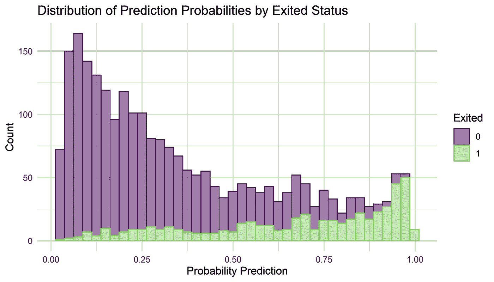
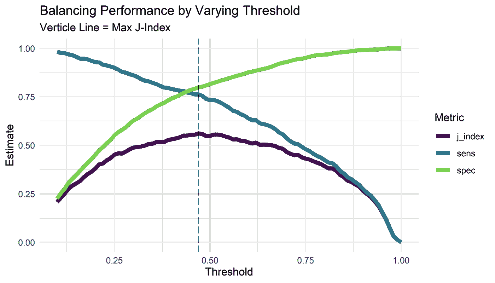
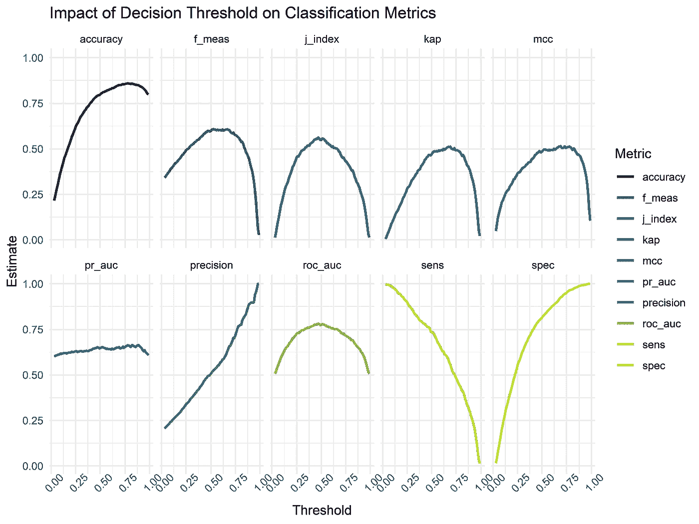
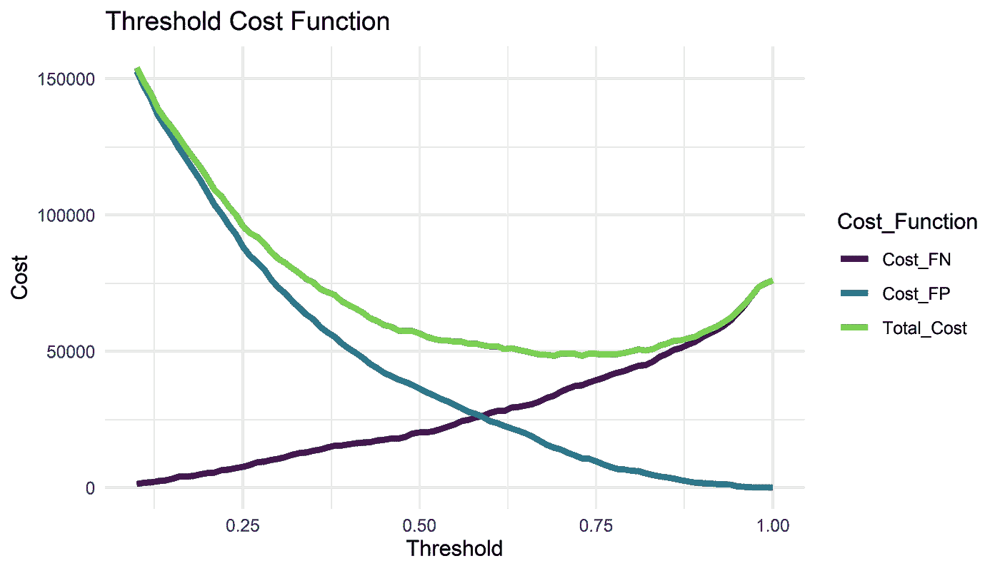
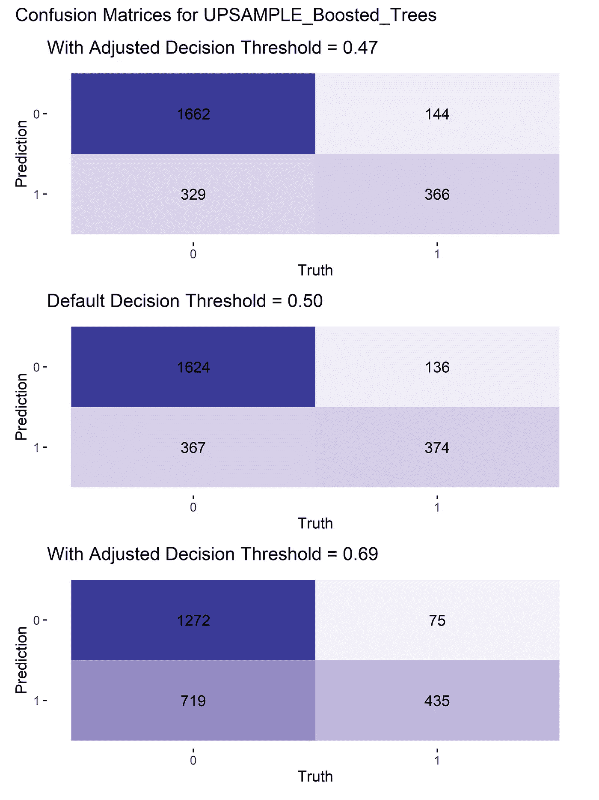

# 潮汐模型下的银行客户流失——第二部分决策阈值分析

> 原文：<https://towardsdatascience.com/bank-customer-churn-with-tidymodels-part-2-decision-threshold-analysis-c658845ef1f>

# 潮汐模型下的银行客户流失——第二部分决策阈值分析

## 决策阈值与潮汐模型情景分析

欢迎回到我们探索银行客户流失问题的第 2 部分，现在检查决策阈值分析。

在第 1 部分中，我们开发了一个候选工作流，它在各种分类指标上取得了很好的结果，并讨论了不同的上采样和下采样技术对管理银行客户流失数据集中 4:1 类别不平衡的影响(摘自 https://www.kaggle.com/shivan118/churn-modeling-dataset(许可证 [CC0:公共领域](https://creativecommons.org/publicdomain/zero/1.0/))。

第 1 部分可在[这里](/bank-customer-churn-with-tidymodels-part-1-model-development-cdec4eeb131c)获得，我建议在更好地理解上下文和模型开发之前阅读。

本文将重点向非技术人员解释模型输出的结果。我们将完成决策阈值分析，并生成一个成本函数，并呈现两种场景—最佳区分类别的阈值或具有最低成本的阈值。我们将使用 tidymodels 的[可能是](https://probably.tidymodels.org/)包来完成这个分析。我们的目标是确定并向我们的利益相关者提供一个成本决策阈值分析，衡量客户流失和干预策略的成本。


罗马卡夫在 [Unsplash](https://unsplash.com?utm_source=medium&utm_medium=referral) 上拍摄的照片

**加载包**

```
library(tidymodels) **#ML Metapackage**
library(probably) **#Threshold Analysis**
library(forcats) **#Working with factors**
library(patchwork) **#ggplot grids**
tidymodels_prefer()
options(yardstick.event_first = FALSE)class_metric <- metric_set(accuracy, f_meas, j_index, kap, precision, sensitivity, specificity, mcc)
```

**最终确定并装配模型**

从我们在第 1 部分停止的地方开始，我们将确定最佳执行工作流并最终确定模型。

```
best_result <- wf_sample_exp %>% 
  extract_workflow_set_result("UPSAMPLE_Boosted_Trees") %>% 
  select_best(metric = 'j_index')xgb_fit <- wf_sample_exp %>% 
  extract_workflow("UPSAMPLE_Boosted_Trees") %>% 
  finalize_workflow(best_result) %>%
  fit(training(cust_split))
```

workflow sets::extract _ workflow _ set _ result 采用命名工作流来生成所有试验超参数组合的表，并将根据 select_best()中调用的度量选择最佳组合。workflows::extract_workflow()再次接受一个命名的工作流，然后根据 best_result 中存储的内容更新超参数。然后，生成的工作流将符合训练数据。

**阈值分析**

```
xgb_fit %>% 
  predict(new_data = testing(cust_split), type = 'prob') %>% 
  bind_cols(testing(cust_split)) %>% 
  ggplot(aes(x=.pred_1, fill = Exited, color = Exited)) +
    geom_histogram(bins = 40, alpha = 0.5) +
    theme_minimal() +
    scale_fill_viridis_d(aesthetics = c('color', 'fill'), end = 0.8) +
    labs(title = 'Distribution of Prediction Probabilities by Exited Status', x = 'Probability Prediction', y = 'Count')
```



按流失状态划分的预测概率分布(按作者划分的图片)

通过预测概率，我们可以看到客户流失状态的分布。默认阈值为 0.5 时，大于的预测被预测为搅动，反之亦然。阈值分析识别给定期望度量的最佳阈值。probably 包使我们能够进行这样的分析。probably::threshold_perf()获取真实值、估计值并依次改变阈值，然后计算每个阈值的灵敏度、特异性和 J 指数。

```
**#Generate Probability Prediction Dataset**
xgb_pred <- xgb_fit %>% 
  predict(new_data = testing(cust_split), type = 'prob') %>% 
  bind_cols(testing(cust_split)) %>% 
  select(Exited, .pred_0, .pred_1)**#Generate Sequential Threshold Tibble**
threshold_data <- xgb_pred %>% 
  threshold_perf(truth = Exited, Estimate = .pred_1, thresholds = seq(0.1, 1, by = 0.01))**#Identify Threshold for Maximum J-Index**
max_j_index <- threshold_data %>% 
  filter(.metric == 'j_index') %>% 
  filter(.estimate == max(.estimate)) %>% 
  select(.threshold) %>% 
  as_vector()**#Visualise Threshold Analysis**
threshold_data %>% 
  filter(.metric != 'distance') %>% 
  ggplot(aes(x=.threshold, y=.estimate, color = .metric)) +
   geom_line(size = 2) +
   geom_vline(xintercept = max_j_index, lty = 5, alpha = .6) +
   theme_minimal() +
   scale_colour_viridis_d(end = 0.8) +
   labs(x='Threshold', 
        y='Estimate', 
        title = 'Balancing Performance by Varying Threshold',
        subtitle = 'Verticle Line = Max J-Index',
        color = 'Metric')
```



UPSAMPLE_Boosted_Trees 工作流的阈值分析(图片由作者提供)

我们的分析表明具有最高 J 指数的阈值是 0.47。

为了扩展这一分析，我们可以假设将阈值调整为任何可用的指标，如下所示。我无法使用一个标尺::metric_set()和 probably::threshold_perf()并包含 pr_auc 和 roc_auc 来让它工作，所以必须使用一个完美的技巧。

```
**#Threshold Analysis by Several Classification Metrics**
list(pred_df = list(pred_df = xgb_pred), 
     threshold = list(threshold = seq(0.03, 0.99, by = 0.01))) %>% 
cross_df() %>% 
  mutate(pred_data = map2(pred_df, threshold, ~mutate(.x, .prob_class = as_factor(if_else(.pred_1 < .y , 0, 1)))),
         pred_data = map2(pred_data,  threshold, ~mutate(.x, .prob_metric = if_else(.pred_1 < .y , 0, 1))),
         pred_metric = map(pred_data, ~class_metric(.x, truth = Exited, estimate = .prob_class)),
         roc_auc = map(pred_data, ~roc_auc(.x, truth = Exited, estimate = .prob_metric)),
         pr_auc = map(pred_data, ~pr_auc(.x, truth = Exited, estimate = .prob_metric)),
         pred_metric = pmap(list(pred_metric, roc_auc, pr_auc),~bind_rows(..1,..2,..3))) %>%
  select(pred_metric, threshold) %>%                                                            
  unnest(pred_metric) %>%                                                                        
  ggplot(aes(x=threshold, y=.estimate, color = .metric)) +
    geom_line(size = 1) +
    scale_color_viridis_d() +
    theme_minimal() +
    theme(axis.text.x = element_text(angle = 45)) +
    facet_wrap(~.metric, nrow = 2) +
    labs(title = 'Impact of Decision Threshold on Classification Metrics', x= 'Threshold', y = 'Estimate', color = 'Metric')
```



各种分类度量的阈值分析

除此之外，我们已经从 probably::threshold_perf()的输出中获得了所需的全部内容。敏感性和特异性使我们能够计算特定阈值的 FPR 和 FNR，从而计算成本函数。

**成本函数**

这里我们输入一个原始数据集中没有捕捉到的假设情况。为了如下计算 FN 和 FP 的总成本，我们需要一个客户终身价值(CLV)和干预成本的近似值。现在让我们假设干预的成本是 99 美元，或者是标准账户年费的价值，如果我们怀疑一个客户正在交易，客户服务将会兑现一年的年费折扣。


客户流失的成本方程(图片由作者提供)

对于年化 CLV，我们取账户费和信用卡费之和。我们假设每个产品都有 99 美元的年费，除了信用卡有 149 美元的年费。因此，如下所示，我们计算每个客户的 CLV，然后取中间值为 CLV。刚好是 149 美元。

请注意，我知道这是关于 CLV 构成的一个非常基本的观点，毫无疑问，现实生活中的场景会计算客户在其他银行客户收入渠道中支付的信用或贷款利息金额。

```
train %>% 
  mutate(CreditCardFees = HasCrCard*149,
         AccountFees = (NumOfProducts - HasCrCard)*99,
         CLV = CreditCardFees + AccountFees) %>% 
  ggplot(aes(CLV)) +
   geom_histogram() +
   theme_minimal() +
   labs(title = 'Distribution of Annual CLV', x='CLV', y = 'Count')
```


年度 CLV 分布(图片由作者提供)

在将这一逻辑应用于我们的 threshold_data 表时，我们可以将这些函数可视化。

```
threshold_data %>% 
  filter(.metric %in% c('sens', 'spec')) %>% 
  pivot_wider(id_cols = .threshold, values_from = .estimate, names_from = .metric) %>% 
  mutate(Cost_FN = ((1-sens) * 510 * 149), 
         Cost_FP = ((1-spec) * 1991 * 99),
         Total_Cost = Cost_FN + Cost_FP) %>% 
 select(.threshold, Cost_FN, Cost_FP, Total_Cost) %>% 
 pivot_longer(2:4, names_to = 'Cost_Function', values_to = 'Cost') %>% 
  ggplot(aes(x = .threshold, y = Cost, color = Cost_Function)) +
    geom_line(size = 1.5) +
    theme_minimal() +
    scale_colour_viridis_d(end = 0.8) +
    labs(title = 'Threshold Cost Function', x = 'Threshold')
```



决策阈值的成本函数(图片由作者提供)

**情景分析——最小化成本或最大化差异化**

因为我们已经建立了成本函数，所以我们可以确定最小化这些成本的决策阈值。正如引言中所提到的，我们可以考虑两种情况，正如我们上面所确定的，优化 J 指数的阈值或最小化成本的阈值。这将在下面演示。

```
threshold_data %>% 
  filter(.metric %in% c('sens', 'spec')) %>% 
  pivot_wider(id_cols = .threshold, values_from = .estimate, names_from = .metric) %>% 
  mutate(Cost = ((1-sens) * 510 * 149) + ((1-spec) * 1991 * 99),
         j_index = (sens+spec)-1) %>% 
  ggplot(aes(y=Cost, x = .threshold)) +
    geom_line() +
    geom_point(aes(size = j_index, color = j_index)) +
    geom_vline(xintercept = 0.47, lty = 2) +
    annotate(x = 0.36, y=100000, geom = 'text', label = 'Best Class Differentiation\nJ-Index = 0.56,\nCost = $57,629,\nThreshold = 0.47') +
    geom_vline(xintercept = 0.69, lty = 2) +
    annotate(x = 0.81, y = 100000, geom = 'text', label = 'Lowest Cost Model\nJ-Index = 0.48,\nCost = $48,329,\nThreshold = 0.69') +    
    theme_minimal() +
    scale_colour_viridis_c() +
    labs(title = 'Decision Threshold Attrition Cost Function', 
         subtitle = 'Where Cost(FN) = $149 & Cost(FP) = $99',
         x = 'Classification Threshold', size = 'J-Index', color = 'J-Index')
```


情景分析(图片由作者提供)

有趣的是，给定我们的成本假设，最低成本阈值是 0.69，不出所料，以灵敏度(TNR)为代价增加了特异性(TPR)。我们将混淆矩阵形象化如下。

```
t1 <- xgb_pred %>% 
  mutate(.pred = make_two_class_pred(.pred_0, levels(Exited), threshold = 0.5)) %>%
  conf_mat(estimate = .pred, Exited) %>% 
  autoplot(type = 'heatmap') + 
  scale_fill_gradient2() +
  labs(title = 'Default Decision Threshold = 0.50')t2 <- xgb_pred %>% 
  mutate(.pred = make_two_class_pred(.pred_0, levels(Exited), threshold = 0.47)) %>%
  conf_mat(estimate = .pred, Exited) %>% 
  autoplot(type = 'heatmap') + 
  scale_fill_gradient2() +
  labs(title = 'With Adjusted Decision Threshold = 0.47')t3 <- xgb_pred %>% 
  mutate(.pred = make_two_class_pred(.pred_0, levels(Exited), threshold = 0.69)) %>%
  conf_mat(estimate = .pred, Exited) %>% 
  autoplot(type = 'heatmap') + 
  scale_fill_gradient2() +
  labs(title ='With Adjusted Decision Threshold = 0.69')t2 / t1 / t3 +
  plot_annotation(title = 'Confusion Matrices for UPSAMPLE_Boosted_Trees')
```



改变决策阈值对混淆矩阵的影响(图片由作者提供)

**结束语**

我们已经使用 probably 包完成了一个决策阈值分析，并构建了一个假设场景分析。根据我们的假设，最低成本模型会降低模型性能。这是企业需要考虑的权衡，生产是一个有效的模型，可以适度区分等级或采用成本较低的模型，尽管需要更多的干预和更大的假阳性预测。

感谢您阅读本文，希望您喜欢。我写这些是为了教会自己一些东西，我希望你也学到了一些东西。如果你不是媒介会员，使用下面我的推荐链接，定期从我和其他优秀的媒介作者那里获得新出版物的更新。

[](https://mmgillin.medium.com/membership) [## 通过我的推荐链接加入媒体——默里·吉林

### 作为一个媒体会员，你的会员费的一部分会给你阅读的作家，你可以完全接触到每一个故事…

mmgillin.medium.com](https://mmgillin.medium.com/membership)