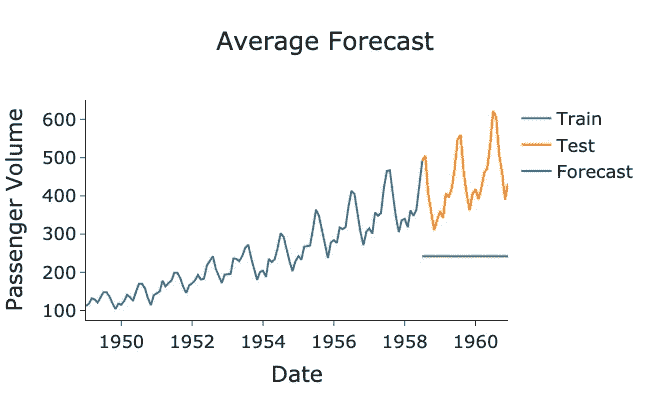
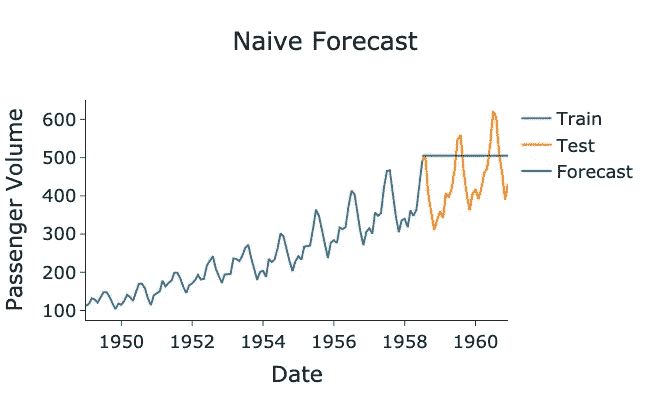
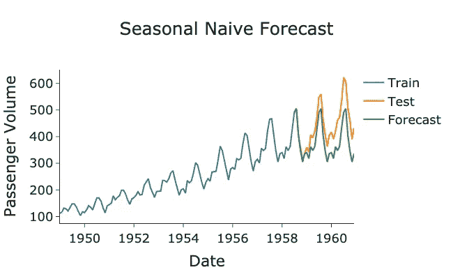

# 基本时间序列预测技术

> 原文：<https://towardsdatascience.com/basic-forecasting-techniques-ef4295248e46>

## 一些非常简单的预测模型概述

马克·柯尼希在 [Unsplash](https://unsplash.com?utm_source=medium&utm_medium=referral) 上的照片

# 介绍

预测是一个广泛的领域，几乎在每个行业都有大量的应用。因此，预测模型的范围也非常大，每个模型都有自己的优缺点。

在这篇文章中，我想回顾一些基本和简单的预测模型。尽管它们很简单，但是这些模型在实践中可以提供很好的结果，并且为迭代提供了一个很好的基础。

# 平均预测

我们将考虑的第一个模型是*平均预测。*该模型简单假设所有未来值等于所有先前观察值的平均值:

作者在 LaTeX 中生成的方程

其中 ***h*** 是我们预测的未来时间步长， ***T*** 是时间序列的长度， ***y_t*** 是时间 ***t*** 的观测值， ***y_bar*** 是观测值的平均值。对于这个模型，我们必须有一些过去的数据来计算预测。

我们可以使用美国航空乘客数据集在 Python 中实现这一点:

> 数据[来自拥有 CC0 许可证的 Kaggle](https://www.kaggle.com/datasets/ashfakyeafi/air-passenger-data-for-time-series-analysis) 。

作者 GitHub 要点。

作者用 Python 生成的图。

从上面的图来看，预测显然不是很好，因为它没有捕捉到数据中的趋势或季节性，并且明显低估了预测。

# 天真的预测

第二个模型，*简单预测，*将未来预测设置为等于最新观察值:

作者在 LaTeX 中生成的方程

这种模型被认为是任何预测的基准，由于其不稳定的性质，通常用于模拟股票市场和金融数据。朴素模型也可以称为*无漂移随机游走模型。*

这也是误差度量 [**平均绝对标度误差【MASE】**](https://en.wikipedia.org/wiki/Mean_absolute_scaled_error)**背后的基础。这是许多专业预测者选择的准确性标准:独立于尺度、可解释和对称。你可以在我之前的文章中读到更多的 MASE:**

  

下面用 Python 展示了一个绘制和执行简单预测方法的示例:

作者 GitHub 要点。

作者用 Python 生成的图。

这比平均预测要好，因为它在一定程度上抓住了趋势，并且没有低估太多。然而，它仍然缺少每年的季节性变化。

# 季节性简单预测

第三种方法是 naive 方法的扩展，但这一次预测值等于同一季节的最新观测值。因此，它被称为*季节性朴素*模型。例如，下一季度的预测值等于上一年的第一季度值。当我们的时间序列中有明显的大的季节变化时，这个模型是有用的。

数学上，该模型被写成:

作者在 LaTeX 中生成的方程

其中 ***m*** 是数据的季节性。因此，对于具有年度季节性的月数据 ***m=12，*** 季度数据将具有 ***m=4*** ，而周数据将具有 ***m=52*** 。

下面是我们的美国航空公司乘客数据集的*季节性朴素*模型的 Python 实现:

作者 GitHub 要点。

作者用 Python 生成的图。

由于我们的模型有相当明显和大的季节性成分，季节性朴素模型表现得相当好。然而，它并没有完全捕捉到数据的趋势，因为我们预计客流量会随着时间的推移而增加。

如果你想了解更多关于季节性和趋势的信息，请查看我以前的帖子:

    

# 漂移模型

我们将考虑的最终模型是*漂移模型。*这也是对*简单预测*的扩展，其中我们让预测作为时间步长的函数随时间线性增加或减少，*由平均历史趋势缩放:*

**

*作者在 LaTeX 中生成的方程。*

*这基本上就是从第一个点到最后一个点画一条直线，并随着时间向前延伸。然而，这就是问题所在，因为模型总是会随着时间的推移而增加或减少，而现实生活中往往不是这样。*

> *这个模型就是 [**随机漂移**](https://en.wikipedia.org/wiki/Stochastic_drift) **的例子。**其他模型如 [**几何** **布朗运动**](https://en.wikipedia.org/wiki/Geometric_Brownian_motion) 和 [**随机游走**](https://en.wikipedia.org/wiki/Random_walk) 也使用随机漂移。*

*下面是 Python 中的*漂移*模型的实现:*

*作者 GitHub 要点。*

**

*作者用 Python 生成的图。*

*该模型很好地捕捉了总体趋势，因为客流量大多随时间线性增长。然而，它未能捕捉到在数据中观察到的预测中的任何季节性。*

# *总结和进一步的思考*

*在这篇文章中，我们讨论了四种基本的预测方法。如果你的模型是高度季节性的，简单的季节性预测可能是最好的选择，如果不是，漂移模型是下一个最好的选择。*

*一般来说，这些基本模型通常不会给出最佳结果，但却是构建更复杂模型的良好起点，例如[**【ARIMA】**](https://en.wikipedia.org/wiki/Autoregressive_integrated_moving_average)和 [**指数平滑**](https://en.wikipedia.org/wiki/Exponential_smoothing) **。这些基本方法也是很好的比较模型，用来衡量你的更复杂的模型的性能。***

*这篇文章中使用的全部代码可以从我的 GitHub 获得:*

*  

# 参考资料和进一步阅读

*   *预测:原理与实践:*https://otexts.com/fpp2/

# 和我联系！

*   要在媒体上阅读无限的故事，请务必在这里注册！T35*💜*
*   *😀*
*   [*LinkedIn*](https://www.linkedin.com/in/egor-howell-092a721b3/)*👔*
*   *[*碎碎念*](https://twitter.com/EgorHowell) 🖊*
*   *[*github*](https://github.com/egorhowell)*🖥**
*   ****🏅****

> ***(所有表情符号都是由 [OpenMoji](https://openmoji.org/) 设计的——开源的表情符号和图标项目。执照: [CC BY-SA 4.0](https://creativecommons.org/licenses/by-sa/4.0/#)****