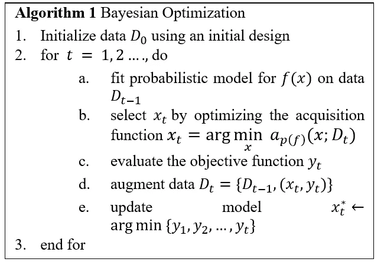
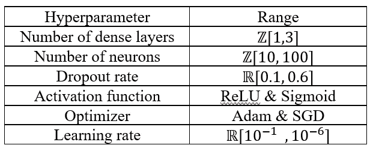
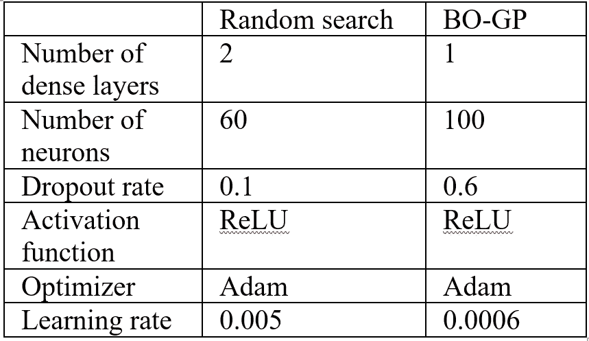
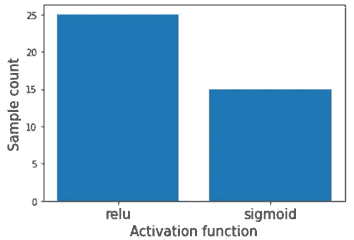
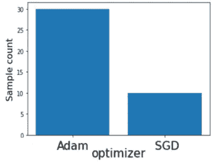
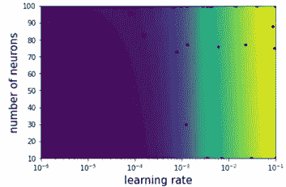

# 网络安全中深度神经网络的贝叶斯超参数优化

> 原文：<https://towardsdatascience.com/bayesian-hyperparameter-optimization-for-a-deep-neural-network-590be92bb0c0>

## 高斯过程贝叶斯优化和最优 DNN 随机搜索优化方法在网络入侵检测中的应用

照片由 [JJ 英](https://unsplash.com/@jjying?utm_source=medium&utm_medium=referral)在 [Unsplash](https://unsplash.com?utm_source=medium&utm_medium=referral)

深度神经网络(DNN)已经成功应用于许多现实世界的问题，从疾病分类到网络安全。基于 DNN 的**分类器的最佳使用需要仔细调整超参数。**手动调整超参数繁琐、耗时且计算量大。因此，需要一种自动技术来找到最佳超参数，以便在入侵检测中最好地使用 DNN。在本文中，我们讨论了基于**贝叶斯优化和随机搜索优化的框架**，用于自动优化超参数，确保最佳 DNN 架构。此外，我们在真实世界的网络入侵检测基准数据集 NSL-KDD 上进行了性能评估。实验结果表明了贝叶斯优化的有效性，因为所得的 DNN 体系结构表现出比基于随机搜索优化的方法显著更高的入侵检测性能。

包括 DNN 在内的机器学习(ML)算法已经展示出了有希望的结果。基于 DNN 的分类器已经变得流行，并且被广泛用于许多应用，包括计算机视觉、语音识别和自然语言处理。**提取自动化特征、高度非线性系统的能力、架构设计的灵活性是 DNN 的亮点。**然而，**从 DNN 获得成功的性能需要仔细调整训练参数和超参数。**当在训练阶段学习训练参数时，必须在训练 DNN 之前指定超参数，例如初始学习速率、密集层数、神经元数和激活函数。**DNN 的性能在很大程度上取决于超参数优化**。它需要调查 DNN 模型的超参数的最佳组合，该组合返回在验证集上缩放的最佳性能

手动调整超参数需要专家经验。缺乏手动设置超参数的技能阻碍了 DNN 的有效使用。特别是，当有许多超参数时，通过蛮力方法来模拟最佳 DNN 架构**过于繁琐、耗时且计算量大，因为这需要对所有超参数的许多可能组合进行实验**【3】。例如，网格搜索和随机搜索通常被研究团体用于超参数优化。**网格搜索探索超参数的所有可能组合，以达到全局最优。** **随机搜索应用多个超参数的任意组合。两种方法都很容易实现。然而，当处理几个超参数时，这些方法收敛缓慢，需要很长时间，并且不能保证按预期执行[3]。根据 DNN 架构的规模，我们可能有数百种可能的超参数组合需要比较，以获得最佳性能。因此，自动且有效的 DNN 超参数优化方法是至关重要的。**贝叶斯超参数优化是一种最先进的自动化高效技术，在几个具有挑战性的优化基准函数上优于其他先进的全局优化方法**【4】。贝叶斯优化(BO)使用类似高斯过程(GP)的代理模型来定义目标函数上的分布，以近似真实的目标函数。在本文中，我们应用贝叶斯优化与高斯过程(BO-GP)调整 DNN 超参数。**

## **贝叶斯优化**

贝叶斯优化(BO)是一种概率优化技术，旨在为某个有界集合全局最小化目标黑箱函数[6]。通常的假设是，黑箱函数没有简单的封闭形式，但可以在任意时刻进行计算[5]。此外，该函数只能通过无偏随机观测来测量[6]。感兴趣的超参数设计空间可以包括连续的、整数值的或分类的。在优化过程中，它构建了一个替代函数(概率模型),该替代函数定义了目标函数上的近似分布，一个获取函数用于量化在任何 *x* 的评估的有效性。简而言之，业务对象框架由三个关键部分组成:代理模型、贝叶斯更新过程和获取函数[7]。代理模型拟合目标函数的所有点，然后在目标函数的每个新评估之后，通过贝叶斯更新过程来更新。最后，获取功能对评估进行评定。算法 1 显示了 BO [5]的基本伪码。

业务对象可以包括不同的代理模型:GP，使用决策树的顺序优化；不同的获取函数:预期改善(EI)、置信下限(LCB)和改善概率(PI)。我们应用 GP 作为替代模型，EI 作为获取函数[9]。

**高斯过程(GP)** :由于描述能力和分析的易处理性，GP 作为概率模型是一个方便和著名的选择。 **GP 假设随机变量集合的每个有限子集都遵循多元正态分布。**

**代理函数:**它是黑盒目标函数的近似，GP 作为代理函数，建立目标函数的概率模型。简单地说——代理函数指导如何探索搜索空间中的参数[10]。

**预期改善(EI)**:EI 等采集功能调查勘探与开采之间的权衡，并决定后续优化的评估点。EI 定义为:

其中*f(x∫)*是已知的最佳观测值，而 *E[。】*是指定函数值 *f(x)* 的期望。因此，如果*f(x∫)>f(x)*，则奖励或改进为*f(x∫)—f(x)*，否则奖励为 *0* 。

**NSL-KDD 数据集**是广泛用于网络入侵检测问题的 KDD cup’99 数据集的改进版本。它是一个公开可用的数据集，数据**来源——**[**【https://www.unb.ca/cic/datasets/nsl.html】**](https://www.unb.ca/cic/datasets/nsl.html)**。**

KDDCUP'99 数据集包含像冗余记录这样的问题，会对频繁记录产生偏见。在 NSL-KDD 数据集中，这些问题得到了解决。KDDTrain+和 KDDTest+是 NSL-KDD 中包含的两个数据集。我们使用 KDDTrain+进行训练，使用 KDDTest+测试框架。NSL-KDD 数据集由 41 个要素和一个指示连接状态(正常或攻击)的标注属性组成。**表 1** 显示了二进制分类的三个数据集的分布(正常与攻击)。

**表 1:**NSL-KDD 数据集的分布(图片由作者提供)

NSL-KDD 模型中的分类变量首先映射到数值数据，然后对整体数据进行归一化处理。协议类型、标志和服务是三个分类特征，它们使用一键编码技术转换成数字数据。我们应用了**最小-最大归一化**技术将原始数据缩放到 0 和 1 的固定范围。**归一化确保了数据分布的一致性，避免了训练阶段的爆炸梯度问题。**

**表 2:** 探索不同范围的超参数设置(图片由作者提供)

我们对 DNN 应用了随机搜索和 BO-GP 超参数优化技术。**表 2** 显示了超参数及其范围值，而**表 3** 显示了针对网络入侵检测的 DNN 的最佳设置超参数。**图 1** 显示了超参数优化的改进，其中最佳适应值(否定的分类精度)绘制在 y 轴上，优化的迭代次数绘制在 x 轴上。**图 2 和图 3** 显示了优化过程中激活函数和优化器的样本分布。对于激活函数，ReLU 的采样多于 sigmoid，而对于优化器，Adam 的采样多于 SGD。**图 4** 显示了两个优化参数的景观图:学习速率的估计适应值和隐藏层中神经元的数量。黑点是优化器的采样位置，而**红星**是两个超参数的最佳点。

**表 3:** 随机搜索和贝叶斯优化的最优超参数(图片由作者提供)

**图 1:** 超参数优化的收敛图(图片由作者提供)

**图 2:** 激活函数的样本分布(图片由作者提供)

**图 3:** 优化器的样本分布(图片由作者提供)

**图 4:** 两个优化参数的景观图——学习率和神经元数量(图片由作者提供)

**表 4:**KDD test+数据的性能评测(图片由作者提供)

## 结论

包括深度神经网络在内的机器学习算法的效率很大程度上取决于超参数的值。手动调整超参数是乏味的、耗时的，并且计算量很大，以模拟最佳的 DNN 架构。在本文中，我们应用高斯过程的贝叶斯优化来优化关于网络入侵检测的深度神经网络超参数。在研究最佳 DNN 架构时，我们探索了六个超参数:隐藏层数、神经元数量、辍学率、激活函数、优化器和学习率。我们应用了一种基于随机搜索的优化技术来比较我们提出的方法的结果。实验结果表明，基于 BO-GP 的方法优于基于随机搜索的方法。

相关文章:

[**机器学习流水线再现性的挑战。**](https://medium.com/p/3b4ca7b975c8)

# 阅读默罕默德·马苏姆博士(以及媒体上成千上万的其他作家)的每一个故事。

你的会员费将直接支持和激励穆罕默德·马苏姆和你所阅读的成千上万的其他作家。你还可以在媒体上看到所有的故事—<https://masum-math8065.medium.com/membership>

**快乐阅读！！！**

****参考****

**[1]m . Kalash，m . Rochan，m . Mohammed，n . Bruce，N. D .，Wang，y .，& Iqbal，F. (2018 年 2 月)。基于深度卷积神经网络的恶意软件分类。2018 年第九届 IFIP 新技术、移动性和安全性国际会议(NTMS)(第 1-5 页)。IEEE。**

**[2]安多尼和弗洛里亚(2020 年)。CNN 超参数优化的加权随机搜索。预印本 arXiv:2003.13300。**

**[3]利马，L. L .，小费雷拉，J. R .，&奥利维拉，M. C. (2020 年)。用卷积神经网络的超参数优化对肺部小结节进行分类。计算智能。**

**[4] Snoek，j .，Larochelle，h .，和 Adams，R. P. (2012 年)。机器学习算法的实用贝叶斯优化。神经信息处理系统进展，25，2951–2959。**

**[5]克莱因，a .，福克纳，s .，巴特尔，s .，亨宁，p .，&胡特，F. (2017 年 4 月)。大数据集上机器学习超参数的快速贝叶斯优化。人工智能和统计学(第 528-536 页)。PMLR。**

**[6]shahrari，b .，Swersky，k .，Wang，z .，Adams，R. P .，& De Freitas，N. (2015)。将人带出循环:贝叶斯优化综述。IEEE 会议录，104(1)，148–175。**

**[7]因贾达特、穆巴伊德、纳西夫和米沙(2020 年)。网络入侵检测的多阶段优化机器学习框架。IEEE 网络与服务管理汇刊。**

**K. P .墨菲。机器学习:概率观点。麻省理工学院出版社，2012 年。ISBN 0262018020，9780262018029。**

**[9] Masum，m .，Shahriar，h .，Haddad，h .，Faruk，M. J. H .，Valero，m .，Khan，m .，a .，和 Wu，F. (2021 年 12 月)。基于深度神经网络的网络入侵检测贝叶斯超参数优化。在 *2021 IEEE 大数据国际会议(大数据)*(第 5413–5419 页)。IEEE。**

**[10][https://medium . com/mlearning-ai/Bayesian-optimization-c9dd 1381 CD 1d](https://medium.com/mlearning-ai/bayesian-optimization-c9dd1381cd1d)**