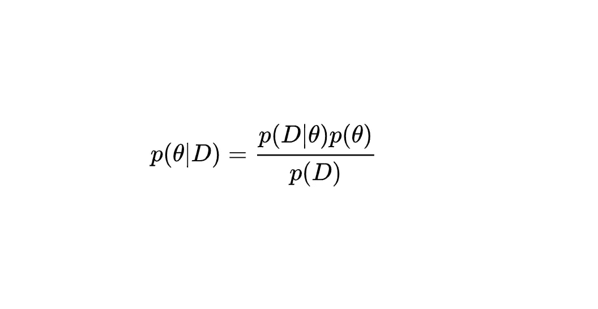

# 贝叶斯直觉与日常物理学

> 原文：<https://towardsdatascience.com/bayesian-intuition-illustrated-with-everyday-physics-1e2f797ced0b>

## 用数据更新你的信念就像往桶里倒水一样

本杰明·沃罗斯在 [Unsplash](https://unsplash.com?utm_source=medium&utm_medium=referral) 上的照片

# 介绍

让我们玩一个游戏。一个巫师选择了一个实数，我们需要猜一猜。

没有额外的信息，我们不知道这个数字是多少。它可以是实数线上的任何东西。

幸运的是，巫师愿意给我们提供线索。他将从正态分布中随机抽取一个数，其平均值等于他选择的数，标准差等于 10。抽到的号码是 136.6。

现在我们对选择的数字有了更好的了解。在这条线索之前，很有可能这个数字是*负数*。现在，很有可能这个数字不仅是正的，而且大于 100。这条线索更新了我们的信念。

巫师同意以同样的方式给我们第二条线索。这次他抽到 123.4。我们现在有理由相信，所选的数字大约在 130 左右——是两个抽取数字的平均值。

第二条线索也让我们更加自信。在第一条线索之后，被选中的数字可能会超过 150。根据第二条线索，这种结果现在不太可能出现。

我们可以想象，如果我们不断从巫师那里得到线索，我们会不断更新对巫师所选数字的信念。如果我们收到 10，000 条类似的线索，我们就有理由相信巫师的数字接近 10，000 次抽奖的平均值。

> 每个线索应该在多大程度上更新我们的信念？贝叶斯法则提供了这个问题的答案。

# 用贝叶斯推理更新我们的信念

## 精确定义信心

在深入研究贝叶斯模型之前，我们需要回顾一些术语。

还有两种描述标准差的方法。第一个是*方差*，它是分布平均值的平均平方距离。第二个是*精度，*是方差的倒数。

> 大的方差对应于高的不确定性，大的精度对应于高的置信度。

在上一节的示例中，正态“线索”分布的标准差是 10，方差是 10 =100，精度是 1/100。

## 正常的正常模型

现在我们已经定义了精度，让我们进入模型。在我们的游戏中，我们称巫师选择的数字为*θ；*这是我们试图推断的参数。对于一个给定的线索，我们将把抽出的数字称为 *D，*因为它是更新我们信念的“数据”。

我们想计算出*P(θ| D)*——给定线索中提供的数据，所选数字*的概率分布。这可以使用贝叶斯规则来计算，如下所示:*

图片由作者提供。贝叶斯法则。

上述等式有四个组成部分:

*   *P(θ| D)——*称为*后路。*这是描述我们观察 *D* 后更新信念的分布。
*   *P(D |θ)——*称为*的可能性。*对于给定的 *θ* ，如何分配 *D* ？在游戏中，这个分布是正态分布，平均值为 *θ* ，标准差为 10。
*   *P(θ)——*被称为*先验。*这是在观察到 *D.* 之前描述我们信念的分布
*   *P(D)*——被称为*边际可能性*。一般我们不会太担心这个分量。我们可以把它看作一个常数，确保后验分布整合为一。

如果我们用正态分布来描述我们的先验信念，计算后验概率就相对简单了。这是因为正态分布是已知方差的正态似然的[共轭先验](https://en.wikipedia.org/wiki/Conjugate_prior)。

这里涉及到相当多的代数知识，我就不赘述了，但是贝叶斯定理的最终结果是后验分布也是正态分布。

> 在正态-正态模型中，后验均值是先验均值和数据(线索中绘制的值)的精度加权均值。后验精度是先验精度和数据精度之和。

我们可以编写一个简单的 Python 函数来计算后验参数，如下所示:

一旦我们根据给定的线索更新了我们的信念，后验分布就变成了下一个线索的先验分布。因此，我们反复使用贝叶斯法则来更新我们对每个线索的信念。

在第一条线索之前，我们没有关于巫师号码的信息。我们可以将这些不知情的信念建模为以 0 为中心的无限宽的正态分布。这个分布的方差为无穷大，对应的精度为 0。正如我们前面提到的，分布“线索”的精度是 1/100。所以每条线索都给我们的信念增加了 1/100 的精确度。所以我们的信念分布在五条线索后精度为 0.05，十条线索后精度为 0.1，依此类推。

随着我们的信念变得越来越自信(高精度)，每一条新线索改变我们信念的能力越来越小。例如，当我们收到第二条线索时，我们通过将 50%的权重放入从线索中提取的值中，并将 50%的权重放入我们先前的信念中，来更新我们的信念。当我们收到第 10 条线索时，我们把 90%的权重放在先前的信念上，只有 10%放在新的信息上。

> 当我们有自信的先验信念时，新信息不会改变我们的想法。

下面的动画展示了当我们收到随机产生的线索时，我们信念的演变。请注意，一开始，我们的信念会随着每一个新线索而显著改变，因为我们是“开放的”在收到许多线索后，我们基本上已经认定 *θ* 在 120 左右，即使远离 120 的线索也无助于改变我们的信念。一旦我们观察到压倒性的证据，我们的信念就会变得沉重而不可动摇。

图片由作者提供。“正常正常”模型的可视化。黑线代表从正态分布中抽取，未知平均值为 *θ，已知标准差为 10。蓝色分布代表关于θ实际值的信念。每一次绘制都是一条线索，更新了我们对θ真实值的信念。*

# 混合水的热力学

假设我在一个 30 摄氏度的桶里放了 2 公斤水，然后我把 1 公斤 90 摄氏度的热水倒进桶里。忽略与周围的传热，混合后桶中水的质量和温度会是多少？

根据质量守恒，最终质量就是最初在桶中的水的质量(1 千克)和倒入桶中的水的质量(2 千克)的总和。所以，3 斤。

如果我们假设比热容不变，最终温度就是桶中已有水的温度和我加入的水的温度的质量加权平均值。这就得出(2 * 30 + 1 * 90)/3 = 50 摄氏度。

这为方差已知的正态-正态贝叶斯模型提供了精确的数学模拟。最初桶里的水代表我们先前的信念，我们倒入的水代表新的信息。质量相加就像贝叶斯模型中精度相加一样。最终温度是质量加权平均值，就像后验平均值是精度加权平均值一样。精确的数学类比是针对我们在贝叶斯和热力学模型中所做的假设的。然而，我发现定性的类比对于理解一般的贝叶斯推理是有用的。

# 探索类比

如果水桶中已经有很多水，那么就需要大量不同温度的水来更新水桶中的水温。如果有人有非常自信的先验信念，改变他们的想法需要强有力的相反证据。

> 用证据来说服一个已经下定决心的人，就像试图通过向海洋中倒入一杯热咖啡来温暖海洋一样。

反过来，如果我们把水倒进一个空桶里，最终的温度将是我们倒入的水的温度。这相当于完全忽略我们先前的信念，只根据新的信息就得出结论——就像我们在巫师的游戏中用第一条线索做的那样。

如果我们把水倒入一桶相同温度的水中，新的温度将与原来的温度相同。但是，桶里会有更多的水，从现在开始更难改变温度。这相当于证实我们信念的证据——它不会改变我们的想法，但它确实让我们的信念在未来更加不可动摇。

# 结束语

当我们面对新的信息时，我们应该考虑我们的水桶里已经有多少水，以及信息增加了多少水。作为人类，我们经常犯过度自信的错误。我们很容易根据自己的经验得出僵化的结论，即使面对压倒性的相反证据，也无法更新我们的信念。然而，解决方法不是完全忽略先前的信念。

贝叶斯统计的一个经典例子是皮埃尔·西蒙·拉普拉斯在 18 世纪提出的[日出问题](https://en.wikipedia.org/wiki/Sunrise_problem)。根据过去的观察，明天太阳升起的概率有多大？如果有人只在地球上生活了一天，对他们来说日出是罕见的事情可能是可信的。对于我们这些目睹过多次日出的人来说，我们可以确信明天太阳还会升起，我们应该高度怀疑任何与此相反的证据。在这种情况下，我们的先验知识*应该*几乎是不可移动的。正如卡尔·萨根所说，“非凡的主张需要非凡的证据。”