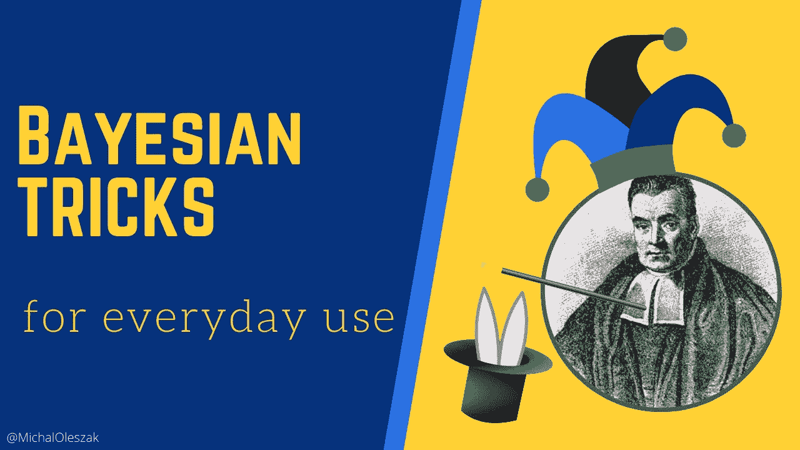
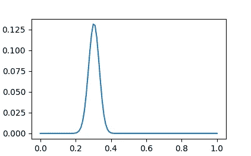
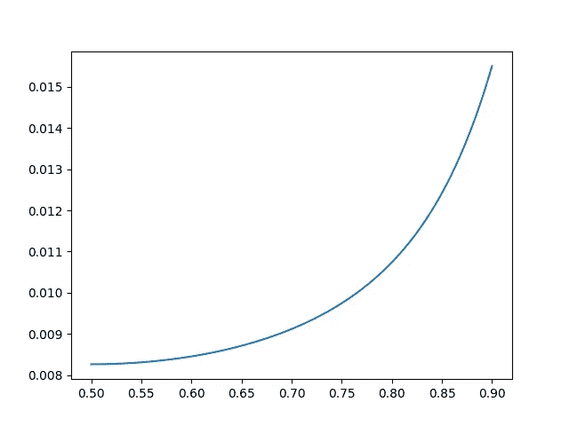

# 日常使用的贝叶斯技巧

> 原文：<https://towardsdatascience.com/bayesian-tricks-for-everyday-use-2b51da45f3ec>

## 学习一些有用的概率技巧，在不完整信息的海洋中安全航行



有时候我们希望我们知道一些我们不知道的事情。不幸的是，很多时候，我们没有时间甚至没有办法去学习我们需要的东西。然而，决策和评估只需要利用可支配的知识。虽然对我们许多人来说，在不完整信息的迷雾中航行似乎很可怕，但那些了解不确定性本质的人可以利用这一点为自己服务。继续读下去，看看如何在一些技巧的帮助下，从有限的信息中获取最多的知识。


# 走向贝叶斯

为了在不确定的海洋中安全航行，我们需要一个指南针。而不是任何指南针。将无害地引导我们的指南针是贝叶斯定理。这个简单的公式允许我们计算我们的假设基于我们已经看到的数据的可能性有多大( *P(H|D)* ，或者*后验概率*)。


假设(H)和数据(D)世界中的贝叶斯公式。

我们只需要知道假设我们的假设为真，观察到我们看到的数据的可能性有多大( *P(D|H)* ，或者*可能性*)。我们还需要一个假设，关于我们的假设本身有多大的可能性，抛开任何数据( *P(H)* ，或者*先验概率*)。然后，我们只需将右边分子中的两个数字相乘。由于整个事情是一个概率，它需要为所有可能的假设总结为一。因此，我们可以简单地把分母当作一个比例因子，确保总和为 1，瞧，我们已经得到了贝叶斯！

如果您对贝叶斯定理还不太熟悉，请随意阅读我关于贝叶斯思维的文章，这篇文章对它进行了更详细的解释，并提供了许多实际例子:

[](/on-the-importance-of-bayesian-thinking-in-everyday-life-a74475fcceeb)  

当我们在本文的剩余部分学习各种贝叶斯技巧时，我将假设您直观地掌握了先验和似然性的概念，以及我们如何将两者相乘并缩放以得到后验概率。阅读上面的文章将足以让你开始。

让我们来看看如何利用这种贝叶斯机制来获得敏感问题的真实答案，并根据训练中泄露的信息来评估你的足球队的状态。


# 获得敏感问题的真实答案

社会和经济研究者有时会问一些困难的问题。你对你的伴侣不忠吗？或者在你的税单上？你每天都吸毒吗？你可以很容易地想象大多数人会如何回答这类问题。

研究人员很难得到诚实的答案，这种现象被称为[社会期望偏差](https://en.wikipedia.org/wiki/Social-desirability_bias)。当被问及敏感问题时，回答者会高估积极行为，低估消极行为，这样提问者会更好地看待他们。然而，获得这些问题的真实答案可能对引导社会经济政策朝着理想的方向发展至关重要。一个人该怎么做呢？

信不信由你，一个简单的贝叶斯技巧解决了这个问题！只是告诉人们偷偷抛硬币。如果结果是正面的，无论你问他们什么，他们都应该说是。如果是反面，他们应该诚实地回答问题。这样人家才愿意老老实实回答。从他们的角度来看，承认毒品交易并不能给你任何关于他们的信息，因为他们可能只是以摇头为由说是。他们将是正确的，因为你无法知道这个特定的人是一个经销商还是一个头脑清醒的人。但是问足够多的人，贝叶斯概率的魔力会让你估计他们中有多少人卖毒品。

让我们在实践中看到它。假设我们想知道偷税漏税的人口比例是多少。我们询问了 1000 名有代表性的人，他们是否使用了上述的硬币戏法来作弊。我们有 652 票赞成，348 票反对。

是时候启动我们的贝叶斯机器了。首先，我们需要一个先验。在看到任何数据之前，作弊的百分比可能是多少？让我们对此不可知论，并采用统一的先验。也就是说，我们说从 0%(没有人作弊)到 100%(每个人都作弊)的每一个可能的数字都是同样可能的。

我们会边走边编码。为了表示我们的先验，我们将使用来自*经验分布图* Python 包的概率质量函数(PMF)。这是一种字典，我们用它来给从 0 到 1 的每一个可能的概率赋予一个相等的值。

```
>>> prior
0.00    1
0.01    1
0.02    1
       ..
0.98    1
0.99    1
1.00    1
```

接下来，我们需要计算可能性。我们需要对一个是和一个否，以及每个之前的值都这样做。以 0.20 的先验为例(20%的人出轨)。得到肯定回答的可能性有多大？是`0.5 + (0.2 / 2) = 0.6`。为什么？嗯，0.5 来自于有一半的人会摇头，回答是。剩下的`0.2 / 2`反映了这样一个事实:在 20%的作弊者中，有一半已经被计算在内了(那些抛了头的人)，但我们仍然需要添加另一半抛了尾的作弊者。

答案是否定的可能性有多大？是`(1 — 0.2) / 2 = 0.4`。因为唯一可能的答案是“是”和“否”，我们可以简单地从 1 中减去 0.6 的可能性，得到 0.4，但是为了更深入的理解，让我们花一点时间在公式上。假设有 20%的人作弊，我们有 80%的人不作弊。其中，只有一半的人会回答不，而另一半会摇头说是。

现在让我们将这种计算扩展到所有先前的值。

```
likelihood["Y"]
array([0.5  , 0.505, 0.51 , 0.515, 0.52 , 0.525, 0.53 , 0.535, 0.54,
       0.545, 0.55 , 0.555, 0.56 , 0.565, 0.57 , 0.575, 0.58, 0.585,
       0.59 , 0.595, 0.6  , 0.605, 0.61 , 0.615, 0.62 , 0.625, 0.63,
       0.635, 0.64 , 0.645, 0.65 , 0.655, 0.66 , 0.665, 0.67, 0.675,
       0.68 , 0.685, 0.69 , 0.695, 0.7  , 0.705, 0.71 , 0.715, 0.72,
       0.725, 0.73 , 0.735, 0.74 , 0.745, 0.75 , 0.755, 0.76, 0.765,
       0.77 , 0.775, 0.78 , 0.785, 0.79 , 0.795, 0.8  , 0.805, 0.81,
       0.815, 0.82 , 0.825, 0.83 , 0.835, 0.84 , 0.845, 0.85, 0.855,
       0.86 , 0.865, 0.87 , 0.875, 0.88 , 0.885, 0.89 , 0.895, 0.9,
       0.905, 0.91 , 0.915, 0.92 , 0.925, 0.93 , 0.935, 0.94, 0.945,
       0.95 , 0.955, 0.96 , 0.965, 0.97 , 0.975, 0.98 , 0.985, 0.99,
       0.995, 1\.   ])
```

在上面的打印结果中，我们可以看到不同的前科得到肯定回答的可能性。第一个可能性 0.5 对应于先验或 0。如果没有人作弊，得到肯定答案的几率就是 50%的抛头几率。1 的最后可能性对应于 1 的先验。如果每个人都作弊，所有的答案都是肯定的——一半是诚实的承认，另一半是硬币正面朝上。正如我们刚刚看到的，第二十一个值 0.6 对应于 0.2 的先验值。

现在我们有了先验、可能性和数据(回想一下，我们有 652 个赞成和 348 个反对)，我们可以很容易地使用贝叶斯公式计算后验概率。为了使计算变得容易，我们将从先验开始，并逐点用似然数据更新它(即:逐个回答)。最后，我们将标准化结果，以获得适当的概率分布。`normalize()`方法是`empiciraldist`包中的一个有用的工具。它所做的只是将分布中的每个值除以所有值的总和，以确保它们加起来等于 1。



骗税的后验概率。图片由作者提供。

所以我们有了它。`max_prob()`方法返回 0.3，后验分布的密度图没有留下任何疑问:偷税者在人口中的百分比在 20%到 40%之间，最有可能在 30%左右。

对于一个非常敏感的问题，这是一个非常精确的回答！如果我们简单地问这个问题，作弊的人不会承认，我们会得到有偏见的结果。我们刚刚是不是免费摆脱了这种偏见？哦，不，天下没有免费的午餐！我们以假设的形式付出了代价！

我们假设了什么？事实上，只有一件事:不管是骗子还是非骗子，抛正面(和反面)的概率都是 50%。或者换句话说:硬币是公平的，所有的人都以同样的方式扔硬币。在我看来这是个合理的假设。

最后，注意我们的后验分布的宽度取决于我们的样本量。我们问了 1000 个人。如果我们面试的人更少，曲线会更宽更低，留下更多的不确定性。只有 100 名受访者(65 名赞成，35 名反对)，我们将得到这条橙色曲线(蓝色曲线与之前的 1000 名受访者相同)。


基于 1000 和 100 名受访者的逃税后验概率。图片由作者提供。


# 点球大战

下一个例子的灵感来自艾伦·唐尼的《思考贝叶斯》中的一个相似的例子。虽然他写的是通过用外星人 Blaster 9000 射击敌人的飞船来防止外星人入侵，但我已经把他的例子翻译成了一个更贴近我内心的领域:足球(当我说足球时，我指的是英国人发明的*足球，*，在这种足球中，你实际上是用脚而不是用手——无意冒犯我的美国朋友😉).

一场大赛即将来临。比如说，冠军联赛决赛。由于两个参赛队都是顶级的，所以认为两队都无法扭转局势，所以这场比赛可能会以平局告终是合理的。在那种情况下，将在点球决出胜负。这意味着每队五名球员轮流罚对手点球。得分多的队获胜。

难怪在如此重要的比赛之前，球队倾向于强调练习点球。在赛前新闻发布会上，你的球队的教练宣布，他们在一次训练中模仿了两次点球大战，两次都进了相同数量的球。他说，这证明了球员们投篮的一致性。这对作为他们粉丝的你来说是好消息还是坏消息？

教练的话可能意味着他们在两次测试中得了五分，或者他们一分也没得。很可能，他没有给出确切的数字，以便不通过宣布他们得分而给球员施加压力，或者不通过说他们只得分一次或两次来增强对手的信心。幸运的是，贝叶斯思维将带领我们找到答案！

让我们将这个问题形式化如下:假设在两次五次射门试验中，得分数量相同，这支球队罚球得分的概率是多少？

我们需要从点球得分概率的先验开始。对于一个足球迷来说，平均四分之三的点球被转化为进球已经不是什么新闻了。这表明有大约 75%的先验。然而，在赛后的点球大战中，除了顶级点球手之外的球员可以射门，这将得分概率降低到 70%左右。也就是说，有些球员不能每隔一个点球就进球，而其他人几乎是完美的得分手(有人说是罗伯特·莱万多夫斯基吗？).基于所有这些，让我们采用 0.5 到 0.9 之间的无信息的、统一的先验。这意味着我们相信点球得分的概率在 50%到 90%之间。

```
>>> prior
0.500    1
0.504    1
        ..
0.896    1
0.900    1
```

接下来是可能性。为了计算它，注意到我们正在处理估计一个比例(得分概率)的任务是很方便的。这就是二项分布发挥作用的地方。

二项式概率质量函数，或称 PMF，可以回答这个问题:如果罚中一个球的概率是 75%，那么在 5 个点球中准确命中 3 个的几率是多少？答案是`binom.pmf(3, 5, 0.75)`26%。

我们可以使用这个函数来计算所有可能结果的可能性(球队得分为零，五分之一，两个，三个，四个，或所有五个惩罚)，所有之前的得分概率(从 0.5 到 0.9)。请注意，我们对结果进行了平方处理，以说明两次试验中的每一次得分相同。然后，我们将它们相加，因为总的可能性是零、一、二、三、四和五个进球得分的概率之和(这些结果中的任何一个都符合教练的话)。一旦我们有了可能性，我们只需将它与先验相乘，然后像往常一样进行归一化，就可以得到后验概率。



现在我们有了！我们队进点球的概率最有可能是 90%左右，极不可能是 50%。这是个好消息！

毫无疑问，使用贝叶斯机器来得到准确的答案是很酷的，但这种结果是意料之中的。想想看:如果得分概率是极端的，比接近 50%时，在每次试验中得分相同数量的目标更有可能。一个近乎完美的球员团队通常会得到 5/5 的分数。一个从来没有踢过足球的队伍经常会得 0/5 分。一个普通的团队在试验中的结果会有更多的变化，因此不太可能重复相同的结果两次。


感谢阅读！如果您对如何更严格地将贝叶斯思维应用于统计数据分析感兴趣，请查看我关于该主题的介绍性文章:

[](/the-gentlest-of-introductions-to-bayesian-data-analysis-74df448da25) 

如果你喜欢这篇文章，为什么不在我的新文章上 [**订阅电子邮件更新**](https://michaloleszak.medium.com/subscribe) ？通过 [**成为媒介会员**](https://michaloleszak.medium.com/membership) ，你可以支持我的写作，并无限制地访问其他作者和我自己的所有故事。

需要咨询？你可以问我任何事情，也可以在这里 预定我 1:1 [**。**](http://hiretheauthor.com/michal)

你也可以试试我的其他文章。不能选择？从这些中选择一个:

[](/on-the-importance-of-bayesian-thinking-in-everyday-life-a74475fcceeb)  [](/6-useful-probability-distributions-with-applications-to-data-science-problems-2c0bee7cef28)  [](/confidence-intervals-vs-prediction-intervals-7b296ae58745) 