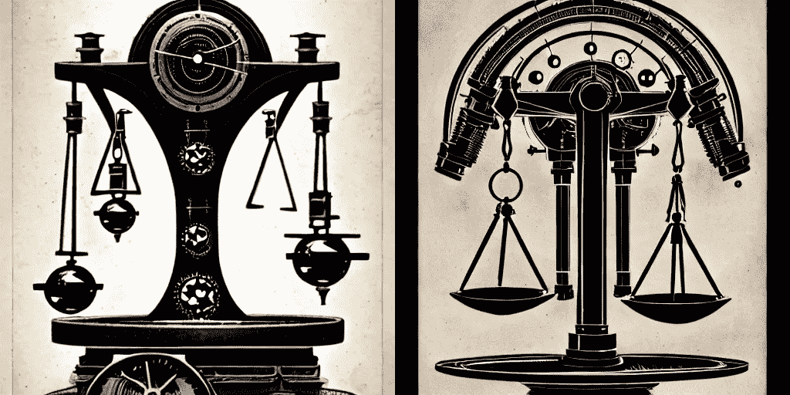

# 贝叶斯与频率主义推理

> 原文：<https://towardsdatascience.com/bayesian-vs-frequentist-inference-a2cab8087bda>

## 你是贝叶斯主义者还是频率主义者？

使用[稳定扩散](https://stability.ai/blog/stable-diffusion-public-release)生成的图像

关于概率学派，有两种主要的方法:贝叶斯方法和频率主义方法。这两种方法都有各自的优点和缺点，它们经常在不同的情况下用于帮助确定事件的概率。

那么，它们的区别在哪里呢？一个比另一个好吗？这是一个错误的问题；贝叶斯思维是基于概率代表对事件发生的信任程度的想法。当事件发生的可能性存在不确定性时，或者当可以获得影响事件发生概率的新信息时，通常使用这种方法。

另一方面，频率主义者的方法是基于这样的想法，即事件发生的概率等于事件发生的长期频率。当通过收集数据并在大量试验中观察事件发生的频率来确定事件的概率时，通常使用这种方法。

> [Learning Rate](https://www.dimpo.me/newsletter?utm_source=medium&utm_medium=article&utm_campaign=bayesian-frequentist) 是为那些对 AI 和 MLOps 世界好奇的人准备的时事通讯。你会在每个月的第一个星期六收到我关于最新人工智能新闻和文章的更新和想法。在这里订阅！

# 直观的例子

为了更好地理解差异，让我们看一个简单的例子。想象一个盒子，里面有一堆弹珠，你想知道盒子里的弹珠是什么颜色的。在贝叶斯方法中，你可能从猜测盒子里大部分是红色弹珠开始，因为你已经在类似的容器里看到许多红色弹珠。当你把手伸进盒子拿出弹珠时，你可以根据你看到的颜色更新你的猜测。所以，如果你拿出一串蓝色的弹珠，你可能会开始认为盒子里主要是蓝色的弹珠，你可以相应地调整你的猜测。

在频率主义者的方法中，你不会去猜测盒子里弹珠的颜色。取而代之的是，你只要把手伸进去，开始拉出弹珠，数一数你看到的红色、蓝色和其他颜色的弹珠的数量。在你抽出大量的弹珠后，你可以通过用你抽出的弹珠总数除以那个颜色的弹珠的数量来计算看到特定颜色的概率。这个概率不是猜测，而是决定盒子里弹珠颜色的随机过程的一个属性。

# 事物的利与弊

贝叶斯方法的一个优点是，它允许我们将先前的信息和信念结合到我们的分析中，并在新的证据出现时更新它们。这在数据稀缺或难以收集的情况下尤其有用。

相比之下，频率主义者的方法只考虑手边的数据，不考虑任何先验信息或信念。这可以使频率主义者的方法更客观，但也可以使它更不灵活，更不能适应新的信息。

贝叶斯方法的另一个优点是它为量化不确定性提供了一个自然的框架。因为贝叶斯概率是个人信念的一种度量，所以它们可以被直接解释为关于与特定假设或命题相关的不确定性程度的陈述。相比之下，frequentist 方法没有提供一种自然的方法来量化不确定性，并且需要额外的工具和假设来对其进行陈述。

稳定扩散生成的图像

贝叶斯方法的缺点是计算量大，特别是对于有许多变量的复杂问题。将贝叶斯方法应用于大型或实时数据集可能会很困难。相比之下，frequentist 方法的计算效率通常更高，这使得它非常适合于关注速度的应用程序。

总的来说，贝叶斯方法和频率主义方法都有它们的优点和缺点，选择哪种方法取决于手头的问题和分析的目标。

# 量化不确定性

但是为什么贝叶斯方法提供了一个量化不确定性的框架？我们来看一个例子。想象一下，你正试图估算明天下雨的概率。在贝叶斯方法中，你首先根据你的经验、你用谷歌搜索得到的天气预报和其他相关信息，给这个事件分配一个先验概率。例如，你可能认为明天有 60%的可能性会下雨，因为你在相似的日子里见过下雨。

稳定扩散生成的图像

现在，假设你观察到今天天空多云。你可以用这个新信息来更新你对明天下雨可能性的看法。在贝叶斯方法中，你将使用贝叶斯定理，它告诉我们如何根据新的证据修正我们的概率。将贝叶斯定理应用于这种情况，你可能会发现明天下雨的概率现在是 80%,因为今天多云的天空更倾向于明天有阵雨而不是没有雨。

在这个例子中，明天下雨的概率是你对这一事件的不确定程度的度量。因为贝叶斯概率是个人信念的一种度量，所以可以直接解释为关于不确定性的陈述:你相信明天有 80%的概率下雨，这意味着你对是否会下雨相当不确定。一般来说，事件发生的概率越高，该事件的不确定性就越小，反之亦然。如果您确信明天会下雨，您可能会将此事件的概率指定为 1.0。相比之下，如果你完全不确定是否会下雨，你可能会把概率定为 0.5。最终，与事件相关的不确定性程度取决于你自己，取决于你自己的信念和你所拥有的证据。

相比之下，频率主义者的方法并没有提供一种自然的方式来量化这种不确定性，因为频率主义者的概率并不是一种个人信念的度量。相反，它们是生成数据的基本随机过程的属性。

# 结论

贝叶斯和频率主义思维是两种不同的统计推断方法。贝叶斯思维基于主观概率的思想，其中事件的概率基于个人对事件的信念或知识。相比之下，频率主义概率是客观的，并且仅仅基于事件在大量试验中发生的频率。

贝叶斯思维的一个关键优势是，它允许将先前的知识或信念结合到分析中，这有助于做出更准确的预测或推断。然而，它在计算上可能比 frequentist 方法更复杂，并且受个人偏见的影响。

频率主义思维比贝叶斯方法更直接，更容易实现，特别是对于大型数据集。然而，它不允许结合先前的知识或信念，也不提供讨论不确定性的自然框架。

# 关于作者

我叫[迪米特里斯·波罗普洛斯](https://www.dimpo.me/?utm_source=medium&utm_medium=article&utm_campaign=bayesian-frequentist)，我是一名为[阿里克托](https://www.arrikto.com/)工作的机器学习工程师。我曾为欧洲委员会、欧盟统计局、国际货币基金组织、欧洲央行、经合组织和宜家等主要客户设计和实施过人工智能和软件解决方案。

如果你有兴趣阅读更多关于机器学习、深度学习、数据科学和数据运算的帖子，请关注我的 [Medium](https://towardsdatascience.com/medium.com/@dpoulopoulos/follow) 、 [LinkedIn](https://www.linkedin.com/in/dpoulopoulos/) 或 Twitter 上的 [@james2pl](https://twitter.com/james2pl) 。

所表达的观点仅代表我个人，并不代表我的雇主的观点或意见。