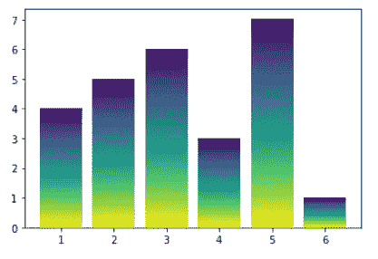
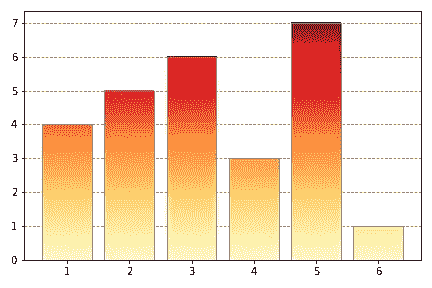
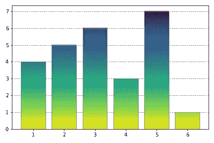
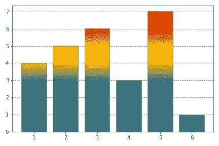

# 美丽的条形图:条形图上的缩放渐变填充

> 原文：<https://towardsdatascience.com/beautiful-bars-scaled-gradient-fill-on-bar-plots-e4da4cdae033>

## 在 matplotlib 中，使用颜色将含义为的**添加到绘图中**

[陈丹妮](https://unsplash.com/@denmychan?utm_source=medium&utm_medium=referral)在 [Unsplash](https://unsplash.com?utm_source=medium&utm_medium=referral) 上的照片

条形图是向我们的观众传达数据的最基本和最有用的方式之一。虽然有更多的数据密集型图，如箱线图、小提琴图和热图，但没有一种图像条形图一样被非技术人员普遍理解。

另一方面，柱状图真的很无聊。它们也非常简单，因为它们没有给观众任何关于所显示的价值观是好是坏的直觉。

在本文中，我们将从用渐变颜色填充给基本的条形图增添一点趣味开始。然后，我们将向您展示如何**缩放**渐变填充，以便单个条不会遍历整个颜色范围，自然地强调值之间的 ***差异*** 。毕竟，这不正是我们试图用柱状图表达的观点吗？

最后，我们将看到如何应用自定义颜色图，我们可以具体定义颜色变化的位置，这样我们就可以说明某些条形指示问题的位置，并进一步将观众的目光吸引到最重要的地方。我们开始吧！

首先，我们将导入标准包，以及一些特定于我们稍后将生成的渐变颜色贴图的包。接下来，我们将为我们的数据创建一个简单的 dataframe，以及一个非常温和的条形图。

最无聊的酒吧情节…😴

现在，简单地改变条形的颜色并不难(例如，`ax.bar(df.a, df.b, color = 'orange')`)，但你不是为此而来的，对吗？

## 基本渐变填充(用于样式，而非内容)

为了执行填充，我们将创建一个基本的条形图，并将其作为变量传递给一个自定义函数。从这里开始，我们将一条一条地把它拆开，并应用`ax.imshow()`函数来应用色彩映射表(简称 cmaps)。

使用`imshow()`最具挑战性的部分之一是设置它需要的第一个变量(文档中的“X”)。这里，我们想要线性地处理我们选择的颜色图，所以我们将使用`np.linspace()`创建一个 0 到 1 之间的 256 个元素的线性数组。重要的是要注意下面`linspace()`代码中的`.T`——它将渐变设置为垂直渐变的正确方向。试着脱下来看看会发生什么！

接下来，我们在函数中重新建立 ax，这样我们就可以提取总绘图区域的 x 和 y 界限。我们用`get_xlim()`和`get_ylim()`提取这些限制。最后，我们用`ax.axis()`函数来应用这些。虽然这看起来很傻，但这些步骤是必要的，以告诉 matplotlib 不要用我们的彩色地图填充整个绘图区域。

最后，我们在一个 for 循环中遍历条形图的每一条。我们首先必须将工具条的`facecolor()`设置为“none ”,否则基色将被放置在我们添加的渐变填充之上。或者，如果我们增加`imshow()`函数中的`zorder`，可以跳过这一行——稍后会详细介绍。然后我们提取酒吧的特征，然后使用`imshow()`在这个范围内应用我们的渐变填充(酒吧的 x，y 坐标)。

使用默认 cmap 的均匀渐变填充

## 高级渐变填充

虽然上面的图看起来更漂亮，但它肯定没有告诉我们任何我们不知道的数据。当我们展示柱状图时，最高点通常更有意义，不管是好是坏。我们真的想让观众注意到酒吧高度的差异。

我们可以将此作为对之前函数的一个相当简单的升级。在我们在顶部设置`grad`变量之前，所有的条将在颜色图上遍历 0 到 256 种颜色。为了缩放我们的颜色，我们真正想要的是最大的*条获得完整的颜色范围，而其他条遍历其中的一个子集。为此，我们将`grad`调用移动到我们的 bar for 循环中。每次调用它时，它都会生成一个包含 256 个数字的数组，但是我们会修改步长。因此，对于最大的小节，`grad`从 0 到 1(有 256 个步长)，但是对于所有其他小节，`grad`不会到 1。步长由特定条形的高度(`h`)与最大条形的高度(`max(ydata)`)进行缩放。为了实现这一点，你可能已经注意到我们现在将`ydata`作为函数调用的一部分传入。我们还传入了一个 cmap 名称，因此我们可以从函数调用中选择梯度 cmap。*

*还有一点——在`imshow()`功能中，我们必须关闭`norm`,否则它会解除我们对`grad`的魔法，并自动将所有输入缩放到 0 和 1 之间。*

*我们可以用不同的彩色地图(cmaps)来尝试，看看哪一种最适合我们的数据:*

**

*分别使用“viridis”、“hot”和“cool”cmap*

*在这些图中，我们看到只有较高的条能够达到特定的颜色。这有助于吸引观众的眼球。*这种差异很微妙，但很重要。*在下面的并排比较中，这种新的缩放渐变填充(左)仅达到第 3 条和第 5 条的紫色范围，使它们具有更高的重力。在这种情况下，我们可以让我们的观众认为“如果一个酒吧变成紫色是不是很糟糕？”。*

**

*将缩放的渐变填充与未缩放的渐变填充进行比较(图片由作者提供)*

## *完善情节*

*在我们与观众分享这个情节之前，我们需要做一些总体的视觉清理。我们将添加网格线以及边界到我们的酒吧，以防止他们融入背景中(因为一些颜色的地图可以相当轻)。这与传统条形图之间的唯一区别是必须对`zorder`多加小心，它控制哪些元素在其他元素的前面。因为我们在一个函数中进行条形着色，但是在基本生成条形之后，我们像这样添加`zorder`:*

**

*“YlOrRd”中的缩放渐变*

**

*“viridis_r”中的比例渐变*

## *完全定制的渐变(额外学分)*

*让我们变得挑剔。如果我们希望我们的条形以某个值改变为某个颜色，以更好地反映什么时候需要我们的观众的注意呢？为此，我们需要构建自定义的彩色地图。[我在我的上一篇文章](/custom-matplotlib-colormaps-for-danger-zone-plots-62310983eb67)中深入讨论了这个问题，展示了如何使用彩色地图，以及如何功能化构建在三种颜色之间转换的彩色地图。更好的是，这些函数使我们能够选择颜色，选择过渡发生的位置，以及过渡的混合程度。我不会一步一步地通过代码来制作如下所示的 cmaps，而是直接让你体验一下它们在我们的渐变填充图上的样子。我将使用上面相同的缩放渐变填充代码，但现在只需插入自定义的 cmaps。*

*在上面的代码中，我们选择以 3.5 从第一种颜色过渡到第二种颜色(混合值为 1)，以 5.5 过渡到第三种颜色(混合值也为 1)。我们给观众的信息是，高于 3.5 的值应该引起关注，高于 5.5 的值是完全危险的。看看你是否能从这张图中得到同样的信息:*

**

*3 级自定义 cmap 应用于我们的酒吧*

## *摘要*

*条形图通常很简单，但是我们可以使用渐变填充来增加趣味。更好的是，我们可以使用*比例渐变*和*自定义比例渐变*来教我们的观众如何解读数据。好消息是——你现在有工具让美丽(和有意义！)条形图。坏消息是——标准条形图现在看起来比以往任何时候都更加简单和乏味(滚动到第一个条形图并退缩😬).*

****感谢阅读，如果你觉得这很有帮助，请跟我来！****

*和往常一样，整个代码走查笔记本可以从我的 github 中找到。干杯，祝大家编码愉快。*