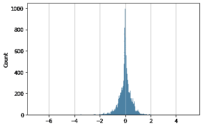
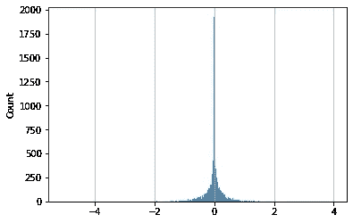
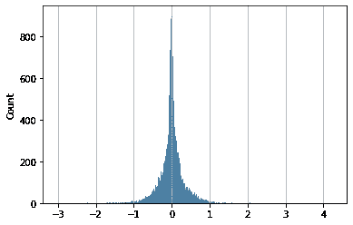

# 基准测试 6 种基于 AutoML 的插补技术

> 原文：<https://towardsdatascience.com/benchmarking-6-automl-based-imputation-techniques-3b1defc0d25b>

## 插补策略基本指南

图片来自[皮克斯拜](https://pixabay.com/?utm_source=link-attribution&amp;utm_medium=referral&amp;utm_campaign=image&amp;utm_content=693873)的[威利·海德尔巴赫](https://pixabay.com/users/wilhei-883152/?utm_source=link-attribution&amp;utm_medium=referral&amp;utm_campaign=image&amp;utm_content=693873)

现实世界中的数据集通常包含大量缺失值，这可能是由于数据损坏或记录数据失败造成的。数据中缺失值的存在妨碍了训练稳健的机器学习模型。大多数机器学习算法不支持缺失值，因此数据科学家需要在特征工程管道中明确处理缺失值。

有各种技术来处理或估算缺失值。在我以前的一篇文章中，我有 7 种处理缺失值的技术。

 [## 机器学习中处理缺失值的 7 种方法

### 处理数据集中缺失值的常用策略

towardsdatascience.com](/7-ways-to-handle-missing-values-in-machine-learning-1a6326adf79e) 

Scikit-learn、Verstack、Impyute 是各种开源包，提供了在几行 Python 代码中估算缺失值的实现。这些软件包实现了各种插补算法，包括 KNN 插补、随机森林插补、迭代插补等。

在本文中，我们将讨论和基准的各种插补算法的性能指标。

# 开始使用:

在开始实施插补算法之前，让我们准备一个自定义数据集，并用缺失值替换一些值。样本数据集有 28 个特征，其中 5 个特征的 25%的值为 NaNs *(12，500 个数据值)*。我们保留了原始数据集的副本(具有 NaNs 的实际值),以比较每种插补策略的性能。

请在我的 [GitHub gist](https://gist.github.com/satkr7/887ed6f2348f29086d7d51b8faa1e293) 中找到实用函数来计算平均绝对误差并生成误差图。

## 1)简单估算器:

简单估算法可被视为一种基本或最简单的估算技术，其中缺失值由平均值、中间值、最频繁值或常数值替代。Scikit-learn 包提供了[简单估算器](https://scikit-learn.org/stable/modules/generated/sklearn.impute.SimpleImputer.html)的实现。

(作者代码)，简单估算器的实现

使用简单估算器的实际值和预测估算值之间的[平均绝对误差](https://scikit-learn.org/stable/modules/generated/sklearn.metrics.mean_absolute_error.html)为`***0.01369***`。

(图片由作者提供)，简单估算器的误差分布图

## 2)迭代估算器:

迭代输入是一种输入缺失值的策略，通过循环方式将每个具有缺失值的要素建模为其他要素的函数。Scikit-learn 还提供了[迭代估算器](https://scikit-learn.org/stable/modules/generated/sklearn.impute.IterativeImputer.html#sklearn.impute.IterativeImputer)的实现。

默认情况下，迭代估算器使用一个可配置的 ***BayesianRidge*** 估算器。

(作者代码)，迭代估算器的实现

使用简单估算器的实际值和预测估算值之间的[平均绝对误差](https://scikit-learn.org/stable/modules/generated/sklearn.metrics.mean_absolute_error.html)为`***0.01359***`。

(图片由作者提供)，迭代估算的误差分布图

## 3)KNN-估算者:

KNN 估算器使用在训练集中找到的`**n_neighbors**`最近邻的平均值估算每个缺失值。它假设两个样本是接近的，如果两个样本都不缺少的特征是接近的。

(作者代码)，KNN 估算器的实现

使用简单估算器的实际值和预测估算值之间的[平均绝对误差](https://scikit-learn.org/stable/modules/generated/sklearn.metrics.mean_absolute_error.html)为`***0.00867***`。

(图片由作者提供)，KNN-估算器的误差分布图

## 4)ver stack—nan inputr:

[nan import](https://verstack.readthedocs.io/en/latest/)**使用 xgboost 模型对熊猫数据框中所有缺失值进行估算。xgboost 模型经过多重处理训练，因此估算值相对较快。**

**使用 NaN Imputer，您可以使用 XGBoost 回归器/分类器更新数值、二进制、分类的缺失值。这个基于 XGBoost 的 NaNImputer 可以使用 verstack 包在一行 Python 代码中实现。**

**(作者代码)，ver stack NaN-inputr 的实现**

**实际值和使用小鼠估算器预测的估算值之间的[平均绝对误差](https://scikit-learn.org/stable/modules/generated/sklearn.metrics.mean_absolute_error.html)为`***0.00903***`。**

****

**(图片由作者提供)，ver stack NaN-inputer 的误差分布图**

## **5)小白鼠:**

**链式方程多变量插补([小鼠](https://impyute.readthedocs.io/en/latest/_modules/impyute/imputation/cs/mice.html))是一种插补缺失值的迭代方法。它假设数据是随机丢失的，并通过查看其他样本值对其真实值进行有根据的猜测。Impyute 包提供了鼠标的实现。**

**(作者代码)，MICE 的实现**

**实际值和使用鼠标估算器预测的估算值之间的 [mean_absolute_error](https://scikit-learn.org/stable/modules/generated/sklearn.metrics.mean_absolute_error.html) 为`***0.01371***`。**

****

**(图片由作者提供)，老鼠的误差分布图**

## **基准测试:**

****

**(图片由作者提供)，上述插补技术的基准平均绝对误差**

**从上表中，我们可以得出结论，KNN 估算器(Scikit-learn)和南估算器(verstack)在估算缺失数据值方面表现最佳，性能提高了 55%到 60%。**

**此外，KNN 估算器和南估算器的误差图相对优于其他误差图，大多数误差等于或接近于 0。**

# **结论:**

**在本文中，我们讨论了使用各种开源软件包的 API 函数来估算缺失值的 5 种方法或技术。在这 5 种技术中，scikit-learn 中实现的 KNN 估算器表现最佳，与使用均值策略估算缺失数据的基线简单估算器相比，性能提高了 x%。**

**此外，verstack 包中实现的 nan inputr 函数对该数据的执行效果不太好，但它可以估算值，而不考虑要素的数据类型(数值、二进制、分类)。**

**上面的基准测试数据是针对一个小的数据集样本生成的，但是很好地概述了各种技术的表现。**

> **感谢您的阅读**