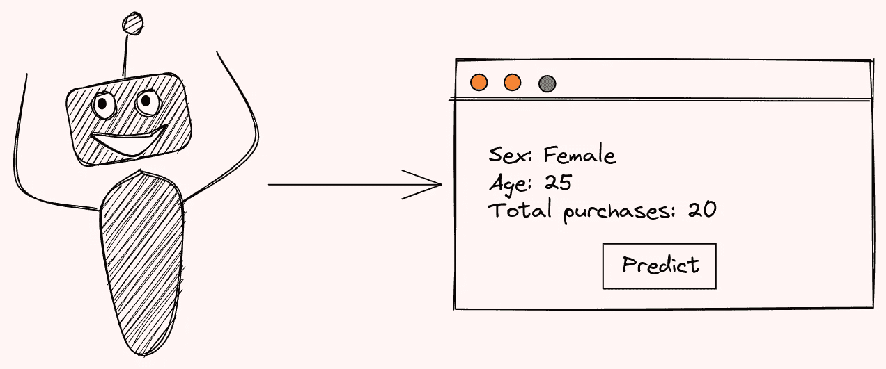
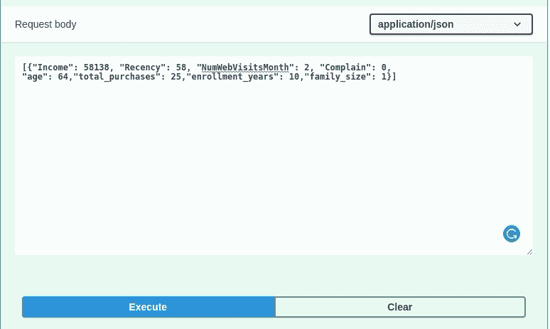
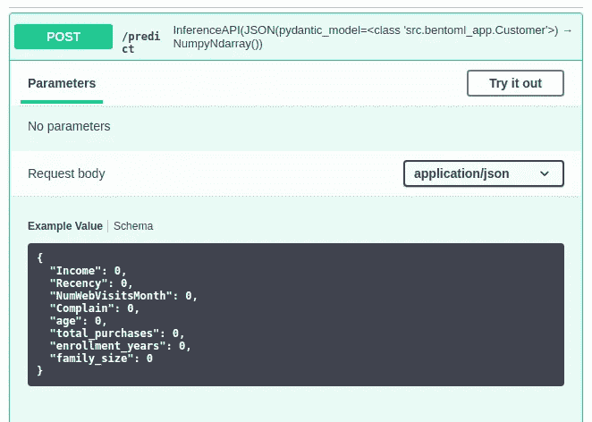
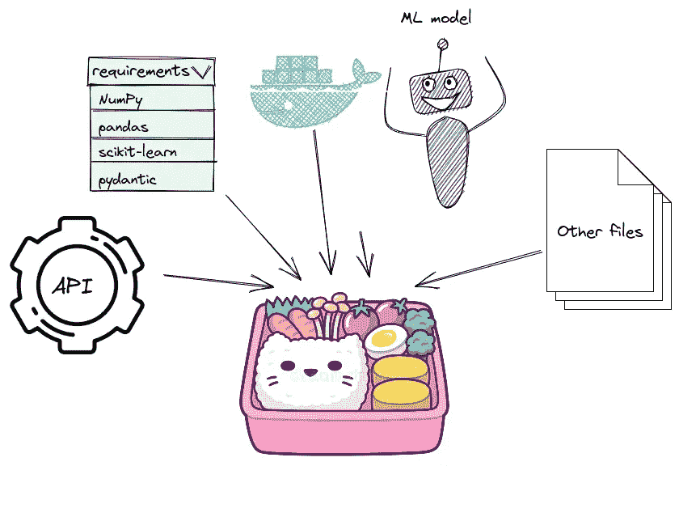
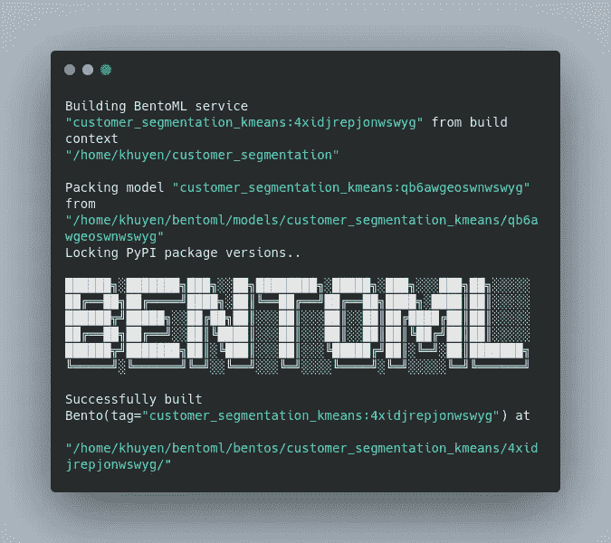
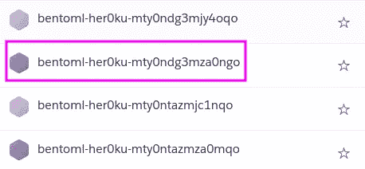
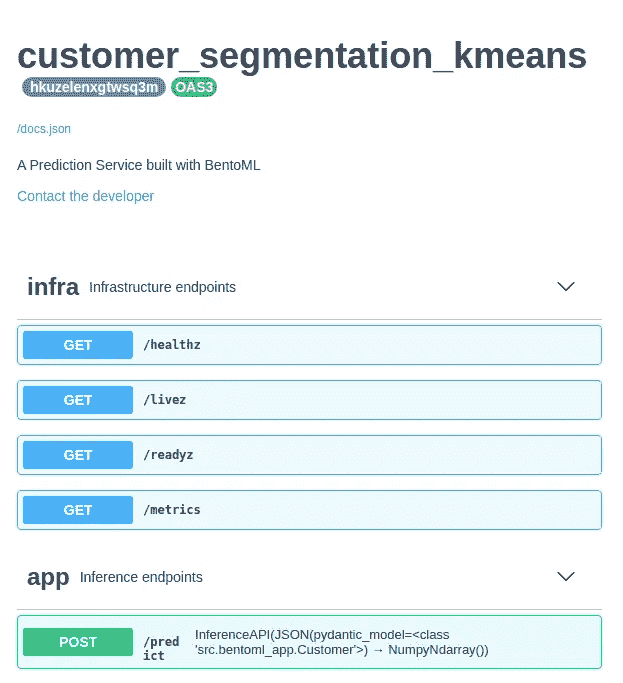
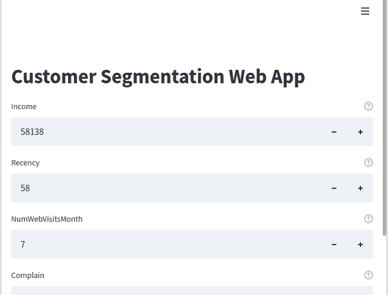

# BentoML:在几分钟内创建一个 ML 驱动的预测服务

> 原文：<https://towardsdatascience.com/bentoml-create-an-ml-powered-prediction-service-in-minutes-23d135d6ca76>

## 用 Python 封装和部署您的 ML 模型

# 动机

您刚刚建立了一个机器学习模型来预测客户属于哪个群体。该模型似乎在细分客户方面做得很好。您决定将这个模型交给您的团队成员，以便他们可以在您的模型之上开发 web 应用程序。



作者图片

等等，但是你如何将这个模型发送给你的团队成员呢？如果你的团队成员可以**使用你的模型而不用设置任何环境或者弄乱你的代码**，那不是很好吗？这时候 BentoML 就派上用场了。

随意发挥，并在这里叉这篇文章的源代码:

[](https://github.com/khuyentran1401/customer_segmentation/tree/bentoml_demo) [## GitHub—khuyentran 1401/客户 _ bentoml _ demo 的细分

### 数据是从 Kaggle 下载的。

github.com](https://github.com/khuyentran1401/customer_segmentation/tree/bentoml_demo) 

# BentoML 是什么？

[BentoML](https://github.com/bentoml/BentoML) 是一个 Python 开源库，使用户能够在几分钟内创建一个机器学习驱动的预测服务，这有助于弥合数据科学和 DevOps 之间的差距。

要使用将在本文中使用的 BentoML 版本，请键入:

```
pip install bentoml==1.0.0a4
```

为了理解 BentoML 是如何工作的，我们将使用 BentoML 来服务于一个根据新客户的个性对其进行细分的模型。

# 保存处理器

从从 Kaggle 下载[客户个性分析](https://www.kaggle.com/imakash3011/customer-personality-analysis)数据集开始。接下来，我们将处理数据。

由于我们稍后将使用`StandardScaler`和`PCA`来处理新数据，我们将把这些 scikit-learn 的变形金刚保存到 BentoML 的本地模型商店。

运行上面的代码后，模型将保存在`~/bentoml/models/`下。您可以通过运行以下命令来查看本地存储的所有模型:

```
$ bentoml models list
```

输出:

请注意，该模型是用特定的标签进行版本化的。如果我们保存另一个同名的模型，您应该会看到一个不同的标签。

这非常好，因为对模型进行版本控制将允许您在不同的模型之间来回切换。

*找到完整的代码读取并处理数据* [*这里*](https://github.com/khuyentran1401/customer_segmentation/blob/bentoml_demo/src/process_data.py) *。*

# 保存模型

接下来，我们将在处理后的数据集上训练`KMeans`模型。我们将使用如上所示的相同方法来保存模型。

*在这里* *找到关于训练和保存模型* [*的完整代码。*](https://github.com/khuyentran1401/customer_segmentation/blob/bentoml_demo/src/segment.py)

# 创建服务

现在我们有了模型，让我们加载最新的处理器和模型，并在`bentoml_app_pandas.py`中用该模型创建一个服务。

`function_name`告诉 BentoML 模型运行时将使用哪个函数。

`function_name`的默认值为`predict`。由于`customer_segmentation_kmeans`是一个估计量，我们保持`function_name`的默认值。由于`scaler`和`pca`是变压器，所以我们把`function_name`设为`transform`。

然后用处理器和模型创建一个服务:

定义服务后，我们可以用它来创建一个 API 函数:

装饰器`@service.api`声明函数`predict`是一个 API，其输入是一个`PandasDataFrame`，输出是一个`NumpyNdarray`。

现在让我们通过运行`bentoml serve`在调试模式下测试服务。由于`bentoml_app_pandas.py`在`src`目录下，我们运行:

```
$ bentoml serve src/bentoml_app_pandas.py:service --reload
```

输出:

我们现在可以通过访问 [http://127.0.0.1:5000](http://127.0.0.1:5000) 并点击“试用”按钮来与 API 进行交互:


作者图片

插入以下值:

```
[{"Income": 58138, "Recency": 58, "NumWebVisitsMonth": 2, "Complain": 0,"age": 64,"total_purchases": 25,"enrollment_years": 10,"family_size": 1}]
```

…请求体应该给你一个值`1`。这意味着模型预测具有这些特征的客户属于分类 1。



作者 GIF

## 用 pydantic 创建数据模型

为了确保用户将具有正确数据类型的正确值插入到 API 中，我们可以使用 pydantic 创建一个自定义数据模型:

现在，您应该在请求主体下看到默认值。



作者图片

*在这里* *可以找到关于创建 API* [*的完整代码。*](https://github.com/khuyentran1401/customer_segmentation/blob/bentoml_demo/src/bentoml_app.py)

# 制作便当

在确保一切看起来不错之后，我们可以开始将模型、服务和依赖项放入便当中。



作者图片

要构建 Bentos，首先在项目目录中创建一个名为`bentofile.yaml`的文件:

关于上述文件的详细信息:

*   `include`部分告诉 BentoML 在便当中包含哪些文件。在这个文件中，我们包括了`bentoml_app.py`和我们之前保存的所有处理器。
*   `python`部分告诉 BentoML 服务依赖于哪些 Python 包。

现在我们准备好做便当了！

```
$ bentoml build
```



作者图片

构建好的便当会保存在`~/bentoml/bentos/<model-name>/<tag>`目录下。目录中的文件应该类似于下图:

```
.
├── README.md
├── apis
│   └── openapi.yaml
├── bento.yaml
├── env
│   ├── conda
│   ├── docker
│   │   ├── Dockerfile
│   │   ├── entrypoint.sh
│   │   └── init.sh
│   └── python
│       ├── requirements.lock.txt
│       ├── requirements.txt
│       └── version.txt
├── models
│   ├── customer_segmentation_kmeans
│   │   ├── cs5htpv3ncng3lg6
│   │   │   ├── model.yaml
│   │   │   └── saved_model.pkl
│   │   └── latest
│   ├── pca
│   │   ├── latest
│   │   └── sa4bx5f3ngf6flg6
│   │       ├── model.yaml
│   │       └── saved_model.pkl
│   └── scaler
│       ├── latest
│       └── sawshnv3ngf6flg6
│           ├── model.yaml
│           └── saved_model.pkl
└── src
    └── src
        └── bentoml_app.py
```

相当酷！我们刚刚用几行代码创建了一个包含模型、服务、处理器、Python 需求和 docker 文件的文件夹！

# 部署到 Heroku

现在你已经有了制作好的便当，你可以把它打包成 [Docker images](https://docs.bentoml.org/en/latest/concepts/containerize_bentos.html#containerize-bentos-page) 或者部署到 Heroku。因为我想为我的 API 创建一个公共链接，所以我将把它部署到 Heroku 容器注册中心。

从安装 [Heroku](https://www.heroku.com/) 开始，然后在命令行上登录一个 Heroku 帐户:

```
$ heroku login
```

登录 Heroku 容器注册表:

```
$ heroku container:login
```

创建 Heroku 应用程序:

```
$ APP_NAME=bentoml-her0ku-**$(**date +%s | base64 | tr '[:upper:]' '[:lower:]' | tr -dc _a-z-0-9**)**
heroku create $APP_NAME
```

接下来，转到您最新构建的便当下的 docker 目录。要查看您的便当的目录，运行:

```
$ bentoml list -o json
[
  {
    "tag": "customer_segmentation_kmeans:4xidjrepjonwswyg",
    "service": "src.bentoml_app:service",
    "path": "/home/khuyen/bentoml/bentos/customer_segmentation_kmeans/4xidjrepjonwswyg",
    "size": "29.13 KiB",
    "creation_time": "2022-02-16 17:15:01"
  }
]
```

由于我最新的便当在`~/bentoml/bentos/customer_segmentation_kmeans/4xidjrepjonwswyg`，我将运行:

将便当打包并推送到上面创建的 Heroku 应用程序:

```
$ heroku container:push web --app $APP_NAME  --context-path=../..
```

发布应用程序:

```
$ heroku container:release web --app $APP_NAME
```

新应用程序现在应该会列在 [Heroku 仪表盘](https://dashboard.heroku.com/apps)中:



作者图片

单击应用程序的名称，然后单击“打开应用程序”打开您的 API 的应用程序:


作者图片

我的 API 服务的公共链接是[https://bentoml-her0ku-mty0ndg3mza0ngo.herokuapp.com](https://bentoml-her0ku-mty0ndg3mza0ngo.herokuapp.com/)。



作者图片

现在，您可以使用公共链接通过示例数据进行预测请求:

```
2
```

就是这样！现在，您可以将此链接发送给团队的其他成员，以便他们可以构建一个基于机器学习的 web 应用程序。**无需安装和设置**即可使用您的机器学习模型。多酷啊。

如果您喜欢自己创建一个简单的 UI，下一节将向您展示如何使用 Streamlit 来实现。

# 使用 Streamlit 为您的服务构建 UI

如果您希望您的经理或利益相关者尝试您的模型，使用 [Streamlit](https://streamlit.io/) 为您的模型构建一个简单的 UI 可能是个好主意。

在文件`streamlit_app.py`中，我从用户那里获得输入，然后使用这些输入进行预测请求。

运行 Streamlit 应用程序:

```
$ streamlit run src/streamlit_app.py
```

然后去 [http://localhost:8501](http://localhost:8501) 。您应该会看到如下所示的 web 应用程序:



作者 GIF

这款应用现在玩起来更直观了。

# 结论

恭喜你！您刚刚学习了如何使用 BentoML 为您的机器学习模型创建 API 端点。有了 BentoML，您的队友可以使用您的模型，而无需设置环境或修改代码。多酷啊。

我喜欢写一些基本的数据科学概念，并尝试不同的数据科学工具。你可以通过 [LinkedIn](https://www.linkedin.com/in/khuyen-tran-1401/) 和 [Twitter](https://twitter.com/KhuyenTran16) 与我联系。

如果你想查看我写的所有文章的代码，请点击这里。在 Medium 上关注我，了解我的最新数据科学文章，例如:

[](/orchestrate-a-data-science-project-in-python-with-prefect-e69c61a49074) [## 用 Prefect 编制 Python 中的数据科学项目

### 用几行代码优化您的数据科学工作流程

towardsdatascience.com](/orchestrate-a-data-science-project-in-python-with-prefect-e69c61a49074) [](/introduction-to-dvc-data-version-control-tool-for-machine-learning-projects-7cb49c229fe0) [## DVC 介绍:机器学习项目的数据版本控制工具

### 就像 Git 一样，但是有数据！

towardsdatascience.com](/introduction-to-dvc-data-version-control-tool-for-machine-learning-projects-7cb49c229fe0) [](/pytest-for-data-scientists-2990319e55e6) [## 数据科学家 Pytest

### 适用于您的数据科学项目的 Pytest 综合指南

towardsdatascience.com](/pytest-for-data-scientists-2990319e55e6) [](/introduction-to-schema-a-python-libary-to-validate-your-data-c6d99e06d56a) [## 模式介绍:验证数据的 Python 库

### 验证您的数据变得更加复杂！

towardsdatascience.com](/introduction-to-schema-a-python-libary-to-validate-your-data-c6d99e06d56a) 

# 参考

阿卡什·帕特尔。2021–08–22.客户个性分析。
CC0:公共领域。检索自[https://www . ka ggle . com/imakash 3011/customer-personality-analysis/](https://www.kaggle.com/imakash3011/customer-personality-analysis/)