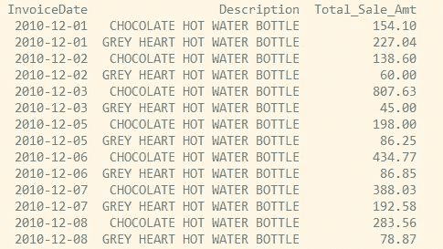
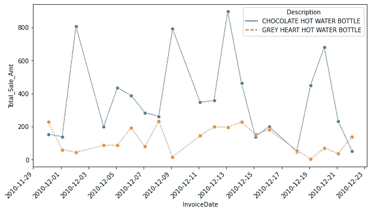

# 两全其美:来自 Python 的自动化和动态 SQL 查询

> 原文：<https://towardsdatascience.com/best-of-both-worlds-automated-and-dynamic-sql-queries-from-python-5b74a24501b0>

## 通过 SQL 和 Python 集成将自动化带到新的高度

现实世界的分析应用程序通常使用各种编程语言构建，每种语言都需要直接访问存储在数据库中的数据。最终目标是创建一个从数据提取(使用 SQL)到模型开发，再到持续性能监控的自动分析管道。通过独立的平面文件传输数据的时代已经过去了！

SQL 和关系数据库垄断了几十年，作为分析的全明星脚本语言，Python 对 SQL APIs 有很好的支持，允许用户直接拉取数据。在这篇博客中，我将分享 3 种方法以及集成 SQL 和 Python 来创建无缝分析工作流的用例。

## 分析数据集-在线零售数据

Python 连接关系数据库有两种方式:(1)使用 [ODBC(开放式数据库连接)](https://docs.microsoft.com/en-us/sql/odbc/reference/what-is-odbc?view=sql-server-ver15#:~:text=To%20the%20end%20user%2C%20it,specification%20for%20a%20database%20API.)作为连接引擎，访问托管在远程 SQL server 中的数据库；(2)使用 [ORM(对象关系映射器)](https://en.wikipedia.org/wiki/Object%E2%80%93relational_mapping)作为位于最终用户和数据库之间的抽象层，这提供了更多的灵活性。

在这个练习中，我们将在 *MS SQL* 服务器中实现 ORM 方法。我们正在处理的数据集是[在线零售](https://archive.ics.uci.edu/ml/datasets/online+retail)数据；包含来自英国在线零售商的各种交易的纵向数据集。

正如我们所看到的，每个记录由*产品、数量、价格/单位和客户、县*信息组成。

## 先决条件-将 Python 连接到 SQL server

> Python {urlib} + {SQLAlchemy}

尽管{ *SQLAlchemy* }在数据科学家和程序员中非常受欢迎，但以理想的形式获得连接字符串可能很棘手。要用 Python 连接 SQL，我们需要我们的驱动程序名、服务器名和数据库名。这里演示了如何为我的本地服务器`localhost\SQLEXPRESS`和名为`master`的数据库指定这些参数，

加入我们的 YouTube 社区🎦 [***【数据说话带吉】***](https://www.youtube.com/channel/UCbGx9Om38Ywlqi0x8RljNdw) ***😄***

## 用例 1:用 Python 编写的简短查询

建立了 SQL 连接引擎后，我们可以编写一个简短的查询，使用{ *熊猫* }将数据拉入 Python，

在本例中，我们提取了 2010 年 12 月 1 日和 2011 年 1 月 1 日之间两种产品——巧克力热水瓶和灰心热水瓶——的所有交易，然后得出每种产品按日期计算的总销售额。以下是返回的数据框:

现在，作为我们分析工作流程的一部分，让我们创建一个可视化图，例如纵向折线图，向我们的利益相关者展示趋势。

## 用户案例#2:读取外部的。sql 文件

我们刚刚经历的是将 SQL 纳入整个分析管道的最简单方法。然而，在我们的实践中，用 Python 编写或复制/粘贴每一个查询**是低效的，甚至是不可能的。原因是双重的:**

1.  现实世界的项目通常需要通过连接多个表和视图来进行长达数千行的查询；
2.  从可重用性的角度来看，如果我们经常需要更新或修改这些查询，维护和调试代码将会非常困难。

那么解决办法是什么呢？阅读现存的不是很好吗？sql 文件直接导入 Python？出于演示的目的，让我们将上面的查询保存为一个. sql 文件`*OnlineRetailPull.sql*`。

现在，诀窍是**扫描**这个查询文件，就像它是一个字符串对象一样:

输出`OnlineRetailData`与上面用例 1 的返回完全相同。

## 用例 3:来自应用程序的动态查询

现在，让我们回到最初的目标——将数据提取整合到我们的应用程序中，对用户的输入做出反应。我们将使用 Python*{****streamlit }****和创建一个小 app，探索如何动态运行 SQL 查询。*

****第一步*** :通过添加占位符来修改我们的查询。在本练习中，我们定义了两个交互变量 *{date}* 和 *{product}，**

****第二步*** :设置我们的***streamlit***app，根据用户选择可视化产品销售趋势，*

*这里的技巧是在我们的查询和应用程序的用户选项中的占位符使用相同的对象名称(即**日期和**产品)。这样， *f 字符串*可以自动接受用户选择的任何值。*

*运行此应用程序让我们…*

**

***最后的话***

*你有它！动态集成 SQL 和 Python 的三个不同用例。希望这篇文章能给你一些新项目的灵感，感谢阅读！*

****想要更多数据科学和编程技巧？使用*** [***我的链接***](https://yilistats.medium.com/membership) ***注册 Medium，获得我所有内容的全部访问权限。****

****还订阅我新创建的 YouTube 频道*** [***《数据与吉谈》***](https://www.youtube.com/channel/UCbGx9Om38Ywlqi0x8RljNdw) ***😀****

# *进一步阅读*

*</6-sql-tricks-every-data-scientist-should-know-f84be499aea5>  </data-reshaping-in-sql-r-and-python-d44ca19e71b8>  <https://levelup.gitconnected.com/6-hilarious-programmers-data-scientists-jokes-to-kick-start-2021-187f86dd6a4c> *