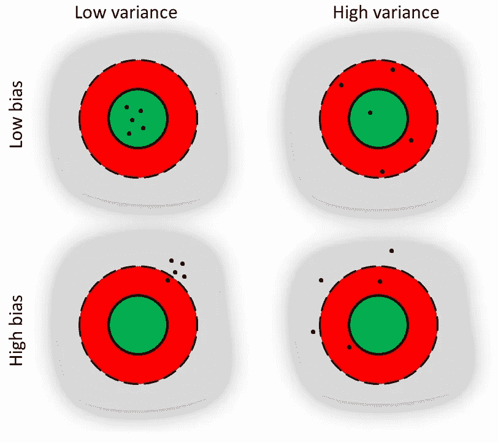
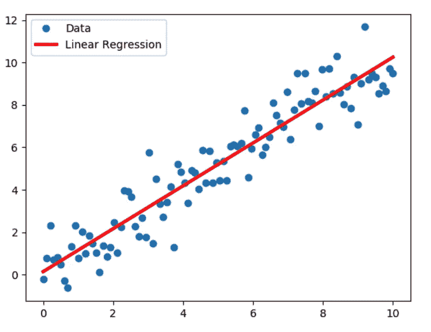
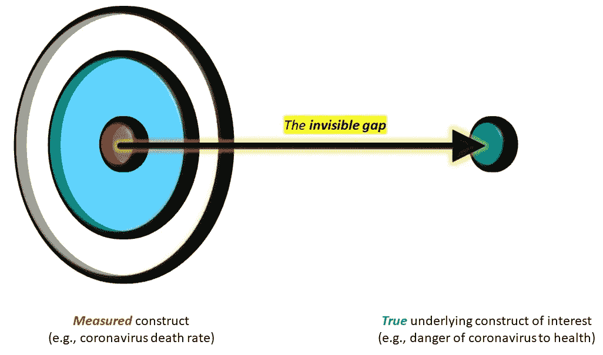

# 超越偏差和差异

> 原文：<https://towardsdatascience.com/beyond-bias-variance-2e621c6c7092>

## 考虑测量值和它们的意义之间的“看不见的差距”

在一个经验主义的时代,“数据驱动”的洞察力被自动视为优越，量化是至关重要的。事实上，对概念和现象的测量是实证科学、研究和推理的核心。然而，这种量化通常具有挑战性，因此在研究过程中会被询问。然而,“好”的量化标准可以说是一致的；这些目标是最小化*偏差*和*方差*。

在一次对巴黎高等商学院的访问中，诺贝尔奖获得者丹尼尔·卡内曼谈到了这两种偏见的后果，这两种偏见在[思维、快与慢](https://www.amazon.com/Thinking-Fast-Slow-Daniel-Kahneman-ebook/dp/B00555X8OA/ref=sr_1_1?gclid=CjwKCAjwk_WVBhBZEiwAUHQCmaWqIwJIwwZfPQitwMzydkD7GWz6RFw34D5nwUeU76vU99znXn13mRoCWZgQAvD_BwE&hvadid=241636883754&hvdev=c&hvlocint=9067609&hvlocphy=9056252&hvnetw=g&hvqmt=e&hvrand=4017513470724740799&hvtargid=kwd-42799328994&hydadcr=21907_10171197&keywords=thinking+fast+thinking+slow&qid=1656588066&sr=8-1)以及噪音中被大量唤起，这也是他最近作品[的主题](https://www.amazon.com/Noise-Human-Judgment-Daniel-Kahneman/dp/0316451401)。在他的演讲中，[我提出了一个问题](http://www.youtube.com/watch?v=6X91ruTd6Fw&t=45m50s)，即关注上述二分法是否会导致我们忽略经验模型中的某些缺陷。有了进一步思考的空间和更多阐述这些想法的空间，我想在本文中详细阐述我的关注点。

**偏差和方差:一个简短但必要的概述**

为了对一种现象建模，实证研究框架依赖于各种方法来测量群体中的结构。例如，人们可能想要测量冠状病毒对健康造成的危险。为了实现这一点，可以从各个医院获得死亡率(即样本)，并对它们进行平均，以实现我们估计总体人口死亡率的真正目标。人们希望这种估计总死亡率的方法具有低偏差和低方差，并且偏差和方差随着观察次数的增加而减少。但是，下图说明了在此评估过程中可能出现的关键问题。

偏差和方差概念的图解(灵感来自:[来源](https://scott.fortmann-roe.com/docs/BiasVariance.html#:~:text=Understanding%20the%20Bias-Variance%20Tradeoff&text=When%20we%20discuss%20prediction%20models,to%20minimize%20bias%20and%20variance)

一个问题可能是估计量具有*高方差*(右上)，这意味着样本医院报告的死亡率差异很大，尽管它们分散在“真实”人口死亡率周围。这样的结果表明，粗略地说，对真实死亡率的估计是分散的。另一个问题是评估过程是否有*偏差*(左下角)，这意味着它总是在某个方向上扭曲评估。例如，我们的方法可能涉及贫困地区的抽样医院，这些地区由于医疗资源不足，死亡率可能较高。结合这两个问题，估计者可能既有偏差又表现出高方差(右下)。

受我们最小化偏差和方差的心照不宣的命令的驱使，也许在实证研究中最常用的模型是普通最小二乘回归(也叫 OLS)。如下所述，这种方法本质上是接受数据，并找到一条趋势线，使该线和它所代表的数据点之间的总误差(即“误差平方和”)最小化。根据[高斯-马尔可夫定理](https://en.wikipedia.org/wiki/Gauss%E2%80%93Markov_theorem)，OLS 方法是 BLUE——即建模这种现象的最佳线性无偏方法，这意味着它是产生最小偏差和方差的方法。建立更复杂和非线性的模型，实证研究人员考虑[偏差-方差权衡](https://medium.com/@itbodhi/bias-and-variance-trade-off-542b57ac7ff4#:~:text=Finding%20the%20right%20balance%20between,variance%20will%20decrease%20the%20bias.)，再次以最小化这些值为目标。因此，经验建模方法的选择在很大程度上取决于偏差和方差的最小化。

OLS 回归是一种流行的建模方法，因为它的偏差和方差最小([图像源](https://www.researchgate.net/figure/Linear-Regression-model-sample-illustration_fig3_340271573))

我的观点是，被偏差和方差的最小化所蒙蔽，我们经常会错过一个更基本的问题:潜在的目标是什么？上面回归图上的那些点是什么*？毕竟，如果目标定义不明确，对这些因素的讨论就不那么重要了。通常，我们没有足够深入地挖掘这个目标，而是接受最容易提供量化的度量。*

有没有一个“真正的”目标？

在冠状病毒死亡率的例子中，让我们考虑我们可能对这样的指标感兴趣的背景。在这种特殊情况下，这种估计背后的科学很可能是为了给决策或政策提供信息。例如，死亡率可能会影响个人对疫苗接种的决定，或对封锁的政策。因此，一个关注死亡率作为结果的模型将提供优化(在这种情况下，最小化)这一预定指标的处方。

即使对死亡率进行了准确(即低偏差、低方差)的估计，这一指标也只是在最大限度减少伤害或最大限度提高总体健康水平的大背景下可能考虑的众多因素之一。因此，死亡率是潜在利益结构的一个*代理*，比如一般福利。即使“真实的”死亡率和测量的死亡率之间的差距最小，在我们选择的指标和以该指标为代表的*真实的*目标之间仍可能存在*看不见的差距*。

测量的结构和感兴趣的真实结构之间的“看不见的差距”

由于未能考虑所使用的度量标准和真正感兴趣的结构之间的距离，我们冒着被量化的简单性所诱惑的风险。例如，引用低死亡率作为感兴趣的结果并相应地提出政策(例如，消除封锁)可能看起来很严格。事实上，这是自由意志论者使用的一个论点，与自由主义者等其他人相比，他们似乎经常标榜自己是“合理”和“客观”的。然而，要反驳这样的论点，人们不需要依靠质疑测量的准确性；相反，更好的策略可能是质疑度量标准本身的选择。

考虑到一个人对度量标准的选择可能导致信息的丢失，人们可能会问:一个可量化的度量标准能成为“真正的”目标吗？这个问题类似于一个流行的问题:“一切都可以量化吗？”。事实上，一方面，一个*可以*构建一个与任何事物相关联的度量；然而，在这样做的时候，一个人不可避免地失去了在表达他们真正希望表达的更抽象的结构时的细微差别。即使在一个想法是完全可测量的情况下(例如，重量、人口)，我们也很少对如此简单的结构感兴趣。更确切地说，我们更有可能使用体重这样的衡量标准来代表“健康”这样更抽象、更多维的概念。

**超越偏差和方差**

虽然实证科学的重点是建立准确的测量尺度，但研究也可以受益于对选择的潜在结构的思考，以及作为代理的度量选择。忽视这些问题会给人一种错觉，认为科学过程是建立在客观测量的基础上的。然而，*选择*作为真实潜在结构的代理措施通常是*主观的*，并且可以被操纵以服务于特定的议程(例如，消除基于低死亡率的封锁)。

尽管存在这些问题，但在某些情况下，与量化相关的细微差别的损失是可以接受的。例如，当我发表一篇论文，关注的现象是在线视频的消费时，人们可能会问这样的问题:他们观看了整个视频吗？他们对这个视频有多关注？人们可以在实践中进行类似的类比，例如，如果一家公司正在监控其网站的“访问量”。虽然使用简单的计数来量化这种结构可能会失去细微差别，但一些信息损失对于构建经验模型是必要的，经验模型是可以指导我们的行动和决策的抽象。

在科学领域之外，用通俗的话说，我们可以改进构建模型的方式。甚至我们在日常生活中听到的诸如“我有偏见”之类的不经意的话也应该被审视一下——你到底偏向或反对什么？你试图评估的真实结构是什么，为什么你认为你得出偏好的过程是扭曲的？如果问题本身具有内在的主观性(例如，我有偏见，因为我是巴黎圣日耳曼足球俱乐部的球迷)，那么“有偏见”这个词就被误用了，因为没有“真正的”目标被估计，而不管衡量挑战如何。或者，如果偏向于一个人系统地得到的偏好(例如，作为埃马纽埃尔·马克龙的支持者，我有偏见)，那么你应该问是什么阻止这个人以不同的方式进行他们的分析。

随着量化的兴起和对“客观”分析的偏爱，我们面临着忽视哲学问题的风险，比如度量和它们的理论目标之间的差距。尽管讨论这种差距需要我们进入一个微妙的主观性的更混乱的领域，但明确地这样做比含蓄地把混乱扫到地毯下要好。对于科学家来说，考虑围绕这一实践制定指导方针，最终使他们的实证分析更有说服力，这将是有益的。